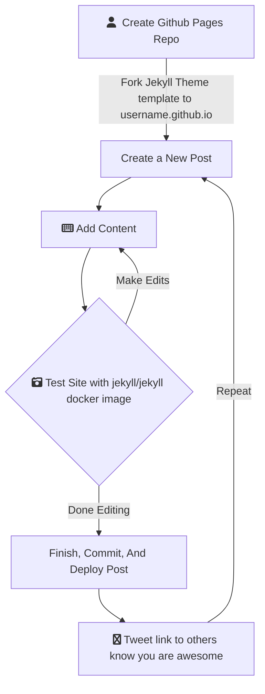

---

# Hello World

Saying hello to the world with a first post. I have seen several slick github.io pages leveraging [Jekyll](https://jekyllrb.com/) to create modern blogs and websites that look great with seemingly little overhead. Not wanting to deal with SSL certificates, host my own server, or really do anything besides create content, I decided to give [Github Pages](https://pages.github.com/) a try.  

## Jekyll Blogging - Chirpy Theme

The [Jekyll](https://docs.github.com/en/pages/setting-up-a-github-pages-site-with-jekyll/about-github-pages-and-jekyll) blogging engine seems to take all the hard work out of creating a modern web site.  Just select a theme, generate your static web site, and focus on content. 

First things first. You need to select a theme. I selected the [chirpy](https://github.com/cotes2020/jekyll-theme-chirpy/) Jekyll template as it sports a clean design, light / dark mode, and focuses you on the content.

{: .shadow }

The chirpy theme even has a corresponding starter template ([chirpy starter](https://github.com/cotes2020/chirpy-starter/) the leverages github [templates](https://github.blog/2019-06-06-generate-new-repositories-with-repository-templates/) to kickstart your `username.github.io` repository (this is where you host your site).

If you prefer another theme, there are plenty to choose from.  Check out the list from Jekyll's theme [list](https://jekyllrb.com/docs/themes/) or the [topic](https://github.com/topics/jekyll-theme) in Github. Github Pages offer you some default themes, but I needed something like the [chirpy starter](https://github.com/cotes2020/chirpy-starter/) to start to understand how to develop and publish with Jekyll.


## Site Development

The development cycle is quite straightforward if you like to be ~~lazy~~ smart and  use docker. Jekyll has its own [image](https://hub.docker.com/r/jekyll/jekyll/dockerfile/). No dependencies to install!  

Clone your repo:
```terminal
$ git clone clearbluejar/clearbluejar.github.io
$ cd clearbluejar.github.io
```

Then startup docker. The `jekyll:jekyll` docker image will build your site and host it locally:

```terminal
$ docker run -it --rm \
    --volume="$PWD:/srv/jekyll" \
    -p 4000:4000 jekyll/jekyll \
    jekyll serve


Fetching gem metadata from https://rubygems.org/.........
Using public_suffix 4.0.6
Using bundler 2.2.24
Using colorator 1.1.0
Using concurrent-ruby 1.1.9

... several line omitted ...

Fetching jekyll-theme-chirpy 5.1.0
Installing jekyll-theme-chirpy 5.1.0
Bundle complete! 7 Gemfile dependencies, 44 gems now installed.
Use `bundle info [gemname]` to see where a bundled gem is installed.
ruby 2.7.1p83 (2020-03-31 revision a0c7c23c9c) [x86_64-linux-musl]
Configuration file: /srv/jekyll/_config.yml
 Theme Config file: /usr/gem/gems/jekyll-theme-chirpy-5.1.0/_config.yml
            Source: /srv/jekyll
       Destination: /srv/jekyll/_site
 Incremental build: disabled. Enable with --incremental
      Generating...
                    done in 4.505 seconds.
 Auto-regeneration: enabled for '/srv/jekyll'
    Server address: http://0.0.0.0:4000/
  Server running... press ctrl-c to stop.      

```

> Server address: http://0.0.0.0:4000/

Once it is running, you can visit your site locally at [http://localhost:4000](http://localhost:4000).

As you make changes to the site, jekyll will detect them and update them realtime.

```terminal
Regenerating: 1 file(s) changed at 2022-02-17 08:02:23
                    _posts/2021-02-17-my-new-post.md
                    ...done in 3.214756529 seconds.
```

## Writing A New Post

There is even some tooling to generate a new post. Mostly following the advice from [chirpy - Writing a New Post](https://chirpy.cotes.page/posts/write-a-new-post/), install Jekyll-Compose and run one of the commands such as:

> `bundle exec jekyll post "My New Post" --timestamp-format "%Y-%m-%d %H:%M:%S %z"`

The post will be available now within `_posts`:
```terminal
bash-5.0# bundle exec jekyll post "These Are You First Steps" --timestamp-format "%Y-%m-%d %H:%M:%S %z"
Configuration file: /srv/jekyll/_config.yml
New post created at _posts/2022-02-17-these-are-you-first-steps.md
```

It will generate the post with some default YAML. Update your [_config.yml](https://github.com/clearbluejar/clearbluejar.github.io/blob/main/_config.yml) with specific `jekyll-compose` settings as [suggested](https://github.com/jekyll/jekyll-compose#:~:text=Set%20default%20front%20matter%20for%20drafts%20and%20posts):

```yaml
jekyll_compose:
  default_front_matter:
    posts:
      description:
      image:
      category: [TOP_CATEGORIE, SUB_CATEGORIE]
      tags: blog
      mermaid: true
```

The new posts that you create will contain the default [YAML front matter](https://jekyllrb.com/docs/front-matter/) as specified by your config.


## Deployment

After I created this first post, these were my changes from my original repo:

```terminal

$ clearbluejar.github.io % git status
On branch main
Your branch is up to date with 'origin/main'.

Changes not staged for commit:
  (use "git add <file>..." to update what will be committed)
  (use "git restore <file>..." to discard changes in working directory)
  
Untracked files:
  (use "git add <file>..." to include in what will be committed)
    Gemfile.lock
  _posts/2022-02-17-these-are-your-first-steps.md
  assets/img/

```

A single file to post and the images I am linking within this article. Once you are ready, you simply need to commit your changes to master. Once these changes are committed, an automated *Action* will be performed on Github that will create a branch `gh-pages` (if it doesn't exist). It leverages this [workflow](https://github.com/cotes2020/chirpy-starter/blob/main/.github/workflows/pages-deploy.yml). Mostly, this workflow is just calling [deploy.sh](https://github.com/clearbluejar/clearbluejar.github.io/blob/main/tools/deploy.sh) on the repository.

Once the workflow finished, and you have already change your github pages settings to point to your new branch `gh-pages`, it will be available [clearbluejar.github.io/](https://clearbluejar.github.io/).

## Workflow Summary

Hope this helps. You can create, host, and establish a workflow for blog writing pretty quickly leveraging these technologies.



---
<sub>Headline Photo by <a href="https://unsplash.com/@tateisimikito?utm_source=unsplash&utm_medium=referral&utm_content=creditCopyText">Jukan Tateisi</a> on <a href="https://unsplash.com/s/photos/first-steps?utm_source=unsplash&utm_medium=referral&utm_content=creditCopyText">Unsplash</a></sub>
