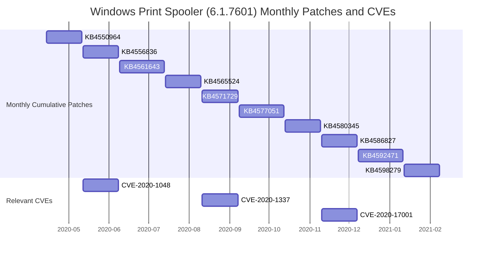
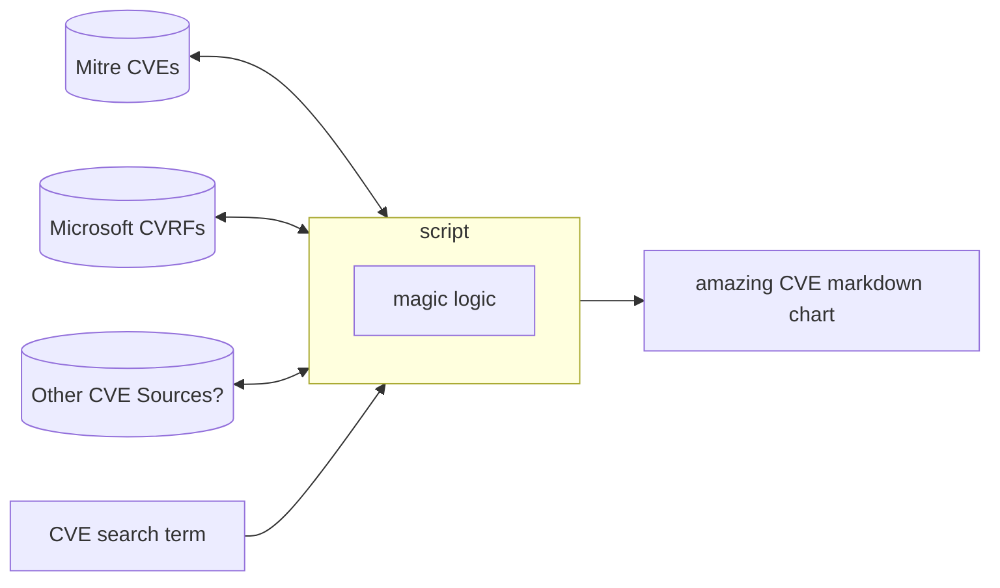
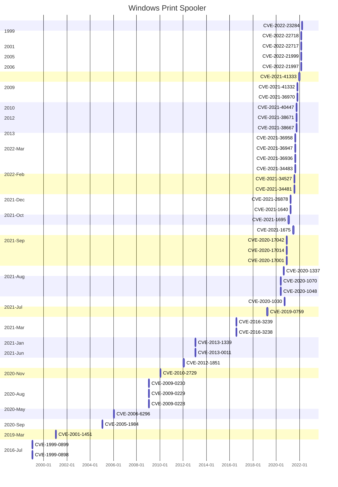
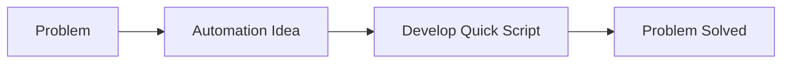
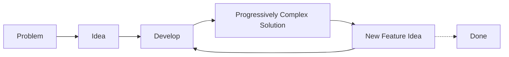

> TL;DR - CVE Markdown Charts - Your InfoSec reports will now write themselves... After writing several InfoSec reports and researching CVEs, I discovered a means to create dynamic charts that help readers and myself understand various CVE relationships and their implications.

Say hello to [CVE Markdown Charts](https://github.com/clearbluejar/cve-markdown-charts), or at least its first iteration ([v0.1.0](https://github.com/clearbluejar/cve-markdown-charts/tree/v0.1.0)). CVE, as in [Common Vulnerabilities and Exposures](https://en.wikipedia.org/wiki/Common_Vulnerabilities_and_Exposures), where a CVE ID (something in the form of CVE-2022-1234) references a specific instance of a known vulnerability in software.  [Markdown](https://en.wikipedia.org/wiki/Markdown), as in the popular writing markup language used everywhere by bloggers and developers alike. Charts, as in well, charts, but generated with [Mermaid.js](https://mermaid-js.github.io/mermaid/#/).

This post is the first part of what will probably become a short series of posts sharing lessons learned during the development of CVE Markdown Charts. This first one is about that 80% solution. And the sequel, coming later, will describe that last 20% that will take me 3x as long to complete.

We begin with the reason for the project, and the steps taken to solve the issue, and finally show an initial proof of concept.

## The Issue

Typically, when I study a new software component as related to security, or perhaps for InfoSec writing or research, I start by reviewing the CVEs for said component to get a basic understanding of the security issues and common bugs for the software. To find related CVEs, I just [search](https://cve.mitre.org/cve/search_cve_list.html) for them on [cve.mitre.org](https://cve.mitre.org) using a keyword like "Windows Print Spooler" or "Google Chrome Use After Free". The results from the search will come back in a table with matches from the [CVE ID](https://cve.mitre.org/cve/identifiers/#:~:text=includes%20the%20following%3A-,CVE%20ID,-number%20with%20four) directly or from keywords in the CVE description.

{: .shadow }_Windows Print Spooler Search Results -cve.mitre.org_

### MSRC API

Besides Mitre, I have also been using the Microsoft Security Response Center ([MSRC](https://msrc.microsoft.com/)) security updates when researching Windows CVEs. Each security update, formatted in the Common Vulnerability Reporting Framework ([CVRF](https://www.icasi.org/cvrf/)) JSON format, contains several details about the latest CVEs (release date, links to patches, products affected, etc.). The monthly updates each have a unique *CVRF ID* like `2021-Dec`. MSRC makes the updates available via their [MSRC API](https://api.msrc.microsoft.com/cvrf/v2.0/swagger/index), which you can test out using their [swagger](https://swagger.io/) front end. I had been using their API to download the relevant security update JSON pulling out detailed information for any Microsoft CVEs. One of the MSRC REST endpoints provides a convenient CVE ID -> CVRF ID map.

#### Updates Endpoint

A query for *CVE-2020-1048*:

```bash
% curl -X GET --header 'Accept: application/json' "https://api.msrc.microsoft.com/cvrf/v2.0/Updates('CVE-2020-1048')"
```

The response:

```json
{
    "@odata.context": "https://msrc-cvrf.azurewebsites.net/odata/$metadata#Updates",
    "value": [
        {
            "ID": "2020-May",
            "Alias": "2020-May",
            "DocumentTitle": "May 2020 Security Updates",
            "Severity": null,
            "InitialReleaseDate": "2020-05-12T07:00:00Z",
            "CurrentReleaseDate": "2021-02-25T08:00:00Z",
            "CvrfUrl": "https://api.msrc.microsoft.com/cvrf/v2.0/document/2020-May"
        }
    ]
}
```

From the *CVRF ID* `2020-May` the MSRC API provides corresponding security update CVRF JSON.

#### CVRF Endpoint

```bash
% curl -X GET --header 'Accept: application/json' 'https://api.msrc.microsoft.com/cvrf/v2.0/cvrf/2020-May'
```

The monthly security update will have detailed information about the products affected and a list of all the CVEs.
```json
{
    "DocumentTitle": {
      "Value": "May 2020 Security Updates"
    },
    "DocumentType": {
      "Value": "Security Update"
    },
    "DocumentPublisher": {
      "ContactDetails": {
        "Value": "secure@microsoft.com"
      },
      "IssuingAuthority": {
        "Value": "The Microsoft Security Response Center (MSRC) identifies, monitors, resolves, and responds to security incidents and Microsoft software security vulnerabilities. For more information, see http://www.microsoft.com/security/msrc."
      },
      "Type": 0
    },
    "DocumentTracking": {
      "Identification": {
        "ID": {
          "Value": "2020-May"
        },

/* several lines omitted */
```

Within contains more detail about each CVE:

```json
{
      "Title": {
        "Value": "Windows Print Spooler Elevation of Privilege Vulnerability"
      },
      "Notes": [
        {
          "Title": "Description",
          "Type": 2,
          "Ordinal": "0",
          "Value": "<p>An elevation of privilege vulnerability exists when the Windows Print Spooler service improperly allows arbitrary writing to the file system. An attacker who ....</p>\n"
        },
        {
          "Title": "Microsoft Windows",
          "Type": 7,
          "Ordinal": "20",
          "Value": "Microsoft Windows"
        },
        {
          "Title": "Issuing CNA",
          "Type": 8,
          "Ordinal": "30",
          "Value": "Microsoft"
        }
      ],
      "DiscoveryDateSpecified": false,
      "ReleaseDateSpecified": false,
      "CVE": "CVE-2020-1048",
      "ProductStatuses": [
        {
          "ProductID": [
            "11497",
            "11498",
            "11499",
            "11563",
            "11568",
```

Including details about the various Microsoft [Knowledge Base](https://en.wikipedia.org/wiki/Microsoft_Knowledge_Base) Articles, links to binary patch updates, and several other useful fields are available for each CVE:

```json
"Remediations": [
        {
          "Description": {
            "Value": "4556807"
          },
          "URL": "https://catalog.update.microsoft.com/v7/site/Search.aspx?q=KB4556807",
          "Supercedence": "4550922",
          "ProductID": [
            "11497",
            "11498",
            "11499",
            "11563"
          ],
          "Type": 2,
          "DateSpecified": false,
          "AffectedFiles": [],
          "RestartRequired": {
            "Value": "Yes"
          },
          "SubType": "Security Update"
        },
        {
          "Description": {
            "Value": "4551853"
          },
          "URL": "https://catalog.update.microsoft.com/v7/site/Search.aspx?q=KB4551853",
          "Supercedence": "4549949",
```

I was repeatedly leveraging information from these two sources when attempting to explain various CVEs and their relationships. I dug through the sites and JSON data to construct tables and graphs to explain CVE release timelines and frequency of various CVEs. While studying CVEs for popular topics (like the "Windows Print Spooler" and its explosion of CVEs over the past two years), watching [presentations](https://www.youtube.com/watch?v=CHWSewPDfhs), reading [slides](https://i.blackhat.com/USA21/Wednesday-Handouts/us-21-Diving-Into-Spooler-Discovering-Lpe-And-Rce-Vulnerabilities-In-Windows-Printer.pdf) and [code](https://github.com/cube0x0/CVE-2021-1675), it was hard to keep track of it all. I found myself taking notes, creating list and tables, trying to keep track of each CVE (when they came out, they type of bug, and who found them).

### Markdown and Mermaid.js

I write my notes (and most everything) in [Markdown](https://en.wikipedia.org/wiki/Markdown), along with what seems to be most of the rest of the world. While using Markdown, I discovered [Mermaids.js](https://mermaid-js.github.io/mermaid/#/) for charts and graphs and I was hooked.

{: .shadow }_Mermaid.js_

The ability dynamically to create charts and graphs from basic plaintext is powerful. Also, Mermaid.js is Javascript. All you need to [include](https://mermaid-js.github.io/mermaid/#/usage?id=using-mermaid) it in your website or application is this script tag:

```js
<script src="https://cdn.jsdelivr.net/npm/mermaid/dist/mermaid.min.js"></script>
```

That also means it is supported by most popular [blogging](https://en-gb.wordpress.org/plugins/wp-mermaid/) and [code](https://marketplace.visualstudio.com/items?itemName=vstirbu.vscode-mermaid-preview) applications and you can create all the README graphs you want in [Gitlab](https://docs.gitlab.com/ee/user/markdown.html#mermaid) or [Github](https://github.blog/2022-02-14-include-diagrams-markdown-files-mermaid/).

For CVEs, when trying to represent a timeline of patch releases, I painstakingly created the following *Mermaids.js* [Gantt chart](https://mermaid-js.github.io/mermaid/#/gantt).

```markdown


It was worth it because *Mermiad.js* transformed the plaintext into this:


Looks pretty good. You can copy and paste the plaintext anywhere and reuse that information, or tweak it without having to deal with generating or storing images. That being the case, after manually creating tables and [charts](https://mermaid-js.github.io/mermaid/#/flowchart) for my CVE research about 10x, it was getting a bit tedious. Having to click through all the Mitre links and dig around in MSRC CVRF JSON became too much. The thought of having to create yet another CVE chart was the motivation I needed to do what every developer does when they discover a tedious, repeatable process, **write a script.** :)

## The Idea

OK, the problem is that I have several reports and future reports to write with various CVE charts that will be required, and I want to save time and effort. I began with some use cases I was using repeatedly.

- [Gantt Chart](https://mermaid-js.github.io/mermaid/#/gantt) 
  - CVEs on a specific software component over time - Think of it like CVE version of [Google Trends](https://trends.google.com/trends/)
  - CVEs of a particular vulnerability class (or CWE) for a particular software over time - This can can hint at which types of bugs you are likely to find.
- [Markdown table](https://github.com/adam-p/markdown-here/wiki/Markdown-Cheatsheet#tables)
  - Table of all the software component CVEs and their corresponding binary update download links - For Notes.
  - Table of CVEs by researcher (see Acknowledgements) for a particular topic - This can help find other related research or posts by the researchers.

There are several more use cases I can think of, but this first post will walk through the Gantt Chart and Markdown table generation.

### Visual

OK, let's generate some charts. Let me first demonstrate my thoughts with a nice Mermaid.js [flowchart](https://mermaid-js.github.io/mermaid/#/flowchart). 



## Development

Before I started down my path of solving all my problems, I needed to find out if someone else already had. Checking to see what else is out there will help prevent you from reinventing the wheel, or at least provide inspiration and perhaps some lessons learned from other projects.

### What Wheels Already Exists?

A quick Github search came up with:

| Tool | Language | 
| --- | --- |
| [find_microsoft_kb_by_cve.py](https://github.com/NopSec/ThreatIntelScripts/blob/master/find_microsoft_kb_by_cve.py) | Python |
| [MSRCSecurityUpdates](https://github.com/Microsoft/MSRC-Microsoft-Security-Updates-API/blob/main/src/README.md) | Powershell | 

The Python script [`find_microsoft_kb_by_cve.py`](https://github.com/NopSec/ThreatIntelScripts/blob/ab3cb43368bca131c4d700711349cfe1ce00372b/find_microsoft_kb_by_cve.py) was a concise script that would take a CVE as input and dump a list of Knowledge Base IDs (like `KB5010359`) related to the CVE. Something like CVE -> CVRF ID -> List of KB links. This could actually serve as a solid starting point, providing the CVRF security update JSON for a CVE. And I could parse out what I needed from the corresponding CVRF JSON.

The Powershell code had some examples of using the CVRF security update with a template to [generate a HTML page](https://github.com/microsoft/MSRC-Microsoft-Security-Updates-API/blob/main/src/MsrcSecurityUpdates/Public/Get-MsrcSecurityBulletinHtml.ps1) leveraging the provided JSON. This is similar to what I need to do to generate a Mermaid.js Markdown graph or chart. They had a [HTML template](https://github.com/microsoft/MSRC-Microsoft-Security-Updates-API/blob/f7ede22d2a05fbaa0edcbb4ca0ad39798ac88805/src/MsrcSecurityUpdates/Public/Get-MsrcSecurityBulletinHtml.ps1#L51) that the script populated with elements from their CVRF security update JSON.

In a short amount of time, remembering that I am pretty green in Powershell scripting, I went with Python.

### Requirements

OK, using `find_microsoft_kb_by_cve.py` as inspiration, I started on my journey. Starting with the two use cases above, I set out to build a Markdown table () and a Mermaid.js Gannt chart. Basically, the script receives a CVE keyword and spits out a Mermaid.js compatible chart (or rather its plaintext).

To support that, we need the following capabilities:

- [Build CVE list from Keyword](#getting-a-list-of-cves---beautiful-soup) - The ability to query Mitre CVE by keyword to obtain a list of matching CVEs
- [Map CVE to CVRF ID](#getting-a-list-of-cves---beautiful-soup) - Translate the CVE to their corresponding CVRF IDs
- [Parse Data](#parsing-out-the-data) - Parse out relevant data for the use case
- [Transform Into Markdown](#transform-into-markdown) - Transform the data into valid markdown

### Getting a list of CVEs - Beautiful Soup

To get a list of CVEs I began with [cve.mitre.org](https://cve.mitre.org). They provide a search page that allows for [keyword search](https://cve.mitre.org/cve/search_cve_list.html).
The results for the keyword search is unfortunately just a basic HTML table (think `<td>,<tr>, and <th>`) and not easy to consume data like JSON. Apparently, they are [working on it](https://www.cve.org/Media/News/item/news/2022/01/11/Changes-Coming-to-CVE-Record#:~:text=The%20main%20format%20for%20submission%20and%20publishing%20of%20CVE%20Records%2C%20CVE%20JSON%204.0%2C%20is%20being%20upgraded%20to%20a%20new%2C%20richer%20format%3A%20JSON%205.0.).
To mitigate this, I used a [beautiful library](https://github.com/clearbluejar/cve-markdown-charts/blob/v0.1.0/cve_markdown_charts.py#L20) to scrape the data needed from the Mitre CVE search results and built out my own JSON structure from it.

I could [transform](https://github.com/clearbluejar/cve-markdown-charts/blob/v0.1.0/cve_markdown_charts.py#L26) the keyword search "Windows Print Spooler" into the following JSON.

```json
'[
    {
        "id": "CVE-2022-23284",
        "description": "Windows Print Spooler Elevation of Privilege Vulnerability.  "
    },
    {
        "id": "CVE-2022-22718",
        "description": "Windows Print Spooler Elevation of Privilege Vulnerability. This CVE ID is unique from CVE-2022-21997, CVE-2022-21999, CVE-2022-22717.  "
    },
    {
        "id": "CVE-2022-22717",
        "description": "Windows Print Spooler Elevation of Privilege Vulnerability. This CVE ID is unique from CVE-2022-21997, CVE-2022-21999, CVE-2022-22718.  "
    },
    {
        "id": "CVE-2022-21999",
        "description": "Windows Print Spooler Elevation of Privilege Vulnerability. This CVE ID is unique from CVE-2022-21997, CVE-2022-22717, CVE-2022-22718.  "
    },
    {
        "id": "CVE-2022-21997",
        "description": "Windows Print Spooler Elevation of Privilege Vulnerability. This CVE ID is unique from CVE-2022-21999, CVE-2022-22717, CVE-2022-22718.  "
    },
    {
        "id": "CVE-2021-41333",
        "description": "Windows Print Spooler Elevation of Privilege Vulnerability  "
    },

 < several lines omitted >
```

### From CVE to CVRF ID

The next step was to map the CVE to a CVRF ID. As explained [above](#msrc-api), MSRC provides the API.

> https://api.msrc.microsoft.com/cvrf/v2.0/Updates('CVE-2020-1048')


For each CVE, we could [ask](https://github.com/clearbluejar/cve-markdown-charts/blob/v0.1.0/cve_markdown_charts.py#L40) the MSRC API to get the CVRF-ID:

```python
def get_cvrf_id_and_date_for_cve(cve):
    cvrf_id = None
    releaseDate = None

    year = int(cve.split('-')[1])
    # MSRC CVRF is not available before 2016
    if year > 2015:
        url = "{}Updates('{}')?api-version={}".format(msrc_api_url, str(cve),   str(datetime.datetime.now().year))
        headers = {}
        response = requests.get(url, headers=headers)

        if response.status_code == 200:
            data = json.loads(response.content)
            cvrf_id = data["value"][0]["ID"]
            releaseDate = data["value"][0]["InitialReleaseDate"]
            cvrf_url = data["value"][0]["CvrfUrl"]
    else:
        pass

    return cvrf_id,releaseDate
```

[This](https://github.com/clearbluejar/cve-markdown-charts/blob/v0.1.0/cve_markdown_charts.py#L31) would return the `cvrf-id` (something like '2020-Sep') and a few more useful fields. With the `cvrf-id` we could then [fetch](https://github.com/clearbluejar/cve-markdown-charts/blob/v0.1.0/cve_markdown_charts.py#L54) the JSON from MSRC.  I perform some simple [caching](https://github.com/clearbluejar/cve-markdown-charts/blob/v0.1.0/cve_markdown_charts.py#L63) so that we don't hammer the MSRC API with requests.

### Parsing out the data

The following table provides a high level look at data, where it's from, and where it's used.

| API Endpoints | Format | Data | Used By |
| --- | --- | --- | --- | 
| cve.mitre.org | html |  `id`,`description`| [get_json_cve_list_from_keyword](https://github.com/clearbluejar/cve-markdown-charts/blob/v0.1.0/cve_markdown_charts.py#L15)
| api.msrc.microsoft.com/cvrf/v2.0/Updates | json | `id`,`cvrf-id`,`release-date`| [build_markdown_table_from_cves](https://github.com/clearbluejar/cve-markdown-charts/blob/v0.1.0/cve_markdown_charts.py#L77)<br>[build_markdown_gantt_from_cves](https://github.com/clearbluejar/cve-markdown-charts/blob/v0.1.0/cve_markdown_charts.py#L115) |
| api.msrc.microsoft.com/cvrf/v2.0/cvrf/<cvrf-id> | json | `release_date`,`kbs`,`acks`| [build_markdown_table_from_cves](https://github.com/clearbluejar/cve-markdown-charts/blob/v0.1.0/cve_markdown_charts.py#L77) |

For the Markdown table, I [select](https://github.com/clearbluejar/cve-markdown-charts/blob/v0.1.0/cve_markdown_charts.py#L91-L95) information available from the MSRC CVRF JSON.

For the Gannt Chart, the information from the [Updates endpoint](#updates-endpoint) response is all that is required. 

### Transform into Markdown

#### Building the Markdown CVE Table

The CVE Markdown table generation in [build_markdown_table_from_cves](https://github.com/clearbluejar/cve-markdown-charts/blob/v0.1.0/cve_markdown_charts.py#L77) uses the following headers.

```python
def build_markdown_table_from_cves(cves,keyword):
    print("Building table...")

    table_list = []
    table_list.extend(['CVE','Description', 'Release Date', 'KBs', 'Acknowledgments'])
```

I found a [basic](https://pypi.org/project/mdutils/) Markdown generation library `mdutils` to help build markdown files. The data [for each CVE](https://github.com/clearbluejar/cve-markdown-charts/blob/v0.1.0/cve_markdown_charts.py#L85-L105) is parsed from the MSRC CVRF JSON and dumped into a Markdown table constructor.

```python
for cve in cves:
        print(cve['id'])
        cvrf_id,release_date = get_cvrf_id_and_date_for_cve(cve['id'])
        cvrf_json = get_knowledge_base_cvrf_json(cvrf_id)
        
        if cvrf_json:
            release_date = '[{}](https://msrc.microsoft.com/update-guide/en-US/vulnerability/{})'.format(release_date,cve['id'])
            kbs = {'[KB{}]({})-{}'.format(kb['Description']['Value'],kb['URL'],kb.get('FixedBuild')) for vuln in cvrf_json["Vulnerability"] if vuln["CVE"] == cve['id'] for kb in vuln["Remediations"] if (str(kb['Description']['Value']).isnumeric() and 'FixedBuild' in kb)  }
            kbs = sorted(['[{}]({}) - [KB{}]({})'.format(kb.get('FixedBuild'),'https://support.microsoft.com/help/{}'.format(kb['Description']['Value']),kb['Description']['Value'],kb['URL']) for vuln in cvrf_json["Vulnerability"] if vuln["CVE"] == cve['id'] for kb in vuln["Remediations"] if (str(kb['Description']['Value']).isnumeric() and 'catalog' in kb['URL'] )])
            acks = {'{}'.format(ack['Name'][0].get('Value')) for vuln in cvrf_json["Vulnerability"] if vuln["CVE"] == cve['id'] for ack in vuln["Acknowledgments"] }
        else:
            kbs = ''
            builds = ''
            acks = ''
                
        cve_id = '[{}](https://cve.mitre.org/cgi-bin/cvename.cgi?name={})'.format(cve['id'],cve['id'])

        table_list.extend([cve_id,cve['description'],release_date,'<details>'+'<br>'.join(kbs)+'</details>', '<br>'.join(acks).replace('\n',' ')])
        
    cve_table = Table().create_table(columns=column_len, rows=len(cves)+1, text=table_list, text_align='center')
```


#### Building the Gantt Mermaid.js Chart

The Gantt chart is generation is simply filling a Mermiad.js format gantt chart [template](https://github.com/clearbluejar/cve-markdown-charts/blob/v0.1.0/cve_markdown_charts.py#L116) with CVE data.

```python
    gantt_template = '''
gantt

title {keyword}
dateFormat YYYY-MM-DD
axisFormat %Y-%m

section CVE Release Dates
{rows}
'''
````

The rows are [built](https://github.com/clearbluejar/cve-markdown-charts/blob/v0.1.0/cve_markdown_charts.py#L136-L149) up from the `api.msrc.microsoft.com/cvrf/v2.0/Updates` endpoint that provides both `cvrf-id` and CVE `release-date`.

```python
for num,cve in enumerate(cves):
        cvrf_id,release_date = get_cvrf_id_and_date_for_cve(cve['id'])
        
        #handle release dates
        if release_date is None:
            year = cve['id'].split('-')[1]
            release_date = '{}-01-01'.format(cve['id'].split('-')[1])
            cvrf_id = year
        else:
            from datetime import datetime
            release_date = datetime.strptime(release_date,'%Y-%m-%dT%H:%M:%SZ').strftime("%Y-%m-%d")

        row = '{} :cve{}, {}, 30d'.format(cve['id'],num,release_date)
        sections.setdefault(cvrf_id,[]).append(row)
```

## Working POC

And finally, with the Python script a bit over explained, here is the result.

### Usage
```bash
% python cve_markdown_charts.py -h    
usage: cve_markdown_charts.py [-h] keyword [keyword ...]

Generate CVE Markdown Charts

positional arguments:
  keyword     The CVE keyword to chart

optional arguments:
  -h, --help  show this help message and exit
```
For some light scripting work, the results are pretty good.

### Windows Print Spooler Charts

```bash
python cve_markdown_charts.py Windows Print Spooler 
```

Generates the files:
- [Windows-print-spooler-gantt.md](https://gist.github.com/clearbluejar/211876b8cd4e3d146bbc74fdd5bca8bb#file-windows-print-spooler-gannt-md)
- [Windows-print-spooler-table.md](https://gist.github.com/clearbluejar/211876b8cd4e3d146bbc74fdd5bca8bb#file-windows-print-spooler-table-md)

#### Gantt



### Google Chrome UAF

```bash
python cve_markdown_charts.py Google Chrome Use After Free
```

Generates the files:
- [Google-Chrome-Use-After-Free-gantt.md](https://gist.github.com/clearbluejar/211876b8cd4e3d146bbc74fdd5bca8bb#file-google-chrome-use-after-free-gannt-md)
- [Google-Chrome-Use-After-Free-table.md](https://gist.github.com/clearbluejar/211876b8cd4e3d146bbc74fdd5bca8bb#file-google-chrome-use-after-free-table-md)

Sometimes the CVE keyword is too broad. For the keyword "Google Chrome Use After Free" the script still works, it just takes a bit of time. It generates a chart with **600+ CVE results**!  Perhaps we need some filters on date range or number of results. If you want to see the full results of the output, try it yourself or view the gist [here](https://gist.github.com/clearbluejar/211876b8cd4e3d146bbc74fdd5bca8bb#file-google-chrome-use-after-free-gannt-md). 

Another fun thing to do is use the Mermaid.Js [live editor](https://mermaid.live/). It can help generate images if you need them or see what different [themes](https://mermaid-js.github.io/mermaid/#/theming?id=theme-configuration) might look like. You can click this [link](https://mermaid.live/edit#pako:eNqFne-LHbcVhv-VZSHffEHS0U9_C3FSCKSFhhYC-2Vr3zim9m5Yb0JDyP_eu6v3Hd9rj85bCk2dZ0bSeTSSjmau_Of16_s3x-uX129v7x4fb-5u7h7fPb4_Xv3t_v7t6X---eXh_sPx6l8fj1df__x4fLj67uF4vLl7c_t4_O7-4cPt49VPp_8cfvjh8OrVzd3t_959xB9_9dPhqw9Pt_t4fP347v7u6pt_f3v1z-P74-3pVq9Ol3_89K9SSOnw_e0JPkGH5_8XLPSrl69_P4YX81-HeIjxxZWFN5dUe6aioPIzlQSVnikTVHimskulMWtfBDVrXwVVn6kmqPJMdUHZMzUENdsY_eCnPibmRz_SURLYbGY0gc12xiyw2dDoGwgDTagCmzpjExiasCfhrLPHw6vj6-3CeMgRXS9OL6er0uGpgef3P2GsbQo-VmfAUxTYjGRKAsPDYwKbAU_ZxwrqVgSGu1WBzbiltoNdBPzv97-fXWg9xDiv7LwyHsL4vIATh2EoDcVN9RYUN4NucYe7qPE_Xj9-diWGp01XODw9Up-V0Ab6qpnipgnLipsqrAiuo9yqOJTbFIdIdcWhfkNxM345CK7N-uWouFm_rHy0-fzkPR8Xxn88_vrZlbNlmYbC2HkInjhMSUVwFRGoipvPRm6CK3M4yl1xiOhQ3HyGSnC500gz41Ki4NKsX0mKmyaL7XAXhr7-7e3llVhYlM1QPzxNml-UgGe3FMXNyJfqcwXPbumKQ_2G4ma5Nexw5xH4rLaz35Wtnzz9d-fuefrqRXEzSr16XIrRMBtvg_cKjFgrbGPcEswAiwIxUZuqY8QSypoAA1YgphqDmShuA90SxHprG-mWIJYr21B3Dl50_O9_e3-pqs9L63ZlOzwt3L5QikG8JsWhA5rg2oxWzYpD_YripvhaFTe7cG2Km_2jdsFVtGMobrpsQXGz3KZ81Nktm_KRp4--197Pesbd5ZUY7Ntmsp5Gk50SMNi3rLjZg1pR3DTZquKmydYUh4h2xSGiQ3B5Gu9BcfMx71FxM349KQ55ofKRZ_z6no8L4z_c_nF5paGELVLli-TomcN03IfiZgRGUNzsaSMqbtZvJMXNCAxTHHLorLjZg0ZR3OxBowouzviNpji0V_nApDeUD855QQnhnBf2jFwupH59uJiKkrGMTVLeGZhOYMKcFUyAnNJDViB2CkIRIOfVUBXIOjYFso5dgazjUCDiGIMCI8Dog5E7JDEpEIutaApEq-Oemc-GmofPLkUc4ubKdtLsJ5DNqwJE1hpjUyA6d-wCbAzYEGDlvlhQIKRuGzrn4EXAvjv-5_LSwjI2e2m_jIKAbds8SxBx2DZ6ViAmqLht9SxBdJxts2cJMg5tB7xcldzeXV6KsT2ms8Xzl9n6E8gFflAgAmZRgcwEkgAjMwFbg-EQT0knGjPqDngWh3B22WDWHLFhEfbSgnCoXDpHbFisOd4vCw4RxfbEksNuQsT2xJpD67E9seZYvy441m8IDsKxPbHm4BvbE0sOC8JYhA8-HkX4YK8owkfmzrjwwaetCB-ZcRE-jO0VPrgUKMJHxMhdhQ9uAlThg4l4FT74AqL6PjJfBtQsOPioRXCIS_V9ZKS0sfo-Mqef2gXHdgzBIS4tCA7tbVFwaG9LgkP_a8IHx5cmfHDKbMIHx6EmfHDcaMIHx40mfHDcaMIHEsnYhQ_jSyvhw9DeLnwgzYtd-Eisn_CBNC924YNTfBc-kL7FLnxwJdCFD672u-_DsGUWRxAcZ3ffh3GdOZLgEOdhgkOch-vjafmBB30UAXLEH02BrGJXIOs4BIg0MYWgQLxoDFGAmG5SSArEG85gCsSL1aACzs8Xggp4YGOqAvHeNCgzSBNT8M0UvnVMYSiQL6eDAqEwRgUiPDEpEOGJpkC0OmYFBoBFgJ2trgJsbHVTIBRGZaaxMcoMXiOmpMxg8zolZaaiUyRlhl8spD0znzKaOHhZHIfSG2__rOn0R1_efnKI6cxEHQ4hnYmowzFQzee2OHXBsR1DcCh35qZrDiuONFNTh-P9ks8hE0gzMV1zHHRN-MCOWzLhAyvyZMIHv9Ew4QMr92S-j9ZZ7hAcys2uj2iN3TtHBSKCOSkQTckmQGRTKWcBYtmWclEgi64K5BdBTYHor7krEB02Dx-s_FCqBAUi4CUqEK0uSYGYjYopEOEpwkxlNytFgfy2qiqQrW4KZKv3zJyNy327rB9q5IwzM_jTH-3c_onDyj7NDN7h-DFY9Dku0WYGv-QC4zQzeIdDmGYGv-Y4b8wMfs1x_J4Z_JpDZplmBr_mDHGeGfyKOyVihQ0ZAsTeUGpBgFiIp-YqOeXa2I1ILQmQHwY2V8ppSco-2bIA2Q1bESCH51YViDi2pkDWcc_M2XPTtsvaoUQOwTOzP_3Rzu2fOdR3ZvYOh-rOzH7Nbd9CJp_D9z5pZvZLjl_LppnZOxzLLT7H53Vm9g7H-jWfY5-cmb3D4Wnovo-Anao0fB-h8FvSKDh4G0lw6GVD-OBTPYQP5OtpCB_GdggfxnYIH9hZSkP44Hg3hA-sJywIH3jhYsH1EUvGG3ALSYEs2RQYAGYftME6FgXic9mwJ-VsyKnbZfVQ0haCqaju3f6Z4-fNXXCsxRAcPtqduwAOh4DOTYA1F3i_5HKRHwvPLYA1h80wmzsADsf6FcHB98z_1xwefYtNcCy3C47l-j74atWS74OfXlqKgkM7kvCBR9qS8IEpz5Lr4xRm1q8IjuVWwSF-yfUR6yDXfa6TGz6HzV2z4HN4mWIWBQe_lnwOU4qZ-Vzmjwyy4ODNiuAyuCo4eDPhwxg_4cPYXuEDU5Rl4QMv2S0LHxz_susj8BN7y3s-zkb1sl1VDj2z9yDpL3t3L4fKjQ5Dzr_m0GuR8i85jprI-Ncco9l9rvJ-Q3AYbZDurznYRra_5JCLGJL9NcdyzeX4dbMV18dp_Q8fpQiO7aiCQ5xL87lOrgsOo0gZPsd-UIPgEL8aBYdya_I5JNhWzeforQofHA2r8MHZuAofmfcTPrBgtyp8cJSrwofxJ1fCBzZarAkfeDVqTfjgQrwJH9jXsyZ8YIPHmvDB1WoTPrDBbE34CIzfno-zUThvV-XD2OY-pPN57-750AbtIJ1fc2gV0vk1xx_OJcHhqUc6v-bQK5DOrzn0CqTzaw62kc4vOWyHGNL5Ncf2dsGxvcIHbQ_hgz_5HMIHf7g5hA-uNYfrw_j9rI0sOP4wsgiO9auCw9M8muDYju5zeH1nYwgOP0cMwefwui2HKLgOLgkOP_AMwge2a3NwfTxtcYIrgsPPPkMVHH_Q2gSHn4eG7nPG-w2fS_yBbBAc4hKj4FBuTIJDO6L5HPY0chQ-sAbPUfgI5ISPwHYIHzxBIu75OJtNbLvKDrVWRnPasb27P3OoLTL5JYfNyIxMfs3xZ85JcCzXfA6fr2Vk8msOvQyZ_Jqr4Krg2I4mOIw2yOSXnPF-wgd2OLIJH5jFsgkffKpM-OBTZcJHYv1cH2nwqbciOPiwKji2twmO7e2CY3uH4NDeHHwOa82co-BQv5wExx_zm-DQjix8RLZD-MBOc87CB9bCOQsfge0VPjhqZuGDo2bxfXS89sslCg71K0lwqF_xfXQewlCy4OCjFMHxsAbfR-d4X5rgWG4XHMv1fXTOC1X44KEOVfhArp2r8MHxvgofHO-r8IEdxVyFD662qvDB1VYVPjh_VOGDq7IqfCA7zE34QJaWm-sjDK6iWvI5rqKaCQ4-WvY5fHyVWxEc21EFBx_N9RE6Xkbn1n2uMy7D54yHngTBoX59z8fZKi9tV6VP738ycve0d_f06b1ORu6-5PhUIXdfc7CD3H3Nsdzqc1uUmuBYvy441m8IDr0HufuS4yoFufuaQ7lD-OCqYggffFqG8MFVwHB9pD7Y3io4eBvN5_CtWR5dcDzSZwgOR-uE4HPYCygh-hzeY5WQfA6zUwkmONYvC47lCh-YTUoQPjLvJ3wgeyhB-OBRR0H4wCq-ROEDq-4ShY_Eo5iED6ymSxQ-Iuvn-ogd41WJro9Y8FyWuOfjbBTeTjaK8WD8ZL4gk987QeeZw45TQSa_5tj6ITgcgIXcfcmxdyN3X3L4iVVB7r7mEE3k7msOvQK5-5pD_JC7LznkRAW5-5rD05KEDx7HlXwfncdnpSE4lGtBcDgIy3wfHF2LJcHxQDITHOJnWXBsh--Ds04x3wePoirWBMd2-D54rmWxITg8HzkIDv0v-z4C3n-XnATHck1wLNf3ETjb5SI49NNcBcf6NcHBRxY-Go-1Ez6QG5cifHA8LcIHcuNShA-Ou0X44LhbhA_k2qUIH4XtFT4K2yt8FLZX-Misn_DB1UcVPrj6qMJH5nGEwgdW-6UKH_h6rFThA6v9UoUPvMEsVfgwtlf44GqrCh9c9VThg_NgEz646mnCB7KH0lwfiblsaeZzHDda9rnK-xWf47qkVcHBW2uCQ5xb97nMcofg0N4efI79qkef42q6Cx9cX3Xhg-urLnyw_3Xhg_2vCx9cnXfhg8eTdt9H43zeh-AQvxEEB28jCg5xGUlwGA-GCQ79fvg--B1dGb4PY38eVXCI8_B9WGa5XXCMn-_DMO7WEASHUzOD6yOyX9WQBIfTOoP5HN5R1JAFx3JdH5H9qgbXR-RRHzU0n8usXxdcAOf6iIbnrUbXR-Sp_jVGweF00uj74FFuNZrgWD_fB0_fqtH3EfC1a42-D65fqp-fBx75Xf38PPC71ern5yE3nma75-NsN2E7eCuGw6lToPXI1vd-BT85WES2vubQKmTrS45n9CJbX3E8CrAiW19xkX9bBbL1BWepkGuCYzu6y3HPtCJbX3CJf39HRba-5vD0mesjctaulgQHv2aCg19zfcTGM4TN9RH4ZUa1PR-femPYDk14Otecv1SoM3cPlz_pvX5x_eH48OH23Zvrl9d_3txdXd1cP_5y_HC8uX55-sc3tw__vbm-ufvrxP3269NfAvPtm3eP9w_XL3--ff_x-OL69rfH-x__uHu9_cGkXr27fftw-wF_-tf_AY0regQ) that somehow contains all the info (the 600 CVE references) you need.  

{: .shadow }_Mermaid.JS Live Editor with 600 Google Chrome UAF refs_

## Done? Not Done


Like many developers (and even those that pretend to be), I began with this intention:



But ended with this situation: 



The most elusive part of any software project is getting to that last step. **Done**. This project is no different. Like most software projects, I started with a problem and came up with a quick solution that definitely got me most of the way there (the 80% solution). My hope of being satisfied with a quick script faded with as I thought about new use cases, new features, and converting this script into something much bigger. The typical issue of a working solution snowballing into several more new ideas and features once again emerged.

Some thoughts for next steps include:

- Replace [cve.mitre.org](https://cve.mitre.org/) web scraping with pure JSON from [services.nvd.nist.gov/rest/json/cves/1.0/](https://services.nvd.nist.gov/rest/json/cves/1.0/)
- Support a list of CVEs as input
- Scrap the python script entirely and build some sort of free CVE Markdown generator service

Time and motivation will determine how quickly I accomplish these tasks, but it's always fun to have the next project in mind. I hope I encouraged you to at least check out Mermaid.js for your next blog or research report. Until next time...

If you have thoughts, ideas, or corrections let me know [@clearbluejar](https://twitter.com/clearbluejar) or create an [issue](https://github.com/clearbluejar/cve-markdown-charts/issues).

---
<sub>Cover photo by RODNAE Productions from Pexels</sub>
