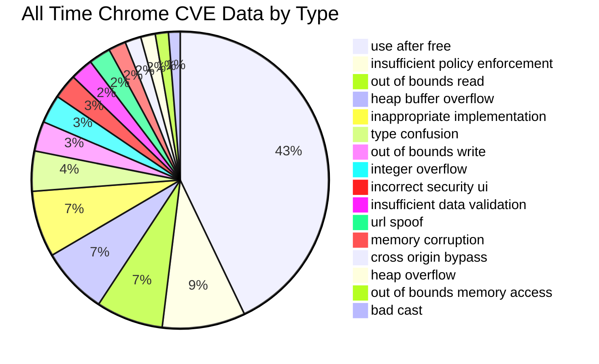
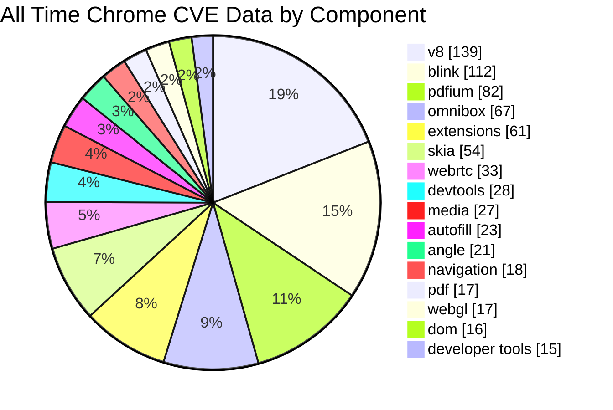
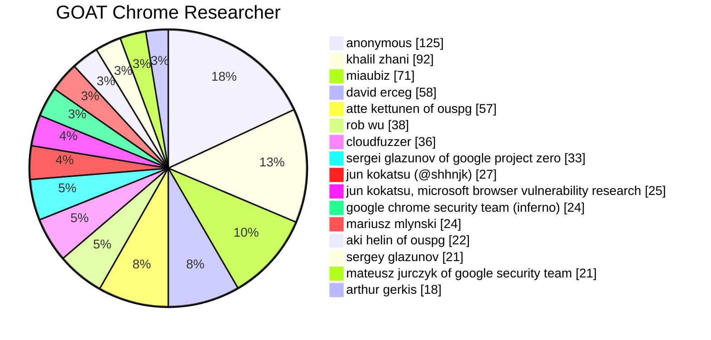
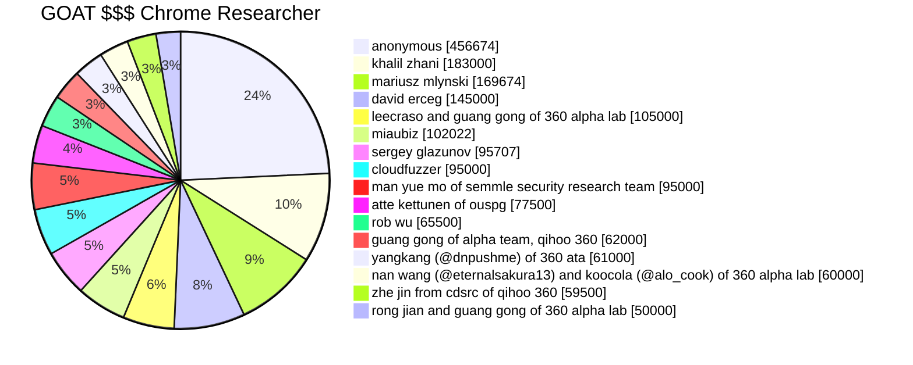

> TL;DR - The Google Chrome Releases blog provides CVE data [one liners](#may-2022-google-chrome-cve-one-liners) containing all the information needed to create a rich CVE data source. Google Chrome CVEs are plentiful and provide information for understanding Google Chrome security trends. Using the information available, I was able to create an enriched [CVE data source](https://github.com/clearbluejar/cve-markdown-charts/blob/1cd46ddf3221932ba1a48b03787cad6493074277/data/chromerelease_cve.json) to enhance the CVE Markdown Charts Github project.

## CVE Data Sources

Known CVE reliable data sources:

- [Mitre](https://cve.mitre.org/)
- [NIST CVEs](https://nvd.nist.gov/developers/vulnerabilities)
- [Github CVEProject](https://github.com/CVEProject/cvelist)

In this short post I will walk you through the process I went through to build a new CVE data source from the [Google Chrome Releases](https://chromereleases.googleblog.com/) CVE data. The purpose of the data is to provide another enriched CVE data source for my latest [CVE Markdown Charts](https://github.com/clearbluejar/cve-markdown-charts) side project.

The current CVE [4.0](https://github.com/CVEProject/cve-schema/blob/master/schema/v4.0/CVE_JSON_4.0_min_public.schema) JSON schema provides the following info:

<script src="https://gist.github.com/clearbluejar/bc2d66e83bd62ea5285f9d72447ac5fc.js"></script>
<sub> CVE_JSON_4.0_min_public.schema </sub>

The v4.0 CVE info is decent, but still lacking. Microsoft provides a rich data set each month containing in depth information for all their CVEs on [Patch Tuesday](https://en.wikipedia.org/wiki/Patch_Tuesday). The information is available through MSRC's public [API](https://api.msrc.microsoft.com/cvrf/v2.0/swagger/index) (for more details see how I originally leveraged that data in my [first CVE Markdown Charts post](https://clearbluejar.github.io/posts/introducing-cve-markdown-charts-part-1/).

Some of the fields of interest in the MSRC CVRF security updates are:

- **Type** (RCE,LPE, Info Disclosure, etc.)
- **Acknowledgement** (researcher who found it)
- **Component Tag** (details on the specific affected component)

With this information we can start to build some interesting charts. How can I find this info for Google Chrome CVEs? Is it readily available?

### CVE JSON Schema++?

The v4.0 CVE json is about to [change to 5.0](https://www.cve.org/Media/News/item/blog/2022/01/18/CVE-List-Download-Formats-Are), but I will believe it when I see it. The proposed schema is a bit larger than the previous one. You can see the new CVE 5.0 schema [here](https://github.com/CVEProject/cve-schema/blob/8b6a261163b98392a72edcb3d087833becc2b91a/schema/v5.0/CVE_JSON_5.0_schema.json). They added fields that seem to match the enriched ones above and several more.

For example, they seem to have a new [credit](https://github.com/CVEProject/cve-schema/blob/8b6a261163b98392a72edcb3d087833becc2b91a/schema/v5.0/docs/advanced-example.json#L241-L257) field in the schema to match **acknowledgement**:

```json
        "credits": [
          {
            "lang": "en",
            "value": "Alice",
            "type": "finder"
          },
          {
            "lang": "en",
            "value": "Bob",
            "type": "analyst"
          },
          {
            "lang": "en",
            "value": "Acme Autofuzz",
            "type": "tool"
          }
        ],
```

They also have some fields that might provide both the [type](https://github.com/CVEProject/cve-schema/blob/8b6a261163b98392a72edcb3d087833becc2b91a/schema/v5.0/docs/advanced-exple.json#L33-L43) and [component](https://github.com/CVEProject/cve-schema/blob/8b6a261163b98392a72edcb3d087833becc2b91a/schema/v5.0/CVE_JSON_5.0_schema.json#L211-L220). I doubt they will retroactively populate all the old CVEs with new information even once the schema migrates to 5.  

Well if this data isn't here yet, what can we do today for Google Chrome CVEs?

## Monorail Chromium Bug Tracker

> Monorail is the Issue Tracker used by the Chromium project and other related projects. It is hosted at bugs.chromium.org. [Source](https://chromium.googlesource.com/infra/infra/+/refs/heads/main/appengine/monorail)

A quick google search didn't provide any leads to Google Chrome CVE data. It did lead me to their standard Monorail bug tracker [list](https://bugs.chromium.org/p/chromium/issues/list).  I say standard because they seem to host [all](https://bugs.chromium.org/) their open source project issues in Monorail.

The bug tracker lists [CVE information](https://bugs.chromium.org/p/chromium/issues/list?colspec=ID%20Pri%20Type%20Component%20Status%20Summary%20Owner%20Target%20M%20Reporter%20Modified%20Opened%20CVE&q=type%3Abug-security%20os%3DAndroid%2Cios%2Clinux%2Cmac%2Cwindows%2Call&can=1&sort=cve&start=0) if you adjust filter and columns:

{: .shadow }_Chromium Bug Tracker_

Perfect. This list seems to have the **type**, **component**, and even the **acknowledgement** data I'm looking for. The acknowledgment data is masked a bit (see in picture *halfname..partofit@provider.com*), but maybe that is OK? Now, how do I leverage an API to grab the data? This is Google, surely they have an one.

### Monorail API

I found a link to the [Monorail API](https://chromium.googlesource.com/infra/infra/+/HEAD/appengine/monorail/doc/api.md) and their test python [client](https://chromium.googlesource.com/infra/infra/+/refs/heads/main/appengine/monorail/doc/example.py). The script and site seemed a bit dated but simple enough.

Hmm. They want to authenticate? That usually is a bridge too far for me. But maybe we don't need to authenticate? I pulled down the python script and set it up. I ran the client script and tried commenting out the [credentials](https://chromium.googlesource.com/infra/infra/+/refs/heads/main/appengine/monorail/doc/example.py#20) section...

{: .shadow }_Monorail API client needs authentication_

No joy. I really don't want to have to authenticate to query the API. Too much overhead and I'm simply running a query once a month. What other options do I have?

## Google Chrome Releases Blog

It seems that all (most?) of Google Chrome CVEs are also available on their [Google Chrome Releases](https://chromereleases.googleblog.com/) blog.

{: .shadow }_Google Release Blog_

Each month, similar to Microsoft's monthly secutiy updates, they publish release notifications on this blog and list the CVEs under the section "Security Fixes and Rewards".

### Google Chrome Releases Blog CVE one-liners

Hmm. The data is here. In the security section there is a list of the CVEs fixed during the current month:  

#### May 2022 Google Chrome CVE One-liners

- [$5000][[1316990](https://crbug.com/1316990)] High CVE-2022-1633: Use after free in Sharesheet. Reported by Khalil Zhani on 2022-04-18
- [$3000][[1314908](https://crbug.com/1314908)] High CVE-2022-1634: Use after free in Browser UI. Reported by Khalil Zhani on 2022-04-09
- [$3000][[1319797](https://crbug.com/1319797)] High CVE-2022-1635: Use after free in Permission Prompts. Reported by Anonymous on 2022-04-26
- [$NA][[1297283](https://crbug.com/1297283)] High CVE-2022-1636: Use after free in Performance APIs. Reported by Seth Brenith, Microsoft  on 2022-02-15
- [$TBD][[1311820](https://crbug.com/1311820)] High CVE-2022-1637: Inappropriate implementation in Web Contents. Reported by Alesandro Ortiz on 2022-03-31
- [$TBD][[1316946](https://crbug.com/1316946)] High CVE-2022-1638: Heap buffer overflow in V8 Internationalization. Reported by DoHyun Lee (@l33d0hyun) of DNSLab, Korea University on 2022-04-17
- [$TBD][[1317650](https://crbug.com/1317650)] High CVE-2022-1639: Use after free in ANGLE. Reported by SeongHwan Park (SeHwa) on 2022-04-19
- [$TBD][[1320592](https://crbug.com/1320592)] High CVE-2022-1640: Use after free in Sharing. Reported by Weipeng Jiang (@Krace) and Guang Gong of 360 Vulnerability Research Institute on 2022-04-28
- [$5000][[1305068](https://crbug.com/1305068)] Medium CVE-2022-1641: Use after free in Web UI Diagnostics. Reported by Rong Jian of VRI on 2022-03-10

These beautiful CVE one-liners contain all the data I'm looking for.

> [$5000][[1316990](https://crbug.com/1316990)] High CVE-2022-1633: Use after free in Sharesheet. Reported by Khalil Zhani on 2022-04-18

| field | data |
| --- | --- |
| **reward** | $5000 |
| **url** | [1316990](https://crbug.com/1316990) |
| **severity** | High |
| **cve_id** | CVE-2022-1633 |
| **type** | Use after free |
| **component** | Sharesheet |
| **acknowledgment** | Khalil Zhani |

## Building Google Chrome Enriched CVE data

Right. Time to do some scraping. Don't hate me Google.

### Scraping like it's 1999

We are actually scraping like it's 2008, because that is how far back this blog goes.  I built a scraper that would [build](https://github.com/clearbluejar/cve-markdown-charts/blob/e82d2b8ee797ece31e0df3b986efe45d7af55c7d/data/chromerelease.py#L32-L43) a set of URLs that matched the simple pattern. The urls span from [2008 until present day](https://github.com/clearbluejar/cve-markdown-charts/blob/b02c39099ef5fd76ff11bf075ed0950243ec8cb2/data/chromerelease.py#L35).

I tried a couple different ways to pull out and parse the CVE data.  I started to try to handle [all the cases](https://github.com/clearbluejar/cve-markdown-charts/blob/e82d2b8ee797ece31e0df3b986efe45d7af55c7d/data/chromerelease.py#L51-L160) using various html tags as hook points

```python
            # finding parent <ul> tag
            for li in soup.find("body").findAll("li"):
                if "CVE" in str(li):
                    #print(len(li))
                    cves.append(li.text)

            # <p> works for 2022
            for p in soup.find("body").findAll("p"):
                if "CVE" in str(p):
                    #print(len(p))
                    cves.append(p.text)

            # find all <divs>
            all_divs = iter(soup.find("body").findAll("div"))
            for div in all_divs:
                dir = div.attrs.get('dir')
                if "CVE" in str(div) and dir == 'ltr':

```

But the complexity was a bit [much](https://github.com/clearbluejar/cve-markdown-charts/blob/e82d2b8ee797ece31e0df3b986efe45d7af55c7d/data/chromerelease.py#L73-L102) and focusing on different tags tended to either duplicate or miss data.

Then I found the most simple heuristic is to leverage [beautifulsoup](https://beautiful-soup-4.readthedocs.io/en/latest/)'s ability to [find all](https://github.com/clearbluejar/cve-markdown-charts/blob/e82d2b8ee797ece31e0df3b986efe45d7af55c7d/data/chromerelease.py#L107) the `href` tags in the response. From the CVE urls, both legacy (`http://code.google.com/p/chromium/issues/detail?id=72517`) and recent (`https://crbug.com/1305068`) URLs, I was able to discover ~2000 CVEs starting from about 2011. This lined up with the number of issues (+/- 25 CVEs) I could see in the Monorail site.

{: .shadow }_chromerelease.py console output_

### Results

From the scraping I was able to produce the final enriched Google Chrome CVE data in two steps.

The [first step](https://github.com/clearbluejar/cve-markdown-charts/blob/588831d1cb8a22354797fd5cedabc1948bd88b33/data/chromerelease.py#L14) did the scraping and recorded the one-liners in [chromerelease_raw_cve.json](https://github.com/clearbluejar/cve-markdown-charts/blob/v0.2.0/data/chromerelease_raw_cve.json):

```json
    [    "2011-01",
        "http://code.google.com/p/chromium-os/issues/detail?id=10234",
        "Kernel is vulnerable to CVE-2010-4258 (10234)"
    ],
    [
        "2011-03",
        "http://code.google.com/p/chromium/issues/detail?id=72517",
        "[$500] [72517] High CVE-2011-1291: Buffer error in base string handling. Credit to Alex Turpin."
    ],
    [
        "2011-03",
        "http://code.google.com/p/chromium/issues/detail?id=73216",
        "[$1000] [73216] High CVE-2011-1292: Use-after-free in the frame loader. Credit to S\u0142awomir B\u0142a\u017cek."
    ],
    [
        "2011-03",
        "http://code.google.com/p/chromium/issues/detail?id=73595",
        "[$2000] [73595] High CVE-2011-1293: Use-after-free in HTMLCollection. Credit to Sergey Glazunov."
    ],
```

The [second step](https://github.com/clearbluejar/cve-markdown-charts/blob/588831d1cb8a22354797fd5cedabc1948bd88b33/data/chromerelease.py#L124) parsed the one-liners to create the final enriched [chromerelease_cve.json](https://github.com/clearbluejar/cve-markdown-charts/blob/v0.2.0/data/chromerelease_cve.json):

```json
    {
        "blog_id": "2011-01",
        "url": "http://code.google.com/p/chromium-os/issues/detail?id=10234",
        "reward": null,
        "bug_id": null,
        "severity": null,
        "cve_id": "CVE-2010-4258",
        "description": null,
        "date": "2011-01-01",
        "acknowledgment": null,
        "type": null,
        "component": null
    },
    {
        "blog_id": "2011-03",
        "url": "http://code.google.com/p/chromium/issues/detail?id=72517",
        "reward": "500",
        "bug_id": "72517",
        "severity": "High",
        "cve_id": "CVE-2011-1291",
        "description": "Buffer error in base string handling",
        "date": "2011-03-01",
        "acknowledgment": "Alex Turpin",
        "type": "buffer error",
        "component": "base string handling"
    },
    {
        "blog_id": "2011-03",
        "url": "http://code.google.com/p/chromium/issues/detail?id=73216",
        "reward": "1000",
        "bug_id": "73216",
        "severity": "High",
        "cve_id": "CVE-2011-1292",
        "description": "Use-after-free in the frame loader",
        "date": "2011-03-01",
        "acknowledgment": "S\u0142awomir B\u0142a\u017cek",
        "type": "use after free",
        "component": "the frame loader"
    }
```

### Enhancing CVE Markdown Charts

With this new data set we can start to build some useful charts in CVE Markdown Charts with [build_markdown_goat_charts_from_chrome_data](https://github.com/clearbluejar/cve-markdown-charts/blob/b02c39099ef5fd76ff11bf075ed0950243ec8cb2/cve_markdown_charts.py#L586) :

## All Time CVEs by Type

What type of vulnerabilities is Google Chrome most susceptible to?



|CVE Type|CVEs|Count|
| :---: | :---: | :---: |
|use after free|<details>CVE-2011-1292<br>CVE-2011-1293<br>CVE-2011-1440<br>CVE-2011-1449<br>CVE-2011-1454<br>CVE-2011-1301<br>CVE-2011-2346<br>CVE-2011-2351<br>CVE-2011-2349<br>CVE-2011-1809<br>CVE-2011-1816<br>CVE-2011-1818<br>CVE-2011-2823<br>CVE-2011-2824<br>CVE-2011-2825<br>CVE-2011-2827<br>CVE-2011-2846<br>CVE-2011-2847<br>CVE-2011-2853<br>CVE-2011-2854<br>CVE-2011-2854<br>CVE-2011-2857<br>CVE-2011-2860<br>CVE-2011-3882<br>CVE-2011-3883<br>CVE-2011-3888<br>CVE-2011-3890<br>CVE-2011-3897<br>CVE-2011-3912<br>CVE-2011-3913<br>CVE-2011-3924<br>CVE-2011-3925<br>CVE-2011-3928<br>CVE-2011-3921<br>CVE-2011-3021<br>CVE-2011-3023<br>CVE-2011-3957<br>CVE-2011-3966<br>CVE-2011-3968<br>CVE-2011-3969<br>CVE-2011-3971<br>CVE-2011-3064<br>CVE-2011-3050<br>CVE-2011-3051<br>CVE-2011-3053<br>CVE-2011-3078<br>CVE-2012-1521<br>CVE-2011-3081<br>CVE-2011-3105<br>CVE-2011-3108<br>CVE-2011-3112<br>CVE-2011-3086<br>CVE-2011-3089<br>CVE-2011-3091<br>CVE-2011-3096<br>CVE-2012-2817<br>CVE-2012-2818<br>CVE-2012-2823<br>CVE-2012-2824<br>CVE-2012-2827<br>CVE-2012-2829<br>CVE-2012-2831<br>CVE-2012-2855<br>CVE-2012-2857<br>CVE-2012-2842<br>CVE-2012-2843<br>CVE-2012-2887<br>CVE-2012-2888<br>CVE-2012-2878<br>CVE-2012-2890<br>CVE-2012-2890<br>CVE-2012-2890<br>CVE-2012-5137<br>CVE-2012-5133<br>CVE-2012-5135<br>CVE-2012-5116<br>CVE-2012-5121<br>CVE-2012-5125<br>CVE-2012-5126<br>CVE-2012-5139<br>CVE-2012-5140<br>CVE-2013-0839<br>CVE-2012-5145<br>CVE-2012-5147<br>CVE-2012-5150<br>CVE-2012-5156<br>CVE-2013-0832<br>CVE-2013-0880<br>CVE-2013-0898<br>CVE-2013-0916<br>CVE-2013-0920<br>CVE-2013-0902<br>CVE-2013-0903<br>CVE-2013-0905<br>CVE-2013-2833<br>CVE-2013-2837<br>CVE-2013-2840<br>CVE-2013-2841<br>CVE-2013-2842<br>CVE-2013-2843<br>CVE-2013-2844<br>CVE-2013-2846<br>CVE-2013-2856<br>CVE-2013-2857<br>CVE-2013-2858<br>CVE-2013-2860<br>CVE-2013-2861<br>CVE-2013-2883<br>CVE-2013-2884<br>CVE-2013-2885<br>CVE-2013-2885<br>CVE-2013-2870<br>CVE-2013-2870<br>CVE-2013-2871<br>CVE-2013-2871<br>CVE-2013-2873<br>CVE-2013-2902<br>CVE-2013-2903<br>CVE-2013-2904<br>CVE-2013-2925<br>CVE-2013-2926<br>CVE-2013-2927<br>CVE-2013-2909<br>CVE-2013-2909<br>CVE-2013-2910<br>CVE-2013-2911<br>CVE-2013-2912<br>CVE-2013-2913<br>CVE-2013-2914<br>CVE-2013-2918<br>CVE-2013-2921<br>CVE-2013-2922<br>CVE-2013-2924<br>CVE-2013-6621<br>CVE-2013-6622<br>CVE-2013-6624<br>CVE-2013-6625<br>CVE-2013-6631<br>CVE-2013-6635<br>CVE-2014-1713<br>CVE-2014-1713<br>CVE-2014-1732<br>CVE-2014-1743<br>CVE-2014-1743<br>CVE-2014-1745<br>CVE-2014-1745<br>CVE-2014-3154<br>CVE-2014-3154<br>CVE-2015-1209<br>CVE-2015-1209<br>CVE-2015-1209<br>CVE-2015-1216<br>CVE-2015-1218<br>CVE-2015-1220<br>CVE-2015-1221<br>CVE-2015-1222<br>CVE-2015-1223<br>CVE-2015-1276<br>CVE-2015-1282<br>CVE-2015-1284<br>CVE-2015-1272<br>CVE-2015-1277<br>CVE-2015-1294<br>CVE-2015-1295<br>CVE-2015-1299<br>CVE-2015-6756<br>CVE-2015-6757<br>CVE-2015-6789<br>CVE-2015-6765<br>CVE-2015-6766<br>CVE-2015-6767<br>CVE-2015-6774<br>CVE-2015-6777<br>CVE-2015-6780<br>CVE-2016-1613<br>CVE-2016-1647<br>CVE-2016-1648<br>CVE-2016-1644<br>CVE-2016-1633<br>CVE-2016-1634<br>CVE-2016-1635<br>CVE-2016-1639<br>CVE-2016-1641<br>CVE-2016-1662<br>CVE-2016-1663<br>CVE-2016-1655<br>CVE-2016-1700<br>CVE-2016-1701<br>CVE-2016-5150<br>CVE-2016-5151<br>CVE-2016-5156<br>CVE-2016-5177<br>CVE-2016-5170<br>CVE-2016-5171<br>CVE-2016-5183<br>CVE-2016-5184<br>CVE-2016-5185<br>CVE-2016-5190<br>CVE-2016-5203<br>CVE-2016-5211<br>CVE-2016-5213<br>CVE-2016-5216<br>CVE-2016-5215<br>CVE-2016-5219<br>CVE-2017-5019<br>CVE-2017-5021<br>CVE-2017-5056<br>CVE-2017-5055<br>CVE-2017-5056<br>CVE-2017-5062<br>CVE-2017-5064<br>CVE-2017-5073<br>CVE-2017-5074<br>CVE-2017-5080<br>CVE-2017-5091<br>CVE-2017-5092<br>CVE-2017-5098<br>CVE-2017-5100<br>CVE-2017-5111<br>CVE-2017-5126<br>CVE-2017-5127<br>CVE-2017-5129<br>CVE-2017-15399<br>CVE-2017-15410<br>CVE-2017-15411<br>CVE-2017-15412<br>CVE-2018-6031<br>CVE-2018-6054<br>CVE-2017-11215<br>CVE-2017-11225<br>CVE-2018-6060<br>CVE-2018-6118<br>CVE-2018-6085<br>CVE-2018-6086<br>CVE-2018-6087<br>CVE-2018-6088<br>CVE-2018-6123<br>CVE-2018-6127<br>CVE-2018-6155<br>CVE-2018-6158<br>CVE-2018-6171<br>CVE-2018-16071<br>CVE-2018-17465<br>CVE-2018-17474<br>CVE-2018-17481<br>CVE-2018-18336<br>CVE-2018-18337<br>CVE-2018-18339<br>CVE-2018-18340<br>CVE-2018-18343<br>CVE-2018-18356<br>CVE-2018-20066<br>CVE-2019-5756<br>CVE-2019-5758<br>CVE-2019-5759<br>CVE-2019-5760<br>CVE-2019-5761<br>CVE-2019-5762<br>CVE-2019-5764<br>CVE-2019-5772<br>CVE-2019-5787<br>CVE-2019-5788<br>CVE-2019-5789<br>CVE-2019-5786<br>CVE-2019-5805<br>CVE-2019-5808<br>CVE-2019-5809<br>CVE-2019-5842<br>CVE-2019-5828<br>CVE-2019-5829<br>CVE-2019-5850<br>CVE-2019-5860<br>CVE-2019-5869<br>CVE-2019-5868<br>CVE-2019-13685<br>CVE-2019-13688<br>CVE-2019-13687<br>CVE-2019-13686<br>CVE-2019-5870<br>CVE-2019-13766<br>CVE-2019-13766<br>CVE-2019-5872<br>CVE-2019-5876<br>CVE-2019-5878<br>CVE-2019-13721<br>CVE-2019-13720<br>CVE-2019-13699<br>CVE-2019-13765<br>CVE-2019-13723<br>CVE-2019-13767<br>CVE-2019-13725<br>CVE-2019-13729<br>CVE-2019-13732<br>CVE-2020-6378<br>CVE-2020-6379<br>CVE-2020-6377<br>CVE-2020-6384<br>CVE-2020-6386<br>CVE-2020-6450<br>CVE-2020-6451<br>CVE-2020-6422<br>CVE-2020-6424<br>CVE-2020-6427<br>CVE-2020-6428<br>CVE-2020-6429<br>CVE-2020-6449<br>CVE-2020-6462<br>CVE-2020-6461<br>CVE-2020-6459<br>CVE-2020-6463<br>CVE-2020-6457<br>CVE-2020-6454<br>CVE-2020-6423<br>CVE-2020-6572<br>CVE-2020-6434<br>CVE-2020-6436<br>CVE-2020-6448<br>CVE-2020-6465<br>CVE-2020-6466<br>CVE-2020-6467<br>CVE-2020-6474<br>CVE-2020-6509<br>CVE-2020-6505<br>CVE-2020-6493<br>CVE-2020-6496<br>CVE-2020-6508<br>CVE-2020-6532<br>CVE-2020-6539<br>CVE-2020-6541<br>CVE-2020-6515<br>CVE-2020-6518<br>CVE-2020-6559<br>CVE-2020-6542<br>CVE-2020-6543<br>CVE-2020-6544<br>CVE-2020-6545<br>CVE-2020-6549<br>CVE-2020-6550<br>CVE-2020-6551<br>CVE-2020-6552<br>CVE-2020-6553<br>CVE-2020-6554<br>CVE-2020-6573<br>CVE-2020-6576<br>CVE-2020-16001<br>CVE-2020-16002<br>CVE-2020-16003<br>CVE-2020-15993<br>CVE-2020-13871<br>CVE-2020-15994<br>CVE-2020-15996<br>CVE-2020-15997<br>CVE-2020-15998<br>CVE-2020-15967<br>CVE-2020-15968<br>CVE-2020-15969<br>CVE-2020-15970<br>CVE-2020-15971<br>CVE-2020-15972<br>CVE-2020-15990<br>CVE-2020-15991<br>CVE-2020-15976<br>CVE-2020-15987<br>CVE-2020-16018<br>CVE-2020-16014<br>CVE-2020-16023<br>CVE-2020-16045<br>CVE-2020-16026<br>CVE-2020-16017<br>CVE-2020-16037<br>CVE-2020-16038<br>CVE-2020-16039<br>CVE-2021-21119<br>CVE-2021-21120<br>CVE-2021-21121<br>CVE-2021-21122<br>CVE-2020-16044<br>CVE-2021-21138<br>CVE-2021-21150<br>CVE-2021-21151<br>CVE-2021-21157<br>CVE-2021-21142<br>CVE-2021-21145<br>CVE-2021-21146<br>CVE-2021-21194<br>CVE-2021-21195<br>CVE-2021-21191<br>CVE-2021-21193<br>CVE-2021-21162<br>CVE-2021-21167<br>CVE-2021-21179<br>CVE-2021-21180<br>CVE-2021-21188<br>CVE-2021-21232<br>CVE-2021-21232<br>CVE-2021-21226<br>CVE-2021-21201<br>CVE-2021-21202<br>CVE-2021-21203<br>CVE-2021-21204<br>CVE-2021-21207<br>CVE-2021-21213<br>CVE-2021-21214<br>CVE-2021-30522<br>CVE-2021-30523<br>CVE-2021-30524<br>CVE-2021-30525<br>CVE-2021-30527<br>CVE-2021-30528<br>CVE-2021-30529<br>CVE-2021-30542<br>CVE-2021-30543<br>CVE-2021-30512<br>CVE-2021-30514<br>CVE-2021-30515<br>CVE-2021-30519<br>CVE-2021-30520<br>CVE-2021-30554<br>CVE-2021-30555<br>CVE-2021-30556<br>CVE-2021-30557<br>CVE-2021-30544<br>CVE-2021-30545<br>CVE-2021-30546<br>CVE-2021-30548<br>CVE-2021-30549<br>CVE-2021-30550<br>CVE-2021-30552<br>CVE-2021-30553<br>CVE-2021-30567<br>CVE-2021-30569<br>CVE-2021-30572<br>CVE-2021-30573<br>CVE-2021-30574<br>CVE-2021-30576<br>CVE-2021-30579<br>CVE-2021-30581<br>CVE-2021-30585<br>CVE-2021-30541<br>CVE-2021-30560<br>CVE-2021-30562<br>CVE-2021-30606<br>CVE-2021-30607<br>CVE-2021-30608<br>CVE-2021-30609<br>CVE-2021-30610<br>CVE-2021-30611<br>CVE-2021-30612<br>CVE-2021-30613<br>CVE-2021-30616<br>CVE-2021-30622<br>CVE-2021-30623<br>CVE-2021-30624<br>CVE-2021-30600<br>CVE-2021-30601<br>CVE-2021-30602<br>CVE-2021-30604<br>CVE-2021-37956<br>CVE-2021-38008<br>CVE-2021-38006<br>CVE-2021-38005<br>CVE-2021-38011<br>CVE-2021-4099<br>CVE-2021-4102<br>CVE-2021-4052<br>CVE-2021-4053<br>CVE-2021-4057<br>CVE-2021-4063<br>CVE-2021-4064<br>CVE-2021-4065<br>CVE-2021-4067<br>CVE-2022-0289<br>CVE-2022-0290<br>CVE-2022-0290<br>CVE-2022-0293<br>CVE-2022-0295<br>CVE-2022-0296<br>CVE-2022-0297<br>CVE-2022-0298<br>CVE-2022-0300<br>CVE-2022-0302<br>CVE-2022-0307<br>CVE-2022-0308<br>CVE-2022-0603<br>CVE-2022-0605<br>CVE-2022-0606<br>CVE-2022-0607<br>CVE-2022-0609<br>CVE-2022-0452<br>CVE-2022-0453<br>CVE-2022-0456<br>CVE-2022-0458<br>CVE-2022-0459<br>CVE-2022-0460<br>CVE-2022-0463<br>CVE-2022-0464<br>CVE-2022-0465<br>CVE-2022-0468<br>CVE-2022-0469<br>CVE-2022-1125<br>CVE-2022-1127<br>CVE-2022-1131<br>CVE-2022-1133<br>CVE-2022-1135<br>CVE-2022-1136<br>CVE-2022-1141<br>CVE-2022-1144<br>CVE-2022-1145<br>CVE-2022-0971<br>CVE-2022-0972<br>CVE-2022-0973<br>CVE-2022-0975<br>CVE-2022-0977<br>CVE-2022-0978<br>CVE-2022-0979<br>CVE-2022-0980<br>CVE-2022-1477<br>CVE-2022-1478<br>CVE-2022-1479<br>CVE-2022-1481<br>CVE-2022-1485<br>CVE-2022-1487<br>CVE-2022-1490<br>CVE-2022-1491<br>CVE-2022-1493<br>CVE-2022-1496<br>CVE-2022-1633<br>CVE-2022-1634<br>CVE-2022-1635<br>CVE-2022-1636<br>CVE-2022-1639<br>CVE-2022-1640<br>CVE-2022-1641<br>CVE-2022-1633<br>CVE-2022-1634<br>CVE-2022-1635<br>CVE-2022-1636<br>CVE-2022-1639<br>CVE-2022-1640<br>CVE-2022-1641</details>|540|
|insufficient policy enforcement|<details>CVE-2018-18349<br>CVE-2018-18350<br>CVE-2018-18351<br>CVE-2018-18355<br>CVE-2018-18357<br>CVE-2018-18358<br>CVE-2018-20069<br>CVE-2018-20070<br>CVE-2018-20071<br>CVE-2019-5765<br>CVE-2019-5766<br>CVE-2019-5768<br>CVE-2019-5775<br>CVE-2019-5776<br>CVE-2019-5777<br>CVE-2019-5778<br>CVE-2019-5779<br>CVE-2019-5781<br>CVE-2020-6504<br>CVE-2019-5880<br>CVE-2019-13727<br>CVE-2019-13737<br>CVE-2019-13738<br>CVE-2019-13744<br>CVE-2019-13745<br>CVE-2019-13746<br>CVE-2019-13748<br>CVE-2019-13754<br>CVE-2019-13755<br>CVE-2019-13758<br>CVE-2019-13762<br>CVE-2019-13763<br>CVE-2020-6425<br>CVE-2020-6420<br>CVE-2020-6431<br>CVE-2020-6432<br>CVE-2020-6433<br>CVE-2020-6435<br>CVE-2020-6438<br>CVE-2020-6439<br>CVE-2020-6441<br>CVE-2020-6445<br>CVE-2020-6446<br>CVE-2020-6469<br>CVE-2020-6471<br>CVE-2020-6472<br>CVE-2020-6473<br>CVE-2020-6476<br>CVE-2020-6480<br>CVE-2020-6481<br>CVE-2020-6482<br>CVE-2020-6483<br>CVE-2020-6486<br>CVE-2020-6487<br>CVE-2020-6488<br>CVE-2020-6506<br>CVE-2020-6495<br>CVE-2020-6497<br>CVE-2020-6527<br>CVE-2020-6558<br>CVE-2020-6560<br>CVE-2020-6562<br>CVE-2020-6563<br>CVE-2020-6566<br>CVE-2020-6568<br>CVE-2020-15961<br>CVE-2020-15962<br>CVE-2020-15963<br>CVE-2020-15966<br>CVE-2020-6574<br>CVE-2020-15959<br>CVE-2020-15973<br>CVE-2020-15980<br>CVE-2020-15984<br>CVE-2020-15992<br>CVE-2020-15988<br>CVE-2020-16022<br>CVE-2020-16027<br>CVE-2021-21117<br>CVE-2021-21125<br>CVE-2021-21126<br>CVE-2021-21127<br>CVE-2021-21129<br>CVE-2021-21130<br>CVE-2021-21131<br>CVE-2021-21133<br>CVE-2021-21136<br>CVE-2021-21141<br>CVE-2021-21168<br>CVE-2021-21172<br>CVE-2021-21177<br>CVE-2021-21182<br>CVE-2021-21185<br>CVE-2021-21186<br>CVE-2021-21189<br>CVE-2021-21228<br>CVE-2021-21205<br>CVE-2021-30531<br>CVE-2021-30532<br>CVE-2021-30533<br>CVE-2021-30534<br>CVE-2021-30558<br>CVE-2021-30537<br>CVE-2021-30538<br>CVE-2021-30539<br>CVE-2021-30571<br>CVE-2021-30577<br>CVE-2021-30577<br>CVE-2021-30580<br>CVE-2021-30620<br>CVE-2021-38016<br>CVE-2021-38017<br>CVE-2021-38019<br>CVE-2021-38020</details>|114|
|out of bounds read|<details>CVE-2011-1445<br>CVE-2011-1455<br>CVE-2011-2345<br>CVE-2011-2843<br>CVE-2011-2844<br>CVE-2011-3234<br>CVE-2011-2850<br>CVE-2011-2851<br>CVE-2011-2864<br>CVE-2011-2858<br>CVE-2011-3903<br>CVE-2011-3906<br>CVE-2011-3908<br>CVE-2011-3910<br>CVE-2011-3911<br>CVE-2011-3025<br>CVE-2011-3960<br>CVE-2011-3962<br>CVE-2011-3963<br>CVE-2011-3970<br>CVE-2011-3972<br>CVE-2011-3059<br>CVE-2011-3060<br>CVE-2011-3104<br>CVE-2011-3088<br>CVE-2011-3093<br>CVE-2011-3094<br>CVE-2012-2820<br>CVE-2012-2826<br>CVE-2012-2865<br>CVE-2012-2884<br>CVE-2012-5130<br>CVE-2012-5152<br>CVE-2013-0833<br>CVE-2013-0834<br>CVE-2013-0888<br>CVE-2013-0917<br>CVE-2013-2838<br>CVE-2013-2869<br>CVE-2013-2875<br>CVE-2013-2877<br>CVE-2013-2878<br>CVE-2013-2907<br>CVE-2013-2917<br>CVE-2013-2920<br>CVE-2013-6623<br>CVE-2013-6627<br>CVE-2013-6640<br>CVE-2014-1746<br>CVE-2014-1746<br>CVE-2014-3155<br>CVE-2014-3155<br>CVE-2015-1224<br>CVE-2015-1225<br>CVE-2016-1619<br>CVE-2016-1626<br>CVE-2016-1628<br>CVE-2016-1646<br>CVE-2016-1651<br>CVE-2016-1685<br>CVE-2016-1686<br>CVE-2016-10403<br>CVE-2016-1702<br>CVE-2016-5186<br>CVE-2017-5088<br>CVE-2017-5071<br>CVE-2017-5097<br>CVE-2017-15388<br>CVE-2017-15416<br>CVE-2018-16066<br>CVE-2018-16067<br>CVE-2018-16069<br>CVE-2018-16076<br>CVE-2018-16083<br>CVE-2018-18359<br>CVE-2019-5798<br>CVE-2019-5813<br>CVE-2019-5835<br>CVE-2019-5867<br>CVE-2019-13706<br>CVE-2019-13752<br>CVE-2019-13753<br>CVE-2019-20503<br>CVE-2020-6455<br>CVE-2020-6555<br>CVE-2020-15960<br>CVE-2020-15981<br>CVE-2020-16041<br>CVE-2021-21198<br>CVE-2021-30536<br>CVE-2021-30511<br>CVE-2021-30575</details>|92|
|heap buffer overflow|<details>CVE-2011-3926<br>CVE-2011-3919<br>CVE-2011-3019<br>CVE-2015-1271<br>CVE-2015-1273<br>CVE-2015-1279<br>CVE-2015-1283<br>CVE-2016-1689<br>CVE-2016-1691<br>CVE-2017-5054<br>CVE-2017-5054<br>CVE-2017-5077<br>CVE-2017-5112<br>CVE-2017-5113<br>CVE-2017-15408<br>CVE-2018-6038<br>CVE-2018-6062<br>CVE-2018-6090<br>CVE-2018-6126<br>CVE-2018-6141<br>CVE-2018-6120<br>CVE-2018-6154<br>CVE-2018-6156<br>CVE-2018-6162<br>CVE-2018-17469<br>CVE-2018-18335<br>CVE-2018-18338<br>CVE-2018-18341<br>CVE-2019-5770<br>CVE-2019-5771<br>CVE-2019-5790<br>CVE-2019-5815<br>CVE-2019-5836<br>CVE-2019-13726<br>CVE-2020-6452<br>CVE-2020-6540<br>CVE-2020-6510<br>CVE-2020-6513<br>CVE-2020-6517<br>CVE-2020-6520<br>CVE-2020-6524<br>CVE-2020-6525<br>CVE-2020-6534<br>CVE-2020-6556<br>CVE-2020-6548<br>CVE-2020-15999<br>CVE-2020-16024<br>CVE-2020-16025<br>CVE-2020-16028<br>CVE-2021-21128<br>CVE-2021-21152<br>CVE-2021-21154<br>CVE-2021-21155<br>CVE-2021-21156<br>CVE-2021-21148<br>CVE-2021-21143<br>CVE-2021-21144<br>CVE-2021-21196<br>CVE-2021-21197<br>CVE-2021-21192<br>CVE-2021-21159<br>CVE-2021-21160<br>CVE-2021-21161<br>CVE-2020-27844<br>CVE-2021-21233<br>CVE-2021-21222<br>CVE-2021-30521<br>CVE-2021-30508<br>CVE-2021-30516<br>CVE-2021-30518<br>CVE-2021-30568<br>CVE-2021-30564<br>CVE-2021-30614<br>CVE-2021-38013<br>CVE-2021-4101<br>CVE-2021-4055<br>CVE-2021-4058<br>CVE-2021-4062<br>CVE-2022-0301<br>CVE-2022-0306<br>CVE-2022-0310<br>CVE-2022-0310<br>CVE-2022-0311<br>CVE-2022-0604<br>CVE-2022-0454<br>CVE-2022-1142<br>CVE-2022-1143<br>CVE-2022-0976<br>CVE-2022-1483<br>CVE-2022-1484<br>CVE-2022-1638<br>CVE-2022-1638</details>|92|
|inappropriate implementation|<details>CVE-2018-18344<br>CVE-2018-18345<br>CVE-2018-18347<br>CVE-2018-18348<br>CVE-2018-18352<br>CVE-2018-18353<br>CVE-2018-20065<br>CVE-2018-20067<br>CVE-2018-20068<br>CVE-2019-5754<br>CVE-2019-5755<br>CVE-2018-20073<br>CVE-2019-5784<br>CVE-2020-6503<br>CVE-2020-6453<br>CVE-2020-6426<br>CVE-2020-6437<br>CVE-2020-6440<br>CVE-2020-6442<br>CVE-2020-6447<br>CVE-2020-6477<br>CVE-2020-6478<br>CVE-2020-6479<br>CVE-2020-6489<br>CVE-2020-6538<br>CVE-2020-6514<br>CVE-2020-6522<br>CVE-2020-6526<br>CVE-2020-6529<br>CVE-2020-6561<br>CVE-2020-6546<br>CVE-2020-16000<br>CVE-2020-6557<br>CVE-2020-15979<br>CVE-2020-15985<br>CVE-2020-16019<br>CVE-2020-16020<br>CVE-2020-16029<br>CVE-2020-16034<br>CVE-2020-16036<br>CVE-2020-16013<br>CVE-2020-16016<br>CVE-2021-21132<br>CVE-2021-21135<br>CVE-2021-21137<br>CVE-2021-21139<br>CVE-2021-21147<br>CVE-2021-21175<br>CVE-2021-21176<br>CVE-2021-21178<br>CVE-2021-21183<br>CVE-2021-21184<br>CVE-2021-21209<br>CVE-2021-21210<br>CVE-2021-21211<br>CVE-2021-21215<br>CVE-2021-21216<br>CVE-2021-30507<br>CVE-2021-30582<br>CVE-2021-30618<br>CVE-2021-38009<br>CVE-2021-38010<br>CVE-2021-38015<br>CVE-2021-38018<br>CVE-2021-38021<br>CVE-2021-38022<br>CVE-2022-0291<br>CVE-2022-0292<br>CVE-2022-0294<br>CVE-2022-0305<br>CVE-2022-0309<br>CVE-2022-0610<br>CVE-2022-0455<br>CVE-2022-0462<br>CVE-2022-0466<br>CVE-2022-0467<br>CVE-2022-1128<br>CVE-2022-1129<br>CVE-2022-1132<br>CVE-2022-1137<br>CVE-2022-1138<br>CVE-2022-1139<br>CVE-2022-1146<br>CVE-2022-1482<br>CVE-2022-1488<br>CVE-2022-1497<br>CVE-2022-1498<br>CVE-2022-1499<br>CVE-2022-1501<br>CVE-2022-1637<br>CVE-2022-1637</details>|91|
|type confusion|<details>CVE-2011-2875<br>CVE-2013-0912<br>CVE-2013-2882<br>CVE-2015-1217<br>CVE-2015-1230<br>CVE-2015-6788<br>CVE-2015-6775<br>CVE-2016-1643<br>CVE-2016-1677<br>CVE-2016-5161<br>CVE-2017-5023<br>CVE-2017-5057<br>CVE-2017-5059<br>CVE-2017-5070<br>CVE-2017-5094<br>CVE-2017-5108<br>CVE-2017-5115<br>CVE-2017-5116<br>CVE-2017-15413<br>CVE-2018-6064<br>CVE-2018-6124<br>CVE-2018-6157<br>CVE-2018-6170<br>CVE-2019-5757<br>CVE-2019-5791<br>CVE-2019-13730<br>CVE-2019-13764<br>CVE-2020-6418<br>CVE-2020-6383<br>CVE-2020-6430<br>CVE-2020-6468<br>CVE-2020-6537<br>CVE-2020-6512<br>CVE-2020-6533<br>CVE-2021-21230<br>CVE-2021-21224<br>CVE-2021-30513<br>CVE-2021-30517<br>CVE-2021-30551<br>CVE-2021-30588<br>CVE-2021-30561<br>CVE-2021-30563<br>CVE-2021-30598<br>CVE-2021-30599<br>CVE-2021-38007<br>CVE-2021-38012<br>CVE-2021-4078<br>CVE-2021-4056<br>CVE-2021-4061<br>CVE-2022-0457<br>CVE-2022-1134<br>CVE-2022-1096<br>CVE-2022-1486<br>CVE-2022-1364<br>CVE-2022-1364</details>|55|
|out of bounds write|<details>CVE-2011-2828<br>CVE-2011-3900<br>CVE-2011-3914<br>CVE-2011-3095<br>CVE-2012-2883<br>CVE-2012-2874<br>CVE-2013-6639<br>CVE-2015-1232<br>CVE-2015-1213<br>CVE-2015-1214<br>CVE-2015-1215<br>CVE-2016-1645<br>CVE-2016-1660<br>CVE-2016-1653<br>CVE-2016-5209<br>CVE-2016-5210<br>CVE-2017-5095<br>CVE-2017-5099<br>CVE-2017-5131<br>CVE-2017-5133<br>CVE-2017-15407<br>CVE-2017-15409<br>CVE-2018-6149<br>CVE-2018-16065<br>CVE-2018-16068<br>CVE-2018-17480<br>CVE-2018-18342<br>CVE-2019-13728<br>CVE-2019-13734<br>CVE-2019-13735<br>CVE-2020-6507<br>CVE-2020-6523<br>CVE-2020-15965<br>CVE-2020-15995<br>CVE-2021-30526<br>CVE-2021-30509<br>CVE-2021-30547<br>CVE-2021-30565<br>CVE-2021-30559<br>CVE-2021-38014<br>CVE-2021-4079</details>|41|
|integer overflow|<details>CVE-2011-2829<br>CVE-2012-2834<br>CVE-2012-2896<br>CVE-2012-5143<br>CVE-2012-5149<br>CVE-2012-5151<br>CVE-2012-5154<br>CVE-2013-0891<br>CVE-2013-0899<br>CVE-2013-2901<br>CVE-2014-1744<br>CVE-2014-1744<br>CVE-2015-1219<br>CVE-2015-6781<br>CVE-2016-1684<br>CVE-2016-5221<br>CVE-2016-5223<br>CVE-2016-5223<br>CVE-2017-15422<br>CVE-2018-6034<br>CVE-2018-6065<br>CVE-2018-6072<br>CVE-2018-6092<br>CVE-2018-6174<br>CVE-2018-16070<br>CVE-2019-5792<br>CVE-2019-5795<br>CVE-2019-5806<br>CVE-2019-5820<br>CVE-2019-5821<br>CVE-2019-5855<br>CVE-2019-5854<br>CVE-2019-13736<br>CVE-2020-6569<br>CVE-2020-15974<br>CVE-2020-15975<br>CVE-2020-15986<br>CVE-2021-21223<br>CVE-2022-0608</details>|39|
|incorrect security ui|<details>CVE-2018-18346<br>CVE-2019-5767<br>CVE-2019-13739<br>CVE-2019-13740<br>CVE-2019-13742<br>CVE-2019-13743<br>CVE-2019-13749<br>CVE-2019-13756<br>CVE-2019-13757<br>CVE-2019-13759<br>CVE-2019-13761<br>CVE-2020-6475<br>CVE-2020-6491<br>CVE-2020-6494<br>CVE-2020-6498<br>CVE-2020-6528<br>CVE-2020-6536<br>CVE-2020-6564<br>CVE-2020-6565<br>CVE-2020-6571<br>CVE-2020-6547<br>CVE-2020-16031<br>CVE-2020-16032<br>CVE-2020-16033<br>CVE-2021-21134<br>CVE-2021-21170<br>CVE-2021-21171<br>CVE-2021-21229<br>CVE-2021-21212<br>CVE-2021-30540<br>CVE-2021-30506<br>CVE-2021-30584<br>CVE-2021-4054<br>CVE-2022-1495</details>|34|
|insufficient data validation|<details>CVE-2018-18354<br>CVE-2019-5773<br>CVE-2019-13750<br>CVE-2020-6460<br>CVE-2020-6443<br>CVE-2020-6484<br>CVE-2020-6485<br>CVE-2020-6490<br>CVE-2020-6535<br>CVE-2020-15964<br>CVE-2020-15977<br>CVE-2020-15978<br>CVE-2020-15983<br>CVE-2020-16015<br>CVE-2020-16030<br>CVE-2019-8075<br>CVE-2020-16035<br>CVE-2020-16040<br>CVE-2021-21118<br>CVE-2021-21123<br>CVE-2021-21163<br>CVE-2021-21164<br>CVE-2021-21187<br>CVE-2021-21227<br>CVE-2021-21231<br>CVE-2021-21208<br>CVE-2021-4098<br>CVE-2021-4059<br>CVE-2022-1492<br>CVE-2022-1494<br>CVE-2022-1500</details>|31|
|url spoof|<details>CVE-2017-15424<br>CVE-2017-15425<br>CVE-2017-15426<br>CVE-2018-6041<br>CVE-2018-6042<br>CVE-2018-6050<br>CVE-2018-6078<br>CVE-2018-6098<br>CVE-2018-6100<br>CVE-2018-6102<br>CVE-2018-6104<br>CVE-2018-6105<br>CVE-2018-6107<br>CVE-2018-6108<br>CVE-2018-6113<br>CVE-2018-6133<br>CVE-2018-6163<br>CVE-2018-6165<br>CVE-2018-6166<br>CVE-2018-6167<br>CVE-2018-6172<br>CVE-2018-6173<br>CVE-2018-6175<br>CVE-2018-16079<br>CVE-2018-16080<br>CVE-2018-17464<br>CVE-2018-17467<br>CVE-2018-17473<br>CVE-2018-17475<br>CVE-2019-13701</details>|30|
|memory corruption|<details>CVE-2011-2347<br>CVE-2011-2806<br>CVE-2011-3065<br>CVE-2011-3052<br>CVE-2012-5124<br>CVE-2013-0879<br>CVE-2013-0904<br>CVE-2013-0904<br>CVE-2013-0906<br>CVE-2013-2855<br>CVE-2013-2862<br>CVE-2013-2863<br>CVE-2013-2919<br>CVE-2014-1705<br>CVE-2014-1710<br>CVE-2015-1280<br>CVE-2015-1290<br>CVE-2015-6761<br>CVE-2015-6761<br>CVE-2016-1661<br>CVE-2018-17466<br>CVE-2018-17470<br>CVE-2019-5807<br>CVE-2019-5853</details>|24|
|cross origin bypass|<details>CVE-2011-2856<br>CVE-2015-1210<br>CVE-2015-1210<br>CVE-2015-1303<br>CVE-2015-1304<br>CVE-2015-1291<br>CVE-2015-1292<br>CVE-2015-1293<br>CVE-2015-6755<br>CVE-2015-6768<br>CVE-2015-6769<br>CVE-2015-6770<br>CVE-2015-6772<br>CVE-2016-1672<br>CVE-2016-1673<br>CVE-2016-1674<br>CVE-2016-1675<br>CVE-2016-1676<br>CVE-2016-1696<br>CVE-2016-1697<br>CVE-2016-5192<br>CVE-2017-5069</details>|22|
|heap overflow|<details>CVE-2011-1302<br>CVE-2011-3889<br>CVE-2011-3895<br>CVE-2011-3018<br>CVE-2016-1678<br>CVE-2016-1681<br>CVE-2016-5152<br>CVE-2016-5154<br>CVE-2016-5157<br>CVE-2016-5158<br>CVE-2016-5159<br>CVE-2016-5182<br>CVE-2017-5012<br>CVE-2017-5014<br>CVE-2017-5024<br>CVE-2017-5025<br>CVE-2017-5063<br>CVE-2017-5125<br>CVE-2017-5128<br>CVE-2017-5130</details>|20|
|out of bounds memory access|<details>CVE-2016-5200<br>CVE-2016-5198<br>CVE-2017-5009<br>CVE-2017-5053<br>CVE-2017-5053<br>CVE-2018-6129<br>CVE-2018-6130<br>CVE-2018-6136<br>CVE-2018-6142<br>CVE-2018-6143<br>CVE-2018-6144<br>CVE-2020-6407<br>CVE-2020-6530<br>CVE-2021-21169<br>CVE-2021-21225<br>CVE-2021-30530<br>CVE-2022-0470<br>CVE-2022-1489</details>|18|
|bad cast|<details>CVE-2011-1441<br>CVE-2011-3027<br>CVE-2011-3109<br>CVE-2012-2866<br>CVE-2012-2871<br>CVE-2012-5136<br>CVE-2012-5122<br>CVE-2013-0828<br>CVE-2013-2839<br>CVE-2015-6758<br>CVE-2016-1612<br>CVE-2016-1632<br>CVE-2017-5052<br>CVE-2017-5052<br>CVE-2018-6151<br>CVE-2018-6151</details>|16|

## All Time CVEs by Component

Where are the major component problem areas with Chrome?



|Chrome Component|CVEs|Count|
| :---: | :---: | :---: |
|v8|<details>CVE-2011-2348<br>CVE-2011-2332<br>CVE-2011-2828<br>CVE-2011-2852<br>CVE-2011-2856<br>CVE-2011-3886<br>CVE-2011-3886<br>CVE-2011-3900<br>CVE-2011-3057<br>CVE-2011-3111<br>CVE-2011-3115<br>CVE-2012-5120<br>CVE-2012-5128<br>CVE-2012-5153<br>CVE-2013-2838<br>CVE-2013-2882<br>CVE-2013-2919<br>CVE-2013-6638<br>CVE-2013-6639<br>CVE-2013-6640<br>CVE-2014-1705<br>CVE-2015-1230<br>CVE-2015-1290<br>CVE-2015-1304<br>CVE-2015-6771<br>CVE-2015-6764<br>CVE-2016-1612<br>CVE-2016-1646<br>CVE-2016-1665<br>CVE-2016-1653<br>CVE-2016-1677<br>CVE-2016-1678<br>CVE-2016-5177<br>CVE-2016-5172<br>CVE-2016-5200<br>CVE-2016-5198<br>CVE-2016-9651<br>CVE-2016-5213<br>CVE-2016-5219<br>CVE-2017-5012<br>CVE-2017-5054<br>CVE-2017-5053<br>CVE-2017-5054<br>CVE-2017-5053<br>CVE-2017-5088<br>CVE-2017-5070<br>CVE-2017-5071<br>CVE-2017-5098<br>CVE-2017-5121<br>CVE-2017-5122<br>CVE-2017-5115<br>CVE-2017-5116<br>CVE-2017-15396<br>CVE-2017-15406<br>CVE-2017-15399<br>CVE-2017-15429<br>CVE-2018-6056<br>CVE-2018-6061<br>CVE-2018-6064<br>CVE-2018-6065<br>CVE-2018-6106<br>CVE-2018-6136<br>CVE-2018-6142<br>CVE-2018-6143<br>CVE-2018-6149<br>CVE-2018-16065<br>CVE-2018-17463<br>CVE-2018-17465<br>CVE-2018-17480<br>CVE-2018-18342<br>CVE-2018-18359<br>CVE-2019-5755<br>CVE-2019-5763<br>CVE-2019-5784<br>CVE-2019-5790<br>CVE-2019-5791<br>CVE-2019-5807<br>CVE-2019-5813<br>CVE-2019-13698<br>CVE-2019-5831<br>CVE-2019-5867<br>CVE-2019-5877<br>CVE-2019-5878<br>CVE-2019-13728<br>CVE-2019-13730<br>CVE-2019-13735<br>CVE-2019-13764<br>CVE-2020-6418<br>CVE-2020-6383<br>CVE-2020-6453<br>CVE-2020-6426<br>CVE-2020-6419<br>CVE-2020-6430<br>CVE-2020-6448<br>CVE-2020-6468<br>CVE-2020-6507<br>CVE-2020-6537<br>CVE-2020-6512<br>CVE-2020-6533<br>CVE-2020-15965<br>CVE-2020-15994<br>CVE-2020-15995<br>CVE-2020-15979<br>CVE-2020-16013<br>CVE-2020-16040<br>CVE-2020-16042<br>CVE-2021-21118<br>CVE-2021-21156<br>CVE-2021-21148<br>CVE-2021-21195<br>CVE-2021-21169<br>CVE-2021-21227<br>CVE-2021-21230<br>CVE-2021-21231<br>CVE-2021-21222<br>CVE-2021-21224<br>CVE-2021-21225<br>CVE-2021-30536<br>CVE-2021-30513<br>CVE-2021-30517<br>CVE-2021-30551<br>CVE-2021-30588<br>CVE-2021-30541<br>CVE-2021-30561<br>CVE-2021-30563<br>CVE-2021-30598<br>CVE-2021-30599<br>CVE-2021-38007<br>CVE-2021-38012<br>CVE-2021-4102<br>CVE-2021-4078<br>CVE-2021-4061<br>CVE-2022-0457<br>CVE-2022-0470<br>CVE-2022-1134<br>CVE-2022-1096<br>CVE-2022-1486<br>CVE-2022-1364<br>CVE-2022-1364</details>|139|
|blink|<details>CVE-2015-1227<br>CVE-2015-1284<br>CVE-2015-1286<br>CVE-2015-1299<br>CVE-2015-1300<br>CVE-2015-6755<br>CVE-2015-6789<br>CVE-2016-1614<br>CVE-2016-1618<br>CVE-2016-1643<br>CVE-2016-1644<br>CVE-2016-1630<br>CVE-2016-1633<br>CVE-2016-1634<br>CVE-2016-1635<br>CVE-2016-1660<br>CVE-2016-1673<br>CVE-2016-1675<br>CVE-2016-1697<br>CVE-2016-5147<br>CVE-2016-5148<br>CVE-2016-5150<br>CVE-2016-5153<br>CVE-2016-5161<br>CVE-2016-5170<br>CVE-2016-5171<br>CVE-2016-5181<br>CVE-2016-5182<br>CVE-2016-5185<br>CVE-2016-5192<br>CVE-2016-5208<br>CVE-2016-5207<br>CVE-2016-5205<br>CVE-2016-5204<br>CVE-2016-5209<br>CVE-2016-5225<br>CVE-2017-5007<br>CVE-2017-5006<br>CVE-2017-5008<br>CVE-2017-5010<br>CVE-2017-5016<br>CVE-2017-5022<br>CVE-2017-5027<br>CVE-2017-5052<br>CVE-2017-5056<br>CVE-2017-5052<br>CVE-2017-5056<br>CVE-2017-5059<br>CVE-2017-5064<br>CVE-2017-5065<br>CVE-2017-5069<br>CVE-2017-5079<br>CVE-2017-5083<br>CVE-2017-5093<br>CVE-2017-5118<br>CVE-2017-15386<br>CVE-2017-15416<br>CVE-2017-15419<br>CVE-2018-6034<br>CVE-2018-6048<br>CVE-2018-6060<br>CVE-2018-6076<br>CVE-2018-6123<br>CVE-2018-6124<br>CVE-2018-6134<br>CVE-2018-6135<br>CVE-2018-6137<br>CVE-2018-6145<br>CVE-2018-6158<br>CVE-2018-6168<br>CVE-2018-6177<br>CVE-2018-4117<br>CVE-2018-16066<br>CVE-2018-16075<br>CVE-2018-16077<br>CVE-2018-17468<br>CVE-2018-17474<br>CVE-2018-18337<br>CVE-2018-18341<br>CVE-2018-18346<br>CVE-2018-18349<br>CVE-2018-18350<br>CVE-2019-5758<br>CVE-2019-5769<br>CVE-2019-5808<br>CVE-2019-5809<br>CVE-2019-5811<br>CVE-2019-5814<br>CVE-2019-5815<br>CVE-2019-5842<br>CVE-2019-5839<br>CVE-2019-5869<br>CVE-2019-13700<br>CVE-2019-13741<br>CVE-2020-6473<br>CVE-2020-6474<br>CVE-2020-6562<br>CVE-2020-6552<br>CVE-2020-16000<br>CVE-2020-15968<br>CVE-2020-15974<br>CVE-2020-15985<br>CVE-2020-16030<br>CVE-2021-21122<br>CVE-2021-21128<br>CVE-2021-21193<br>CVE-2021-21188<br>CVE-2021-21203<br>CVE-2021-21204<br>CVE-2021-30606<br>CVE-2021-30617<br>CVE-2021-30620</details>|112|
|pdfium|<details>CVE-2015-1225<br>CVE-2015-1271<br>CVE-2015-1273<br>CVE-2015-1279<br>CVE-2015-1282<br>CVE-2015-6756<br>CVE-2015-6758<br>CVE-2015-6775<br>CVE-2015-6776<br>CVE-2015-6778<br>CVE-2015-6779<br>CVE-2016-1613<br>CVE-2016-1619<br>CVE-2016-1626<br>CVE-2016-1628<br>CVE-2016-1645<br>CVE-2016-1681<br>CVE-2016-1685<br>CVE-2016-1686<br>CVE-2016-10403<br>CVE-2016-5151<br>CVE-2016-5152<br>CVE-2016-5154<br>CVE-2016-5157<br>CVE-2016-5158<br>CVE-2016-5159<br>CVE-2016-5183<br>CVE-2016-5184<br>CVE-2016-5206<br>CVE-2016-5203<br>CVE-2016-5210<br>CVE-2016-5211<br>CVE-2016-5216<br>CVE-2016-5217<br>CVE-2016-5220<br>CVE-2016-5223<br>CVE-2016-5223<br>CVE-2017-5057<br>CVE-2017-5095<br>CVE-2017-5108<br>CVE-2017-5111<br>CVE-2017-5114<br>CVE-2017-5126<br>CVE-2017-5127<br>CVE-2017-15408<br>CVE-2017-15410<br>CVE-2017-15411<br>CVE-2018-6031<br>CVE-2018-6072<br>CVE-2018-6088<br>CVE-2018-6144<br>CVE-2018-6120<br>CVE-2018-6170<br>CVE-2018-16076<br>CVE-2018-17469<br>CVE-2018-17481<br>CVE-2018-17481<br>CVE-2018-18336<br>CVE-2018-20065<br>CVE-2019-5756<br>CVE-2019-5762<br>CVE-2019-5772<br>CVE-2019-5792<br>CVE-2019-5795<br>CVE-2019-5805<br>CVE-2019-5820<br>CVE-2019-5821<br>CVE-2019-5860<br>CVE-2019-5855<br>CVE-2019-13721<br>CVE-2019-13706<br>CVE-2019-13736<br>CVE-2020-6458<br>CVE-2020-6513<br>CVE-2020-16002<br>CVE-2020-15989<br>CVE-2020-16029<br>CVE-2021-21190<br>CVE-2021-21217<br>CVE-2021-21218<br>CVE-2021-21219<br>CVE-2022-0306</details>|82|
|omnibox|<details>CVE-2015-1296<br>CVE-2015-6782<br>CVE-2016-1615<br>CVE-2016-5218<br>CVE-2016-5222<br>CVE-2017-5013<br>CVE-2017-5015<br>CVE-2017-5060<br>CVE-2017-5061<br>CVE-2017-5067<br>CVE-2017-5089<br>CVE-2017-5072<br>CVE-2017-5086<br>CVE-2017-5076<br>CVE-2017-5101<br>CVE-2017-5105<br>CVE-2017-5106<br>CVE-2017-15389<br>CVE-2017-15390<br>CVE-2017-15420<br>CVE-2017-15424<br>CVE-2017-15425<br>CVE-2017-15426<br>CVE-2017-15427<br>CVE-2018-6042<br>CVE-2017-15420<br>CVE-2018-6050<br>CVE-2018-6078<br>CVE-2018-6098<br>CVE-2018-6100<br>CVE-2018-6102<br>CVE-2018-6104<br>CVE-2018-6105<br>CVE-2018-6107<br>CVE-2018-6108<br>CVE-2018-6133<br>CVE-2018-6163<br>CVE-2018-6165<br>CVE-2018-6166<br>CVE-2018-6167<br>CVE-2018-6172<br>CVE-2018-6173<br>CVE-2018-6175<br>CVE-2018-17459<br>CVE-2018-17464<br>CVE-2018-17467<br>CVE-2018-17473<br>CVE-2018-17475<br>CVE-2018-18348<br>CVE-2019-5775<br>CVE-2019-5776<br>CVE-2019-5777<br>CVE-2019-5781<br>CVE-2019-13739<br>CVE-2019-13742<br>CVE-2019-13746<br>CVE-2019-13749<br>CVE-2019-13757<br>CVE-2019-13761<br>CVE-2020-6441<br>CVE-2020-6497<br>CVE-2020-6565<br>CVE-2020-6571<br>CVE-2020-15984<br>CVE-2021-21121<br>CVE-2022-0295<br>CVE-2022-0302</details>|67|
|extensions|<details>CVE-2013-0919<br>CVE-2015-1298<br>CVE-2015-6788<br>CVE-2015-6774<br>CVE-2016-1622<br>CVE-2016-1648<br>CVE-2016-1632<br>CVE-2016-1662<br>CVE-2016-1655<br>CVE-2016-1674<br>CVE-2016-1687<br>CVE-2016-1687<br>CVE-2016-1700<br>CVE-2016-5149<br>CVE-2016-5201<br>CVE-2017-5021<br>CVE-2017-5094<br>CVE-2017-15391<br>CVE-2018-6035<br>CVE-2018-6045<br>CVE-2018-6046<br>CVE-2018-6138<br>CVE-2018-6176<br>CVE-2018-6178<br>CVE-2018-6179<br>CVE-2018-6044<br>CVE-2018-17477<br>CVE-2018-18344<br>CVE-2018-20066<br>CVE-2019-5778<br>CVE-2019-5793<br>CVE-2019-5796<br>CVE-2019-5838<br>CVE-2019-13754<br>CVE-2019-13755<br>CVE-2020-6425<br>CVE-2020-6454<br>CVE-2020-6433<br>CVE-2020-6435<br>CVE-2020-6438<br>CVE-2020-6440<br>CVE-2020-6509<br>CVE-2020-6554<br>CVE-2020-15961<br>CVE-2020-15963<br>CVE-2020-15966<br>CVE-2020-15973<br>CVE-2020-16039<br>CVE-2021-21126<br>CVE-2021-21127<br>CVE-2021-21143<br>CVE-2021-21185<br>CVE-2021-21228<br>CVE-2021-21202<br>CVE-2021-30545<br>CVE-2021-30552<br>CVE-2021-4055<br>CVE-2022-0465<br>CVE-2022-1137<br>CVE-2022-1145<br>CVE-2022-0972</details>|61|
|skia|<details>CVE-2011-3927<br>CVE-2011-3065<br>CVE-2011-3104<br>CVE-2012-2883<br>CVE-2012-2884<br>CVE-2012-2874<br>CVE-2012-5130<br>CVE-2012-5123<br>CVE-2012-5123<br>CVE-2013-0883<br>CVE-2013-0888<br>CVE-2015-1280<br>CVE-2015-1294<br>CVE-2015-6773<br>CVE-2016-1637<br>CVE-2016-1680<br>CVE-2016-1691<br>CVE-2016-1702<br>CVE-2017-5014<br>CVE-2017-5063<br>CVE-2017-5077<br>CVE-2017-5097<br>CVE-2017-5102<br>CVE-2017-5103<br>CVE-2017-5113<br>CVE-2017-5117<br>CVE-2017-5119<br>CVE-2017-5125<br>CVE-2017-5131<br>CVE-2017-5133<br>CVE-2017-15388<br>CVE-2017-15409<br>CVE-2017-15417<br>CVE-2017-15418<br>CVE-2018-6062<br>CVE-2018-6067<br>CVE-2018-6069<br>CVE-2018-6071<br>CVE-2018-6090<br>CVE-2018-6126<br>CVE-2018-6141<br>CVE-2018-6153<br>CVE-2018-16070<br>CVE-2018-18335<br>CVE-2018-18343<br>CVE-2018-18356<br>CVE-2019-5785<br>CVE-2019-5798<br>CVE-2020-6540<br>CVE-2020-6520<br>CVE-2020-6523<br>CVE-2020-6525<br>CVE-2020-6548<br>CVE-2021-21147</details>|54|
|webrtc|<details>CVE-2016-1639<br>CVE-2017-5009<br>CVE-2017-5068<br>CVE-2018-6129<br>CVE-2018-6130<br>CVE-2018-6132<br>CVE-2018-6155<br>CVE-2018-6156<br>CVE-2018-6157<br>CVE-2018-16071<br>CVE-2018-16083<br>CVE-2019-5760<br>CVE-2019-5764<br>CVE-2020-6444<br>CVE-2020-6467<br>CVE-2020-6514<br>CVE-2020-6529<br>CVE-2020-6534<br>CVE-2020-6570<br>CVE-2020-15969<br>CVE-2020-15987<br>CVE-2020-16026<br>CVE-2020-16028<br>CVE-2020-16034<br>CVE-2020-16044<br>CVE-2021-21191<br>CVE-2021-21162<br>CVE-2021-30523<br>CVE-2021-30611<br>CVE-2021-30612<br>CVE-2021-30602<br>CVE-2021-4079<br>CVE-2022-1133</details>|33|
|devtools|<details>CVE-2016-1699<br>CVE-2016-5165<br>CVE-2016-5186<br>CVE-2016-5212<br>CVE-2017-5011<br>CVE-2017-15393<br>CVE-2018-6039<br>CVE-2018-6152<br>CVE-2018-6152<br>CVE-2018-6151<br>CVE-2018-6101<br>CVE-2018-6111<br>CVE-2018-6112<br>CVE-2018-6151<br>CVE-2018-6152<br>CVE-2018-16081<br>CVE-2019-5768<br>CVE-2019-5783<br>CVE-2020-6434<br>CVE-2021-21132<br>CVE-2021-21137<br>CVE-2021-21138<br>CVE-2021-30567<br>CVE-2021-30571<br>CVE-2021-30576<br>CVE-2021-30581<br>CVE-2021-30618<br>CVE-2022-0301</details>|28|
|media|<details>CVE-2015-1232<br>CVE-2016-1654<br>CVE-2016-1689<br>CVE-2018-18352<br>CVE-2019-13688<br>CVE-2019-13687<br>CVE-2019-5870<br>CVE-2019-5876<br>CVE-2019-13699<br>CVE-2020-6452<br>CVE-2020-6424<br>CVE-2020-6420<br>CVE-2020-6572<br>CVE-2020-6466<br>CVE-2020-6566<br>CVE-2020-6544<br>CVE-2020-6547<br>CVE-2020-6549<br>CVE-2020-15964<br>CVE-2020-16001<br>CVE-2020-15986<br>CVE-2020-16038<br>CVE-2021-21119<br>CVE-2021-21152<br>CVE-2021-30578<br>CVE-2021-30616<br>CVE-2021-38008</details>|27|
|autofill|<details>CVE-2016-1690<br>CVE-2016-1701<br>CVE-2018-6037<br>CVE-2018-16078<br>CVE-2019-5810<br>CVE-2020-6521<br>CVE-2020-6560<br>CVE-2020-15990<br>CVE-2021-21177<br>CVE-2021-21181<br>CVE-2021-21215<br>CVE-2021-21216<br>CVE-2021-30521<br>CVE-2021-30514<br>CVE-2021-30546<br>CVE-2021-30572<br>CVE-2021-30575<br>CVE-2021-30619<br>CVE-2021-30621<br>CVE-2021-30624<br>CVE-2021-4054<br>CVE-2021-4065<br>CVE-2022-0309</details>|23|
|angle|<details>CVE-2013-2901<br>CVE-2016-5221<br>CVE-2018-17466<br>CVE-2019-5806<br>CVE-2019-5836<br>CVE-2020-6463<br>CVE-2020-6542<br>CVE-2021-21233<br>CVE-2021-30547<br>CVE-2021-30559<br>CVE-2021-30604<br>CVE-2021-4100<br>CVE-2021-4058<br>CVE-2021-4066<br>CVE-2022-0606<br>CVE-2022-0454<br>CVE-2022-0975<br>CVE-2022-0978<br>CVE-2022-1479<br>CVE-2022-1639<br>CVE-2022-1639</details>|21|
|navigation|<details>CVE-2016-1647<br>CVE-2018-6041<br>CVE-2018-6113<br>CVE-2018-18347<br>CVE-2018-18351<br>CVE-2018-20067<br>CVE-2018-20068<br>CVE-2018-20069<br>CVE-2019-13701<br>CVE-2019-13738<br>CVE-2019-13758<br>CVE-2020-15978<br>CVE-2021-21146<br>CVE-2021-21226<br>CVE-2021-21205<br>CVE-2021-21211<br>CVE-2021-30615<br>CVE-2021-38018</details>|18|
|pdf|<details>CVE-2011-2839<br>CVE-2011-2841<br>CVE-2011-2861<br>CVE-2011-3911<br>CVE-2011-3110<br>CVE-2011-3110<br>CVE-2011-3110<br>CVE-2011-3110<br>CVE-2011-3110<br>CVE-2011-3110<br>CVE-2011-3113<br>CVE-2011-3097<br>CVE-2011-3097<br>CVE-2012-2828<br>CVE-2012-2852<br>CVE-2012-2844<br>CVE-2013-0897</details>|17|
|webgl|<details>CVE-2012-2896<br>CVE-2012-5129<br>CVE-2015-1219<br>CVE-2017-5112<br>CVE-2017-5128<br>CVE-2018-6038<br>CVE-2018-6047<br>CVE-2018-6073<br>CVE-2018-6079<br>CVE-2018-6154<br>CVE-2018-6162<br>CVE-2019-5770<br>CVE-2020-6422<br>CVE-2020-6555<br>CVE-2021-30554<br>CVE-2021-30568<br>CVE-2022-1482</details>|17|
|dom|<details>CVE-2011-2342<br>CVE-2013-2884<br>CVE-2013-2918<br>CVE-2015-1209<br>CVE-2015-1209<br>CVE-2015-1209<br>CVE-2015-1218<br>CVE-2015-1223<br>CVE-2015-1303<br>CVE-2015-1291<br>CVE-2015-1293<br>CVE-2015-6768<br>CVE-2015-6770<br>CVE-2015-6772<br>CVE-2015-6777<br>CVE-2016-1623</details>|16|
|developer tools|<details>CVE-2011-1816<br>CVE-2019-5819<br>CVE-2019-13748<br>CVE-2020-6443<br>CVE-2020-6447<br>CVE-2020-6469<br>CVE-2020-6471<br>CVE-2020-6472<br>CVE-2020-6482<br>CVE-2020-6489<br>CVE-2020-6495<br>CVE-2020-6518<br>CVE-2020-6530<br>CVE-2020-16027<br>CVE-2021-4063</details>|15|

## GOAT Chrome Researcher 

Who has found the most CVEs?



|GOAT CVE Researcher|CVEs|Count|
| :---: | :---: | :---: |
|anonymous|<details>CVE-2015-1210<br>CVE-2015-1211<br>CVE-2015-1210<br>CVE-2015-1211<br>CVE-2015-1232<br>CVE-2015-1216<br>CVE-2015-1217<br>CVE-2015-1291<br>CVE-2015-1295<br>CVE-2015-6756<br>CVE-2015-6788<br>CVE-2015-6765<br>CVE-2015-6766<br>CVE-2015-6767<br>CVE-2015-6771<br>CVE-2015-6774<br>CVE-2016-1613<br>CVE-2016-1629<br>CVE-2016-1622<br>CVE-2016-1647<br>CVE-2016-1648<br>CVE-2016-1632<br>CVE-2016-1663<br>CVE-2016-1652<br>CVE-2016-1696<br>CVE-2016-5147<br>CVE-2016-5148<br>CVE-2016-5150<br>CVE-2016-5151<br>CVE-2016-5154<br>CVE-2016-5155<br>CVE-2016-5157<br>CVE-2016-5164<br>CVE-2016-5177<br>CVE-2016-5170<br>CVE-2016-5171<br>CVE-2016-5173<br>CVE-2016-5181<br>CVE-2016-5183<br>CVE-2016-5184<br>CVE-2016-5205<br>CVE-2016-5203<br>CVE-2016-5211<br>CVE-2016-5216<br>CVE-2017-5056<br>CVE-2017-5056<br>CVE-2017-5062<br>CVE-2017-5074<br>CVE-2017-5094<br>CVE-2017-5095<br>CVE-2017-5097<br>CVE-2017-5100<br>CVE-2017-5102<br>CVE-2017-5103<br>CVE-2017-5113<br>CVE-2017-5119<br>CVE-2017-15401<br>CVE-2017-5124<br>CVE-2017-5125<br>CVE-2017-5131<br>CVE-2017-15429<br>CVE-2017-15409<br>CVE-2018-6031<br>CVE-2018-6062<br>CVE-2018-6071<br>CVE-2018-6087<br>CVE-2018-6088<br>CVE-2018-6121<br>CVE-2018-6170<br>CVE-2018-6179<br>CVE-2018-17481<br>CVE-2018-17481<br>CVE-2018-18335<br>CVE-2018-18340<br>CVE-2019-5756<br>CVE-2019-5762<br>CVE-2019-5805<br>CVE-2019-5860<br>CVE-2019-13736<br>CVE-2020-6453<br>CVE-2020-6460<br>CVE-2020-6423<br>CVE-2020-6572<br>CVE-2020-6509<br>CVE-2020-6493<br>CVE-2020-6532<br>CVE-2020-6534<br>CVE-2020-6545<br>CVE-2020-6554<br>CVE-2020-15960<br>CVE-2020-15995<br>CVE-2020-15968<br>CVE-2020-15969<br>CVE-2020-15972<br>CVE-2020-15975<br>CVE-2020-16029<br>CVE-2020-16013<br>CVE-2020-16017<br>CVE-2020-16039<br>CVE-2021-21119<br>CVE-2021-21152<br>CVE-2021-21157<br>CVE-2021-21145<br>CVE-2021-21193<br>CVE-2021-21162<br>CVE-2021-21179<br>CVE-2021-21214<br>CVE-2021-30554<br>CVE-2021-30553<br>CVE-2021-30562<br>CVE-2021-30563<br>CVE-2021-30616<br>CVE-2021-37975<br>CVE-2021-37996<br>CVE-2021-4102<br>CVE-2022-0291<br>CVE-2022-0610<br>CVE-2022-0458<br>CVE-2022-1127<br>CVE-2022-1133<br>CVE-2022-1096<br>CVE-2022-0979<br>CVE-2022-1485<br>CVE-2022-1635<br>CVE-2022-1635</details>|125|
|khalil zhani|<details>CVE-2013-2843<br>CVE-2013-2914<br>CVE-2013-6621<br>CVE-2014-1732<br>CVE-2015-6780<br>CVE-2016-1639<br>CVE-2016-1693<br>CVE-2016-5212<br>CVE-2016-5213<br>CVE-2017-5011<br>CVE-2017-5058<br>CVE-2017-5065<br>CVE-2017-5067<br>CVE-2017-5073<br>CVE-2017-5079<br>CVE-2017-5080<br>CVE-2017-5083<br>CVE-2017-5104<br>CVE-2017-15424<br>CVE-2018-6042<br>CVE-2018-6077<br>CVE-2018-6078<br>CVE-2018-6098<br>CVE-2018-6102<br>CVE-2018-6103<br>CVE-2018-6104<br>CVE-2018-6105<br>CVE-2018-6107<br>CVE-2018-6108<br>CVE-2018-6111<br>CVE-2018-6113<br>CVE-2018-6133<br>CVE-2018-6163<br>CVE-2018-6172<br>CVE-2018-6173<br>CVE-2018-6175<br>CVE-2018-6178<br>CVE-2018-16080<br>CVE-2018-17467<br>CVE-2018-17473<br>CVE-2018-17476<br>CVE-2019-5777<br>CVE-2019-5801<br>CVE-2019-5812<br>CVE-2019-5833<br>CVE-2019-5834<br>CVE-2019-13685<br>CVE-2019-5873<br>CVE-2019-5875<br>CVE-2019-13667<br>CVE-2019-13669<br>CVE-2019-13674<br>CVE-2019-13703<br>CVE-2019-13708<br>CVE-2019-13718<br>CVE-2019-13719<br>CVE-2019-13740<br>CVE-2019-13742<br>CVE-2019-13749<br>CVE-2019-13756<br>CVE-2019-13757<br>CVE-2019-13758<br>CVE-2019-13761<br>CVE-2020-6475<br>CVE-2020-6478<br>CVE-2020-6505<br>CVE-2020-6496<br>CVE-2020-6564<br>CVE-2020-6565<br>CVE-2020-16001<br>CVE-2020-16003<br>CVE-2020-15993<br>CVE-2020-16033<br>CVE-2020-16038<br>CVE-2021-21151<br>CVE-2021-21155<br>CVE-2021-21142<br>CVE-2021-21196<br>CVE-2021-21159<br>CVE-2021-21161<br>CVE-2021-21189<br>CVE-2021-30542<br>CVE-2021-30543<br>CVE-2021-30520<br>CVE-2021-37961<br>CVE-2022-1125<br>CVE-2022-0977<br>CVE-2022-1489<br>CVE-2022-1633<br>CVE-2022-1634<br>CVE-2022-1633<br>CVE-2022-1634</details>|92|
|miaubiz|<details>CVE-2011-1436<br>CVE-2011-1437<br>CVE-2011-1447<br>CVE-2011-2346<br>CVE-2011-2347<br>CVE-2011-2350<br>CVE-2011-2351<br>CVE-2011-2349<br>CVE-2011-1808<br>CVE-2011-1808<br>CVE-2011-1818<br>CVE-2011-2824<br>CVE-2011-2827<br>CVE-2011-2847<br>CVE-2011-3234<br>CVE-2011-2850<br>CVE-2011-2857<br>CVE-2011-2860<br>CVE-2011-3878<br>CVE-2011-3883<br>CVE-2011-3885<br>CVE-2011-3885<br>CVE-2011-3885<br>CVE-2011-3885<br>CVE-2011-3885<br>CVE-2011-3885<br>CVE-2011-3888<br>CVE-2011-3889<br>CVE-2011-3927<br>CVE-2011-3016<br>CVE-2011-3017<br>CVE-2011-3027<br>CVE-2011-3958<br>CVE-2011-3060<br>CVE-2011-3050<br>CVE-2011-3053<br>CVE-2011-3081<br>CVE-2011-3105<br>CVE-2011-3089<br>CVE-2011-3093<br>CVE-2011-3094<br>CVE-2012-2817<br>CVE-2012-2818<br>CVE-2012-2823<br>CVE-2012-2824<br>CVE-2012-2829<br>CVE-2012-2830<br>CVE-2012-2831<br>CVE-2012-2842<br>CVE-2012-2843<br>CVE-2012-2865<br>CVE-2012-2866<br>CVE-2012-2868<br>CVE-2012-2864<br>CVE-2012-2888<br>CVE-2012-2896<br>CVE-2012-5129<br>CVE-2012-5133<br>CVE-2012-5115<br>CVE-2012-5116<br>CVE-2012-5118<br>CVE-2013-2856<br>CVE-2013-2857<br>CVE-2013-2861<br>CVE-2013-2871<br>CVE-2013-2871<br>CVE-2013-2873<br>CVE-2013-2875<br>CVE-2013-6623<br>CVE-2015-1228<br>CVE-2015-6781</details>|71|
|david erceg|<details>CVE-2018-18349<br>CVE-2019-5766<br>CVE-2019-5778<br>CVE-2019-5779<br>CVE-2019-5823<br>CVE-2019-5838<br>CVE-2019-5852<br>CVE-2019-13691<br>CVE-2019-13662<br>CVE-2019-13668<br>CVE-2019-13673<br>CVE-2019-13681<br>CVE-2019-13683<br>CVE-2019-13701<br>CVE-2019-13711<br>CVE-2019-13713<br>CVE-2019-13746<br>CVE-2019-13748<br>CVE-2020-6432<br>CVE-2020-6433<br>CVE-2020-6440<br>CVE-2020-6441<br>CVE-2020-6447<br>CVE-2020-6469<br>CVE-2020-6471<br>CVE-2020-6472<br>CVE-2020-6486<br>CVE-2020-6488<br>CVE-2020-6495<br>CVE-2020-6518<br>CVE-2020-15961<br>CVE-2020-15963<br>CVE-2020-15966<br>CVE-2020-15973<br>CVE-2020-16027<br>CVE-2021-21126<br>CVE-2021-21132<br>CVE-2021-21170<br>CVE-2021-21185<br>CVE-2021-21202<br>CVE-2021-30524<br>CVE-2021-30525<br>CVE-2021-30526<br>CVE-2021-30527<br>CVE-2021-30509<br>CVE-2021-30511<br>CVE-2021-30555<br>CVE-2021-30557<br>CVE-2021-30549<br>CVE-2021-30550<br>CVE-2021-30552<br>CVE-2021-30565<br>CVE-2021-30571<br>CVE-2021-30576<br>CVE-2021-30581<br>CVE-2021-37994<br>CVE-2021-38015<br>CVE-2022-0466</details>|58|
|atte kettunen of ouspg|<details>CVE-2011-3915<br>CVE-2011-3916<br>CVE-2011-3963<br>CVE-2011-3064<br>CVE-2012-2820<br>CVE-2012-2849<br>CVE-2012-2876<br>CVE-2012-2883<br>CVE-2012-2887<br>CVE-2012-2884<br>CVE-2012-5130<br>CVE-2012-5120<br>CVE-2012-5121<br>CVE-2013-0839<br>CVE-2012-5145<br>CVE-2013-0879<br>CVE-2013-0881<br>CVE-2013-0883<br>CVE-2013-0916<br>CVE-2013-0904<br>CVE-2013-0904<br>CVE-2013-0905<br>CVE-2013-2845<br>CVE-2013-2845<br>CVE-2013-2845<br>CVE-2013-2845<br>CVE-2013-2862<br>CVE-2013-2878<br>CVE-2013-2925<br>CVE-2013-2906<br>CVE-2013-2906<br>CVE-2013-2906<br>CVE-2013-2906<br>CVE-2013-2906<br>CVE-2013-2909<br>CVE-2013-2909<br>CVE-2013-2911<br>CVE-2013-2920<br>CVE-2014-1745<br>CVE-2014-1745<br>CVE-2014-3156<br>CVE-2014-3156<br>CVE-2015-1284<br>CVE-2015-1270<br>CVE-2015-6758<br>CVE-2015-6775<br>CVE-2016-1644<br>CVE-2016-1641<br>CVE-2016-1660<br>CVE-2016-1654<br>CVE-2016-1680<br>CVE-2016-1689<br>CVE-2016-1691<br>CVE-2016-5153<br>CVE-2016-5190<br>CVE-2018-6072<br>CVE-2021-38014</details>|57|
|rob wu|<details>CVE-2015-1226<br>CVE-2015-1298<br>CVE-2015-1302<br>CVE-2016-1635<br>CVE-2016-1638<br>CVE-2016-1662<br>CVE-2016-1655<br>CVE-2016-1676<br>CVE-2016-1679<br>CVE-2016-1690<br>CVE-2016-1698<br>CVE-2016-1700<br>CVE-2016-1701<br>CVE-2017-5018<br>CVE-2017-5020<br>CVE-2017-5021<br>CVE-2018-6035<br>CVE-2018-6045<br>CVE-2018-6046<br>CVE-2018-6054<br>CVE-2018-6070<br>CVE-2018-6081<br>CVE-2018-6089<br>CVE-2018-6152<br>CVE-2018-6152<br>CVE-2018-6150<br>CVE-2018-6151<br>CVE-2018-6101<br>CVE-2018-6112<br>CVE-2018-6139<br>CVE-2018-6140<br>CVE-2018-6044<br>CVE-2018-6150<br>CVE-2018-6151<br>CVE-2018-6152<br>CVE-2019-5768<br>CVE-2020-6561<br>CVE-2021-21228</details>|38|
|cloudfuzzer|<details>CVE-2013-2882<br>CVE-2013-2883<br>CVE-2013-2902<br>CVE-2013-2903<br>CVE-2013-2904<br>CVE-2013-2926<br>CVE-2013-2927<br>CVE-2013-2913<br>CVE-2013-6622<br>CVE-2013-6625<br>CVE-2013-6635<br>CVE-2014-1743<br>CVE-2014-1743<br>CVE-2015-1213<br>CVE-2015-1214<br>CVE-2015-1215<br>CVE-2015-1218<br>CVE-2015-1225<br>CVE-2015-1271<br>CVE-2015-1280<br>CVE-2015-1294<br>CVE-2015-6789<br>CVE-2015-6773<br>CVE-2016-1612<br>CVE-2016-1643<br>CVE-2016-1633<br>CVE-2016-1634<br>CVE-2016-1702<br>CVE-2016-5185<br>CVE-2018-6038<br>CVE-2018-16066<br>CVE-2018-18337<br>CVE-2018-18339<br>CVE-2018-18341<br>CVE-2019-5808<br>CVE-2019-5857</details>|36|
|sergei glazunov of google project zero|<details>CVE-2019-13767<br>CVE-2019-13726<br>CVE-2019-13732<br>CVE-2020-6380<br>CVE-2020-6407<br>CVE-2020-6383<br>CVE-2020-6424<br>CVE-2020-6425<br>CVE-2020-6435<br>CVE-2020-6485<br>CVE-2020-6507<br>CVE-2020-6541<br>CVE-2020-6549<br>CVE-2020-6550<br>CVE-2020-6551<br>CVE-2020-15999<br>CVE-2020-16024<br>CVE-2020-16025<br>CVE-2021-21156<br>CVE-2021-21231<br>CVE-2021-30561<br>CVE-2021-30603<br>CVE-2021-38006<br>CVE-2021-38005<br>CVE-2021-38010<br>CVE-2021-38011<br>CVE-2021-4098<br>CVE-2021-4057<br>CVE-2022-0289<br>CVE-2022-0306<br>CVE-2022-0608<br>CVE-2022-0971<br>CVE-2022-0972</details>|33|
|jun kokatsu (@shhnjk)|<details>CVE-2017-15387<br>CVE-2017-15419<br>CVE-2018-6032<br>CVE-2018-6048<br>CVE-2018-6083<br>CVE-2018-6091<br>CVE-2018-6093<br>CVE-2018-6099<br>CVE-2018-6134<br>CVE-2018-6159<br>CVE-2018-6161<br>CVE-2018-6164<br>CVE-2018-16072<br>CVE-2018-16073<br>CVE-2018-16074<br>CVE-2018-16084<br>CVE-2018-17472<br>CVE-2018-18350<br>CVE-2018-18351<br>CVE-2018-18352<br>CVE-2018-20071<br>CVE-2019-5800<br>CVE-2019-5811<br>CVE-2019-5880<br>CVE-2020-6487<br>CVE-2020-16036<br>CVE-2021-30537</details>|27|
|jun kokatsu, microsoft browser vulnerability research|<details>CVE-2019-5793<br>CVE-2019-5822<br>CVE-2019-5862<br>CVE-2019-13692<br>CVE-2019-13665<br>CVE-2019-13675<br>CVE-2019-13677<br>CVE-2019-13682<br>CVE-2019-13704<br>CVE-2019-13714<br>CVE-2020-6445<br>CVE-2020-6446<br>CVE-2020-6483<br>CVE-2020-6531<br>CVE-2020-6535<br>CVE-2020-6566<br>CVE-2020-15971<br>CVE-2020-15983<br>CVE-2021-21139<br>CVE-2021-21175<br>CVE-2021-30558<br>CVE-2021-30518<br>CVE-2021-30620<br>CVE-2021-30622<br>CVE-2022-1499</details>|25|
|google chrome security team (inferno)|<details>CVE-2011-1301<br>CVE-2011-1813<br>CVE-2011-2851<br>CVE-2011-2864<br>CVE-2011-2858<br>CVE-2011-3882<br>CVE-2011-3905<br>CVE-2011-3972<br>CVE-2011-3104<br>CVE-2011-3091<br>CVE-2011-3100<br>CVE-2012-2826<br>CVE-2012-2874<br>CVE-2012-2882<br>CVE-2012-5136<br>CVE-2012-5122<br>CVE-2012-5123<br>CVE-2012-5123<br>CVE-2012-5126<br>CVE-2012-5150<br>CVE-2012-5152<br>CVE-2013-0888<br>CVE-2013-0894<br>CVE-2013-0900</details>|24|
|mariusz mlynski|<details>CVE-2015-1303<br>CVE-2015-1304<br>CVE-2015-1292<br>CVE-2015-1293<br>CVE-2015-6755<br>CVE-2015-6768<br>CVE-2015-6769<br>CVE-2015-6770<br>CVE-2015-6772<br>CVE-2016-1623<br>CVE-2016-1630<br>CVE-2016-1631<br>CVE-2016-1672<br>CVE-2016-1673<br>CVE-2016-1674<br>CVE-2016-1675<br>CVE-2016-1697<br>CVE-2016-5208<br>CVE-2016-5207<br>CVE-2016-5204<br>CVE-2017-5007<br>CVE-2017-5006<br>CVE-2017-5008<br>CVE-2017-5010</details>|24|
|aki helin of ouspg|<details>CVE-2011-2348<br>CVE-2011-2839<br>CVE-2011-2861<br>CVE-2011-3892<br>CVE-2011-3893<br>CVE-2011-3893<br>CVE-2011-3895<br>CVE-2011-3906<br>CVE-2011-3908<br>CVE-2011-3018<br>CVE-2011-3957<br>CVE-2011-3959<br>CVE-2011-3960<br>CVE-2011-3962<br>CVE-2011-3966<br>CVE-2011-3970<br>CVE-2011-3083<br>CVE-2011-3088<br>CVE-2011-3101<br>CVE-2013-2877<br>CVE-2015-1220<br>CVE-2015-1224</details>|22|
|sergey glazunov|<details>CVE-2011-1293<br>CVE-2011-1294<br>CVE-2011-1295<br>CVE-2011-1296<br>CVE-2011-1451<br>CVE-2011-1454<br>CVE-2011-2332<br>CVE-2011-2342<br>CVE-2011-2826<br>CVE-2011-2829<br>CVE-2011-2862<br>CVE-2011-3881<br>CVE-2011-3881<br>CVE-2011-3881<br>CVE-2011-3881<br>CVE-2011-3881<br>CVE-2011-3887<br>CVE-2011-3054<br>CVE-2011-3056<br>CVE-2012-2889<br>CVE-2012-2886</details>|21|
|mateusz jurczyk of google security team|<details>CVE-2012-2850<br>CVE-2012-2850<br>CVE-2012-2850<br>CVE-2012-2850<br>CVE-2012-2850<br>CVE-2012-2850<br>CVE-2012-2850<br>CVE-2012-2850<br>CVE-2012-2850<br>CVE-2012-2851<br>CVE-2012-2851<br>CVE-2012-2851<br>CVE-2012-2855<br>CVE-2012-2856<br>CVE-2012-2856<br>CVE-2012-2890<br>CVE-2012-2890<br>CVE-2012-2890<br>CVE-2012-2895<br>CVE-2012-2895<br>CVE-2012-2895</details>|21|
|arthur gerkis|<details>CVE-2011-2846<br>CVE-2011-2849<br>CVE-2011-2855<br>CVE-2011-3912<br>CVE-2011-3913<br>CVE-2011-3924<br>CVE-2011-3926<br>CVE-2011-3021<br>CVE-2011-3968<br>CVE-2011-3969<br>CVE-2011-3971<br>CVE-2011-3059<br>CVE-2011-3051<br>CVE-2011-3086<br>CVE-2011-3090<br>CVE-2011-3096<br>CVE-2012-2857<br>CVE-2013-0835</details>|18|


## GOAT $$$ Researcher

Who has claimed the most reward?



|GOAT $$$ Researcher|$|
| :---: | :---: | 
|anonymous|456674|
|khalil zhani|183000|
|mariusz mlynski|169674|
|david erceg|145000|
|leecraso and guang gong of 360 alpha lab|105000|
|miaubiz|102022|
|sergey glazunov|95707|
|cloudfuzzer|95000|
|man yue mo of semmle security research team|95000|
|atte kettunen of ouspg|77500|
|rob wu|65500|
|guang gong of alpha team, qihoo 360|62000|
|yangkang (@dnpushme) of 360 ata|61000|
|nan wang (@eternalsakura13) and koocola (@alo_cook) of 360 alpha lab|60000|
|zhe jin from cdsrc of qihoo 360|59500|
|rong jian and guang gong of 360 alpha lab|50000|

These charts were created with [CVE Markdown Charts v0.2.0](https://github.com/clearbluejar/cve-markdown-charts/tree/v0.2.0). There are more questions to answer and charts to create.  Stay tuned for the next post talking about this and other new features. Have some thoughts? Let me know [@clearbluejar](https://twitter.com/clearbluejar).

---
<sub>Cover photo by Bence Balla-Schottner on Unsplash</sub>
