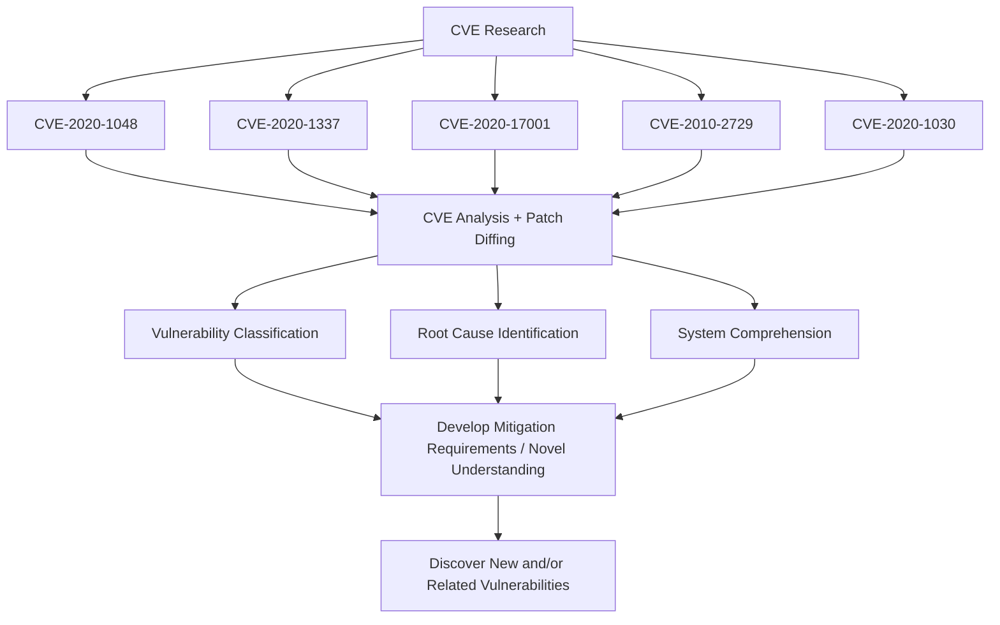
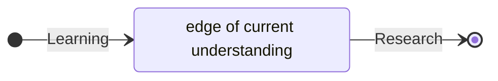

> **TL;DR - CVE North Stars is a tutorial that introduces a method to kickstart vulnerability research by treating CVEs as North Stars in vulnerability discovery and comprehension.**

## Background

This post introduces [CVE North Stars](https://cve-north-stars.github.io/), a tutorial I started writing back in 2020 ([v1.0.0](https://github.com/cve-north-stars/cve-north-stars.github.io/tree/v1.0.0)) when attempting to learn methods of vulnerability research. At the time, I observed several examples of others using CVEs as a starting point in their research. Researchers were leveraging CVEs to both [learn](https://googleprojectzero.blogspot.com/2020/04/tfw-you-get-really-excited-you-patch.html) about the particular vulnerabilities and even [discover](https://googleprojectzero.blogspot.com/2017/10/using-binary-diffing-to-discover.html) new ones along the way. I decided to write a tutorial to teach myself how to leverage CVEs in my own research, as I really don't understand something until I try to write [about](../../about/) it.

### Standing on the Shoulders of Giants

Before I try to make the argument that CVEs are a great place to start your research, know that this idea isn't new. Several prominent security researchers share this sentiment.

> My end goal was to do variant analysis on the vulnerability, but without full and accurate details about the vulnerability, I needed to do a root cause analysis first. I tried to get my hands on the exploit sample, but I wasn't able to source a copy. Without the exploit, I had to use binary patch diffing in order to complete root cause analysis. - [TFW you-get-really-excited-you-patch-diffed-...](https://googleprojectzero.blogspot.com/2020/04/tfw-you-get-really-excited-you-patch.html)

Maddie Stone ([@maddiestone](https://twitter.com/maddiestone)) was leveraging CVEs and patch diffing back in 2020 for new discoveries. Her research inspired several of my thoughts on the [value](https://cve-north-stars.github.io/docs/Patch-Diffing#benefits) of patch diffing analysis.

> As of June 15, 2022, there have been 18 0-days detected and disclosed as exploited in-the-wild in 2022. When we analyzed those 0-days, we found that at least nine of the 0-days are variants of previously patched vulnerabilities. **At least half of the 0-days we’ve seen in the first six months of 2022 could have been prevented with more comprehensive patching** and regression tests. - [2022 0-day In-the-Wild Exploitation…so far](https://googleprojectzero.blogspot.com/2022/06/2022-0-day-in-wild-exploitationso-far.html)

Her research continues in 2022, reporting that researchers (for better or worse) are still using CVEs for 0-day vulnerability research.

> "Patches are really good documentation for when you are familiarizing yourself with the code base."  
> "They can give you inspiration for ideas you didn't yet have, or patterns, or variants."  
> [OffensiveCon22 - Mark Dowd- Keynote - How Do You Actually Find Bugs?](https://www.youtube.com/watch?v=7Ysy6iA2sqA)

Mark Dowd ([@mdowd](https://twitter.com/mdowd)) is teaching the value of leveraging CVEs in 2022. He further explains that the patches show you where the bug is, but not exactly what it is. It will take some effort (analysis) on your part to gain that full understanding.  From his keynote, and in my experience, **it is in striving for understanding of how and why the code base was vulnerable that new insights will emerge**. This same idea, promoted throughout CVE North Stars, will hopefully inspire and guide you on your next vulnerability discovery.

*Aside*: @mdowd's book "The Art Of Software Security Assessment" is a must have if you are getting started in vulnerability research.

## Tutorial Overview

As mentioned, I wrote the tutorial as a way to learn the process and the skills involved in analyzing CVEs. Essentially, writing to learn. Here is what I came up with.

From the CVE North Stars:

> CVE North Stars introduces a method to kickstart vulnerability research by taking advantage of the CVE information freely available (ie public blog posts, Github POCs, CVE Mitre database, etc). A CVE provides a compass of sorts that orients and guides a researcher towards a deeper understanding of the patched vulnerability and its vulnerability class. The idea is to treat CVEs as North Stars in vulnerability discovery and comprehension. [CVE North Stars - Overview](https://cve-north-stars.github.io/#overview)

### CVE Analysis Template

The tutorial walks through (now slightly dated) practical examples of Windows Print Spooler CVEs from 2020-2021. It starts by observing each CVE through the lens of a [CVE Analysis Template](https://cve-north-stars.github.io/docs/Templates/Template-for-CVE-analysis/). The template can help orient you and keep you on track in your analysis.

> **WHY USE A TEMPLATE?**

> 1.  _A Path to Follow_ - A template helps remove the guesswork of analysis. It provides a standard set of concepts and attributes to consider and helps a researcher focus the important aspects as related to the vulnerability.
> 2.  _Efficiency through Standardization_ - As the process becomes familiar, the speed of analysis increases. With experience comes the ability to pick out the relevant information. With this (or another) prescribed template, the concepts to watch for are clear.
> [CVE Analysis - Why Use A Template](https://cve-north-stars.github.io/docs/CVE-analysis#why-use-a-template)

### The Ideal Process

The tutorial prescribes the following [ideal CVE analysis process](https://cve-north-stars.github.io/docs/CVE-analysis#the-ideal-process).

The basic idea is to look at CVEs, build up your knowledge of the code base and vulnerability classes, and eventually discover vulnerabilities on your own.

More formally, the high level idea is to:

1. [Research](https://cve-north-stars.github.io/docs/CVE-Research) relevant CVEs
2. Perform analysis ([CVE](https://cve-north-stars.github.io/docs/CVE-analysis) and [Patch Diffing](https://cve-north-stars.github.io/docs/Patch-Diffing)) to reach a sufficient level of understanding. Sprinkle in some [root cause analysis](https://cve-north-stars.github.io/docs/Root-Cause-Analysis) to ensure a solid patch.
3. Leverage the knowledge gained throughout the process to discover new or related vulnerabilities.

Starting with CVE analysis, progressing to patch diffing, and finishing up with root cause analysis, you progress **from knowing about a CVE to actually understanding it**.

> Performing analysis of a CVE challenges the researcher to go one step past learning (what others understand) and arrive in a place of actual research (discovering something new). This short tutorial walks through practical CVE analysis, binary patch diffing, and root cause analysis. While these techniques for vulnerability research aren't new, this tutorial offers a concise collection of practical examples and ideas for leveraging CVEs to get started. [CVE North Stars - Overview](https://cve-north-stars.github.io/#overview)

Essentially, for any research that you do, you begin by learning. You come up to speed with what is known and try to progress. You continue learning until you take [one step past learning](https://kanjun.me/writing/research-as-understanding) and enter into research (discovery).

### Key Objectives

The course attempts to deliver on the following objectives:

-   Learn a practical method to focus on a set of CVEs to discover and generalize a [vulnerability class](https://cve-north-stars.github.io/docs/Resources/Vulnerability-Classes/) or [CWE - Common Weakness Enumeration](https://cve-north-stars.github.io/docs/Resources/CWE-Common-Weakness-Enumeration/) via [CVE analysis](https://cve-north-stars.github.io/docs/CVE-analysis).
-   Gain familiarity with the Microsoft Windows [update process](https://cve-north-stars.github.io/docs/Security-Patches)
-   Improve Reverse Engineering and use of open source tools (_Ghidra_, _symchk_, _patch-diff-correlator_, etc.)
-   Experience [Patch Diffing](https://cve-north-stars.github.io/docs/Patch-Diffing) With [Ghidra](https://cve-north-stars.github.io/docs/Ghidra-Version-Tracking)
-   Introduction to [Root Cause Analysis](https://cve-north-stars.github.io/docs/Root-Cause-Analysis)

### Beyond Vulnerability Research

Even if you aren't interested directly in vulnerability research, you might be interested in the various RE skills presented in the tutorial:

- [Microsoft Security Patches](https://cve-north-stars.github.io/docs/Security-Patches)
- [Ghidra Patch Diffing](https://cve-north-stars.github.io/docs/Ghidra-Version-Tracking)
- [Root Cause Analysis](https://cve-north-stars.github.io/docs/Root-Cause-Analysis)

## Tutorial Progression

The original version ([v1.0.0](https://github.com/cve-north-stars/cve-north-stars.github.io/tree/v1.0.0)) I wrote in markdown, which is a pretty good way for sharing information, but not as flexible as I wanted.

{: .shadow }_Github Markdown Version v1.0.0_

I recently published a new version ([v2.0.0](https://github.com/cve-north-stars/cve-north-stars.github.io/tree/v2.0.0)) using an excellent documentation Jekyll theme called [Just The Docs](https://github.com/just-the-docs/just-the-docs). Just-The-Docs allows for a responsive and searchable documentation that renders well on both desktop and mobile (see Just The Docs [documentation](https://just-the-docs.github.io/just-the-docs/) if interested).

{: .shadow }_v2.0.0 available at [https://cve-north-stars.github.io/](https://cve-north-stars.github.io/)_

## Try It

If you are getting started in vulnerability research, or just need some direction, consider using a [CVE as your North Star](https://cve-north-stars.github.io/) for your next vulnerability research project.

Please reach out [@clearbluejar](https://twitter.com/clearbluejar) with questions or comments. Also appreciate any [feedback or corrections](https://github.com/clearbluejar/clearbluejar.github.io/issues/new?assignees=&labels=&template=post-feedback.md&title=%5BFeedback%5D%20CVE%20North%20Stars) you might have for the post.

---
Cover Photo by Faik Akmd from Pexels
