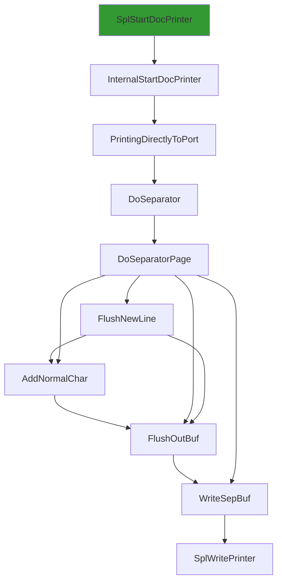
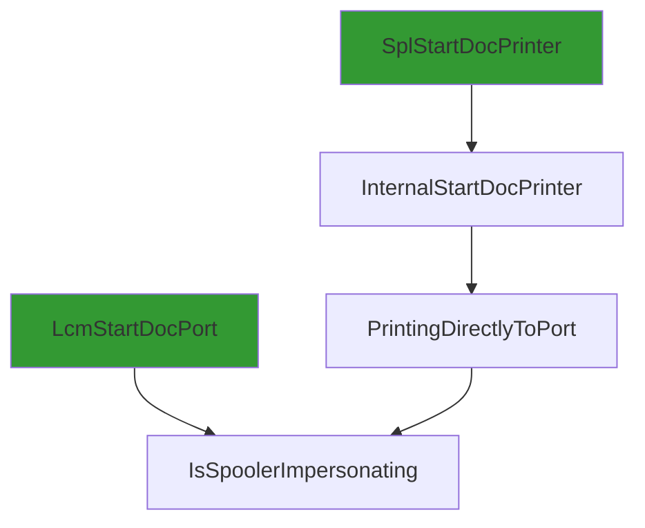
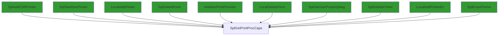

TLDR; This post will teach you how to leverage Ghidra's [FlatProgramAPI](https://ghidra.re/ghidra_docs/api/ghidra/program/flatapi/FlatProgramAPI.html) and Python 3 to generate function call graphs. Ghidra scripting with Python 3, powered by [Pyhidra (via Jpype)](https://github.com/dod-cyber-crime-center/pyhidra), provides robust access to Ghidra's SRE toolset for binary analysis. To follow along, clone the repo at [ghidra-pyhidra-callgraphs](https://github.com/clearbluejar/ghidra-pyhidra-callgraphs).

## Ghidra, Pyhidra (via Jpype), and Callgraphs Oh My!

Ghidra continues to impress me with its constant [improvements](https://htmlpreview.github.io/?https://github.com/NationalSecurityAgency/ghidra/blob/Ghidra_10.2.2_build/Ghidra/Configurations/Public_Release/src/global/docs/WhatsNew.html), response to [issues](https://github.com/NationalSecurityAgency/ghidra/issues), and the overall quality of the SRE toolkit. After learning the ins and out of using the GUI, I am now leaning into Ghidra's Headless (non-GUI)  scripting to enable automation for large analysis tasks. For this post, we will look into automating the generation of function callgraphs as a simple demonstration of its power. By the end, we will generate several call graphs from a popular Windows binary `localspl.dll`.

From `SplWritePrinter`'s simple [**calling** callgraph](https://github.com/clearbluejar/ghidra-pyhidra-callgraphs/blob/main/.callgraphs/localspl.dll.x64.10.0.22000.376/SplWritePrinter.flow.md#flowchart):



To `SplWritePrinter`'s much more complex [**called** callgraph](https://github.com/clearbluejar/ghidra-pyhidra-callgraphs/blob/main/.callgraphs/localspl.dll.x64.10.0.22000.376/SplWritePrinter.flow.md#flowchart-1):

```mermaid
flowchart LR
classDef shaded fill:#339933
392 --> 93:::shaded
118 --> 127["API-MS-WIN-CORE-PROCESSTHREADS-L1-1-1.DLL::OpenProcess"]:::shaded
169 --> 78
385 --> 27
144 --> 161["SplDeleteIniSpooler"]
144 --> 28
342 --> 346
304 --> 103
282 --> 17
320 --> 327
286 --> 382["WPP_SF_qDSSS"]
406 --> 142:::shaded
114 --> 54
216 --> 191
407 --> 413["CreateIniForm"]
230 --> 159:::shaded
92 --> 17
317 --> 328["FUN_18000e393"]:::shaded
161 --> 28
90 --> 95["CanUserSeeRealDocName"]
0 --> 2["FUN_180001cf8"]
92 --> 148["WPP_SF_qd"]
346 --> 349["FreeMem"]
16 --> 9:::shaded
0 --> 5["SeekPrinterSetEvent"]
184 --> 190["API-MS-WIN-CORE-FILE-L1-1-0.DLL::SetFilePointerEx"]:::shaded
20 --> 273["RetainJob"]
362 --> 267
387 --> 395["MSVCRT.DLL::_wtoi"]:::shaded
346 --> 163:::shaded
347 --> 349
386 --> 393["FUN_180002c74"]:::shaded
31 --> 26:::shaded
170 --> 88:::shaded
249 --> 257["Register"]
392 --> 88:::shaded
184 --> 63:::shaded
276 --> 99
392 --> 403["SplRegEnumValue"]
374 --> 344:::shaded
52 --> 46
132 --> 52
161 --> 145:::shaded
0 --> 18["API-MS-WIN-CORE-SYNCH-L1-1-0.DLL::EnterCriticalSection"]:::shaded
384 --> 264
35 --> 32:::shaded
216 --> 223["IsCoreDriverFile"]
207 --> 210["StrCatAlloc"]
191 --> 195["WPP_SF_DD"]
388 --> 159:::shaded
105 --> 108["NTDLL.DLL::RtlVirtualUnwind"]:::shaded
216 --> 32:::shaded
28 --> 36["API-MS-WIN-CORE-PROCESSTHREADS-L1-1-0.DLL::TlsSetValue"]:::shaded
158 --> 143
0 --> 12["FindJob"]:::shaded
90 --> 93["SPOOLSS.DLL::DllAllocSplMem"]:::shaded
170 --> 181["DelinkPortFromSpooler"]
216 --> 187:::shaded
180 --> 233["~TList<class_TIniSpoolerWrapper>"]
332 --> 329
295 --> 375["API-MS-WIN-SECURITY-BASE-L1-1-0.DLL::AreAllAccessesGranted"]:::shaded
379 --> 37:::shaded
285 --> 14
99 --> 101["API-MS-WIN-SECURITY-BASE-L1-1-0.DLL::MapGenericMask"]:::shaded
385 --> 32:::shaded
66 --> 68["MSVCRT.DLL::malloc"]:::shaded
215 --> 220["API-MS-WIN-CORE-FILE-L2-1-0.DLL::MoveFileExW"]:::shaded
184 --> 187["SplLogType"]:::shaded
178 --> 63:::shaded
293 --> 311["InternalCreateSafeFile"]
325 --> 356["ResetMesControlBlockList"]
293 --> 17
0 --> 6["GetOpenedMonitor"]
20 --> 130
243 --> 130
389 --> 396:::shaded
379 --> 70:::shaded
207 --> 216["SplDeleteFile"]
242 --> 243
315 --> 326["Encode"]
388 --> 396:::shaded
17 --> 26:::shaded
385 --> 28
370 --> 267
390 --> 103
20 --> 12:::shaded
30 --> 57["`vector_constructor_iterator'"]
30 --> 58["MSVCRT.DLL::_wcsicmp"]:::shaded
172 --> 88:::shaded
273 --> 33
46 --> 46
318 --> 329
249 --> 10
0 --> 24["IsXPS2GDI"]
308 --> 46
102 --> 61:::shaded
315 --> 318["EndChunk"]
280 --> 40:::shaded
207 --> 214["StringCchCopyW"]:::shaded
325 --> 78
31 --> 18:::shaded
398 --> 103
210 --> 93:::shaded
331 --> 130
324 --> 355["RPCRT4.DLL::NdrMesProcEncodeDecode3"]:::shaded
20 --> 32:::shaded
289 --> 103
166 --> 26:::shaded
16 --> 239
369 --> 370["LogJobInfo"]
293 --> 30
371 --> 374["GetSpoolerPolicy"]
0 --> 3["API-MS-WIN-CORE-ERRORHANDLING-L1-1-0.DLL::SetLastError"]:::shaded
315 --> 14
266 --> 38:::shaded
30 --> 53["StatusFromHResult"]:::shaded
138 --> 70:::shaded
154 --> 38:::shaded
385 --> 388["CopyIniFormToFormInfo"]
282 --> 15
289 --> 196:::shaded
45 --> 40:::shaded
49 --> 61:::shaded
205 --> 208
215 --> 32:::shaded
379 --> 3:::shaded
275 --> 33
275 --> 299["UpdateString"]
293 --> 61:::shaded
170 --> 61:::shaded
275 --> 276
22 --> 33
92 --> 124:::shaded
0 --> 16["WriteToPrinter"]
192 --> 199["WPP_SF_DDDDD"]
223 --> 51
119 --> 49
275 --> 297["SetJobPosition"]
329 --> 14
311 --> 189:::shaded
273 --> 30
283 --> 277:::shaded
161 --> 142:::shaded
387 --> 396["MSVCRT.DLL::wcschr"]:::shaded
392 --> 236
39 --> 40["NTDLL.DLL::EtwTraceMessage"]:::shaded
0 --> 4["GetMonitorHandle"]:::shaded
358 --> 14
184 --> 191["SplLogEvent2"]
147 --> 162
78 --> 81["free"]
185 --> 37:::shaded
362 --> 366["StrNCatBuff"]:::shaded
92 --> 96:::shaded
281 --> 28
281 --> 30
372 --> 373["WPP_SF_DDS"]
21 --> 381["MSVCRT.DLL::_wcsnicmp"]:::shaded
177 --> 40:::shaded
31 --> 9:::shaded
92 --> 30
144 --> 30
154 --> 70:::shaded
5 --> 11:::shaded
337 --> 332
100 --> 93:::shaded
178 --> 183["FreeFPList"]
201 --> 202["FreeIniVersion"]
17 --> 32:::shaded
403 --> 410["API-MS-WIN-CORE-REGISTRY-L1-1-0.DLL::RegEnumValueW"]:::shaded
298 --> 213
223 --> 226["API-MS-WIN-CORE-FILE-L1-1-0.DLL::GetFileAttributesW"]:::shaded
203 --> 206["FUN_180034b77"]
293 --> 15
284 --> 12:::shaded
30 --> 28
48 --> 71["API-MS-WIN-CORE-THREADPOOL-L1-2-0.DLL::SetThreadpoolTimer"]:::shaded
92 --> 28
184 --> 30
210 --> 3:::shaded
275 --> 291["CheckDataTypes"]
10 --> 248["API-MS-WIN-CORE-SYNCH-L1-2-0.DLL::InitOnceBeginInitialize"]:::shaded
172 --> 142:::shaded
33 --> 89["SPOOLSS.DLL::ReplyPrinterChangeNotification"]:::shaded
211 --> 213
282 --> 293
285 --> 5
102 --> 117["API-MS-WIN-SECURITY-BASE-L1-1-0.DLL::AccessCheck"]:::shaded
150 --> 93:::shaded
175 --> 145:::shaded
275 --> 304["GMT2AdjustedGMTIfDST"]
168 --> 144
154 --> 266["LeaveSpoolerLock"]
349 --> 352["API-MS-WIN-CORE-HEAP-L1-1-0.DLL::HeapFree"]:::shaded
250 --> 14
118 --> 54
20 --> 30
304 --> 378["API-MS-WIN-CORE-TIMEZONE-L1-1-0.DLL::GetTimeZoneInformation"]:::shaded
309 --> 359["CreateShdWriter"]
281 --> 162
385 --> 392["InitializeForms"]
298 --> 376["API-MS-WIN-CORE-STRING-L2-1-0.DLL::CharLowerW"]:::shaded
52 --> 78
406 --> 306:::shaded
370 --> 23
302 --> 40:::shaded
171 --> 17
374 --> 306:::shaded
102 --> 115["API-MS-WIN-SECURITY-BASE-L1-1-0.DLL::ObjectCloseAuditAlarmW"]:::shaded
202 --> 88:::shaded
230 --> 93:::shaded
385 --> 17
92 --> 155["RegSetDWord"]
203 --> 88:::shaded
275 --> 15
228 --> 98:::shaded
388 --> 399["FUN_180002f77"]
143 --> 88:::shaded
0 --> 21["ValidRawDatatype"]
57 --> 14
312 --> 361["StringCchPrintfW"]
394 --> 397["API-MS-WIN-CORE-STRING-L2-1-1.DLL::SHLoadIndirectString"]:::shaded
232 --> 234["~TString"]
184 --> 188["API-MS-WIN-CORE-FILE-L1-1-0.DLL::CreateFileW"]:::shaded
20 --> 284["FindServerJob"]
338 --> 342["forwardPicAlloc"]
392 --> 406["RegistryGetFormInfo2"]
282 --> 28
160 --> 164["NotifyConsumer"]
223 --> 58:::shaded
192 --> 197["WPP_SF_DDSD"]
275 --> 283
17 --> 9:::shaded
92 --> 157["EnterSplSemAndRestoreCount"]
408 --> 361
35 --> 30
204 --> 207["DecrementFileRefCnt"]
215 --> 219["SFC_OS.DLL::SfcConnectToServer"]:::shaded
335 --> 329
388 --> 400["SPOOLSS.DLL::PackStrings"]:::shaded
406 --> 93:::shaded
46 --> 67["_callnewh"]
275 --> 58:::shaded
314 --> 40:::shaded
102 --> 120["API-MS-WIN-SECURITY-BASE-L1-1-0.DLL::CheckTokenMembership"]:::shaded
251 --> 254["MSVCRT.DLL::__dllonexit"]:::shaded
385["SplEnumForms"] --> 386["GetDisplayName"]
387 --> 391:::shaded
413 --> 41:::shaded
223 --> 225["Cat"]
92 --> 37:::shaded
293 --> 306["API-MS-WIN-CORE-REGISTRY-L1-1-0.DLL::RegQueryValueExW"]:::shaded
169 --> 178["~FilePool"]
170 --> 63:::shaded
243 --> 239
207 --> 3:::shaded
52 --> 84["FUN_18001fe54"]
293 --> 313["CopyString"]:::shaded
119 --> 140["API-MS-WIN-SECURITY-BASE-L1-1-0.DLL::GetTokenInformation"]:::shaded
320 --> 336["FUN_18000e168"]:::shaded
198 --> 40:::shaded
216 --> 30
370 --> 372["SplLogEvent"]
42 --> 62["API-MS-WIN-CORE-THREADPOOL-L1-2-0.DLL::CloseThreadpoolTimer"]:::shaded
406 --> 130
330 --> 14
191 --> 130
30 --> 42["~CoalescedSleep"]
184 --> 32:::shaded
90 --> 12:::shaded
362 --> 159:::shaded
174 --> 88:::shaded
114 --> 121["API-MS-WIN-SECURITY-BASE-L1-1-0.DLL::SetTokenInformation"]:::shaded
90 --> 94["GetPrinterPorts"]
293 --> 96:::shaded
8 --> 18:::shaded
92 --> 142["API-MS-WIN-CORE-REGISTRY-L1-1-0.DLL::RegCloseKey"]:::shaded
326 --> 14
392 --> 404["CreateNode"]
20 --> 281["ResumeJob"]
308 --> 195
204 --> 93:::shaded
285 --> 15
30 --> 44["InitPreferMultithreaded"]
118 --> 103
175 --> 236["FreeLangPair"]
274 --> 145:::shaded
199 --> 40:::shaded
282 --> 18:::shaded
25 --> 248:::shaded
293 --> 130
0 --> 32["API-MS-WIN-CORE-ERRORHANDLING-L1-1-0.DLL::GetLastError"]:::shaded
161 --> 177["WPP_SF_SqDd"]
160 --> 37:::shaded
311 --> 191
102 --> 104:::shaded
67 --> 69["MSVCRT.DLL::_callnewh"]:::shaded
144 --> 17
398 --> 391:::shaded
31 --> 3:::shaded
158 --> 23
230 --> 218:::shaded
102 --> 119["IsClientAppContainer"]
202 --> 145:::shaded
54 --> 32:::shaded
338 --> 340["forwardPicRead"]
293 --> 23
215 --> 222["SFC_OS.DLL::SfcClose"]:::shaded
203 --> 204["InternalDecrement"]
150 --> 23
402 --> 376:::shaded
205 --> 93:::shaded
258 --> 259["NTDLL.DLL::EtwEventSetInformation"]:::shaded
293 --> 312["GetFullNameFromId"]
388 --> 145:::shaded
325 --> 358["~TList<class_NPackageInstallLocalspl::TDriverStore::TMissingDriver>"]
77 --> 14
22 --> 380
92 --> 146["API-MS-WIN-CORE-SYSINFO-L1-1-0.DLL::GetTickCount"]:::shaded
275 --> 293["WriteShadowJob"]
118 --> 49
30 --> 48["Wait"]
232 --> 77
327 --> 14
203 --> 145:::shaded
161 --> 37:::shaded
406 --> 88:::shaded
20 --> 60
153 --> 245["LogPrinterOfflineStatus"]
49 --> 76["~TRefPtrCOM<struct_IBidiRequest>"]
369 --> 293
406 --> 403
385 --> 389["GetResourceNameID"]
48 --> 74["SleepTimerCallback"]
370 --> 30
282 --> 30
281 --> 379["ControlPrintProcessor"]
95 --> 99["ValidateObjectAccessWithToken"]
20 --> 283["DeleteJobCheck"]
275 --> 298["FindIniKey"]
185 --> 61:::shaded
126 --> 40:::shaded
379 --> 14
315 --> 319["TPrinterSerializationFormat"]
298 --> 218:::shaded
20 --> 38:::shaded
10 --> 249["~Completer"]
372 --> 195
0 --> 9["API-MS-WIN-CORE-SYNCH-L1-1-0.DLL::WaitForSingleObject"]:::shaded
379 --> 18:::shaded
20 --> 24
369 --> 371["GetSpoolerNumericPolicy"]
257 --> 258["TraceLoggingRegisterEx_EtwEventRegister_EtwEventSetInformation"]
158 --> 30
281 --> 293
237 --> 30
234 --> 51
370 --> 103
160 --> 165["Dequeue"]:::shaded
161 --> 170["DeletePortEntry"]
249 --> 14
151 --> 241["SplRegSetValue"]
264 --> 265["NTDLL.DLL::EtwEventWriteTransfer"]:::shaded
207 --> 211["FilesUnloaded"]
281 --> 278
374 --> 305:::shaded
308 --> 315["PickleJobNamedPropertyArray"]
319 --> 334["MakeCrcTable"]:::shaded
118 --> 132["GetContainerId"]
203 --> 205["InternalIncrement"]
293 --> 123:::shaded
207 --> 213["FastStrcmpi"]
22 --> 34:::shaded
406 --> 305:::shaded
413 --> 408
174 --> 169
30 --> 60["WPP_SF_SS"]
20 --> 282["PauseJob"]
49 --> 79["Release"]
30 --> 41["StringCbCopyW"]:::shaded
335 --> 52
275 --> 300["CircularChainedJobsList"]
184 --> 162
90 --> 96["API-MS-WIN-SECURITY-BASE-L1-1-0.DLL::GetSecurityDescriptorLength"]:::shaded
236 --> 145:::shaded
30 --> 59["API-MS-WIN-CORE-COM-L1-1-0.DLL::CoCreateInstance"]:::shaded
191 --> 192["TraceValue"]
22 --> 5
28 --> 37["API-MS-WIN-CORE-SYNCH-L1-1-0.DLL::LeaveCriticalSection"]:::shaded
274 --> 3:::shaded
42 --> 61["API-MS-WIN-CORE-HANDLE-L1-1-0.DLL::CloseHandle"]:::shaded
28 --> 26:::shaded
243 --> 244["API-MS-WIN-CORE-REGISTRY-L1-1-0.DLL::RegSetValueExW"]:::shaded
132 --> 137["GetDeviceInstanceId"]
92 --> 154["LeaveSplSemAndResetCount"]
92 --> 32:::shaded
399 --> 88:::shaded
27 --> 3:::shaded
92 --> 151["RegSetString"]
243 --> 30
245 --> 10
413 --> 402
311 --> 188:::shaded
164 --> 37:::shaded
6 --> 85["operator_struct__INIMONITOR*___ptr64"]:::shaded
290 --> 40:::shaded
413 --> 93:::shaded
102 --> 3:::shaded
25 --> 14
0 --> 34["API-MS-WIN-CORE-SYNCH-L1-2-0.DLL::Sleep"]:::shaded
92 --> 159["SPOOLSS.DLL::AllocSplStr"]:::shaded
293 --> 49
367 --> 139:::shaded
17 --> 18:::shaded
342 --> 348:::shaded
291 --> 213
367 --> 368["API-MS-WIN-CORE-PROCESSTHREADS-L1-1-0.DLL::OpenProcessToken"]:::shaded
411 --> 37:::shaded
30 --> 54["GetLastErrorAsFailHR"]
207 --> 88:::shaded
388 --> 93:::shaded
338 --> 341["RPCRT4.DLL::MesEncodeIncrementalHandleCreate"]:::shaded
160 --> 163["Link"]:::shaded
213 --> 218["API-MS-WIN-CORE-STRING-OBSOLETE-L1-1-0.DLL::lstrcmpiW"]:::shaded
162 --> 40:::shaded
20 --> 27
160 --> 79
13 --> 103
369 --> 33
144 --> 162["WPP_SF_SD"]
92 --> 144["SplDeleteSpooler"]
8 --> 37:::shaded
207 --> 209["API-MS-WIN-CORE-FILE-L1-1-0.DLL::GetTempFileNameW"]:::shaded
297 --> 371
286 --> 383["ReleaseRetainedRef"]
233 --> 14
392 --> 142:::shaded
92 --> 147["PrinterCreateKey"]
216 --> 224["MSVCRT.DLL::wcsrchr"]:::shaded
0 --> 14["_guard_xfg_dispatch_icall_nop"]
30 --> 46["operator_new"]
245 --> 263["Write<struct__tlgWrapSz<unsigned_short>,struct__tlgWrapperByVal<4>_>"]
170 --> 30
232 --> 78
274 --> 32:::shaded
92 --> 143["FreeClonedIniPrinterWithMask"]
92 --> 18:::shaded
297 --> 370
28 --> 3:::shaded
48 --> 32:::shaded
245 --> 262["_tlgKeywordOn"]:::shaded
390 --> 391:::shaded
158 --> 32:::shaded
403 --> 23
398 --> 159:::shaded
46 --> 66["malloc"]
92 --> 94
183 --> 63:::shaded
288 --> 10
51 --> 78
201 --> 203["UpdateDriverFileRefCnt"]
345 --> 346["AllocateMesControlBlock"]
22 --> 17
406 --> 30
398 --> 88:::shaded
17 --> 37:::shaded
49 --> 78["operator_delete"]
92 --> 153["LogPrinterStatusChange"]
150 --> 30
312 --> 362["GetPrinterDirectory"]
385 --> 391["API-MS-WIN-CORE-LOCALIZATION-L1-2-0.DLL::GetThreadUILanguage"]:::shaded
239 --> 240["MSVCRT.DLL::memcpy"]:::shaded
31 --> 32:::shaded
249 --> 25
20 --> 145:::shaded
118 --> 133["API-MS-WIN-DEVICES-QUERY-L1-1-0.DLL::DevGetObjectProperties"]:::shaded
285 --> 298
119 --> 141["API-MS-WIN-CORE-PROCESSTHREADS-L1-1-0.DLL::OpenThreadToken"]:::shaded
300 --> 12:::shaded
132 --> 131:::shaded
8 --> 269["StopTimer"]
308 --> 316["WPP_SF_dd"]
103 --> 105["__report_gsfailure"]
30 --> 52["Update"]
293 --> 239
320 --> 329
118 --> 128["RPCRT4.DLL::RpcServerInqCallAttributesW"]:::shaded
243 --> 23
293 --> 267
253 --> 256["MSVCRT.DLL::_unlock"]:::shaded
92 --> 158["CloneIniPrinter"]
286 --> 33
321 --> 338["TMes"]
79 --> 14
20 --> 159:::shaded
247 --> 250["_onexit"]
23 --> 40:::shaded
215 --> 191
315 --> 325["~TMes"]
309 --> 37:::shaded
372 --> 103
84 --> 78
33 --> 92["UpdatePrinterIni"]
171 --> 14
175 --> 88:::shaded
157 --> 17
385 --> 3:::shaded
388 --> 3:::shaded
404 --> 93:::shaded
52 --> 83["FUN_180055b38"]
0 --> 29["WPP_SF_DS"]
119 --> 139["API-MS-WIN-CORE-PROCESSTHREADS-L1-1-0.DLL::GetCurrentThread"]:::shaded
275 --> 30
301 --> 120:::shaded
392 --> 103
92 --> 156["RegSetBinaryData"]
362 --> 214:::shaded
171 --> 28
172 --> 200["API-MS-WIN-CORE-LIBRARYLOADER-L1-2-0.DLL::FreeLibrary"]:::shaded
114 --> 49
161 --> 4:::shaded
285 --> 26:::shaded
389 --> 159:::shaded
406 --> 162
356 --> 347
100 --> 30
266 --> 36:::shaded
20 --> 15
373 --> 40:::shaded
382 --> 40:::shaded
150 --> 88:::shaded
48 --> 18:::shaded
392 --> 409["API-MS-WIN-CORE-LIBRARYLOADER-L1-2-0.DLL::LoadStringW"]:::shaded
323 --> 49
8 --> 268["KERNEL32.DLL::GetTickCount64"]:::shaded
388 --> 239
346 --> 138
17 --> 34:::shaded
405 --> 3:::shaded
0 --> 7["ClearJobError"]
266 --> 26:::shaded
76 --> 14
317 --> 327["SafeTell"]
107 --> 113["API-MS-WIN-CORE-ERRORHANDLING-L1-1-0.DLL::SetUnhandledExceptionFilter"]:::shaded
83 --> 78
161 --> 79
360 --> 188:::shaded
10 --> 247["atexit"]
153 --> 25
358 --> 235:::shaded
311 --> 32:::shaded
158 --> 88:::shaded
0 --> 22["UpdateJobStatus"]
118 --> 130["memset"]
282 --> 370
161 --> 172["FreeIniMonitor"]
204 --> 208["DuplicateFile"]
361 --> 363["MSVCRT.DLL::_vsnwprintf"]:::shaded
293 --> 32:::shaded
2 --> 28
130 --> 135["MSVCRT.DLL::memset"]:::shaded
181 --> 182["RemoveFromHashBuckets"]:::shaded
250 --> 253["_unlock"]
169 --> 88:::shaded
246 --> 103
293 --> 305["API-MS-WIN-CORE-REGISTRY-L1-1-0.DLL::RegOpenKeyExW"]:::shaded
293 --> 308["GetSerializedBlobOfNamedProperties"]
293 --> 314["WPP_SF_qD"]
184 --> 185
293 --> 124:::shaded
370 --> 32:::shaded
281 --> 18:::shaded
281 --> 37:::shaded
228 --> 130
100 --> 32:::shaded
180 --> 232["`vector_deleting_destructor'"]
197 --> 40:::shaded
369 --> 26:::shaded
271 --> 272["API-MS-WIN-EVENTING-PROVIDER-L1-1-0.DLL::EventWriteTransfer"]:::shaded
207 --> 212["API-MS-WIN-CORE-FILE-L1-1-0.DLL::CreateDirectoryW"]:::shaded
118 --> 131["API-MS-WIN-DEVICES-QUERY-L1-1-0.DLL::DevFreeObjectProperties"]:::shaded
350 --> 353["MemoryAlloc"]
275 --> 32:::shaded
28 --> 32:::shaded
114 --> 122["API-MS-WIN-SECURITY-BASE-L1-1-0.DLL::CreateWellKnownSid"]:::shaded
389 --> 395:::shaded
276 --> 61:::shaded
149 --> 3:::shaded
161 --> 168["DeleteSpoolerCheck"]
215 --> 221["SFC_OS.DLL::SfcFileException"]:::shaded
185 --> 18:::shaded
20 --> 286["ReleaseJob"]
308 --> 14
33 --> 87["SPOOLSS.DLL::PartialReplyPrinterChangeNotification"]:::shaded
345 --> 14
405 --> 412["SPOOLSS.DLL::CheckLocalCall"]:::shaded
44 --> 64["API-MS-WIN-CORE-COM-L1-1-0.DLL::CoInitializeEx"]:::shaded
0["SplWritePrinter"] --> 1["SPOOLSS.DLL::WritePrinter"]:::shaded
164 --> 70:::shaded
275 --> 296["IsXpsPrintProcessor"]
14 --> 80["_guard_dispatch_icall"]:::shaded
100 --> 88:::shaded
99 --> 102["FUN_180055643"]
20 --> 28
118 --> 50
399 --> 391:::shaded
389 --> 145:::shaded
164 --> 18:::shaded
243 --> 46
184 --> 88:::shaded
161 --> 17
364 --> 53:::shaded
288 --> 25
387 --> 159:::shaded
379 --> 53:::shaded
20 --> 21
17 --> 36:::shaded
225 --> 46
293 --> 88:::shaded
323 --> 46
22 --> 32:::shaded
99 --> 100["SetRequiredPrivileges"]
144 --> 79
174 --> 201["DeleteIniVersion"]
166 --> 167["GetLastErrorAsHResult"]
206 --> 88:::shaded
237 --> 23
293 --> 28
318 --> 331["CalculateCrc"]
362 --> 365["FUN_18002b236"]:::shaded
392 --> 407["CreateIniFormInternal"]
413 --> 401:::shaded
31 --> 37:::shaded
195 --> 40:::shaded
315 --> 317["StartChunk"]
285 --> 28
191 --> 23
293 --> 103
114 --> 125["API-MS-WIN-SECURITY-BASE-L1-1-0.DLL::DuplicateTokenEx"]:::shaded
7 --> 15
315 --> 323["ConvertToPickleArray"]
374 --> 142:::shaded
299 --> 377["SPOOLSS.DLL::ReallocSplStr"]:::shaded
394 --> 398["FUN_180053454"]
359 --> 188:::shaded
161 --> 173["API-MS-WIN-CORE-HEAP-L2-1-0.DLL::LocalFree"]:::shaded
30 --> 56["API-MS-WIN-CORE-COM-L1-1-0.DLL::CoUninitialize"]:::shaded
16 --> 26:::shaded
49 --> 77["`vector_destructor_iterator'"]
150 --> 239["memcpy"]
20 --> 279["ShouldGetMasqDataForHandle"]:::shaded
22 --> 15
48 --> 37:::shaded
269 --> 71:::shaded
33 --> 90["GetInfoData"]
201 --> 88:::shaded
48 --> 70["API-MS-WIN-CORE-PROCESSTHREADS-L1-1-0.DLL::GetCurrentThreadId"]:::shaded
372 --> 193:::shaded
118 --> 58:::shaded
114 --> 123["SPOOLSS.DLL::ImpersonatePrinterClient"]:::shaded
0 --> 13["SplTraceErrorPrintCancelled"]
318 --> 327
0 --> 31["EnterSpoolerLock"]
0 --> 27["ValidateSpoolHandle"]
105 --> 106["NTDLL.DLL::RtlLookupFunctionEntry"]:::shaded
275 --> 24
0 --> 23["WPP_SF_D"]
22 --> 3:::shaded
293 --> 310["API-MS-WIN-CORE-FILE-L1-1-0.DLL::SetFilePointer"]:::shaded
275 --> 292["ValidateJobTimes"]:::shaded
74 --> 26:::shaded
161 --> 171["ShutdownMonitors"]
92 --> 145["SPOOLSS.DLL::DllFreeSplStr"]:::shaded
24 --> 58:::shaded
293 --> 142:::shaded
118 --> 60
399 --> 3:::shaded
285 --> 33
345 --> 347["ReleaseMesControlBlock"]
362 --> 364["BoolFromHResult"]
370 --> 361
134 --> 40:::shaded
266 --> 3:::shaded
319 --> 130
385 --> 387["GetFormSize"]
388 --> 395:::shaded
392 --> 305:::shaded
148 --> 40:::shaded
345 --> 348["MesControlBlockToClientPointer"]:::shaded
367 --> 112:::shaded
20 --> 3:::shaded
20 --> 103
92 --> 150["CloneIniSpooler"]
20 --> 274["~_TELEMETRY_JOB_INFO"]
293 --> 93:::shaded
225 --> 51
31 --> 34:::shaded
154 --> 37:::shaded
184 --> 189["API-MS-WIN-CORE-FILE-L1-1-0.DLL::DeleteFileW"]:::shaded
192 --> 198["WPP_SF_DDDD"]
372 --> 196:::shaded
269 --> 270["API-MS-WIN-CORE-THREADPOOL-L1-2-0.DLL::WaitForThreadpoolTimerCallbacks"]:::shaded
293 --> 19:::shaded
30 --> 55["API-MS-WIN-CORE-COM-L1-1-0.DLL::CoTaskMemFree"]:::shaded
275 --> 301["AllowAccessToLocalSystemAndDelegatedPrintAdmins"]
207 --> 215["SplMoveFileEx"]
372 --> 130
285 --> 17
384 --> 103
385 --> 30
97 --> 98["StringCopyWorkerW"]:::shaded
92 --> 14
156 --> 241
20 --> 33
392 --> 405["ValidateFormAccess"]
294 --> 369["FUN_180060a89"]
392 --> 408["BuildResourceName"]
339 --> 14
155 --> 241
230 --> 88:::shaded
301 --> 276
20 --> 287["SPOOLSS.DLL::SetJobW"]:::shaded
404 --> 159:::shaded
406 --> 103
0 --> 8["UpdateTimer"]
17 --> 38:::shaded
150 --> 130
315 --> 321["TPickle<struct_JobNamedPropertyPickleArray>"]
0 --> 25["<lambda_invoker_cdecl>"]
325 --> 357["RPCRT4.DLL::MesHandleFree"]:::shaded
275 --> 294["FUN_18000bbb3"]
385 --> 162
184 --> 186["API-MS-WIN-CORE-FILE-L1-1-0.DLL::SetEndOfFile"]:::shaded
281 --> 17
205 --> 230["IncrementFileRefCnt"]
338 --> 344["HResultFromWin32"]:::shaded
132 --> 103
353 --> 354["API-MS-WIN-CORE-HEAP-L1-1-0.DLL::HeapAlloc"]:::shaded
100 --> 23
223 --> 224:::shaded
60 --> 40:::shaded
237 --> 238["API-MS-WIN-CORE-REGISTRY-L1-1-0.DLL::RegCreateKeyExW"]:::shaded
362 --> 30
281 --> 370
183 --> 185["FPCloseFiles"]
335 --> 337["FUN_18000e4dd"]
105 --> 109["NTDLL.DLL::RtlCaptureContext"]:::shaded
33 --> 33
228 --> 229["StringExHandleOtherFlagsW"]
100 --> 104["API-MS-WIN-SECURITY-BASE-L1-1-0.DLL::AdjustTokenPrivileges"]:::shaded
161 --> 30
92 --> 152["NTDLL.DLL::RtlLengthSid"]:::shaded
102 --> 88:::shaded
149 --> 93:::shaded
258 --> 260["NTDLL.DLL::EtwEventRegister"]:::shaded
33 --> 88["SPOOLSS.DLL::DllFreeSplMem"]:::shaded
147 --> 30
261 --> 14
94 --> 97["StringCbCatW"]
20 --> 280["WPP_SF_dDD"]
309 --> 18:::shaded
170 --> 134
380 --> 26:::shaded
138 --> 18:::shaded
184 --> 23
295 --> 101:::shaded
164 --> 166["SetAutoEventHandle"]
30 --> 51["vFree"]
171 --> 30
118 --> 134["WPP_SF_S"]
367 --> 141:::shaded
169 --> 180["~TDriverStore"]
183 --> 88:::shaded
223 --> 227["TString"]
311 --> 187:::shaded
387 --> 145:::shaded
379 --> 379
311 --> 30
0 --> 28["LeaveSplSem"]
282 --> 371
22 --> 23
288 --> 262:::shaded
390 --> 397:::shaded
273 --> 15
338 --> 339["forwardPicWrite"]
281 --> 15
92 --> 23
408 --> 93:::shaded
364 --> 3:::shaded
20 --> 285["RestartJob"]
281 --> 26:::shaded
20 --> 277["DeleteJob"]:::shaded
286 --> 290
169 --> 63:::shaded
227 --> 52
275 --> 303["MapJobStatus"]:::shaded
8 --> 70:::shaded
383 --> 15
388 --> 391:::shaded
118 --> 129["KERNELBASE.DLL::GetPackageFamilyName"]:::shaded
318 --> 330["SafeSeek"]
263 --> 103
114 --> 103
349 --> 351["API-MS-WIN-CORE-HEAP-L1-1-0.DLL::GetProcessHeap"]:::shaded
8 --> 267["WPP_SF_"]
293 --> 162
315 --> 103
399 --> 103
250 --> 251["__dllonexit"]
316 --> 40:::shaded
315 --> 324["JobNamedPropertyPickleArrayEncode"]
211 --> 14
0 --> 17["EnterSplSem"]
33 --> 91["MapToPrinterQueueStatus"]:::shaded
167 --> 32:::shaded
147 --> 237["SplRegCreateKey"]
236 --> 88:::shaded
258 --> 261["_tlgEnableCallback"]
282 --> 379
92 --> 88:::shaded
48 --> 75["API-MS-WIN-CORE-THREADPOOL-L1-2-0.DLL::CreateThreadpoolTimer"]:::shaded
161 --> 169["`scalar_deleting_destructor'"]
92 --> 93:::shaded
285 --> 380["SetPortErrorEvent"]
100 --> 103["__security_check_cookie"]
281 --> 371
406 --> 236
257 --> 14
42 --> 63["API-MS-WIN-CORE-SYNCH-L1-1-0.DLL::DeleteCriticalSection"]:::shaded
385 --> 88:::shaded
392 --> 391:::shaded
17 --> 65["API-MS-WIN-CORE-SYNCH-L1-1-0.DLL::ResetEvent"]:::shaded
275 --> 295["AccessGranted"]
320 --> 335["WriteChunk"]
225 --> 228["StringCchCopyExW"]
13 --> 271["_tlgWriteTransfer_EventWriteTransfer"]
353 --> 351:::shaded
30 --> 14
338 --> 46
367 --> 32:::shaded
0 --> 19["API-MS-WIN-CORE-FILE-L1-1-0.DLL::WriteFile"]:::shaded
114 --> 124["SPOOLSS.DLL::RevertToPrinterSelf"]:::shaded
179 --> 63:::shaded
258 --> 103
331 --> 52
161 --> 176["API-MS-WIN-DEVICES-QUERY-L1-1-0.DLL::DevCloseObjectQuery"]:::shaded
289 --> 193:::shaded
0 --> 11["API-MS-WIN-CORE-FILE-L1-1-0.DLL::GetFileSizeEx"]:::shaded
144 --> 144
107 --> 111["API-MS-WIN-CORE-PROCESSTHREADS-L1-1-0.DLL::TerminateProcess"]:::shaded
340 --> 345["PicRead"]
269 --> 267
338 --> 343["RPCRT4.DLL::MesDecodeIncrementalHandleCreate"]:::shaded
311 --> 134
191 --> 193["NTDLL.DLL::EtwEventWrite"]:::shaded
0 --> 15["CheckJobStatusChange"]
405 --> 411["ValidateAccess"]
250 --> 252["_lock"]
269 --> 62:::shaded
22 --> 28
346 --> 350["AllocMemAlign"]
102 --> 118["IsClientAssociatedWSDA"]
138 --> 37:::shaded
114 --> 126["WPP_SF_d"]
179 --> 79
403 --> 30
94 --> 41:::shaded
308 --> 3:::shaded
160 --> 138
161 --> 134
153 --> 10
225 --> 214:::shaded
331 --> 333["SafeRead"]
229 --> 130
161 --> 18:::shaded
102 --> 103
317 --> 329["SafeWrite"]
369 --> 103
107 --> 112["API-MS-WIN-CORE-PROCESSTHREADS-L1-1-0.DLL::GetCurrentProcess"]:::shaded
20 --> 17
30 --> 43["API-MS-WIN-CORE-SYNCH-L1-1-0.DLL::InitializeCriticalSectionAndSpinCount"]:::shaded
118 --> 30
114 --> 30
2 --> 35["FUN_1800521e1"]
30 --> 45["WPP_SF_SSd"]
31 --> 36:::shaded
5 --> 26:::shaded
399 --> 400:::shaded
293 --> 307["API-MS-WIN-CORE-FILE-L1-1-0.DLL::FlushFileBuffers"]:::shaded
171 --> 60
266 --> 37:::shaded
132 --> 136["API-MS-WIN-CORE-COM-L1-1-0.DLL::StringFromGUID2"]:::shaded
241 --> 243["FUN_18004e1b5"]
411 --> 18:::shaded
35 --> 39["WPP_SF_qDd"]
191 --> 103
282 --> 162
215 --> 187:::shaded
30 --> 50["WPP_SF_Sd"]
179 --> 145:::shaded
48 --> 72["API-MS-WIN-CORE-SYNCH-L1-1-0.DLL::CreateEventW"]:::shaded
191 --> 196["NTDLL.DLL::EtwEventEnabled"]:::shaded
252 --> 255["MSVCRT.DLL::_lock"]:::shaded
81 --> 82["MSVCRT.DLL::free"]:::shaded
278 --> 24
153 --> 246["Write<struct__tlgWrapSz<unsigned_short>,struct__tlgWrapperByVal<4>,struct__tlgWrapperByVal<4>_>"]
33 --> 26:::shaded
105 --> 107["__raise_securityfailure"]
308 --> 30
92 --> 149["SubChar"]
230 --> 231["FUN_180034e97"]:::shaded
309 --> 360["CreateSplWriter"]
211 --> 217["GDI32.DLL::GdiArtificialDecrementDriver"]:::shaded
208 --> 218:::shaded
246 --> 264
107 --> 110["API-MS-WIN-CORE-ERRORHANDLING-L1-1-0.DLL::UnhandledExceptionFilter"]:::shaded
385 --> 390["GetDisplayNameFromMuiDll"]
392 --> 41:::shaded
288 --> 384["Write<struct__tlgWrapperByVal<8>,struct__tlgWrapperByVal<4>,struct__tlgWrapperByRef<16>,struct__tlgWrapperByVal<4>,struct__tlgWrapSz<unsigned_short>,struct__tlgWrapSz<unsigned_short>,struct__tlgWrapperByVal<4>,struct__tlgWrapperByVal<4>,struct__tlgWrapperByVal<4>,struct__tlgWrapSz<unsigned_short>,struct__tlgWrapSz<unsigned_short>,struct__tlgWrapperByVal<4>,struct__tlgWrapperByVal<4>,struct__tlgWrapperByVal<4>,struct__tlgWrapperByVal<4>,struct__tlgWrapperByVal<4>_>"]
216 --> 134
30 --> 47["TRefPtrCOM<struct_IBidiRequest>"]:::shaded
243 --> 78
282 --> 278
7 --> 33
20 --> 289["SplLogJobDiagEvent"]
150 --> 32:::shaded
20 --> 276["ValidateObjectAccess"]
296 --> 58:::shaded
0 --> 20["SplSetJob"]
0 --> 33["SetPrinterChange"]
83 --> 84
275 --> 302["WPP_SF_dD"]
169 --> 179["~INIPRINTPROC"]
160 --> 18:::shaded
275 --> 12:::shaded
286 --> 30
392 --> 402["HashName"]
399 --> 397:::shaded
208 --> 93:::shaded
337 --> 52
207 --> 103
273 --> 290["WPP_SF_qDSSSD"]
408 --> 214:::shaded
15 --> 86["API-MS-WIN-CORE-PROFILE-L1-1-0.DLL::QueryPerformanceCounter"]:::shaded
161 --> 88:::shaded
17 --> 3:::shaded
291 --> 58:::shaded
263 --> 264["_tlgWriteTransfer_EtwEventWriteTransfer"]
315 --> 322["API-MS-WIN-CORE-COM-L1-1-0.DLL::CreateStreamOnHGlobal"]:::shaded
318 --> 332["WriteCrc"]
20 --> 288["LogSetJobCompleted"]
137 --> 138["IsValid"]
387 --> 394["FUN_1800031e4"]
92 --> 3:::shaded
20 --> 278["GetIniPrintProc"]
160 --> 70:::shaded
413 --> 404
191 --> 194["GetValue"]:::shaded
180 --> 49
0 --> 30["PrinterNonRegGetHardwareId"]
118 --> 51
266 --> 32:::shaded
315 --> 320["StartFormat"]
245 --> 25
22 --> 79
179 --> 88:::shaded
408 --> 103
0 --> 26["API-MS-WIN-CORE-SYNCH-L1-1-0.DLL::SetEvent"]:::shaded
161 --> 174["FreeIniEnvironment"]
285 --> 145:::shaded
390 --> 159:::shaded
28 --> 38["API-MS-WIN-CORE-PROCESSTHREADS-L1-1-0.DLL::TlsGetValue"]:::shaded
331 --> 103
183 --> 184["DeletePoolFile"]
158 --> 14
161 --> 175["DeleteIniForm"]
406 --> 395:::shaded
406 --> 404
31 --> 65:::shaded
48 --> 73["API-MS-WIN-CORE-COM-L1-1-0.DLL::CoWaitForMultipleHandles"]:::shaded
144 --> 160["Enqueue"]
216 --> 189:::shaded
50 --> 40:::shaded
282 --> 37:::shaded
158 --> 93:::shaded
184 --> 61:::shaded
22 --> 30
406 --> 23
30 --> 49["Reset"]
293 --> 126
276 --> 367["GetTokenHandle"]
0 --> 10["get"]
20 --> 275["SetLocalJob"]
308 --> 49
243 --> 49
102 --> 32:::shaded
132 --> 133:::shaded
233 --> 235["~TLink"]:::shaded
315 --> 78
29 --> 40:::shaded
31 --> 38:::shaded
102 --> 116["API-MS-WIN-SECURITY-BASE-L1-1-0.DLL::ObjectOpenAuditAlarmW"]:::shaded
392 --> 401["StringCchCopyA"]:::shaded
339 --> 344:::shaded
102 --> 114["CreateMediumIntegrityTokenFromToken"]
267 --> 40:::shaded
399 --> 159:::shaded
172 --> 145:::shaded
30 --> 17
178 --> 88:::shaded
92 --> 123:::shaded
241 --> 242["FUN_18002c99f"]
333 --> 14
293 --> 309["GetWriterFromHandle"]

```


## Ghidra Callgraphs

A function [call graph](https://en.wikipedia.org/wiki/Call_graph) provides a map of function relationships within a program.  Which functions call other functions and are called by others.  It's a nice way to visualize code flow through a program, instead of reading a long list of functions. Before we get to building our own, let's learn how to leverage Ghidra and `pyhidra`. 

The workflow for Ghidra (or any SRE tool) is something like this:

1. **Create New Project**
2.  **Import Binary** 
3.  **Analyze Binary** 
4. **Find something amazing**

When attempting that 4th step, you can leverage one of the several features within the GUI.

The listing view (for assembly) and the decompiler for (C):

{: .shadow }_`IsSpoolerImpersonating` Listing View and Decompiler_

Use the *Function Graph* window to see the code flow of a particular function:

{: .shadow }_`IsSpoolerImpersonating` Function Graph_

Use the *Function Call Graph* window to see the relationship of a function to others within a program:

{: .shadow }_`IsSpoolerImpersonating` Function Call Graph_

Use the *Function Call Trees* window to recursively find function callers and called functions: 

{: .shadow }_`IsSpoolerImpersonating` Function Call Trees_

And several other options:

{: .shadow }_Default Ghidra Windows_

Ghidra has everything needed to dig deep into the depths of the binary you are hoping to reverse engineer and understand within its GUI. With that being the case, at some point, you will find the need to automate your analysis. Perhaps you are looking for a specific function or code pattern across 100s of binaries, and it would be too tedious to manually perform the workflow on each binary. 
Or maybe you find a useful feature, but it needs to be tweaked to suit your particular need. Say we want to build our own Function Call Trees to understand the code flow? Maybe we want to transform the call graphs into markdown and [host them in a gist](https://gist.github.com/clearbluejar/b7bd3338ff2d27c283d3413e010f8167)?

Ghidra has you covered. Whether you use its [preferred language](https://github.com/NationalSecurityAgency/ghidra/blob/master/DevGuide.md#environment) Java, or are in the Python camp with me, you can leverage [Ghidra scripting](https://ghidra.re/ghidra_docs/api/ghidra/app/script/GhidraScript.html) to get the job done.

Let's figure out how to use Python and Ghidra. 

## Creating a Ghidra Python Project with Pyhidra

> Pyhidra leverages CPython to interface with Java at the native level. No bridges or translation. It does this with [Jpype](https://jpype.readthedocs.io/en/latest/). 

`pyhidra` is a python library that orchestrates Ghidra project creation and analysis (workflow), JVM startup (running Ghidra linked to Python). `pyhidra` itself is well written and lightweight.  It mostly relies on `jpype` to do the heavy lifting, granting Python access to the Java Virtual Machine at the native level (read fast!). 

The `jpype` python library gives you a means to access Java libraries from within Python. **It attempts to give you access to the entire Java language.** An impressive feat.  It does so by mapping Java classes or types to their nearest match in Python through several conversions classes starting with `J`something (such as [JClass](https://github.com/jpype-project/jpype/blob/20f18067dacd0b185c4f68fbf76ae8089931fa2a/jpype/_jclass.py "_jclass.py") or [JString](https://github.com/jpype-project/jpype/blob/20f18067dacd0b185c4f68fbf76ae8089931fa2a/jpype/_jstring.py "_jstring.py")). While Java and Python share many language concepts (types, class, objects, function, methods, and members) they have several concepts with no direct mapping (weak vs strongly typed, Python lacking casting and type declarations).   Despite this, `jpype` addresses each [difference](https://jpype.readthedocs.io/en/latest/userguide.html#jpype-types) and leverages each similarity to provide their solution.  Read more in their [excellent docs](https://jpype.readthedocs.io/en/latest/userguide.html). 

If you want to know more about why we have selected `pyhidra` above other options or details of `jpype`  take a look at my last post in the [Pyhidra and Jpype ](https://clearbluejar.github.io/posts/building-vscode-ghidra-python-skeletons/#pyhidra---cpython-and-jpype) section.

Now, how do we get started?

### Install  

The first step is to install the `pyhidra` Python package.

#### Option 1: Pip Install 

From `pyhidra`'s [README](https://github.com/dod-cyber-crime-center/pyhidra#install), to install, simply:

```bash
pip install pyhidra
export GHIDRA_INSTALL_DIR="/path/to/ghidra"
```

#### Option 2: Vscode Devcontainer

Alternatively, you can try out a vscode Ghidra Python devcontainer template that I use for several of my Ghidra Python projects. The magic of [devcontainers](https://code.visualstudio.com/docs/devcontainers/containers) is "**Everything just works.**". This works well when I'm trying to dev on various platforms and want the same experience across each. The template provides a devcontainer that installs the latest Ghidra, sets up autocomplete for VScode, and sets the needed `GHIDRA_INSTALL_DIR` environment variable needed for `pyhidra`. 

Check it out and consider it as a starting point for your next Ghidra `pyhidra` project. If you find a problem or find it hard to use submit an [issue](https://github.com/clearbluejar/ghidra-python-vscode-devcontainer-skeleton/issues). Check it out here: [ghidra-python-vscode-devcontainer-skeleton](https://github.com/clearbluejar/ghidra-python-vscode-devcontainer-skeleton#quick-start-setup---dev-container--best-option).

### Test Run Pyhidra

You can test to see if `pyhidra` is running with your current Ghidra by simply running a script like:

```python
import pyhidra

pyhidra.start(True)
```

It should immediately spit out some details from Ghidra starting up (the `True` passed into the `start` method is for verbose.)

```bash
INFO  Using log config file: jar:file:/ghidra/Ghidra/Framework/Generic/lib/Generic.jar!/generic.log4j.xml (LoggingInitialization)  
INFO  Using log file: /home/vscode/.ghidra/.ghidra_10.2.2_PUBLIC/application.log (LoggingInitialization)  
INFO  Loading user preferences: /home/vscode/.ghidra/.ghidra_10.2.2_PUBLIC/preferences (Preferences)  
INFO  Class search complete (839 ms) (ClassSearcher)  
INFO  Initializing SSL Context (SSLContextInitializer)  
INFO  Initializing Random Number Generator... (SecureRandomFactory)  
INFO  Random Number Generator initialization complete: NativePRNGNonBlocking (SecureRandomFactory)  
INFO  Trust manager disabled, cacerts have not been set (ApplicationTrustManagerFactory)  
```

If you are using the latest Ghidra (currently 10.2.2), have at least Java 17 64-bit Runtime and Development Kit (JDK).

## Using Pyhidra (and Jpype) Features

Once you call [`pyhidra.start()`](https://github.com/dod-cyber-crime-center/pyhidra/blob/718627f8289019cf0433d6a4e9f535f63cd56d3e/pyhidra/launcher.py#L177) within your program, `pyhidra` will start the Java Virtual Machine and initialize Ghidra. 

### Custom Init and Adding classpaths

You can [add *classpaths*](https://github.com/dod-cyber-crime-center/pyhidra/blob/718627f8289019cf0433d6a4e9f535f63cd56d3e/pyhidra/launcher.py#L139) and custom *vmargs* if you want to load additional Java capabilities or modify init JVM parameters.

> ```python
> from pyhidra.launcher import HeadlessPyhidraLauncher
> launcher = HeadlessPyhidraLauncher()
> launcher.add_classpaths("log4j-core-2.17.1.jar", "log4j-api-2.17.1.jar")
> launcher.add_vmargs("-Dlog4j2.formatMsgNoLookups=true")
> launcher.start()
> ```
> [Source: Pyhidra Init](https://github.com/dod-cyber-crime-center/pyhidra#customizing-java-and-ghidra-initialization)

The JVM is kicked off by `jpype` with this [line](https://github.com/dod-cyber-crime-center/pyhidra/blob/718627f8289019cf0433d6a4e9f535f63cd56d3e/pyhidra/launcher.py#L204) within `pyhidra`:

```python
        jpype.startJVM(
            str(jvm),
            *self.vm_args,
            ignoreUnrecognized=True,
            convertStrings=True,
            classpath=self.class_path
        )
```


### Import  Ghidra Java Classes

From that point on, you can import and use Ghidra Java classes from Python:

{: .shadow }_Import a Java Object in Python_

As you can see in the picture, **the Java class and data are inspectable within the vscode debugger**!  


### Workflow automation

Above, we mentioned the typical Ghidra analysis workflow:

>1. **Create New Project**
>2.  **Import Binary** 
>3.  **Analyze Binary** 
>4. **Find something amazing**

Pyhidra implements steps 1-3 of the workflow with a Python [context manager](https://book.pythontips.com/en/latest/context_managers.html): 

```python
import pyhidra

with pyhidra.open_program("binary_file.exe") as flat_api:
    program = flat_api.getCurrentProgram()
    listing = program.getListing()
    print(listing.getCodeUnitAt(flat_api.toAddr(0x1234)))

    # We are also free to import ghidra while in this context to do more advanced things.
    from ghidra.app.decompiler.flatapi import FlatDecompilerAPI
    decomp_api = FlatDecompilerAPI(flat_api)
    # ...
    decomp_api.dispose()
```
Source: [Pyhidra README](https://github.com/dod-cyber-crime-center/pyhidra#analyze-a-file)

The `open_program` call will create a directory, create a new Ghidra project, and import the binary passed in as an argument, and analyse it. 

All those things can be configured as well: 
```python
with pyhidra.open_program(bin_path, project_location=project_location, project_name=bin_path.name, analyze=False) as flat_api:

	program = flat_api.getCurrentProgram()
```

### FlatProgramAPI

Once the binary is imported and analysed, `pyhidra` returns Ghidra's [FlatProgramAPI](https://ghidra.re/ghidra_docs/api/ghidra/program/flatapi/FlatProgramAPI.html) offering Java classes and methods to help explore the current open Ghidra Project. 

The API [promises](https://ghidra.re/ghidra_docs/api/ghidra/program/flatapi/FlatProgramAPI.html#:~:text=the%20Program%20API.-,NOTE%3A,-NO%20METHODS%20*SHOULD) to be stable in the following way:

> 1.  NO METHODS *SHOULD* EVER BE REMOVED FROM THIS CLASS.
> 2.  NO METHOD SIGNATURES *SHOULD* EVER BE CHANGED IN THIS CLASS.

The [Program](https://ghidra.re/ghidra_docs/api/ghidra/program/model/listing/Program.html) interface is the primary entry point to explore your imported binary (program).

```python
program = flat_api.getCurrentProgram()
```

In our case, we want to iterate through all the functions in the program and generate callgraphs for each one. We are going to take advantage of Ghidra's Java [FunctionDB](https://ghidra.re/ghidra_docs/api/ghidra/program/database/function/FunctionDB.html) class and two methods to create our function callgraphs:
- [getCallingFunctions](https://github.com/NationalSecurityAgency/ghidra/blob/b6181be1e44cd2de24f1493cb45148fc873e8487/Ghidra/Framework/SoftwareModeling/src/main/java/ghidra/program/model/listing/Function.java#L711) - a set of functions that call this function ([FlatAPI ref](https://ghidra.re/ghidra_docs/api/ghidra/program/model/listing/Function.html#getCalledFunctions(ghidra.util.task.TaskMonitor)))
- [getCalledFunctions](https://github.com/NationalSecurityAgency/ghidra/blob/b6181be1e44cd2de24f1493cb45148fc873e8487/Ghidra/Framework/SoftwareModeling/src/main/java/ghidra/program/model/listing/Function.java#L720) - a set of functions that this function calls. ([FlatAPI ref](https://ghidra.re/ghidra_docs/api/ghidra/program/model/listing/Function.html#getCalledFunctions(ghidra.util.task.TaskMonitor)))

A simplified version just printing that data might look like this:

```python
import pyhidra

with pyhidra.open_program("binary_file.exe") as flat_api:
    program = flat_api.getCurrentProgram()

	all_funcs = program.functionManager.getFunctions(True)

	for f in all_funcs:

		print(f.getName())
		print(f.getCallingFunctions(monitor))
		print(f.getCalledFunctions(monitor))
```

With output:
```bash
IsSpoolerImpersonating
[LcmStartDocPort, PrintingDirectlyToPort]
[API-MS-WIN-CORE-ERRORHANDLING-L1-1-0.DLL::GetLastError, SPOOLSS.DLL::DllFreeSplMem, WPP_SF_, API-MS-WIN-CORE-HANDLE-L1-1-0.DLL::CloseHandle, API-MS-WIN-SECURITY-BASE-L1-1-0.DLL::IsWellKnownSid, API-MS-WIN-CORE-PROCESSTHREADS-L1-1-0.DLL::OpenThreadToken, WPP_SF_d, API-MS-WIN-CORE-PROCESSTHREADS-L1-1-0.DLL::GetCurrentProcess, API-MS-WIN-CORE-PROCESSTHREADS-L1-1-0.DLL::OpenProcessToken, SPOOLSS.DLL::DllAllocSplMem, API-MS-WIN-SECURITY-BASE-L1-1-0.DLL::GetTokenInformation, API-MS-WIN-CORE-PROCESSTHREADS-L1-1-0.DLL::GetCurrentThread, PrinterNonRegGetHardwareId]
```

With these foundational pieces, we can build a solution.

##  ghidra-pyhidra-callgraphs

I created a GitHub repo [ghidra-pyhidra-callgraphs](https://github.com/clearbluejar/ghidra-pyhidra-callgraphs) to host the callgraphs script. When building Ghidra Python projects, I start with a template I created for Ghidra and `pyhidra`. 

{: .shadow }_pyhidra-github-template_

Here is the basic usage for [ghidra_pyhidra_callgraphs.py](https://github.com/clearbluejar/ghidra-pyhidra-callgraphs/blob/main/ghidra_pyhidra_callgraphs.py):

```bash
usage: ghidra_pyhidra_callgraphs.py [-h] [--include INCLUDE] [-s SYMBOL_PATH] [-o OUTPUT_PATH] [-m MAX_DISPLAY_DEPTH] bin

A demo Ghidra callgraph generation script

positional arguments:
  bin                   Path to binary used for analysis

options:
  -h, --help            show this help message and exit
  --include INCLUDE     Func name or partial name to include
  -s SYMBOL_PATH, --symbol-path SYMBOL_PATH
                        Path to symbol path for bin
  -o OUTPUT_PATH, --output-path OUTPUT_PATH
                        Callgraph output directory.
  -m MAX_DISPLAY_DEPTH, --max-display-depth MAX_DISPLAY_DEPTH
                        Max Depth for graph generation. Will set size of markdown callgraph
```

At a high level, the script iterates through all functions within the loaded binary and generates a callgraphs for every function.

```python
all_funcs = program.functionManager.getFunctions(True)

for f in all_funcs:

	if f.getName().startswith('FUN_'):
		# skip FUN for demo
		continue

	if args.include:
		if not any([f.getName(True).find(match) >= 0 for match in args.include]):
			# skip functions that don't match any of the include args
			continue

	print(f"Processing function: {f.getName(True)}")

	calling = get_calling(f)            

	called = get_called(f)
```

The `--include` command line arg can  select a specific function name or names that match a pattern. 

The script generates two callgraphs:
- `calling`  - all functions that led to `f` being called
- `called` - all the functions called by `f`

Here is the command line used for the follow along repo and our analysis. We will take a look at all the function names that contain "Spl" within the entire Windows binary `localspl.dll`.

```bash
python ghidra_pyhidra_callgraphs.py .data/localspl.dll.x64.10.0.22000.376 -s .data/localspl.pdb --include Spl
```

### Beyond Ghidra's FlatProgramAPI

Earlier we introduced the `FlatProgramAPI`. While this API is suggested as the one that isn't likely to change over time, we are hardly limited to it.  Thanks to `jpype`, we have access to **every Ghidra class available with Java**. For example, in [ghidra_pyhidra_callgraphs.py](https://github.com/clearbluejar/ghidra-pyhidra-callgraphs/blob/main/ghidra_pyhidra_callgraphs.py) I setup the project to use a specific symbol file from [.data](https://github.com/clearbluejar/ghidra-pyhidra-callgraphs/tree/main/.data). To do this, I called a static method on the [PdbUniversalAnalyzer](https://github.com/NationalSecurityAgency/ghidra/blob/975db1919c9e13aeb794883f4e93603fc6c0ea7e/Ghidra/Features/PDB/src/main/java/ghidra/app/plugin/core/analysis/PdbUniversalAnalyzer.java#L50) Java class, which is not available in the API docs.

{: .shadow }_`PdbUniversalAnalyzer` Not Found in API docs_

#### Configuring Symbols

```python
# configure symbol path for bin
if args.symbol_path:
	symbol_path = Path(args.symbol_path)
	from ghidra.app.plugin.core.analysis import PdbUniversalAnalyzer
	from java.io import File

	pdbFile = File(symbol_path)
	PdbUniversalAnalyzer.setPdbFileOption(program, pdbFile)
```

Public symbols are available for the Windows binary `localspl.dll`. Symbols provide useful functions names and are often necessary to make sense of large binaries.

Here, we use [`setPdbFileOption`](https://github.com/NationalSecurityAgency/ghidra/blob/975db1919c9e13aeb794883f4e93603fc6c0ea7e/Ghidra/Features/PDB/src/main/java/ghidra/app/plugin/core/analysis/PdbUniversalAnalyzer.java#L258) to configure the specific file for analysis. Notice as well.  The function requires a Java File type as a parameter. In order to create one, we import the File Class from `java.io.File` in Python! 

```python
from java.io import File

# instantiates a Java File object
pdbFile = File(symbol_path)
```

 Then pass our defined path object to the constructor of the static method. 

```python
PdbUniversalAnalyzer.setPdbFileOption(program, pdbFile)
```

It creates a Java File object we can then use as the needed parameter. 

{: .shadow }_`java.io.File` from Python_

This is a clear example of how we create, access, and leverage Java within Python. Is this making sense?

###  Callgraph Class

So now we have a working project, with the full  power of Ghidra's SRE behind us. It is time to do something useful.  First thing to do is remember what a call graph is. 

From wikipedia's entry on [Graph Theory](https://en.wikipedia.org/wiki/Graph_theory): 

> In mathematics, graph theory is the study of graphs, which are mathematical structures used to model pairwise relations between objects. A graph in this context is made up of vertices (also called nodes or points) which are connected by edges (also called links or lines). A distinction is made between undirected graphs, where edges link two vertices symmetrically, and directed graphs, where edges link two vertices asymmetrically.

In our case, we will build both *calling* (those functions that call ours) and *called* (those functions we call) callgraphs. These graphs are directed. 

#### `IsSpoolerImpersonating` Calling Callgraph

The calling graph ends with our selected function. 



#### `IsSpoolerImpersonating` Called Callgraph

The called graph, albeit difficult to see, begins with our selected function at its root. 

{: .shadow }_`IsSpoolerImpersonating` Called Callgraph _

For me, this was the most challenging bit of this example repo. Pyhidra and Ghidra do the heavy lifting by providing all I need to analyze and traverse the binary. Remembering graph theory, directed graphs, and how to program them was the more difficult task. This brought me back to university computer science days, and I think I mostly have it correct. To store the callgraph edges and nodes, we will use a custom [`CallGraph` class](https://github.com/clearbluejar/ghidra-pyhidra-callgraphs/blob/1db84c4c7a83be1633b497f408c2bf9cd2c03aba/ghidra_pyhidra_callgraphs.py#L23-L112). Each node in our callgraph will represent a function and each edge a call to a function.

```python
    def add_edge(self, node1, node2, depth):

        assert self.root is not None, 'root node must be set prior to adding an edge'

        self.graph.setdefault(node1, [])
        self.graph.setdefault(node2, [])

        self.graph[node1].append((node2, depth, self.count))
        self.count += 1

        # update max depth
        if depth > self.max_depth:
            self.max_depth = depth
```


### Calling Implementation

In order to traverse all the nodes that call our selected function. I wrote a recursive function using Ghidra's [getCallingFunctions](https://github.com/NationalSecurityAgency/ghidra/blob/b6181be1e44cd2de24f1493cb45148fc873e8487/Ghidra/Framework/SoftwareModeling/src/main/java/ghidra/program/model/listing/Function.java#L711) method.  

```python
# Recursively calling to build calling graph
def get_calling(f: Function, cgraph: CallGraph = CallGraph(), depth: int = 0, visited: list = [], verbose=False,include_ns=True):
    """
    Build a call graph of all calling functions
    Traverses depth first
    """

    if f == None:
        return None

    if depth == 0:
        if verbose:
            print(f"root({f.getName(include_ns)})")
        cgraph.set_root(f.getName(include_ns))

    if depth > MAX_DEPTH:
        return cgraph

    space = (depth+2)*'  '

    # loop check
    if [f.entryPoint.toString(), f.getName(True)] in visited:

        # calling loop
        if verbose:
            print(f"{space} - LOOOOP {f.getName(include_ns)}")

        # add ref to self
        cgraph.add_edge(f.getName(include_ns), f.getName(include_ns), depth)

        return cgraph

    calling = f.getCallingFunctions(monitor)

    visited.append([f.entryPoint.toString(), f.getName(True)])

    if len(calling) > 0:
        
        depth = depth+1

        for c in calling:

            currently_visited = visited.copy()

            if verbose:
                print(f"{space} - {c.getName(include_ns)}")

            # Add calling edge
            cgraph.add_edge(c.getName(include_ns), f.getName(include_ns), depth)

            # Parse further functions
            cgraph = get_calling(c, cgraph, depth, visited=currently_visited)

    return cgraph
```


The basic algorithm is:

1. [Check](https://github.com/clearbluejar/ghidra-pyhidra-callgraphs/blob/1db84c4c7a83be1633b497f408c2bf9cd2c03aba/ghidra_pyhidra_callgraphs.py#L305) function for any calling functions. 
2. If calling functions:
	1. Add an edge `cgraph.add_edge(c.getName(include_ns), f.getName(include_ns), depth)`
	2. Call [`get_calling`](https://github.com/clearbluejar/ghidra-pyhidra-callgraphs/blob/1db84c4c7a83be1633b497f408c2bf9cd2c03aba/ghidra_pyhidra_callgraphs.py#L269) on each calling function.
3. Else:
	1. Return


I added some basic loop detection, but otherwise, that is it. 

### Called Implementation

The  [`get_called`](https://github.com/clearbluejar/ghidra-pyhidra-callgraphs/blob/1db84c4c7a83be1633b497f408c2bf9cd2c03aba/ghidra_pyhidra_callgraphs.py#L325-L381) implementation is the same algorithm, with two exceptions.

```python
# Add called edge
if c.isExternal():
	cgraph.add_edge(f.getName(), f"{c.getExternalLocation().getLibraryName()}::{c.getName()}", depth)
else:
	cgraph.add_edge(f.getName(), c.getName(), depth)
```

1. The order of adding links is reversed
2. The function called might be external. Ghidra has separate method to test whether or not the function reference is external and when building the called graph, this case must be checked. 

As the `CallGraph` class traverses the function edges, it builds up a record in `self.graph` that looks something like:

> TODO add self.graph here

The last step was to add some visualization for the graph data. 

## Markdown All The Things

If you don't know already, I am a huge fan of [markdown](https://github.github.com/gfm/) and [`mermaidjs`](https://mermaid.js.org/#/). 

> I write my notes (and most everything) in [Markdown](https://en.wikipedia.org/wiki/Markdown), along with what seems to be most of the rest of the world. While using Markdown, I discovered [Mermaids.js](https://mermaid-js.github.io/mermaid/#/) for charts and graphs and haven’t looked back. [2022-03-19-introducing-cve-markdown-charts-part-1](_posts/2022-03-19-introducing-cve-markdown-charts-part-1.md)

I have created several projects for which the primary output of the project is markdown, with [ghidra-pyhidra-callgraphs](https://github.com/clearbluejar/ghidra-pyhidra-callgraphs) being no exception. It order to do that, I had to translate my `CallGraph` class to a format that `mermaidjs` would [understand](https://mermaid.js.org/syntax/flowchart.html#graph). 

### Flowcharts

A flow chart is essentially a directed graph, and perfect for both my calling and called graphs. I added [gen_mermaid_flow_graph](https://github.com/clearbluejar/ghidra-pyhidra-callgraphs/blob/1db84c4c7a83be1633b497f408c2bf9cd2c03aba/ghidra_pyhidra_callgraphs.py#L114-L224) to generate the expected mermaid format.

It can turn my simple output for `IsSpoolerImpersonating`:

```markdown

flowchart TD
classDef shaded fill:#339933
4["SplStartDocPrinter"]:::shaded --> 3
0["LcmStartDocPort"]:::shaded --> 1["IsSpoolerImpersonating"]
2["PrintingDirectlyToPort"] --> 1
3["InternalStartDocPrinter"] --> 2

```

into this:


### MindMaps

I did the same for the [Mindmaps](https://mermaid.js.org/syntax/mindmap.html), turning the callgraph into a mindmap with [gen_mermaid_mind_map](https://github.com/clearbluejar/ghidra-pyhidra-callgraphs/blob/1db84c4c7a83be1633b497f408c2bf9cd2c03aba/ghidra_pyhidra_callgraphs.py#L226).

From the markdown:

```markdown
mindmap
root((SplEnumForms))
      WriteSepBuf
        FlushOutBuf
          AddNormalChar
            FlushNewLine
              DoSeparatorPage
                DoSeparator
          AddNormalChar
            DoSeparatorPage
              DoSeparator
                PrintingDirectlyToPort
        FlushOutBuf
          FlushNewLine
            DoSeparatorPage
              DoSeparator
                PrintingDirectlyToPort
        FlushOutBuf
          DoSeparatorPage
            DoSeparator
              PrintingDirectlyToPort
                InternalStartDocPrinter
      WriteSepBuf
        DoSeparatorPage
          DoSeparator
            PrintingDirectlyToPort
              InternalStartDocPrinter

```

To the mindmap:

{: .shadow }_`SplEnumForms` Mindmap _

Not quite as impressive as the flowchart, but still interesting. 

### Entry and Endpoints

Sometimes the graphs are too large to make sense of, but from an analysis point of view, it might be useful to know the entry points (the first function called in a program that will eventually call your function) or the end points (the last functions called as a result of your function).

A condensed view, showing only entrypoints to the callgraph for [`SplGetPrintProcCaps`
](https://github.com/clearbluejar/ghidra-pyhidra-callgraphs/blob/1db84c4c7a83be1633b497f408c2bf9cd2c03aba/.callgraphs/localspl.dll.x64.10.0.22000.376/SplGetPrintProcCaps.flow.md#splgetprintproccaps).



### Other Reasons for Markdown and MermaidJs

Before we conclude, check out these reasons for using markdown:

- Host with a Gist
	- Ability to host the content in a Github gist. I added a markdown [gist template](https://github.com/clearbluejar/ghidra-pyhidra-callgraphs/blob/77a013f360fae69b582bd75f6277ad8e43290545/ghidra_pyhidra_callgraphs.py#L402-L454) that demonstrates all the features of `ghidra-pyhidra-callgraphs`.
- Copy paste results into your README
	- As mentioned, Gitlab, Github, and most modern note taking and website authoring tools support markdown.  You can add the content to your [README with great looking results](https://github.com/clearbluejar/ghidra-pyhidra-callgraphs#generated-call-graphs! 
- MermaidJs
	- Mermaid is supported right alongside markdown as well. For our callgraphs (or any mermaidjs chart), you can `base64` encode your graph and display it with mermaids image generation and [live editor](https://mermaid.live/edit#pako:eNq1Wm1v28gR_iuGekC_5AIu3ykUBziWE7iNX06yE6B1kVLiymaPInV8caIE6W_vzOzsCyXZvRa9fIokcnd25plnnpn1t8mqKeRkOllXzefVY972J-_n9_WqyrtuJtcn3WNeyOJkXVbV9A9BkGVBcF97Jz_--NOJd18L3__b_eR983DTlnV_0zar87Zt2vvJ3-mJ7L5O4Xf6sawfZmUrV321u21umrbXDyWwTOib5yN44ep9s8qrxbZpKtlOp7e0wPXyn_D2n7q-HVb9p08XVxc384ur2_P5KzL209GXZHta5Nu-aX-aTv_Rwe95-6mQlURz4D9qsab9IxgznU75sGhKGt7XvjqniMCsGMx6e3f1SaSeF3vr5VKbnwqwP8ng5wvcrs6r06J427QbxwlBSP8LwWMZnzSEFxayfSpXctaWT7IFb4NZEt6C3QT8qj7zKc4e5eoXsyWsE6klhYfuE6FjXRT5kacfFQLCFeCv1dA9Xg_9m2Gtf_MxfpF6zI9VHP_cLNWOBRkiAmWuCFL4kKqHwIvvZG8iLruuaVVom3Z34EiRRuggDOtiW501293VsFnK9nr9tqxkd_h8gnZFqXMiP1-t7YkiOjE6HK0YllXZPd40YMzbttm8u7uYOY6PE4pL2Zd5VX6V2uansiCQjneOYWMGYohIRGh_gPeK3IThKt9IN_CZp-H98yAHOZNPNWTTXG6ap7w6y6tqmduwBfBCQpHteLm7La5tEoESKtS2U1DZZeiq8ydZm6TBsGaBQUMSq2fBI3edbOGIW9n2uzf5w6F_Ea8hoydEX8fRkQ8BWECgmHVjK_0Q38dznzWbLUJU4fdu-9DCJtZAdL9JaxHxuhGgIcic4IbrJM6NizC2KeMGraEs6S_zGkwAdPHBSsKNSU4RZfx_2Am9Bhl4BRkIIQBCM2uj3fpBz6bfh1Ad4GJ9JWWhgR_hOlc3EL78QV7UXQ_BJOh32wrIRb2yAJskfJrLB1nLFrz0sWl_QfaZD7W1EHf2M8Nw6ls8nffiHs_9wF8oEw7iG4BDfM5aEYOzhUFrzFEXCaGWUncBbzafIe07OjdHLMZ0fTOUVXFeP5VtU28Aexf1uqGH_IDXsSGOXX70k9j36ckM4f6-7HpZAyU-lygmYQHJoTIXSSAWDARAHEeYPHbWSvA0Rk-2t4_wgUMWBibt2ahQn4LzzZwgTMdO830CtX4_jHg3DFKgSQ9Qxes843qBDBJZK9R6aWaCgImgneejcUTr74ry56Hp87OmLoCpmlpFgqFKKeGr9F70UJ9nzYrNODQAqYAoSdHiS3kTm1qE-NRlCWl3BuW56xc3Oq85--EhzRp4Dg_tv31TFuVV05fr3bwZekT-dU1Epb48YiFsxuyTjgoQ5TH7Jkzow3-RgZdl16HCoC_30o-2CTRRg_sGRDMgZxjXMPMGoYFxGBliNQ-f5VuVLGHGYeEfpVkCK70IDFMnyruJLlomDyDkfV7W9CKgJFDcxYtBxlyv1xX8rL6gNwyboZYwnCKCsZkA0bzPz79YGYASRnndcgLiO82YCZ1cUs-lxNqusPCWeWjdClkZB9YATtbAd97wlstlQEeLDAUr-qN43NVbhdM3O67b4NP4MN0OOQ72TkIrzhC1CqfqJCwCL_OtqVoIL5ZhKaArSvQ2SmaxYBtvE4GrKE11DeR1jQ_QRZ5hDZEmYxU4YovzLz-sy_oH7_AwMSbtnlQkrWCqZ6D87GPR8HCTuezbUj7Jy7z7dcxtnGUx8pnQdR1D0rQr6WY0sjKjmFmAnEhFnJdUKI-YxoJDOQTFo5WsiRAt_v-escSEYCTX4tp5-LQuLuqbszNzOqSHfQZHh7FeTyhk8gny9HKo-nLxVZ2Tow8g9FPjWWbWkdg-DBEVgsQEmqEeUiQ6oBOonyOGjITKdJYYhTqNcbmnNv3Ylu6e6lVDKXpNksLGxGeBygILgR7H2tIks0p4T-ySwC4BqCiPT9dggmJw_KiVnVNdtS6MM4MYkbjSC3Ih9fbbFrB2Lp0Cjy-w9xLUkSLhD4hXz9X8YbQuxKjH8vciDpLK6T1134nIUP6CBDxbzF-kECp2C7nNW6ySejckyMgijX0ofM8kYhCaLez6KO4V_gISx9sdyEKIeLvzZyqToPgdr5lcgujLcpWzBrBdhv8bYmV8TCQxUthRkVpd7kGgIt0QXsnP76G-mLJlhQDS8HndDa28vJtddJzNrI4Dmz-ZbSqY2YVm1uutrNk9VIkgNJ4BTsYymJSm0hvP9RPGqDCyrXR4yEZG3YkwNcJG6FCiLmazVfAAObqlInSZbyHxcCnA7ps2r1ePUIQhhw-ljI_499BRp92uXt0026ECaxxOPstXj6N-UQSq8cDkhkOXo0gnWG1Mj0Ut1lyuSOzOur_InQkh-D2KnVIzYgZ18siyFCmffOgMSVFR1yXtVDcSsIERh3QydqJIElsYZhKfLXTL1I0KiCBBm9cPOiCnPVSpJQBVPReoZA9SlbYjbdMywAj7NpdjLRv0Hp4TdqgLJO6t_JrLXwfJHMvIxDZUK5_EzDgMVBhZUMWP1AFduNWTqW6ekLfcdicKV1lglRa6nvSYM5CJffs7tRrJS5VSx5V_GFmDQw5-z9ZD2JJpNaRhi5FDs44liwsfVDUMDmwYdL-thKDRj0xZsf9c--Ooy5j42dWKXu4thRXUgYkHapiDWkRbQ6oUQzVu6RL_mbGRdpFTWTRzZaoqy34m1znUf1ACG-g1-TyZSSFw20tBeC8f8tXuN4cg0GCl8OryEY_rhNtqoONDHgYNloIF6pPACWYgVFzIMpXCnNgYOxr8QIktTB_v1tpQ91M8FLmVm63pXRGmhscF9cpKECv6rasmL5ziMg5ZlliH0zRBQu-q1RyTBXs8SV1Jo3N7bzkAsFG7XCVC4pNK5q1mP0ocPlGqTvQh3G_J8SzZqO9Hr4_UcZxa36D6FonYB7kbqT3aD1EfHKOLj2X_yIMUAzIiz3Fjdnx2oL20_yCzj-4AqJflKuqzyGScu6NQ9Y7HyvigVBwTLf5-b-rmCxWEIHHTlAT7fkNE3vQTR5dpBBUuLj2L7yi2LWR8sL57T4D1MYucCQQB5GNe9kj7ZSsL0z4o8NrkpG48HU3w8zRzFxapC4GjIlskmfVHNhrj6j6WZ-aZ6rfOofobIaDL7Kx92puU0lDIesH3Difbtnigkuek9U1VRB0W6zoGTtI5AlSrGQDFT2BlSKQ6VeI20Hd7bIZSiYKtm7JxqSZ0GJTjfZCWxfG4qT4GZM2NDmHb6u47VMcve2riGFnbubsRMcPsvB42NO0wqkEPm3GEjRDBNgtUvnP14ZkeMMElxWjMEXkysR4PTW0F2I5KJHW_diiqMj3_XB9MzGMrjnU9q5pulIVa1tK4Cde9fSw79wHh2xFi6pmy8gJSw-DFaYTNDrrASoxi1v0-4IsK1O9zGfev_8s64y5JOSjgslEPWwXDYjTOsIN49rma9vljwZbl7mWbluUYnflQj3Nb3djZ4QCzszg2kWN4siy46JyCe_qUl1W-rI40GtiFRtnoJmu2cLW6Rg9zOCUojmVQqYD8Ud0L9ULuKf3lMh1xYLQ_ztwbIuLETwNYzeDH9B9Rf5_agYCgCSnX0tEMxBnkMKOCm-NxP37jUBLJWtbq1F_P5RZqA-pCp1vguzNs-wTniNOE2hY4s5UkElaaIhA8Q0o8k_PxUDRS0hdxHbr1qt_iqrcN07pz_-lcY3LWe44gN93WBRRG1Y_x3YawBKIlIS7hm6HKdbuF9mpUSH-_23JnlTnsnneHwMSsi-woWdfG1K2NN25lNNeOng2W0XuIAGFvT0TqdKn7EUxMHhPVxfHRa97xWJ_iaO8MaZ7p-tXqNrqY4PCTWEyC_Zv88aT-BgC7mU4hcfTIxyS7vooKRhay3xdyNUBx2s1kt2rLbT_GsRDcKb-FxSqUQk6JS9MXau3RGbPNzNFwqMiWa9XGc0Z4_CcdVIZOV-OGXFhX6PmCsAPBzFygR-E-_WlpzgH0XCYCXbNSNiSH3SYR0OHwDnS4o-bTI_c0B3-YYJVmYEgvsPftsXJpXjxzLRTHVunwdv-5PUS_e86tlucU5cPrPGWWrWXRwV-JgF_UOCK2fw3Bo4mMJhPHxm8HDqQuXI_8BDPPiyIBOHXyarKR7SYvi8l08u2-Pjm5n_SPEqf_U_hvkbe_3E_u6-_w3EBZe16U4PnJFDhIvprkQ98sdvVqMl1Diy31Q7MyBzm8Md9KeulS_VES_W3Sq8k2r__aNBu9EnycTL9NvkymAJzXXiiyAHIlCEKQMa8mu8nUe534mQc04_lJlHh-_P3V5Cst4L3O1L848v3UD5Pg-78BCbJeJA). 

### Recap

We covered quite a few topics in this post.  From Ghidra and Python, to callgraphs and Markdown. If you have some feedback or direct questions, reach out on Twitter or comment in the [thread for the post](fillinlater).

