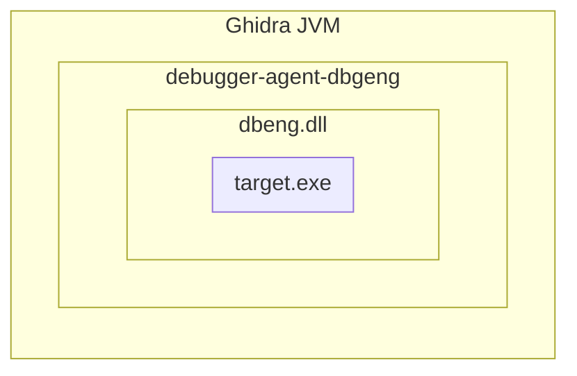
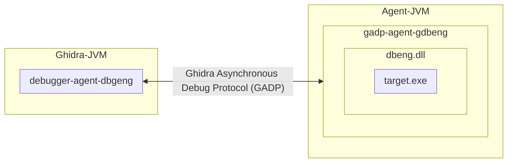

---

TL;DR - Debugging an application can provide the insight to understanding strange runtime application behaviour or help troubleshoot a subtle bug in your software. Normally, when debugging, you have source code and data type information (aka symbols) to help navigate your application. In the world of Reverse Engineering closed source applications, you won’t have the needed information to debug your application. Don’t worry, Ghidra has you. **Decompilation debugging lets you pretend like every program comes with source.** In this post, we will see how the Ghidra Debugger integrates with the Ghidra Code Browser, allowing you to step through the pseudo-code of the program you are debugging.

# Pretending All Binaries Come With Source Code

Modern [decompilers](https://en.wikipedia.org/wiki/Decompiler) attempt to produce pseudo code that matches the original source. Pairing this ability with runtime debugging tools lets you debug closed source applications like they were your very own. Here is an example of debugging the standard Windows `wordpad.exe` application with Ghidra, stepping through pseudo-code and pretending like we have source. 

{: .shadow }_Decompilation Debugging of `wordpad.exe`_

Before we explain how this works or why this is impressive, let's first talk establish what normal debugging looks like, how symbols and debug information assist with debugging. After that, we will dig into Ghidra's Debugger and show you some of its features, limitations, and hope for what's to come. 

If learning about normal debugging sounds boring, skip straight to [Decompilation Debugging](#decompilation-debugging). 

## Standard Debugging

Debugging is a fundamental skill every software developer must learn. Inevitably, your new program will behave unexpectedly or raise some unknown exception. Until you look closer by stepping through your program, it will be difficult to uncover subtle faults in your logic or understanding of underlying programming APIs.

When you write, compile, and build your own application (the example used for the next couple of sections is [rpc-svc](https://github.com/clearbluejar/rpc-svc),  an old RPC project from unmanaged (read native) program from the [Windows SDK](https://github.com/microsoft/Windows-classic-samples/tree/main/Samples/Win7Samples/netds/rpc/rpcsvc), you can produce all the information you need to debug it. You can navigate to the function you are interested in, set a [break point](https://learn.microsoft.com/en-us/visualstudio/debugger/using-breakpoints?view=vs-2022), run the application, and [step through](https://learn.microsoft.com/en-us/visualstudio/debugger/navigating-through-code-with-the-debugger?view=vs-2022&tabs=csharp#code-stepping) each line of source reading variables and outputs of functions to understand its behaviour. 

{: .shadow }_`Server.c` from [rpc-svc](https://github.com/clearbluejar/rpc-svc/blob/main/server/Server.c#L75)_

To fully debug a program, you will need to produce debug symbols. When building your application, debug linker flags specify whether to include the extra debug information.

### Leveraging PDBs


{: .shadow }_[Debug Linker Flag](https://learn.microsoft.com/en-us/cpp/build/reference/debug-generate-debug-info?redirectedfrom=MSDN&view=msvc-160)_

You can compile the application and coerce the linker to create debug symbols by using `/DEBUG` the [`/PDB`](https://learn.microsoft.com/en-us/windows/win32/debug/symbol-files?redirectedfrom=MSDN#pdb-files)  flag for Windows or the `-g` [GCC flag](https://gcc.gnu.org/onlinedocs/gcc-12.2.0/gcc/Debugging-Options.html) with Linux. 

Here is a sample linker command with `/DEBUG` for our rpc-svc project.
>  `C:\Program Files\Microsoft Visual Studio\2022\Community\VC\Tools\MSVC\14.37.32822\bin\HostX64\x64\link.exe /ERRORREPORT:PROMPT /OUT:"C:\Users\User\source\repos\rpc-svc\x64\Debug\server.exe" /INCREMENTAL /ILK:"x64\Debug\server.ilk" /NOLOGO rpcrt4.lib kernel32.lib user32.lib gdi32.lib winspool.lib comdlg32.lib advapi32.lib shell32.lib ole32.lib oleaut32.lib uuid.lib odbc32.lib odbccp32.lib /MANIFEST /MANIFESTUAC:"level='asInvoker' uiAccess='false'" /manifest:embed /DEBUG /PDB:"C:\Users\User\source\repos\rpc-svc\x64\Debug\server.pdb" /SUBSYSTEM:CONSOLE /TLBID:1 /DYNAMICBASE /NXCOMPAT /IMPLIB:"C:\Users\User\source\repos\rpc-svc\x64\Debug\server.lib" /MACHINE:X64 x64\Debug\RPCsvc_s.obj`

For Visual Studio, the compiled pdb file will end up where you set `/PDB`:
> `/PDB:"C:\Users\User\source\repos\rpc-svc\x64\Debug\server.pdb"`

{: .shadow }_PDB file found beside compiled binary_

A [symbol file](https://en.wikipedia.org/wiki/Debug_symbol) will be generated by the linker that often is much larger than the actual binary. Microsoft compilers create a program database called a PDB (Apple [uses](https://opensource.apple.com/source/lldb/lldb-179.1/www/symbols.html#:~:text=On%20MacOSX%2C%20debug%20symbols%20are,files%20when%20given%20a%20UUID.) `.dSym` files and `gcc` by default [embeds the debug info](https://interrupt.memfault.com/blog/dealing-with-large-symbol-files#building-with-debug-info-enabled) into the resulting executable in `_debug*` sections) to hold symbol information. If you want to know more about the Windows PDB structure you can check out an archived repo [microsoft-pdb](https://github.com/Microsoft/microsoft-pdb).  If we use `cvname.exe` (found [here](https://github.com/microsoft/microsoft-pdb/tree/master/cvdump) in the repo) to dump our `server.pdb` you get quite a bit of information (about [19,000 lines of output](https://gist.github.com/clearbluejar/d42f9f280fae104120a87dee92c0ace3)). 

{: .shadow }_`cvname.exe` output from server.pdb_

The output [contains](https://devblogs.microsoft.com/cppblog/whats-inside-a-pdb-file/) items like type information, offsets and locations, references to headers and source files, and details about how the specific binary was compiled. While I can make out some words and references, I can't make heads or tails of most of the information. That isn't a problem though, because **debuggers speak fluent PDB**. 

Leveraging symbols information with a decent debugger, you can debug your application in your IDE, check function results and local variable assignments, and dynamically trace through your applications control flow. 

This can be done with Visual Studio's built-in debugger:

{: .shadow }_Visual Studio Built-in Debugger_

Or an external debugger such as [WinDbg](https://learn.microsoft.com/en-us/windows-hardware/drivers/debugger/). 

{: .shadow }_WinDBG preview launch configuration_

### Debugging with WinDbg

WinDbg is a powerful tool to allow dynamic analysis of Windows applications, system Dlls, and services. There are [a](https://learn.microsoft.com/en-us/windows-hardware/drivers/debugger/getting-started-with-windows-debugging) [hundred](https://codemachine.com/articles/windbg_quickstart.html) [articles](https://www.codeproject.com/Articles/6084/Windows-Debuggers-Part-1-A-WinDbg-Tutorial) to [teach](https://securityoversimplicity.wordpress.com/2019/11/03/debugging-service-using-windbg/) you [how](https://dev.to/gabbersepp/how-to-debug-an-unmanaged-application-with-windbg-2j23) to use WinDbg for debugging modern windows applications, so I won't give you too many tips here. The most important tip I can give is to always ensure you configure and load symbols.
#### Loading Symbols

As Microsoft [provides](https://learn.microsoft.com/en-us/windows-hardware/drivers/debugger/microsoft-public-symbols) public symbols for most of their distributed applications, you can get a pretty good picture of functions and data types available for the application you are trying to understand. In WinDbg parlance, there are 3 types of symbols.

> Types of symbols recognized by WinDbg:
> - **private** - full debug information (full function, global and local variables, user data types, source filenames and line numbers)
> - **public** - subset of debug information (function names, global variables (not local),)
> - **export** - only export information function names (no data types) 
{: .prompt-tip }

When debugging your own application, you can use the private symbols provided in the PDB file you generated. For other loaded modules you don’t have PDB files for, the debugger will at least leverage the exports of the other files running within its process space.

{: .shadow }_Module listing showing some files with export symbols_

The exports don't have type information, but would at least allow you to break on an interesting function names:

```
0:000> x user32!cl*
00007ffc`a7343f40 USER32!CloseClipboard (<no parameter info>)
00007ffc`a73441e0 USER32!ClientThreadSetup (<no parameter info>)
00007ffc`a735fff0 USER32!ClientToScreen (<no parameter info>)
00007ffc`a736d770 USER32!ClipCursor (<no parameter info>)
00007ffc`a736d780 USER32!CloseDesktop (<no parameter info>)
00007ffc`a736d790 USER32!CloseWindowStation (<no parameter info>)
00007ffc`a7384ee0 USER32!CliImmSetHotKey (<no parameter info>)
00007ffc`a7387ff0 USER32!CloseGestureInfoHandle (<no parameter info>)
00007ffc`a738aa50 USER32!CloseTouchInputHandle (<no parameter info>)
00007ffc`a73ca380 USER32!CloseWindow (<no parameter info>)
```


> When debugging unfamiliar applications where you don't know where to start, try setting breakpoints on export function names that likely relate to the behavior you are interested in. 
{: .prompt-info }

All libraries need to define the location and name of their exported function to enable use by applications that import them (well this is not the case when trying to optimize your binary by [calling functions by ordinal](https://learn.microsoft.com/en-us/cpp/build/exporting-functions-from-a-dll-by-ordinal-rather-than-by-name?view=msvc-170), but the general case is to use function names). Export names alone can still be very helpful when debugging blind. For example, if you knew nothing else about your application than it reads, you could break on an exported function having to do with files and hope for the best. 

```
0:000>x kernel32!*file*
00007ffc`cfd02590 KERNEL32!FlushViewOfFile (<no parameter info>)
00007ffc`cfd02730 KERNEL32!BasepGetPackagedAppInfoForFile (<no parameter info>)
00007ffc`cfd033c0 KERNEL32!GetProfileIntA (<no parameter info>)
00007ffc`cfd033d0 KERNEL32!GetPrivateProfileIntA (<no parameter info>)
00007ffc`cfd03440 KERNEL32!GetPrivateProfileStringA (<no parameter info>)
00007ffc`cfd04310 KERNEL32!DosDateTimeToFileTime (<no parameter info>)
00007ffc`cfd0e170 KERNEL32!GetProfileIntW (<no parameter info>)
00007ffc`cfd11100 KERNEL32!GetSystemTimeAsFileTime (<no parameter info>)
00007ffc`cfd15030 KERNEL32!CreateFileMappingA (<no parameter info>)
00007ffc`cfd154d0 KERNEL32!GetFileInformationByHandleEx (<no parameter info>)
```

As mentioned previosly, Microsoft provides [public symbols](https://learn.microsoft.com/en-us/windows-hardware/drivers/debugger/public-and-private-symbols) for most of its common libraries and system files. While the public symbols don’t give you source lines or local variables, they often provide limited type information and even function signatures (above and beyond the exported function names).

> As a general rule, the public symbol table contains exactly those items that are accessible from one source file to another. Items visible in only one object file--such as **static** functions, variables that are global only within a single source file, and local variables--are not included in the public symbol table. [public and private symbols - MSDN](https://learn.microsoft.com/en-us/windows-hardware/drivers/debugger/public-and-private-symbols)

You can have WinDbg automatically download these by updating your symbols path using this command in the console: 

``` 
.sympath srv*c:\symbols*https://msdl.microsoft.com/download/symbols
```
 
 or

``` 
.symfix+ c:\symbols
.reload /f
```

This allows you to use private symbols for your local application and take advantage of public symbols for other binaries.

{: .shadow }_WinDbg Module Listing with Public and Private symbols_

The public symbols give you more information on types and function signatures than you had just from exports:

```
0:000> x user32!cl*
00007ffc`a734f818 USER32!ClassNameToVersion (void)
00007ffc`a7346804 USER32!CliImmInitializeHotKeys (void)
00007ffc`a73be7f4 USER32!ClStartExecute (int __cdecl ClStartExecute(struct tagXACT_INFO *))
00007ffc`a73bdc70 USER32!ClRespAdviseAck (int __cdecl ClRespAdviseAck(struct tagXACT_INFO *,unsigned int,__int64))
00007ffc`a7388524 USER32!CLocalHookManager::CallNextHookInChain (public: static __int64 __cdecl CLocalHookManager::CallNextHookInChain(struct HHOOK__ *,int,unsigned __int64,__int64))
00007ffc`a7388948 USER32!CLocalHookManager::RunHookChain (public: static __int64 __cdecl CLocalHookManager::RunHookChain(int,int,unsigned __int64,__int64))
00007ffc`a7388758 USER32!CLocalHookManager::GetLocalCollection (private: static struct tagLOCALHOOKCOLLECTION * __cdecl CLocalHookManager::GetLocalCollection(void))
00007ffc`a7348bd4 USER32!CliImmSetHotKeyWorker (int __cdecl CliImmSetHotKeyWorker(unsigned long,unsigned int,unsigned int,struct HKL__ *,unsigned long))
00007ffc`a73be938 USER32!ClStartRequest (int __cdecl ClStartRequest(struct tagXACT_INFO *))
```

But not quite as much info as the private symbols:

{: .shadow }_`server.exe` private symbols displayed with the `x` command_

Each one of the hyperlinks shown from the `x` command are shortcuts to explore each of the defined types in depth:

{: .shadow }_Enriched data type information with hover-over `dx` command_

```console
0:001> dx -r1 (*((server!_NDR64_POINTER_FORMAT *)0x7ff68d2dc460))
(*((server!_NDR64_POINTER_FORMAT *)0x7ff68d2dc460))                 [Type: _NDR64_POINTER_FORMAT]
    [+0x000] FormatCode       : 0x20 [Type: unsigned char]
    [+0x001] Flags            : 0x0 [Type: unsigned char]
    [+0x002] Reserved         : 0x0 [Type: unsigned short]
    [+0x008] Pointee          : 0x7ff68d2dc410 [Type: void *]
```

The extra information from the private symbols enable these advanced features of the debugger. 
#### Stepping Through Source

If you have the source for an application and the private debug symbols, WinDbg will perform just like Visual Studio, stepping through the source code line by line.

{: .shadow .float }_Standard Source debugging requires private symbols and source_

If you have private symbols and the source is stored locally, the source will automatically appear!

{: .shadow }_Source Code Stepping with WinDbg_

#### Stepping Through Assembly

What happens when you don't have source? What if you want to debug a crash in a service or follow a call into a system library such as `RPCRT4!RpcServerUseProtseqW` or other proprietary library? When you hit code for which you don't have the source, most debuggers will offer you the disassembly (machine code to assembly). 

{: .shadow }_Visual Studio Offering to view disassembly_

Well, nothing stops you from debugging any application with disassembly. 

{: .shadow }_Assembly Listing for `RPCRT4!RpcServerUseProtseqW`_

Reading and understanding program flow via assembly is possible. You can rely on function calls to named exports (such as `RPCRT4!RpcpGetThreadPointer` in the above example) and look at the call stack to get your bearings. You can read memory and strings like normal. Even so, it is much easier to follow program flow and understand a program with the high level representation. So, if we can’t have source for these proprietary libraries, what if we could pretend to have it?

## Decompilation Debugging

Modern [SRE](https://en.wikipedia.org/wiki/Reverse_engineering#software:~:text=decades.%5B9%5D-,Software%20reverse%20engineering,-can%20help%20to) tooling provides the ability to **decompile native code into pseudo-code**. 

>This ability is not as remarkable for [managed](https://learn.microsoft.com/en-us/dotnet/standard/managed-code) code as "decompilation debugging" is a [standard feature](https://devblogs.microsoft.com/visualstudio/decompilation-of-c-code-made-easy-with-visual-studio/).  
{: .prompt-info }

This resulting pseudo code is much easier to understand. It is much easier to leverage the high level representation of code than attempt to keep entire register states and program flow in our heads. Using the `RpcServerUseProtseqW` example, we can transform the disassembly into:

```c
RPC_STATUS __stdcall RpcServerUseProtseqW(RPC_WSTR Protseq,uint MaxCalls,void *SecurityDescriptor)

{
  RPC_STATUS extraout_EAX;
  long lVar1;
  RPC_STATUS RVar2;
  THREAD *pTVar3;
  long *plVar4;
  undefined auStackY_68 [32];
  int local_38 [2];
  ulonglong local_20;
  
  local_20 = __security_cookie ^ (ulonglong)auStackY_68;
  if ((RpcHasBeenInitialized != 0) || (lVar1 = PerformRpcInitialization(), lVar1 == 0)) {
    local_2c = 0;
    local_28 = 0;
    local_30 = 0xc;
    pTVar3 = RpcpGetThreadPointer();
    if (pTVar3 == (THREAD *)0x0) {
      local_38[0] = 0;
      pTVar3 = (THREAD *)AllocWrapper(0xe8);
      if (pTVar3 == (THREAD *)0x0) {
LAB_18007353f:
        RVar2 = FUN_180015f94();
        return RVar2;
      }
      plVar4 = local_38;
      pTVar3 = (THREAD *)THREAD::THREAD(pTVar3,plVar4);
      if (pTVar3 == (THREAD *)0x0) goto LAB_18007353f;
      if (local_38[0] != 0) {
        THREAD::`scalar_deleting_destructor'(pTVar3,(uint)plVar4);
        goto LAB_18007353f;
      }
      if (pTVar3 == (THREAD *)0x0) goto LAB_180015f7e;
    }
    RpcpPurgeEEInfoFromThreadIfNecessary(pTVar3);
    I_RpcServerUseProtseq2W((RPC_WSTR)0x0,Protseq,MaxCalls,SecurityDescriptor,&local_30);
  }
LAB_180015f7e:
  __security_check_cookie(local_20 ^ (ulonglong)auStackY_68);
  return extraout_EAX;
}
```

It's not perfect, but much easier to understand than assembly. What if you wanted to add this decompilation ability to a debug session, to more easily understand your closed source application? Well, as you probably have guessed from the title of this post, that is exactly what 
we are going to do. 

### Ghidra Debugger

Let’s look at using Ghidra’s new(ish) feature, its Debugger tool.

{: .shadow }_Ghidra's Debugger Icon_

The Debugger is one of the default tools available since Ghidra [10.0](https://github.com/NationalSecurityAgency/ghidra/releases/tag/Ghidra_10.0_build). 

{: .shadow }_Decompilation Debugging of `wordpad.exe`_

The Ghidra Debugger, like all Ghidra tools, consists of a collection of the [plugins](https://github.com/NationalSecurityAgency/ghidra/tree/master/Ghidra/Debug). The plugins for the Debugger tool work together to create "Ghidra's Dynamic Analysis Framework". The Ghidra debugger is not a debugger, rather, it relies on external debugggers to control debugging targets. Ghidra's Debugger communicates to these external debuggers via one of  its "connectors". 

{: .shadow }_List of [available connectors](https://github.com/NationalSecurityAgency/ghidra/tree/master/Ghidra/Debug) for Ghidra's Debugger_

Right now, Ghidra has built-in connectors for Windows via `dbeng` and `dbgmodel`, which is the same debugging engine used in WinDbg and WinDbg Preview, respectively. It also supports `gdb` on Linux, `lldb` for Mac, and even touts experimental support for [Frida](https://github.com/frida/frida). These are available via the Debugger dropdown menu.

{: .shadow }_Selecting one of the debugger "connectors"_

It connects to each debugger via a connector. `dbeng.dll` is wrapped with the Java code here that provides a Java interface to the native debug engine. The connector code is here in [DbgModel.java](https://github.com/NationalSecurityAgency/ghidra/blob/master/Ghidra/Debug/Debugger-agent-dbgeng/src/main/java/agent/dbgeng/dbgeng/DbgEng.java#L32). Each connector provides two modes to run a target for a debugger.

#### Ghidra Debugger Run Options

Directly or "IN-VM":



Or running the debugging engine in a separate process via an "agent": 



Ghidra can call run "IN-VM" which will start the debugger within its own process, or it has the ability to launch an agent that will run the debugger in a [separate process](https://github.com/NationalSecurityAgency/ghidra/blob/master/Ghidra/Debug/Debugger-agent-dbgeng/src/main/java/agent/dbgeng/gadp/DbgEngGadpServer.java#L89). The "IN-VM" case should run with better performance, but there is a risk to crashing Ghidra and losing your state if the Debugger crashes within the JVM. I had tried both with success. 

### Wait - Debuggers? What? How? 

A debugger is a client application that leverages an OS provided [debugging API](https://learn.microsoft.com/en-us/windows/win32/debug/debugging-functions) to register for several types of [events](https://learn.microsoft.com/en-us/windows/win32/api/minwinbase/ns-minwinbase-debug_event#members) related to a specific process and sit waiting in an event loop. The debugger will monitor events such as thread creation, or a module load, or hitting an `int3` (or breakpoint). The debugger, when receiving these events, can decide what to do next, whether that be to continue, step to the next instruction, modify memory, etc.

Some common debugger capabilities include:
- inspecting memory
- reading registers
- setting breakpoints
- modifying control flow

A great reference for understanding what a debugger is and how they work under the hood is [@timmisiak](https://twitter.com/timmisiak)'s blog on writing a debugger in Rust. Through [several](https://www.timdbg.com/posts/writing-a-debugger-from-scratch-part-1/) [posts](https://www.timdbg.com/posts/writing-a-debugger-from-scratch-part-2/) he helps us understands the basic concepts of a debugging application.  

#### The Puppeteer

Remember, Ghidra’s Debugger is not a debugger. It allows you to perform debugging via proxy. You can direct the external debugger to start or stop the debugging target; read or modify the current program state; break on specific functions. **Ghidra’s Debugger is a puppeteer, treating externals debuggers like marionettes by directing them to start, stop, and manipulate a target application.**

What is the point then? Why not just use the original debugger and skip the overhead? Well, Ghidra’s Debugger **combines static analysis and dynamic analysis in one view**. It has several plugins that are reading state from the debugger to provide information that can enhance the static analysis (like reading live register values). The real time information is available in real time syncing across the static and dynamic listings within the Debugger GUI.

### Decompilation Debugging With Ghidra

Let's learn how to launch and debug an application on Windows. Let's again try out the rpc-svc `server.exe` application from above. We will start with a new project, import and launch our binary, set some break points, and see how we can step through the application both in assembly (listing view) and in pseudo-code (decompiler view).

>Alternative exercise: If you don't want to use `server.exe` to follow along, just try these same steps with an example binary from windows. Say `ping.exe`? If you use that one, try setting a breakpoint on [WSAStartup](https://learn.microsoft.com/en-us/windows/win32/api/winsock/nf-winsock-wsastartup) and make sure to supply a [command-line](#command-line) arg like `www.google.com` or some other server so the exe doesn't quit immediately.
{: .prompt-info } 

#### Import and Analyze 

From Ghidra's debugger tutorial: 

> For the "Debug" button to work, you must (a) have the program you wish to run visible and selected in the static Listing window, and (b) have imported the program from the place it lives on the local system. In other words, the file path associated with the program should be the path to the executable for the current file system. [Ghidra Docs - Getting Started](https://htmlpreview.github.io/?https://raw.githubusercontent.com/NationalSecurityAgency/ghidra/7ee84802b83b289cd63da54a283fbbdb9db54887/Ghidra/Debug/Debugger/src/main/help/help/topics/Debugger/GettingStarted.html)

The first step will be to import the application into Ghidra for analysis, the same as you would for static analysis.  We will use the release version of the binary that will contain no symbols, which would normally be the case when you are reverse engineering.

{: .shadow }_Import `server.exe` into Ghidra Project_

After the binary is imported we can analyze it with the default settings.

{: .shadow }_Analyze `server.exe`_

And then launch it in the debugger. 
#### Open in Debugger

{: .shadow }_Launch `server.exe` in Debugger Tool_

The GUI appears with what seems like [1000 windows](https://github.com/NationalSecurityAgency/ghidra/blob/master/GhidraDocs/GhidraClass/Debugger/A2-UITour.md#windows). I won't explain them all, because even after studying the tool I don't have a full grasp on every feature, but will touch on several of the Windows necessary to understand setting a breakpoint and stepping through code. 

{: .shadow }_Ghidra Debugger with 1000 Windows_

#### Launch in debugger

{: .shadow }_Debugger Connector Options_

##### Dbgeng IN-VM

We will run the `dbgeng` connector locally within Ghidra (IN-VM). You can alternatively select running via an agent via GADP. See [Ghidra Debugger Run Options](#ghidra-debugger-run-options).

##### Command-Line 

You will need to provide a command-line. For `server.exe`  append a '-debug' so that we hit [this code path](https://github.com/clearbluejar/rpc-svc/blob/e7c428fe488ad82888a4fbe8ebdc1fd1820ab050/server/Service.C#L91-L94) for debugging. 

{: .shadow }_Configure Command Line_


This should open up an **Interpreter** Window, that should match what you might be used to in WinDbg:

> - The **Interpreter** window: This is essentially a terminal emulator providing a command-line interface to the back-end debugger. It is useful for diagnostics or for issuing commands that do not have a button in the GUI. Some may also prefer to command the debugger from here rather than the GUI. [Debugger Tutorial - Windows](https://github.com/NationalSecurityAgency/ghidra/blob/master/GhidraDocs/GhidraClass/Debugger/A2-UITour.md#windows)


{: .shadow }_Ghidra Interpreter Window pass-through to WinDbg_

From here we are ready to get started. The first thing we will do is set some breakpoints. 
#### Setting Breakpoints

You can set breakpoints from the Interpreter Window with a command like `bp kerne32!CreateFileW`, but that is not your only option. We can navigate to interesting sections of code using all the utilities of Ghidra’s standard Code Browser and set breakpoints from a listing or pseudo-code window.

For our server, we are running the release version with no debug information to mimic a standard reverse engineering scenario. Here, we will need to rely on some imported functions to break at locations we are interested in. We will set two breakpoints. One in the very beginning when the command line arguments are being parsed and before the RPC server is being initialized. Another one when our server is processing a RPC request from a client.

To find these breakpoints, I prefer to head over to the symbol table. Open the symbol table for `server.exe` choose to break on a call to [`GetCommandLineW`](https://learn.microsoft.com/en-us/windows/win32/api/processenv/nf-processenv-getcommandlinew). You can break on a different function call, but just try to choose something that happens early on.

Using the Symbol Table (*Ctrl-T*) we can look through symbols of interest:

{: .shadow }_Ghidra Symbol Table_

View the location for `GetCommandLineW` in the listing:  

{: .shadow }_`GetCommandLineW` listing_

Then pivot to one of the cross references (*XREF*s) in `server.exe`:

{: .shadow }_`GetCommandLineW` in `server.exe`_

And set a breakpoint (*k* shortcut key) or right click:

{: .shadow }_Setting SW_EXECUTE breakpoint_

For the 2nd breakpoint, if we want to observe RPC calls coming to our server, we can break on one of the RPC functions that [handle RPCs calls](https://github.com/clearbluejar/rpc-svc/blob/e7c428fe488ad82888a4fbe8ebdc1fd1820ab050/server/Server.c#L279-L598) within our server. As this is just a test server, some of those functions don’t [do much](https://github.com/clearbluejar/rpc-svc/blob/e7c428fe488ad82888a4fbe8ebdc1fd1820ab050/server/Server.c#L317-L325) or reference any external calls (making it more difficult to find a nice breakpoint). But some do. A common activity when responding to an RPC call is to allocate some new memory to populate a structure. For an RPC server, this happens in [midl_user_allocate](https://learn.microsoft.com/en-us/windows/win32/rpc/the-midl-user-allocate-function). This is not an exported symbol from our server, but if we browse the symbol table again, we find that `HeapAlloc` is that only allocation function available.

{: .shadow }_`midl_user_allocate` allocation options_

Again we can pivot to a cross reference and set a breakpoint. 

{: .shadow }_Handle RPC call breakpoint_

The breakpoints can be listed in the Breakpoints Window:

{: .shadow }_Breakpoints Window: Top (static) and Bottom (dynamic)_

The top has the addresses matching the static listing from the analyzed program, the bottom has the addresses matching the memory state of the running `server.exe` in the debugger. There is a bit of a learning curve when trying to understand which components of the Ghidra Debugger operate on the live target and which on the static program. Check out the docs on [Machine State](https://github.com/NationalSecurityAgency/ghidra/blob/master/GhidraDocs/GhidraClass/Debugger/A4-MachineState.md#machine-state) to learn more. 
#### Navigating in the Debugger

Time to run our program.

{: .shadow }_Navigation Control Buttons_

To run the application in the debugger you can use one of the Ghidra Debugger [control buttons](https://github.com/NationalSecurityAgency/ghidra/blob/master/GhidraDocs/GhidraClass/Debugger/A2-UITour.md#toolbar) or just type `g` in the interpreter. The result should be to hit our first breakpoint.

```
0:000>g
Breakpoint 1 hit
0:000>bl
 0 e 00007ff7`3d461381     0001 (0001)  0:**** server+0x1381
 1 e 00007ff7`3d461da3     0001 (0001)  0:**** server+0x1da3
```

{: .shadow }_GetCommandLine breakpoint hit_

After we reach the breakpoint, you have the option to use the navigation buttons on the top to step over or in, continue, stop, etc or you can use the interpreter window using commands like `t` to step. 

We will step into the function that [initializes](https://learn.microsoft.com/en-us/windows/win32/rpc/how-the-server-prepares-for-a-connection) our RPC server. 

{: .shadow }_Stepping into `server.exe` RPC setup function_

Let's check out when our server [registers](https://learn.microsoft.com/en-us/windows/win32/rpc/making-the-server-available-on-the-network) its RPC protocols with `RpcServerUseProtseq`. Our server [registers several protocols](https://github.com/clearbluejar/rpc-svc/blob/e7c428fe488ad82888a4fbe8ebdc1fd1820ab050/server/Server.c#L45-L49). 

{: .shadow }_Breaking on `RpcServerUseProtseqW`_

When we arrive at `RpcServerUseProtseqW`, the Listing window displays the actual value of the first element in the array of available protocols.

{: .shadow }_Listing pointing to array of RPC protocols_

If we try to “Step Into” code we haven’t imported, our only option is to revert to assembly once again. **But we can fix this. This is the magic decompilation debugging.**

{: .shadow }_Decompilation fails when binary is not available within Ghidra project_

#### Dynamically Importing External Libraries

> While the Debugger can operate without importing external modules, it generally works better when you have. The symbols `srand` and `rand` are in `libc`. If you would like to save the breakpoints we placed on them, you must import the module. You could do this in the usual manner, but the Debugger offers a convenient way to import missing modules. [import libc - Ghidra Debugger Tutorial](https://github.com/NationalSecurityAgency/ghidra/blob/master/GhidraDocs/GhidraClass/Debugger/A3-Breakpoints.md#importing-libc)

Go to the Modules window and import the missing module:

{: .shadow }_Import missing module_

This will bring up the file chooser dialog to choose `rpcrt4.dll`:

{: .shadow }_Import `rpcrt4.dll_

After you [import and analyze](#import-and-analyze) the binary, the decompilation view will be restored and you can step through the pseudo-code, read memory, and **pretend like you have source**!

{: .shadow }_Step through `rpcrt4.dll` psuedo-code_

The second breakpoint we hit is one for a function that handles an RPC call. If we cheat and look at the source we know the function [BufferOut3](https://github.com/clearbluejar/rpc-svc/blob/e7c428fe488ad82888a4fbe8ebdc1fd1820ab050/server/Server.c#L383-L397) looks like this:

{: .shadow }_`BufferOut3` RPC function within `server.exe`_

In the debugger Ghidra produces the following psuedo-code for  `BuggerOut3`:

```c
undefined8 FUN_140001360(undefined8 param_1,undefined4 *param_2)

{
  HANDLE hHeap;
  LPVOID pvVar1;
  undefined8 uVar2;

  *param_2 = 100;
  hHeap = GetProcessHeap();
  pvVar1 = HeapAlloc(hHeap,4,100);
  uVar2 = 0;
  *(LPVOID *)(param_2 + 2) = pvVar1;
  if (pvVar1 == (LPVOID)0x0) {
    uVar2 = 0xe;
  }
  return uVar2;
}
```

What is powerful about this breakpoint is that we can see the full stack from the incoming RPC call within `rpcrt4.dll`. This can be useful when trying to understand the [RPC runtime](https://learn.microsoft.com/en-us/windows/win32/rpc/how-rpc-works) and how a server handles RPC calls from the client.

{: .shadow }_RPC server call stack_

Then we can set new breakpoints further down the stack and walk the `rpcrt4.dll`, or just step out of our function and see what happens after we process the call in the server.

{: .shadow }_Follow return patch to RPC client_

>If you want to set breakpoints in external libraries (and want Ghidra to remember them), you will need to import and analyze the external library. The breakpoint is saved with the corresponding program database.
{: .prompt-info }

#### Reading / Writing Memory

##### Reading Memory

One last debugger feature to cover is the ability to read and write memory. When reading memory from the live target, there are quite a few options.

Registers Window: 
{: .shadow }_Register values from live target_

Watches Window:
{: .shadow }_Watches Window watching function arguments_

Reading live target memory in Ghidra can happen in the Dynamic Listing window, the Memory window, and the Watch Window.  Let’s demonstrate observing the string used in `RpcServerUseProtseqW` to register each RPC protocol for the server. Assuming this is our list of protocols:

{: .shadow }_RPC server protocol array from `server.exe`_

The easiest way to demonstrate is to set a watch for the value of *RCX*, which typically hold the first argument for functions when using the [Microsoft x64 calling convention](https://en.wikipedia.org/wiki/X86_calling_conventions#Microsoft_x64_calling_convention). You can find out more about the Watches Window syntax [here](https://github.com/NationalSecurityAgency/ghidra/blob/master/GhidraDocs/GhidraClass/Debugger/A4-MachineState.md#variables-and-constants). We can then setup the Memory Window to track the watch expression.

{: .shadow }_Track Watch expression via RCX_

While iterating in the code in this loop:

```c
    //
    // Use protocol sequences (protseqs) specified in ProtocolArray.
    //

    for(i = 0; i < sizeof(ProtocolArray)/sizeof(TCHAR *); i++)
        {

        // Report the status to the service control manager.
        if (!ReportStatusToSCMgr(
            SERVICE_START_PENDING, // service state
            NO_ERROR,              // exit code
            3000))                 // wait hint
            return;


        status = RpcServerUseProtseq(ProtocolArray[i],
                                     ProtocolBuffer,
                                     0);

        if (status == RPC_S_OK)
            {
            fListening = TRUE;
            }
        }

```

The memory windows tracks the first argument *RCX* iterating through each protocol in memory:

{: .shadow }_Watch Memory Window track RCX_

##### Writing Memory

For modifying memory we can do it in the Memory Window. By default, the Target Mode and Memory Window is read-only.

> "Edits in any _dynamic_ window will attempt to patch the live target. Edits in any _static_ window will **not** patch the live target; they modify the program database as usual." [Machine State](https://github.com/NationalSecurityAgency/ghidra/blob/master/GhidraDocs/GhidraClass/Debugger/A4-MachineState.md#patching)
{: .prompt-info }

So you will need to turn on Edits in the Control Mode drop-down:

{: .shadow }_Enable Editing in Control Mode Drop-down_

Then also enable edits in the Memory Window:

{: .shadow }_Enable Editing in Memory Window_

Then we can modify the protocol string to something invalid: 

{: .shadow }_Modifying a protocol string_

And watch the RPC call fail:

{: .shadow }_RPC_STATUS == 1703_

With error 1703: 

{: .shadow }_RPC Protocol not supported_

Nice. Also, notice that when you hover over variables (aka [Variable Hovers](https://github.com/NationalSecurityAgency/ghidra/blob/master/GhidraDocs/GhidraClass/Debugger/A4-MachineState.md#variable-hovers)) within the Decompiler window or any listing window, Ghidra will attempt to unwind the stack to determine a value for the high-level variable.  

{: .shadow }_Variable Hovers_

### Limitations

Not everything worked perfectly out of the gate. It took me several tries to understand the workflow well enough to select the correct debug connector, start the debugger in a clean state, and set breakpoints that made sense.
#### Connectors Hanging

If I ever reached a failed state (i.e. the connector was hanging) the best thing for me to do was to restart Ghidra as a whole, rather than just restart the debugging tool.

{: .shadow }_Connector Error_

#### Module Mapping Bug

I ran into an issue with the Windows module mapping that made it quite painful to step through external libraries and return to the main server code. I just submitted a [bug report](https://github.com/NationalSecurityAgency/ghidra/issues/5994), so likely they will address soon it or I will learn what I was doing wrong.

#### Stack Could Include Module Names

A normal Windows debugger will display module names in the call stack to help give you a quick reference to where it was from.

```
Breakpoint 0 hit
0:000>k
Child-SP          RetAddr               Call Site
0000001b`f76ff868 00007ff6`430410a3     RPCRT4!RpcServerUseProtseqW
0000001b`f76ff870 00007ff6`43041de1     server+0x10a3
0000001b`f76ff8b0 00007ff6`430416cf     server+0x1de1
0000001b`f76ff8f0 00007ff6`43042140     server+0x16cf
0000001b`f76ff950 00007ff9`a78f257d     server+0x2140
0000001b`f76ff990 00007ff9`a8d4aa58     KERNEL32!BaseThreadInitThunk+0x1d
0000001b`f76ff9c0 00000000`00000000     ntdll!RtlUserThreadStart+0x28
```


Currently, Ghidra's Debugger call stack lacks module names. This might be due to the module mapping issue I found, but I feel like it could be a nice addition. 

{: .shadow }_Ghidra Debugger Call Stack Missing Module Names_

## Pretend Like Your Binary Comes with Source

All in all, the Ghidra Debugger is pretty amazing. The Ghidra Debugger is yet another powerful tool for reverse engineering. It allows you to debug native code as if you have the source code, even for external libraries that you don’t have access to. 

In this blog post, I showed you how to use decompilation debugging to analyze a Windows RPC server. I hope you found it useful and learned something new. I see some great potential in using this technique generally. Remember, the Ghidra Debugger is not limited to Windows. You can use it to debug programs on other platforms as well. There are many more features in the Ghidra Debugger that I didn’t cover in this post, such as tracing (akin to [Time Travel Debugging](https://learn.microsoft.com/en-us/windows-hardware/drivers/debuggercmds/time-travel-debugging-overview) ) and [emulation](https://github.com/NationalSecurityAgency/ghidra/blob/master/GhidraDocs/GhidraClass/Debugger/B2-Emulation.md#emulation). For now, I will leave those topics as an exercise for the reader. 

Hope this blog post helps you see how powerful decompilation debugging can be. Give it a try and let me know how it goes. Love to hear if you were able to use this for good or have a different take.  

---

If you have feedback or correction for this post please [submit an issue](https://github.com/clearbluejar/clearbluejar.github.io/issues/new?assignees=&labels=&template=post-feedback.md&title=%5BFeedback%5D%20Decompilation%20Debugging)  or reach out on social.

---

<sub>Cover Photo by Timothy Dykes on Unsplash</sub>
  
  
