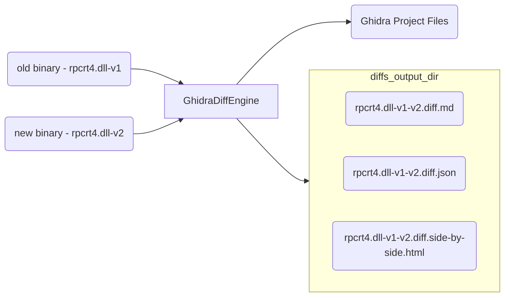

TL;DR As seen in most security blog posts today, binary diffing tools are essential for reverse engineering, vulnerability research, and malware analysis. Patch diffing is a technique widely used to identify changes across versions of binaries as related to security patches. By diffing two binaries, a security researcher can dig deeper into the latest CVEs and patched vulnerabilities to understand their root cause. This post presents [`ghidriff`](https://github.com/clearbluejar/ghidriff), a new open-source Python package that offers a command-line binary diffing capability leveraging the power of the Ghidra Software Reverse Engineering (SRE) Framework with a fresh take on the standard patch diffing workflow.

`ghidriff` is a side project that evolved into a powerful [patch diffing](https://cve-north-stars.github.io/docs/Patch-Diffing) tool for vulnerability research. I have had the privilege to present it at several conferences this year and the slides are available [here](https://www.blackhat.com/sector/2023/briefings/schedule/#ghidriff-ghidra-binary-diffing-engine-34595). It is about a year in the making and publicly released in [October](https://github.com/clearbluejar/ghidriff/releases/tag/v0.5.0). Coincidentally, BinDiff decided it was also time to open-source (after ~20 years!) a few weeks before. Also, another tool `qbindiff` came out just a day later! So, in the now sea of binary diffing tools, `ghidriff` [throws its hat](https://twitter.com/clearbluejar/status/1712093656708976868) into the ring. 

This post shows off some of its key features and might give you a reason to give it a try. Its primary advantages are the fact that it is command-line (lending towards automation) and its output is markdown (enabling something I'm branding  "[social diffing](#social-binary-diffing)"). Additionally, `ghidriff`, built for patch diffing, structures the markdown to enable a quick review of changes which can highlight interesting security related changes. 

Let's get started. To skip all the background and head straight to its features straight to its features [click here](#features). Otherwise, read on and learn a little more about binary diffing, why it's useful, and why we have yet another diffing tool.
### History

There are many tools that perform binary diffing, and do it quite well. The most well known being [BinDiff](https://www.zynamics.com/bindiff.html), followed by others such as [Diaphora](https://github.com/joxeankoret/diaphora/) (paired with IDA) and [Version Tracking](https://github.com/NationalSecurityAgency/ghidra/tree/master/Ghidra/Features/VersionTracking) (built into Ghidra). I have the most experience with Ghidra [Version Tracking](https://cve-north-stars.github.io/docs/Ghidra-Patch-Diffing), but have often used BinDiff as a sanity check while developing `ghidriff`. There is a good reason for that BinDiff is the most often used and well known. Its origins date back to 2004 from [Halvar Flake](https://twitter.com/halvarflake) and [Rolf Rolles](https://twitter.com/RolfRolles) and their research on binary comparison. Halver's epic paper [Structural Comparison of Executable Objects](https://www.researchgate.net/publication/28356113_Structural_Comparison_of_Executable_Objects), introduced a novel method to find matching functions between two binaries.  

> This paper presents a novel approach which corrects the above mentioned asymmetry: Given two variants of the same executable A called *A'* and *A''*, an one-to-one mapping between all the functions in *A'* to all functions in *A''* is created. The mapping does not depend on the specific assembly-level instructions generated by the compiler but is more general in nature: It maps control flow graphs of functions, thus ignoring less-aggressive optimization such as instruction reordering and changes in register allocation. [Structural Comparison of Executable Objects](https://www.researchgate.net/publication/28356113_Structural_Comparison_of_Executable_Objects)

Bindiff introduced a fast and reliable means to way to identify functions across two different versions of a binary that detect logic changes in a function rather simple byte changes or compiler optimizations. Instead of focusing on the actual bytes of a function (which can vary with a small source code change), his paper points us toward using a structural comparison of functions to find matches. The gist being that the structure of a function remains unchanged unless the logic of the function changes.

> In 2004, I started a company called zynamics that built highly specialized reverse engineering tools. [...] **One of our products (BinDiff) became an industry standard and even a verb.** In 2011, Google acquired the company, and I spent the next 5 years integrating our technology and team into Google. [Halvar Flake](https://thomasdullien.github.io/about/)

Zynamics (now owned by Google) implemented this comparison method into BinDiff, along with several techniques to make BinDiff a revered binary diffing tool. 

### Purpose

Each binary diffing tool has the same purpose. Find the *added*, *deleted*, and *modified* data and functions between two binaries or minimally, match functions between two binaries.

With this functionality the diffing tool can be used for:

- **Reverse Engineering**: Port previous reverse engineering work to new binary (ie. bring over comments, labels, and other metadata considered)
- **Vulnerability Research**: Determine whether or not a security update actually addressed the root issue, or was a shallow fix.  
- **Malware analysis** - find similar code in one malware set to another, or correlate new versions of malware to old

### Complexity

Matching functions across binaries is a difficult. A simple diff program won't find all the differences. I know this, because I've [tried](https://github.com/clearbluejar/ghidriff/blob/main/ghidriff/simple_diff.py). You aren't comparing two text documents; you are comparing two binaries with 1000s of functions and complicated relationships. Not only is it non-trivial, the problem, as noted in Halvar's paper, is asymmetric. 

> It takes relatively little work to change source code and recompile, while the analysis of the object code will have to be completely redone to detect the changes.  [Structural Comparison of Executable Objects](https://static.googleusercontent.com/media/www.zynamics.com/en//downloads/dimva_paper2.pdf)

Several changes can occur from a simple change in the source of a binary:

1. Registers used to hold specific variables (using RAX instead of RDX)
2. Basic block arrangement and branches (flowgraph and callgraph respectively)
3. Compiler might optimize instructions that perform the same operations  (`xor eax, eax` or `mov eax,0`)

**Binary diffing tools attempt to bring symmetry to the asymmetric problem of reverse engineering changes between two binaries.**

## Binary Diffing Tools - Under the Hood

### Stand on the Shoulders of Giants (SRE tooling)

All diffing tools I know of rely on modern SRE toolsets (like Ghidra, IDA, or Binja) to distill a complex binary into a list of symbols, functions, [basic blocks](https://en.wikipedia.org/wiki/Basic_block) and their inter-relationships. 

{: .shadow }_Standing on the Shoulders of Giants - `ghidriff` on Ghidra_

SRE tools catalog all the functions, data, types, and references to enable the programmatic analysis needed to compare two binaries.

- [IDA](https://en.wikipedia.org/wiki/Interactive_Disassembler) analyzes a binary and stores its analysis in its proprietary database. Diaphora exports the IDA database to a SQLite format that it can later query for function matching.
- [Ghidra](https://ghidra-sre.org/) analyzes a binary and saves offs the analysis in its proprietary database. Version Tracking in Ghidra runs in Ghidra, and simply queries its database directly.
- BinDiff is a stand-alone tool that offers export plugins for SRE tooling. One for [IDA, Ghidra, and BinaryNinja](https://github.com/google/binexport/releases).  These plugins extract the analysis information into  [protocol buffers](https://protobuf.dev/), which is a language neutral way to serialize the structured binary data and functions. Later, the BinDiff visualizer app can use this data for function matching.


### Function Matching

Each tool can then analyze every function from each binary and compare them.  The comparison algorithm, or means of matching the two functions from different binaries, has a few different names depending on the tool. BinDiff calls them [matching algorithms](https://www.zynamics.com/bindiff/manual/#N2038E), Diaphora calls them matching [heuristics](https://github.com/joxeankoret/diaphora/blob/ed9d0467468e4950519d893854036861643925cd/diaphora_heuristics.py#L42), and Ghidra calls them [correlators](https://github.com/NationalSecurityAgency/ghidra/tree/master/Ghidra/Features/VersionTracking/src/main/java/ghidra/feature/vt/api/correlator/program). No matter the name, they are all algorithms that take various inputs (basic blocks, data, functions) and create an association between two binaries and score them based on some heuristic. Each heuristic uses one or a combination of the methods for matching a function.

#### 3 General Methods for Matching Functions

I know of 3 different methods of matching two functions. Each method has its pros and cons.

>-   **Syntax** - compare representation of actual bytes or sequence of instructions
>        -   Pros - Quick. Easy to compute, just hash the two binaries
>        -   Cons - Not generally realistic. Compiling the same source twice with the same compiler will generate a different hash, as this naive approach doesn’t consider the time based metadata put into a binary by the compiler.
>-   **Semantics** - compare the meaning is equivalent or provide the same functionality, or has similar effects
>        -   Pros - Less susceptible to metadata or simple compiler changes.
>        -   Cons - To prove two functions are semantically equivalent basically boils down to the [halting problem](https://en.wikipedia.org/wiki/Halting_problem).
>-   **Structure** - a blend of semantic and syntax. Analyzes graph representations of binaries ( control flow, callgraphs, etc. ) and computes similarity on these generated structures
>        -   Pros - More general. A control flow is a type of semantic, and easier to compute.

> Source: [Ghidra Patch Diffing](https://cve-north-stars.github.io/docs/Ghidra-Patch-Diffing#run-correlators-step-3)

Syntax-based function matching heuristics are quick and accurate, but cannot handle minor changes or compiler optimizations.


{: .shadow }_Syntax Matching Heuristic - `ExactBytesFuncotinHasher` from [VT](https://github.com/NationalSecurityAgency/ghidra/blob/6242fda158fed6c7dbbd6928a4a74371a212c373/Ghidra/Features/Base/src/main/java/ghidra/app/plugin/match/ExactBytesFunctionHasher.java#L29)_

I don’t know of any semantic based heuristics, but perhaps the pseudo-code output of the decompiler could represent “meaning”. Structure-based heuristics look at the edges and nodes of the callgraphs or control flow graphs of various functions.

{: .shadow }_Structural Comparison CFG from BinDiff_

Each diffing tool provides several function matching heuristics:

| Tool             | Matching Name                                                                                                                  | Code                                                                                                                                                                                      |
| ---------------- | ------------------------------------------------------------------------------------------------------------------------------ | ----------------------------------------------------------------------------------------------------------------------------------------------------------------------------------------- |
| BinDiff          | [Algorithms](https://www.zynamics.com/bindiff/manual/#N2038E)                                                                  | [Code](https://github.com/google/bindiff/tree/0b5bb854907ce83af5f67200dbd3b7fd36cb9a86/match)                                                                                             |
| Diaphora         | [Heuristics](https://github.com/joxeankoret/diaphora/blob/ed9d0467468e4950519d893854036861643925cd/diaphora_heuristics.py#L42) | [Code](https://github.com/joxeankoret/diaphora/blob/master/diaphora_heuristics.py#L42)                                                                                                        |
| Version Tracking | [Correlators](https://cve-north-stars.github.io/docs/Ghidra-Patch-Diffing#run-correlators-step-3)                              | [Code](https://github.com/NationalSecurityAgency/ghidra/tree/4c8c6aedbd27bdd1ba9d3efbdd33e9bf22886cef/Ghidra/Features/VersionTracking/src/main/java/ghidra/feature/vt/api/correlator/program) |
| `ghidriff`       | [Correlators](https://github.com/clearbluejar/ghidriff/tree/main#implementations)                                              | [Code](https://github.com/clearbluejar/ghidriff/blob/d05cb1e892872236c8f6b0bb7447bff33ba05a00/ghidriff/correlators.py)                                                                        |

### Finding Added, Deleted, and Modified

All the tools look to provide you with the list added, deleted, and modified functions.

| Classification | old binary            | new binary            |
| -------------- | --------------------- | --------------------- |
| Deleted        | Unmatched             | X                     |
| Added          | X                     | Unmatched             |
| Modified       | Matched but different | Matched but different |

Functions found in the old binary but not in the new are assumed to be deleted. Functions unmatched in the new binary are determined to be new. And functions that match, but have slight differences are identified as modified. 

Once you classify all the functions, you can start deducing some interesting changes. 

Sometimes new functions are added to address security issues:

{: .shadow }_Interesting security related functions added to Table of Contents (TOC)_

Sometimes functions are removed because they are less secure, and replaced with safer APIs:

{: .shadow }_Example fixing an unsafe (potential TOCTOU in file path) API call_

**The point is to filter out the noise (everything that is the same) and focus on the signal (everything that has changed).**

Now we know what binary diffing is and how diffing tools can be useful. Why then do we need another one?

## YADT (yet another diffing tool)

{: .shadow }_`ghidriff` like a phoenix rising from the ashes_

Well, I can’t speak for everyone, but I can at least speak as to why I needed one (and why you might). `ghidriff` was born of curiosity of necessity. I’ve been patch diffing [since 2020](https://clearbluejar.github.io/posts/cve-north-stars/). I learned how to use [Version Tracking](https://cve-north-stars.github.io/docs/Ghidra-Patch-Diffing) in Ghidra, and was impressed with the power of patch diffing for understanding the exact changes made to a binary. My adventures with patch diffing with Ghidra are detailed in [CVE North Stars](https://cve-north-stars.github.io/), where I teach you how to manually load two binaries in Ghidra and perform a patch diff with Version Tracking GUI. For a one-off project, that workflow is fine, but after doing that several (40?) times, I was tired of loading a binary in Ghidra and clicking through the links. Also, the output for the diff was locked into a Ghidra Match Table, making it difficult to share. I was taking the output and copying-and-pasting into `vscode` to use their standard diff view.

I found a repetitive and tedious task, and every part of the developer within me told me it was time to automate. `ghidriff` is my attempt to provide some of these features to overcome common patch diffing pain points for myself and the community.
### Curiosity

I had read about the function matching algorithms, and saw their effect when using the different correlators in Ghidra’s Version Tracking. Writing my own differ gave me a chance to write my own [correlators](https://github.com/clearbluejar/ghidriff/blob/d05cb1e892872236c8f6b0bb7447bff33ba05a00/ghidriff/correlators.py), apply some lessons [learned](https://cve-north-stars.github.io/docs/Ghidra-Patch-Diffing#boosting-the-signal) in research, and see my correlations effectively find function matches. For `ghidriff` I implement several correlators from Ghidra, some function matching ideas from BinDiff, and some custom matching algorithms. The process of writing my own tooling helped me appreciate the complexity of the binary diffing problem and sharpen my skills with the Ghidra Program API. You can see the evolution of my learning about diffing functions in the several [Implementations](https://github.com/clearbluejar/ghidriff#implementations) section of the `ghidriff` README.
### Necessity

#### Command Line

I do a lot of patch diffing. I often approach a new research problem by [studying the CVEs](https://cve-north-stars.github.io/docs/CVE-Research) related to the new software project. When diffing several binaries, the process of diffing using the available tools is a bit tedious. Most involve some workflow like this.

1. Obtain two binaries to diff (patched and vulnerable)
2. Create a new SRE project
3. Import old and new binary
4. Run analysis on binaries
5. Export the analysis for each file
6. Open up the exported analysis in the corresponding diff tool (or within the SRE tooling)
7. Analyze the diff

This is too many steps if you want to perform any more than say, 10 patch diffs. I needed a command-line tool.

I wanted to run a single command and point the tool at 2 binaries.

```bash
ghidriff old.dll new.dll
```

`ghidriff` changes to the entire workflow to 3 steps.

1. Download two binaries to diff
2. Run `ghidriff` binary_old.dll binary_new.dll
3. Analyze the diff

#### Decompilation Diffs

{: .shadow }_Disassembly Diffs in BinDiff_

While looking at the assembly diff can help in understanding the particular vulnerability, doing this across the 20 functions that have changed for your diff gets a bit out of hand. I needed psuedo-code diffs (aka decompilation diffs).

Every time I performed a patch diff in Ghidra’s [Version Tracking](https://cve-north-stars.github.io/docs/Ghidra-Patch-Diffing) I noticed two things. Version Tracking could [find the differences](https://cve-north-stars.github.io/docs/Patch-Diffing-Applied#identifying--changed-functions) well. A major issue though it that VT didn’t have a diff for the decompiled output between two functions, and I always found myself copy-and-pasting the decomp from each function in both binaries and comparing them manually in `vscode`.

{: .shadow }_Manually Comparing Psuedo-code in Vscode_

That quickly got old. What if I could automate that?

####  Sharing Results- Markdown All the Things

Most of the existing diffing tools don’t have an easy way to share results. They might be able to export an image, or save off some database, but no easy way to send a link to a friend and say hey check this out. I wanted the diffing results to be easily shareable, or [“social”](https://clearbluejar.github.io/ghidriff/docs/Social%20Diffing/) even. I have several projects where the output is markdown and I like the results.

{: .shadow }_Markdown All The Things from [callgraphs-with-ghidra-pyhidra](https://clearbluejar.github.io/posts/callgraphs-with-ghidra-pyhidra-and-jpype/)_

I wanted the diff output to look good in a blog post or in a [gist](https://gist.github.com/clearbluejar/58af23c6b17eefae87608ef2d67d22d7) on Github. Markdown is [everywhere](https://en.wikipedia.org/wiki/Markdown#Implementations) and when combined with another [ubiquitous](https://mermaid.js.org/ecosystem/integrations-community.html) library `mermaidjs` you can produce some pretty interesting [looking](#visual-diff-charts) outputs. 


## Hello Ghidriff 

{: .shadow }_`ghidriff` logo_

Say hello to [`ghidriff`](https://github.com/clearbluejar/ghidriff). 

> `ghidriff` provides a command-line binary diffing capability with a fresh take on diffing workflow and results.

This project, developed over the course of a year, has [improved](https://github.com/clearbluejar/ghidriff/releases/tag/v0.3.0) and [evolved](https://github.com/clearbluejar/ghidriff/tree/main#implementations) over time. I started with simple diffing, eventually added to structural matching and several other correlations, and have arrived at a version that works quite well.

> It leverages the power of Ghidra's ProgramAPI and [FlatProgramAPI](https://ghidra.re/ghidra_docs/api/ghidra/program/flatapi/FlatProgramAPI.html) to find the _added_, _deleted_, and _modified_ functions of two arbitrary binaries. It is written in Python3 using `pyhidra` to [orchestrate Ghidra](https://clearbluejar.github.io/posts/callgraphs-with-ghidra-pyhidra-and-jpype/#creating-a-ghidra-python-project-with-pyhidra) and `jpype` as the Python to Java interface to Ghidra.

> Its primary use case is patch diffing. Its ability to perform a patch diff with a single command makes it ideal for automated analysis. The diffing results are stored in JSON and rendered in markdown (optionally side-by-side HTML). The markdown output promotes "social" diffing, as results are easy to publish in a gist or include in your next writeup or blog post.
> [ghidriff README](https://github.com/clearbluejar/ghidriff)


### High Level



At a high level, `ghidriff` accepts two binaries as input and outputs Ghidra projects files (which can be used in the Ghidra GUI later) and the diff output. 

The heavy lifting of the binary analysis is done by Ghidra and the diffing is made possible via Ghidra's Program API. Ghidra translates the raw binary into objects and relationships that `ghidriff` can compare. `ghidriff` provides a diffing [workflow](https://github.com/clearbluejar/ghidriff/blob/main/README.md#engine), function matching, and resulting markdown and HTML diff output. It's code is relatively simple and consists of ~10 source files within the source package in [ghidriff](https://github.com/clearbluejar/ghidriff/tree/main/ghidriff). 

{: .shadow }_`ghidriff` Python Source Package_

There is much more to explain on Ghidra internals, but that will have to wait for another post. For now, we will skip straight to reviewing its features. To really understand how useful it is, you are going to have to go try it for yourself.

## Features

### Command Line

`ghidriff` allows you to perform the entire patch diffing workflow with a single command.

`ghidriff old.bin new.bin`

It has quite a few options, but the defaults should work for most cases. It also provides the [command line](https://gist.github.com/clearbluejar/58af23c6b17eefae87608ef2d67d22d7#command-line) used to generate the diff. 

{: .shadow }_Command-line used to generate a report is included in results and sometimes download links_

While `ghidriff` will support any platform that can be analyzed by Ghidra, if Windows binaries are being diffed, then it even gives you the direct download links from Microsoft's MSDL servers.

### Summary TOC

The entire markdown diff is created dynamically using the JSON results generated by `ghidriff`. If we take a look at a full Windows 11 22H2 kernel diff from last October's patch Tuesday ([KB5031354](https://support.microsoft.com/en-us/topic/october-10-2023-kb5031354-os-build-22621-2428-ecc07685-218f-4ba9-b3c8-fe2e35059aec)), the [TOC give us a quick picture](https://gist.github.com/clearbluejar/58af23c6b17eefae87608ef2d67d22d7#toc) of how the kernel has changed with the latest security update.

{: .shadow }_`ntoskrnl.exe` Windows 11 22H2 Update - KB5031354_

### Visual Diff Charts

[MermaidJS](https://mermaid.js.org/#/) provides the ability to show some great visualizations to help us understand how the functions have changed across versions. 

{: .shadow }_MermaidJS flowchart rendered from GitHub's markdown renderer_

With pie charts:

{: .shadow }_Match Types Pie Chart showing which matching algorithms were used_

{: .shadow }_Added, Deleted, Modified Ratios_

### Metadata Diffs

The [Binary Metadata Diff](https://gist.github.com/clearbluejar/58af23c6b17eefae87608ef2d67d22d7#binary-metadata-diff) section shows you differences between binary properties like the compiler detected, architecture, and the number of symbols and functions.

{: .shadow }_Binary Diff Metadata_

[Strings diffs](https://gist.github.com/clearbluejar/58af23c6b17eefae87608ef2d67d22d7#strings-diff) help provide insight to newly introduced strings for the patched binary. 

{: .shadow }_Whole Program Strings Diff_

### Function Diffs

Each discovered modified function will generate some metadata about it. The ratios show how similar they are based on instructions (*i_ratio*), mnemonics (*m_ratio*), or basic block mnemonics (*b_ratio*). The *match_types* tell you which correlator(s) was used to match the function. 

[Match Info](https://gist.github.com/clearbluejar/58af23c6b17eefae87608ef2d67d22d7#match-info-6):

{: .shadow }_Modified Function Match Info_


[Function Meta Diffs](https://gist.github.com/clearbluejar/58af23c6b17eefae87608ef2d67d22d7#function-meta-diff-6) show you the difference between reference count, or called functions, or several other properties of the function.

{: .shadow }_Modified Function Meta Diff_

[Called diff](https://gist.github.com/clearbluejar/58af23c6b17eefae87608ef2d67d22d7#vrpbuildkeypath-called-diff):

{: .shadow }_Modified Function Called Diff_

Finally, the pseudo-code unified diff for [`VrpBuildKeyPath`](https://gist.github.com/clearbluejar/58af23c6b17eefae87608ef2d67d22d7#vrpbuildkeypath-diff) shows the decompiled code diff from the modified function:

{: .shadow }_Pseudo-code Unified Diff_

### Side by Side Diffs

Side by side diffs are also possible by adding the command-line flag `--sxs`. This will generate a markdown diff with an HTML table showing the side-by-side view.

{: .shadow }_VScode side-by-side preview_

#### Issue: GitHub Markdown doesn't support HTML style

This works well if you publish the markdown on your own blog or report, but the side-by-side HTML will break if you attempt to display it in GitHub.  GitHub doesn't allow you to modify the HTML style and it simply displays it as text

{: .shadow }_HTML Style Not Rendered in GitHub_

As a result I built a workaround. If you are familiar with the simple  [HTML preview sites](https://htmlpreview.github.io/) that allow you to view HTML stored in Github (or really anywhere), you will recognize immediately how this works. 

#### Diffpreview.github.io

{: .shadow }_diffpreview.github.io_

You can go and see for yourself this site works. To use [diffpreview.github.io](https://diffpreview.github.io/) follow this process:

1. Create diff with `ghidriff`.
	1. `ghidriff ntoskrnl.exe.10.0.22621.2361 ntoskrnl.exe.10.0.22621.2428`
2. Put the resulting markdown in a [gist](https://gist.github.com/clearbluejar/58af23c6b17eefae87608ef2d67d22d7).
	1. `https://gist.github.com/clearbluejar/58af23c6b17eefae87608ef2d67d22d7`
3. Copy the gist ID and paste it into:
	1. [https://diffpreview.github.io/?58af23c6b17eefae87608ef2d67d22d7](https://diffpreview.github.io/?58af23c6b17eefae87608ef2d67d22d7)


{: .shadow }_Copy/Paste the GistID into diffpreview.github.io_

Link to function with side-by-side: [VrpBuildKeyPath](https://diffpreview.github.io/?58af23c6b17eefae87608ef2d67d22d7#d2h-647798:~:text=ed8-,VrpBuildKeyPath,-(undefined8%20*param_1%2C) gives us this view:

{: .shadow }_`VrpBuildKeyPath` side-by-side HTML view in diffpreview.github.io_

### Social Binary Diffing

If GitHub can provide “social coding”, `ghidriff` can provide “social diffing”. Since the diff output is in markdown, you can publish the diff wherever markdown is supported. All the sections within the markdown are deep linked, which is great for sharing and pointing out specific areas of interest. Here is an example of social diffing with *CVE-2023-38140* from a recent post on Twitter. As each function is a deep-link, you can highlight (with deep-links) to the functions of interest. 

[](https://twitter.com/clearbluejar/status/1711613511367868845)
## Usage - Diffing Kernels, CVEs, Cross-Architecture

Now that we know some of the features, let's walk through some use cases for the tool. 
### Diffing a full Windows Kernel 

Each month I have been trying to post the latest diff of the Windows Kernel to highlight how simple it is to diff with `ghidriff`.  Try these steps. 

#### Download two versions of the kernel (older and patched binary):

```bash
wget https://msdl.microsoft.com/download/symbols/ntoskrnl.exe/F7E31BA91047000/ntoskrnl.exe -O ntoskrnl.exe.10.0.22621.1344
wget https://msdl.microsoft.com/download/symbols/ntoskrnl.exe/17B6B7221047000/ntoskrnl.exe -O ntoskrnl.exe.10.0.22621.1413
```

#### Run ghidriff:

```bash
ghidriff ntoskrnl.exe.10.0.22621.1344 ntoskrnl.exe.10.0.22621.1413
```

#### Analyze the Diff

The result of a full Windows kernel diff (**which has about 32,000 functions**) results in this beautiful concise markdown file: [ntoskrnl.exe.10.0.22621.1344-ntoskrnl.exe.10.0.22621.1413.ghidriff.md](https://gist.github.com/clearbluejar/b95ae854a92ee917cd0b5c7055b60282)

{: .shadow }_add caption here_

Again, to see the the side-by-side, use `diffpreview`: [https://diffpreview.github.io/?b95ae854a92ee917cd0b5c7055b60282](https://diffpreview.github.io/?b95ae854a92ee917cd0b5c7055b60282
)

#### Diffing CVE-2023-2342

The kernel update had a security flaw. See if you can figure out what function was patched for [CVE-2023-2342](https://msrc.microsoft.com/update-guide/vulnerability/CVE-2023-23420).

- Details of [CVE-2023-2342](https://msrc.microsoft.com/update-guide/vulnerability/CVE-2023-23420) can be found here: [https://bugs.chromium.org/p/project-zero/issues/detail?id=2392](https://bugs.chromium.org/p/project-zero/issues/detail?id=2392)

<details><summary>Answer:</summary>
<div markdown="1">
[CnRenameKey](https://gist.github.com/clearbluejar/b95ae854a92ee917cd0b5c7055b60282#cmrenamekey)
</div>
</details>


### Diffing CVE-2023-21768

Let's try another example by patch diffing a CVE. We are going to use a perfect example CVE. By perfect I mean that the binary only had a single line change in the entire binary, pointing directly to the root cause! Complete details of the CVE-2023-21768 are available in this blog [post](https://securityintelligence.com/posts/patch-tuesday-exploit-wednesday-pwning-windows-ancillary-function-driver-winsock/)). 

Lets repeat this patch diff with `ghidriff`.

1. Download two versions of `AFD.sys` (vulnerable and patched):

```bash
wget https://msdl.microsoft.com/download/symbols/afd.sys/0C5C6994a8000/afd.sys -O afd.sys.x64.10.0.22621.608
wget https://msdl.microsoft.com/download/symbols/afd.sys/DE5438E9a8000/afd.sys -O afd.sys.x64.10.0.22621.1105
ghidriff afd.sys.x64.10.0.22621.608 afd.sys.x64.10.0.22621.1105
```

2.  Run `ghidriff`:

```bash
ghidriff afd.sys.x64.10.0.22621.608 afd.sys.x64.10.0.22621.1105
```

3. Review results

In the table of contents we can see the list of modified functions:

{: .shadow }_CVE-2023-21768 Diff Table of Contents_

Which lines up from what we learned from the blog post! 

{: .shadow }_Vulnerable Function Identified in Blog_

The vulnerable function  `AfdNotifyRemoveIoCompletion` was identified [here](https://gist.github.com/clearbluejar/f6fecbc507a9f1a92c9231e3db7ef40d#afdnotifyremoveiocompletion-diff) with a single line change. The "Modified (No Codes Changes)" section helps you quickly see that something about the external function `ProbeForWrite` changed. In this case it was the [number of references](https://gist.github.com/clearbluejar/f6fecbc507a9f1a92c9231e3db7ef40d#function-meta-diff-1).

{: .shadow }_Modified (No Code Changes) showing ref count change_

The diff results are posted in this GitHub [gist](https://gist.github.com/clearbluejar/f6fecbc507a9f1a92c9231e3db7ef40d) and immediately available in a [side-by-side](https://diffpreview.github.io/?f6fecbc507a9f1a92c9231e3db7ef40d)  view or jump to the [single line change](https://diffpreview.github.io/?f6fecbc507a9f1a92c9231e3db7ef40d#d2h-703858:~:text=ProbeForWrite(*(undefined8%20*)(param_3%20%2B%200x18)%2C4%2C4\)%3B)
### Diffing Across Architectures

{: .shadow }_Diff x64 with arm64_

I recently posted on twitter an example of diffing across architectures. There is nothing stopping you from doing so. Although if you try to do this with `ghidriff` it will warn you. You will need to add the flag `--force-diff` to the command-line to proceed.


{: .shadow }_Need to `--force-diff` to diff different architectures_

The result is not as accurate, but still handy if you only have binaries of different architectures to compare.

{: .shadow }_`ntoskrnl.exe` diff across architectures_

These are just some fun examples. I plan to keep posting similar ones on social. 
## Conclusion

This post covered `ghidriff`, a new open-source Python package that offers a command-line binary diffing capability leveraging the power of the Ghidra Software Reverse Engineering (SRE) Framework with a fresh take on the standard patch diffing workflow. 
  
Like other binary diffing solutions, `ghidriff` relies on SRE tooling to distill complex binaries into objects and relationships that can be compared. Unlike other tools, `ghidriff` offers a command-line experience, simplifying the entire patch diffing workflow to only a single step, significantly reducing analysis time. Additionally, the markdown diff output can be shared on GitHub, GitLab, blogs, or almost anywhere. 

This tool has been a game changer for me trying to stay on top of recent updates and researching CVEs. Its public release is me "throwing my hat" into the binary diffing ring and a chance to give back to the community. While no binary diffing tool is a silver bullet, `ghidriff` might just give you a head start on your next vulnerability hunting adventure. 

Let me know your thoughts on social or discord. I've got some features coming down the line which I'm excited to share here soon. Stay tuned. If you find issues using the tool, submit an issue. If you like it, send `ghidriff`  a ⭐️ on its [Github repo](https://github.com/clearbluejar/ghidriff).  


---
<sub>Cover photo by Garett Mizunaka Unsplash</sub>
  