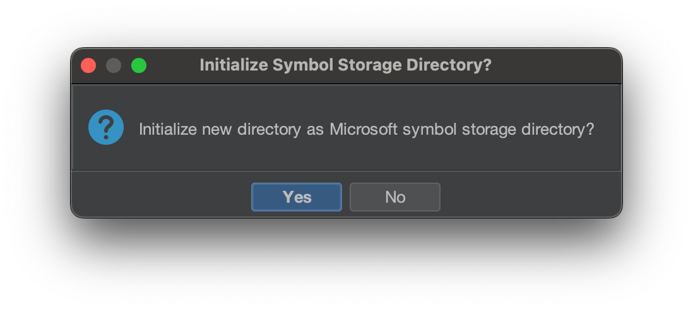

## Automatic Symbol Acquisition with Ghidra

It doesn’t matter where symbols come from, as long as you can get them to help clean up your analysis. **Ghidra offers the ability to automatically download symbols on your behalf.** It takes some configuration, but it is really useful once you get going.

## Public Symbol Servers

Ghidra has a list of servers it will reach out to for public symbol information, but you need to configure Ghidra to enable it, as the default settings won’t try. The list of symbol servers is available as a config file in the build.


{: .shadow }_PDB\_SYMBOL\_SERVER\_URLS.pdburl config file_

If you review the stored urls in [PDB\_SYMBOL\_SERVER\_URLS.pdburl](https://github.com/NationalSecurityAgency/ghidra/blob/4d856572319837d1419833b84fe1c59fd43d1d77/Ghidra/Configurations/Public_Release/data/PDB_SYMBOL_SERVER_URLS.pdburl) you will see several Windows symbol servers:

```
Internet|https://msdl.microsoft.com/download/symbols/|WARNING: Check your organization's security policy before downloading files from the internet.
Internet|https://chromium-browser-symsrv.commondatastorage.googleapis.com|WARNING: Check your organization's security policy before downloading files from the internet.
Internet|https://symbols.mozilla.org/|WARNING: Check your organization's security policy before downloading files from the internet.
```

If you browse to any of the servers you will find different results. Some symbol server servers show a help page.

_[https://msdl.microsoft.com/download/symbols/](https://msdl.microsoft.com/download/symbols/)_

Others just some XML with paths to specific [PDB](https://learn.microsoft.com/en-us/windows/win32/debug/symbol-files?redirectedfrom=MSDN#pdb-files)s:

_[https://chromium-browser-symsrv.commondatastorage.googleapis.com](https://chromium-browser-symsrv.commondatastorage.googleapis.com/)_

Just [4 months ago](https://github.com/NationalSecurityAgency/ghidra/commit/14ff4649fa1e7eb318646c46703ffa3e2f40b5d6), Ghidra’s server list included 3 additional public symbol servers.

```
- Internet|https://software.intel.com/sites/downloads/symbols/|WARNING: Check your organization's security policy before downloading files from the internet.
- Internet|https://driver-symbols.nvidia.com/|WARNING: Check your organization's security policy before downloading files from the internet.
- Internet|https://download.amd.com/dir/bin|WARNING: Check your organization's security policy before downloading files from the internet.
```

If we investigate a bit further, we can browse the files on Nvidia’s “symbol server”.


_[https://driver-symbols.nvidia.com/index.html](https://driver-symbols.nvidia.com/index.html)_

This server, although still called a symbol server, only contains binaries, **no PDBs**.


The Nvidia developer page explains the absence of PDBs and advises us to “enjoy”. While there is value (metadata, export names, etc.) in having versioned copies of the binaries for debugging, symbols are what we are after. **Symbols are what bring us joy.**

## Configuring Ghidra to Leverage Remote Symbol Servers

Let’s try the servers with actual PDBs. You can configure Ghidra to leverage remote symbol servers, which can save you a step every time you analyze a new binary. Using Ghidra’s CodeBrowser click _File → Edit → Symbol Server Config_.


This will bring up the Symbol Server Search dialog:


You will need to configure your symbols directory, so it has a place to store the download PDBs. Select a local directory to store your symbols. It will ask you if you want to configure it as a Microsoft symbol storage directory.



Click _yes_. This will create a directory structure with two files:

```zsh
% tree /tmp/symbols
/tmp/symbols
├── 000admin
└── pingme.txt
```

This structure matches the single tier directory structure that is one of the standard symbol server directory structures defined by Microsoft.

> Normally files are placed in a single tier directory structure in which a single subdirectory exists for each filename cached. Under each filename folder, additional folders are made to store each version of the file. [Symbol Store Folder Tree](https://learn.microsoft.com/en-us/windows-hardware/drivers/debugger/symbol-store-folder-tree#symbol-store-single-tier-or-two-tier-structure)

The next step is to add specific servers and/or local directories that host PDB files. Click on the green ‘+’ button to add new servers.


This will provide a drop-down menu with several options.


Add a few of the suggested remote servers.


Once these are configured, Ghidra will use these servers to search for matching symbols for the binary that you are currently analyzing. It doesn’t need to have any special logic to identify the binary, rather, it goes out and checks each server to see if it contains a matching PDB file.


Log of Ghidra attempting several public symbol servers

There are several ways to trigger the PDB download using the configured servers.

## Load Symbols with Ghidra Manually

If you want to load symbols for your binary prior to analysis, you can force Ghidra to look for the symbols.

Within the CodeBrowser, click _File → Load PDB_.


This is will open the _Load PDB_ dialog box.


The PDB location is blank, but we can fix this. If you click _Advanced_, you gain more options.


Click on _Search All_ , which will tell Ghidra to go and check both remote and local symbol servers. When a PDB is found, whether it’s local or remote, the dialog box will update with a successful outcome.


Once you click _Load_, the PDB downloads to your local symbol store. Later, Ghidra will leverage the symbol information to improve analysis. Ghidra uses the single tier directory structure to store the PDB, just like on the public symbols servers.

```bash
% tree /tmp/symbols
/tmp/symbols
├── 000admin
├── afd.pdb
│   └── 14FBAE3662AD9F7B9D33AA9228D2554A1
│       └── afd.pdb
└── pingme.txt
```

Ghidra uses a well-known algorithm to figure out the correct download URL for Microsoft binaries. You can check this out for yourself [here](https://github.com/NationalSecurityAgency/ghidra/blob/master/Ghidra/Features/PDB/ghidra_scripts/GetMSDownloadLinkScript.java#L64).

## Alternate — Download Symbols with Microsoft’s Symchk

Alternatively, you could use a Microsoft provided tool to download symbols for your analysis and just add the local directory as a symbol server location. Check out the tool [symchk](https://learn.microsoft.com/en-us/windows-hardware/drivers/debugger/using-symchk). and run this command to download all the symbols files available in `C:\Windows\System32`. and cache them in `C:\symbols`

```bash
symchk /r /v /s SRV*c:\symbols*https://msdl.microsoft.com/download/symbols C:\Windows\System32
```

Then just add the local directory to the list of available symbol locations:


## Configure Ghidra to Automatically Download Symbols

There is a way to configure Ghidra to download symbols automatically during analysis. Changing the analysis options allows you to perform this action. Before you run analysis with the defaults, scroll down to _PDB Universal_ and check the checkbox _Search remote symbol servers_.


When you check this, the analysis will run the code to download the PDB, similar to when we manually made Ghidra download the PDB in the _Load PDB_ section above. After you click _Analyze_, the PDB will download and apply extra information to the binary. While it is possible to apply the PDB file after analysis is done, I’ve found that applying it beforehand gives the best outcomes.

## How do I know that symbols have been loaded?

While in [part 1](), we saw specifically how symbols improve analysis, there are some general ways to determine if symbols have improved your analysis.

One quick way to check is to press Cmd + T / Ctrl + T to open up the S_ymbol Table_ Window. For general reverse engineering, I often jump here to navigate to specific function or search for useful names. Without symbols, most of your useful name will come from export names. The functions within the binary with have names like FUN\_6758473.

Here is the _Symbol Table_ window `afd.sys` without symbols:


afd.sys Symbol Table **Without** Public Symbols

There are 1714 identified symbols. These symbol include labels, identified function with random names, and some named externals.

Here is the Symbol Table with public symbols added:


afd.sys Symbol Table **With** Public Symbols

There are now 2484 identified symbols, with external names and function names like `AfdQueueTransmit` that used to be called `FUN_1c003f3ac` .

> Symbols are what bring us joy.

Another visual way to see more information available for your binary is to look at the quick summary scroll bar on the _Listing_ Window. Notice the Listing window on the right has quite a bit more light color markers.


The markers that increased are analysis bookmarks. See the legend.


Marker Legend from Ghidra Help

## Save Custom Ghidra Analysis Options

Next time you are analyzing a binary that maps to a public symbol server, make sure you configure the analysis to leverage the remote PDBs to maximize the analysis results. If you want to use the same option(s) next time, you can save your analysis preferences.


Then the next time you run analysis, select your custom options.


---

This is part two of a look into how symbols enhance reverse engineering and details on how Ghidra can take advantage. Stay tuned for more “Everyday Ghidra” lessons.

Reach out on [X](https://x.com/clearbluejar) or [mastadon](https://infosec.exchange/@clearbluejar) if you have questions. 


