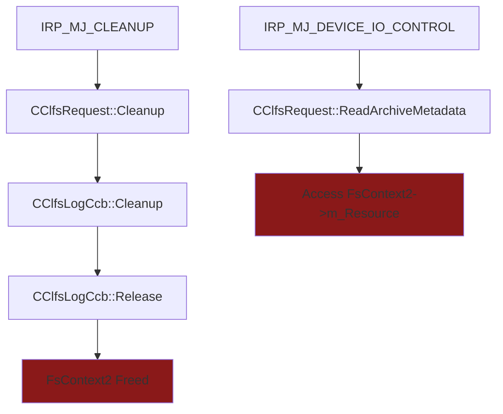

> **TL;DR** This post demonstrates how LLMs and [pyghidra-mcp](https://github.com/clearbluejar/pyghidra-mcp) accelerate reverse engineering by tracing a use-after-free vulnerability in Windows' Common Log File System (CLFS) through a patch diff, showing how AI maintains momentum in complex analysis. LLMs don't replace the work—they feed the habit by making the work feel lighter, faster, and well... fun.


Reverse engineering has always been a mix of instinct, curiosity, and stubbornness. You follow threads, you chase weird behavior, you stare at code flows until they start to make sense. But something interesting happens when you add LLMs into the loop.  

Not as oracles.
Not as replacements.
As **momentum** — the thing that keeps you moving when the system gets complicated.

They help you move faster in systems you already know, and they help you build foundational structure in systems you've never touched. They can turn "Where do I start?" into "Show me the shape of this thing."  

## How LLMs Feed Your RE Habit Series

This two‑part mini‑series explores both sides of that experience:  
- First, by following a UAF path in CLFS — a subsystem I know well enough to be dangerous.
- Then, by mapping macOS XPC services — a subsystem I just started studying.

Same tools, totally different terrain.

Let's find out how **LLMs feed your RE habit**. 

## Understanding CLFS Context for CVE-2025-29824

Before diving into the vulnerability, let's quickly understand what CLFS (Common Log File System) does in Windows. It's the kernel-level logging system that provides high-performance, reliable, structured persistent logging for Windows components and applications. 

CLFS is just another Windows kernel driver that quietly does its job… until it doesn’t. And when it doesn’t, the consequences surface directly in the kernel.

User-mode applications interact with it through Win32 APIs like [CreateLogFile](https://learn.microsoft.com/en-us/windows/win32/api/clfsw32/nf-clfsw32-createlogfile) and [ReserveAndAppendLog](https://learn.microsoft.com/en-us/windows/win32/api/clfsw32/nf-clfsw32-reserveandappendlog) (from clfsw32.dll), which open special log handles — by sending IOCTL requests straight to the **clfs.sys** driver in the kernel. 

The vulnerabality can be triggered by creating a subtle race condition by sending these IOCTLs. Eventually, through the help of a patch diff, a blog post, and an LLM, we will see exactly how the vulnerability can be triggered. 

## Patch Diffing

### Found the Bug, What Was the Bug Again?

Patch diffs are where the story starts, not where it ends.

When you’re [patch diffing](https://cve-north-stars.github.io/docs/Patch-Diffing), finding the code changes is _usually_ the easy part. The harder part — and the part that actually matters — is understanding why the change was needed. That’s where the reverse engineering begins. You start tracing control flow, start to understand the code, and ask the classic question:

*“Okay… but how does this actually become a bug?”*

Try it. You can run the patch diff for [CVE-2025-29824](https://msrc.microsoft.com/update-guide/vulnerability/CVE-2025-29824) yourself with these commands:
```bash 
wget https://msdl.microsoft.com/download/symbols/Clfs.Sys/B199B0AF86000/Clfs.Sys -O clfs.sys.x64.10.0.26100.3624
wget https://msdl.microsoft.com/download/symbols/Clfs.Sys/931DCBBD86000/Clfs.Sys -O clfs.sys.x64.10.0.26100.3775
uvx ghidriff clfs.sys.x64.10.0.26100.3624 clfs.sys.x64.10.0.26100.3775
```

Check out the [ghidriff result](https://gist.github.com/clearbluejar/2717c01bccda877e5073121fcc018396). 

{: .shadow }_Ghidriff diff output showing CLFS patch changes_

From the diff we can see a couple functions have been modified and we can actually go and see the details of how the code was changed. We know that CVE-2025-29824 is a use-after-free (UAF), so that gives us quite a bit of a head start and the perfect context for an LLM. 

In addition to the diff, sometimes you get lucky and someone has already done the heavy lifting. For this example we can leverage an excellent StarLabs write‑up on CVE‑2025‑29824. With this detailed post, the diff and vulnerability have context, shape, and stakes. 

>Turns out, it’s a use-after-free vulnerability in the Windows Common Log File System (CLFS) driver. When a log file handle is closed, the FsContext2 structure is incorrectly freed in CClfsRequest::Cleanup(), while another IRP request can still be in progress.  [My Blind Date with CVE-2025-29824](https://starlabs.sg/blog/2025/07-my-blind-date-with-cve-2025-29824/)

When reading another write-up, I like to go and see for myself if it's true. A good write‑up shouldn't replace your own investigation — it gives you a direction. Maybe this is true for you? You want to see the path, the conditions, the lifetime transitions, the exact moment where CLFS lets a UAF slip through.

You can do this investigation on your own with Ghidra, Binja, or Ida, but what if you could automate some of the analysis with a LLM? Let's try it. 

## Environment Setup and Tech Stack

To follow along, you'll need a setup that combines the knowledge of LLMs with Ghidra's analysis power. If you have the compute that can run local LLMs, even better!

### Local LLM Tech Stack

- **Open WebUI and LM Studio**: For running and chatting with local LLMs. [Open WebUI](https://openwebui.com/) provides a clean interface, while [LM Studio](https://lmstudio.ai/) handles model management and inference.
- **Local LLMs for privacy (optional)**: For these demos I used [nvidia/VIDIA-Nemotron-3-Nano-30B-A3B](https://huggingface.co/nvidia/NVIDIA-Nemotron-3-Nano-30B-A3B-FP8) for secure, on-device processing. You can also configure Open WebUI to use an [OpenAI compatible](https://docs.openwebui.com/getting-started/quick-start/starting-with-openai-compatible) frontier model. 
- **pyghidra-mcp**: Project-based, multi-binary analysis with dynamic importing. The [latest release](https://github.com/clearbluejar/pyghidra-mcp/releases/tag/v0.1.13) lets you import an entire directory, with all binaries auto-analyzed and ready for inspection. Additionally, callgraphs have been implemented so you can start to understand the control-flow path.

### Troubleshooting Tips

If you're hitting issues:

- **pyghidra-mcp startup**: Ensure `GHIDRA_INSTALL_DIR` is set correctly
- **LLM context limits**: Break complex analysis into smaller prompts. 
- **Binary import**: CLFS analysis benefits from improved Ghidra GDTs. Check out some of my other posts to learn how to create those.

## Starting With the Patch Diff  

I started with the diff and context from the StarLabs blog. The change was simple on the surface with just a few lines modified in CLFS driver functions. 

Immediate thought...  "How well can an LLM match the analysis found in the blog?" 

<!-- We will use the LLM to attempt to repeat some of the analysis and see how it performs.  -->

First test. Using only the diff and a simple question... 

{: .shadow }_LLM prompt asking about CLFS patch changes_

We get an accurate answer: 
{: .shadow }_LLM response summarizing the security fix in CLFS_

It even had the details about potential pending IRP requests that would cause the issue:
{: .shadow }_LLM details on potential pending IRP requests causing UAF_

**Remember this result was from a local LLM!** 🤯

With just the patch diff and a targeted prompt, the LLM independently inferred the same race condition described in the StarLabs post. Not word‑for‑word, but still accurate.

That’s the **momentum** I’m talking about.

### IRP Timing Deep Dive

The key insight for the vuln lies in understanding Windows I/O Request Packet (IRP) timing:

- **IRP_MJ_CLEANUP**: Sent when the last user-mode handle closes, but outstanding I/O requests might still be active
- **IRP_MJ_CLOSE**: Sent only when the last reference to the file object is released and all I/O is complete

Think of cleanup as the application saying "I'm done with this handle," and CLOSE as the kernel saying "Everyone is done with this object." This timing window is where the vulnerability lives - between cleanup and close, the `FsContext2` structure can be accessed by other threads after it's been freed.

These facts can be learned from reading the blog post, from experience, or
from the **knowledge found in a 30B 4-bit 18GB quantized model from Nvidia running on your local machine**.

{: .shadow }_30B 4-bit 18GB quantized model from Nvidia_

Amazing.

Now that we understand the vulnerability, how could we dive deeper, either to see actual code from the binary or to verify the blog analysis? 

What other questions might we come up with? 

New thought: *"Where does the UAF path actually form?"* 

Time to go and see for ourselves. 

## Importing the Vulnerable CLFS Binary  

Using pyghidra-mcp, I imported the vulnerable version of the CLFS driver (`clfs.sys`). Auto-analysis completed quickly; everything was indexed and cross-referenced - ready for vibes. 

### Setup Verification

Normally you can just run pyghidra-mcp and have it run with the transport streamable-http.
```bash
# Verify pyghidra-mcp is running and can see the binaries
$ uvx pyghidra-mcp -t http --port 1337 /path/to/clfs_vulnerable.sys
```

To use it with Open WebUI, you need to wrap your MCP with `mcpo` and run it with stdio. See `mcpo` details [here](https://github.com/open-webui/mcpo?tab=readme-ov-file#-quick-usage).

Something like this should work:
```bash
$ uvx mcpo --port 1337 -- pyghidra-mcp analyzed-clfs-bins/clfs.sys.x64.10.0.26100.3624-7fc7ad.gzf 
```

The server should report the binary loaded successfully with analysis complete.

{: .shadow }_pyghidra-mcp server reporting CLFS binary loaded successfully_

Once the mcp server is running on port 1337, wrapped nicely with mcpo, you can configure it in Open WebUI. 

{: .shadow }_Open WebUI configuration for MCP server_

Once there, it should be available in your chat window

{: .shadow }_Open WebUI chat window with pyghidra-mcp tools available_

The next time you ask a question, the pyghidra-mcp tools will be available. To discover more about the pyghidra-mcp tools and setup check out the [previous post]() introducing pyghidra-mcp.

## Tracing the UAF CLFS Code Flow  

List project binaries to make sure it's there and has been analyzed. 
{: .shadow }_List of CLFS binaries loaded in pyghidra-mcp_

Then I gave it some context from the blog and asked it to show me the vulnerable cleanup function..

"Verify the release occurs in the function CClfsLogCcb::Cleanup , show me the decompiled code, and the code path for an IRP request ending at the cleanup function."

{: .shadow }_Decompiled CClfsLogCcb::Cleanup function showing release logic_


Then it gave me the code path with a nice visual and summary. This would help someone trying to understand in general how drivers handle incoming I/O Request Packets ([IRPs](https://learn.microsoft.com/en-us/windows-hardware/drivers/gettingstarted/i-o-request-packets)). 


{: .shadow }_MermaidJs - Visual representation of IRP handling code path_

Summary of code path:
{: .shadow }_Summary of the IRP code path and cleanup interaction_


### The Actual Use After Free

The blog and patch diff taught us that this is the issue. A load and dereference of the `FsContext2` object from two different IRP requests. 



The red boxes show the race condition - `FsContext2` can be freed in the cleanup path while still being accessed by the I/O path. These conditions can be setup by sending a DeviceIocontrol (IOCTL) with a specific IOCTL while at the same time calling CloseHandle on reference to the CLFS object. 

How could we investigate this more? 

## Looking for Use

The StarLabs write‑up has a section titled *“Finding the Right Functions”*.  At this point we can stop reading and start tracing. You don’t just want to *believe* the UAF path exists, you want to *see* it in the binary.


{: .shadow }_Finding the right functions for FsContext2 UAF analysis_

Can we automate that search? I asked the LLM:

> “In what other functions is `FsContext2` accessed that could cause the UAF? Look specifically for `FileObject->FsContext2`.”


{: .shadow }_LLM search results for FsContext2 usage that could cause UAF_

I also asked it to map out the IOCTL codes needed to actually trigger the various code paths.

This is where LLMs stop being a convenience and becomes an assistant for your RE workflow. Instead of manually spelunking through CLFS, I can get some help: list binaries, decompile functions, pull cross‑references, generate callgraphs — all inside a conversational loop.

{: .shadow }_LLM starting to understand the task and reviewing available tools_

The LLMs start to make a plan, like a real analyst...

{: .shadow }_Thinking output: LLM creating analysis plan like a real analyst_

### The LLM Found the Same Vulnerable Functions StarLabs Identified + More

In the StarLabs analysis, once they determined the offset of `FsContext2`, they manually inspected each function that dereferenced it. 

They ended up with three key functions:

- `CClfsRequest::ReserveAndAppendLog()`  
- `CClfsRequest::WriteRestart()`  
- `CClfsRequest::ReadArchiveMetadata()`

These are the functions that dereference `FsContext2` and can collide with the cleanup path, creating the UAF window.

When I asked the LLM to search for `FsContext2` usage, it independently surfaced several **the same functions** — without being told they existed.


It did this by:

- scanning the CLFS binary  
- identifying references to the `FsContext2` offset  
- decompiling each candidate function  
- verifying actual dereferences  
- cross‑checking with IRP paths  

By making several tool calls:

{: .shadow }_LLM making multiple tool calls for binary analysis_

Exactly the same workflow StarLabs performed manually, but compressed into a few conversational prompts.


Starting at `Dispatch`:

{: .shadow }_Starting analysis at the Dispatch function_


It started to discover the functions that might cause use of `FsContext2` like `WriteRestart`
{: .shadow }_Discovery of WriteRestart function that could cause UAF_

Then `ReserverAndAppendLog`:
{: .shadow }_Discovery of ReserveAndAppendLog function that could cause UAF_

Then it provided a table with exactly what we were looking for.  Actual **use** of the `FsContext2` object and also a classification of use. Here is the summary table from the LLM:

{: .shadow }_Summary table of FsContext2 usage with classifications and IOCTL mappings_

Here is the exact text:

| #   | Function (binary + offset)                                                           | De‑compiled excerpt that touches **FsContext2**                                                                                                                                                                                                                           | Classification                                                                                                                   | IOCTL that calls it (hex)                                                 | IRP Major / Minor (when known)                                                         |
| --- | ------------------------------------------------------------------------------------ | ------------------------------------------------------------------------------------------------------------------------------------------------------------------------------------------------------------------------------------------------------------------------- | -------------------------------------------------------------------------------------------------------------------------------- | ------------------------------------------------------------------------- | -------------------------------------------------------------------------------------- |
| 1   | **`CClfsRequest::ScanContainers-1c00438a4`**                                         | ```c\np_Var4 = p_Var3->FileObject;\nplVar5 = *(longlong **)((longlong)p_Var4->FsContext + 0x78);\nthis->field116_0x90 = plVar5;\n**this->field117_0x98 = (longlong)p_Var4->FsContext2;**\nCClfsLogCcb::AddRef((CClfsLogCcb *)this->field117_0x98);\n```                   | **Read / Reference** – loads the `FsContext2` pointer into `this->field117_0x98` and immediately increments its reference count. | **0x80076816** – *ScanContainers* IOCTL (custom)                          | Major = `0x0d` (IRP_MJ\_SET\_INFORMATION) – Minor ≈ `0x00` (depends on dispatch table) |
| 2   | **`CClfsRequest::Flush-1c00425ec`**                                                  | ```c\np_Var2 = p_Var1->FileObject;\npvVar4 = p_Var2->FsContext2;          // ← deref\n(**(code **)(*plVar3 + 0x40))();   // cleanup callback\n...\n*(undefined8 *)((longlong)pvVar4 + 0x68) = *(undefined8 *)((longlong)pvVar4 + 0x68) + local_res10; // write state\n``` | **Control / State** – obtains the `FsContext2` pointer, calls a cleanup callback, then updates a field (`+0x68`) of the object.  | **0x8007282c** – *Flush* IOCTL (custom)                                   | Major = `0x0e` (IRP_MJ\_SET\_INFORMATION) – Minor ≈ `0x05` (Flush)                     |
| 3   | **`CClfsRequest::StartArchival-1c0043ce0`**                                          | ```c\nthis_00 = p_Var1->FileObject->FsContext2;   // ← deref\nCClfsLogCcb::AddRef(this_00);\n```                                                                                                                                                                          | **Control** – reads the `FsContext2` pointer to get the `CClfsLogCcb` object and bumps its reference count before archival work. | **0x8007283e** – *StartArchival* IOCTL (custom)                           | Major = `0x0e` – Minor ≈ `0x0a` (Start archival)                                       |
| 4   | **`CClfsRequest::ReserveAndAppendLog-1c0070920`**                                    | ```c\npvVar4 = p_Var5->FileObject->FsContext2;   // ← deref\n...\n*(undefined8 *)((longlong)pvVar4 + 0x68) = *(undefined8 *)((longlong)pvVar4 + 0x68) + local_res10; // write state\n```                                                                                  | **Write / State** – fetches `FsContext2`, then increments a reservation counter (`+0x68`).                                       | **0x8007a827** (or **0x8007a828**) – *ReserveAndAppendLog* IOCTL (custom) | Major = `0x0e` – Minor ≈ `0x0b` (Reserve/Append)                                       |
| 5   | **`ClfsReadRestartAreaInternal-1c006c0d0`** (called via `CClfsRequest::ReadRestart`) | ```c\nthis = param_1->FsContext2;               // ← deref\nCClfsLogCcb::AddRef(this);\n...\n(**(code **)(*(longlong *)pCVar1 + 0x48))();\nCClfsLogCcb::Release(this);\n```                                                                                               | **Control** – obtains the `FsContext2` pointer, adds a reference, runs a cleanup callback, then releases it.                     | **0x80076832** – *ReadRestart* IOCTL (custom)                             | Major = `0x0e` – Minor ≈ `0x09` (Read restart)                                         |


This wasn’t pattern‑matching or hallucination, it was actual binary analysis driven by a local LLM and pyghidra‑mcp!

### Why This Matters

This is the moment where LLM‑augmented RE becomes more than autocomplete:

- It **navigates the binary** the way a human would.  
- It **follows dataflow** instead of guessing.  
- It **reconstructs the vulnerability surface** from first principles.  
- It **validates external research** against the actual binary.  

And it does it without breaking your momentum.

You stay in the investigation.  
The LLM handles the friction.

## Quantifying the Speedup

Some back of napkin math...

- Traditional patch diff + Vuln analysis: 2-3 hours of manual cross-referencing  
- LLM-assisted analysis: ~20 minutes (5 mins prompt iteration, 15 mins validating the generated traces in Ghidra).
- Time saved: ~90% with higher confidence in the findings

The real metric isn’t just time. It’s confidence. When the LLM’s checking each step, I get to focus on the fun parts instead of obsessively re‑verifying every reference. (Admittedly, I still double‑checked everything here because, well… blog post.)


## What This Shows About LLM‑Augmented RE  

- Faster triage.  
- Clearer mental models of complex code paths.  
- Less time spelunking, more time understanding.  
- LLMs amplify your instincts instead of replacing them.

## Wrapping Up - How LLMs Feed Your RE Habit: Part 1

The CLFS UAF wasn't mysterious once the pieces were laid out — but getting to that point used to take hours of manual spelunking. With local LLMs and pyghidra‑mcp, the friction melts away. You spend less time hunting for the right entry point and more time reasoning about the vulnerability itself.  

That's the real value here.  
Not automation.  
Not shortcuts.  
Just a smoother path to understanding, so your attention stays on the parts that matter.  

**LLMs don't replace the work. They feed the habit.** 

**LLMs make the work feel lighter, faster, and more fun.**

---

## Looking Ahead to Part 2 - Exploring a New Area in RE

While CLFS gave us a deep dive into a known subsystem, our next adventure takes us into (potentially) unfamiliar territory - MacOS XPC services. We'll see how LLMs help when you don't even know where to start, turning a maze of binaries into a navigable map. Same tools, different challenge. Stay tuned.

If you liked this post or want to reach out, find me [on X](https://x.com/clearbluejar) or [mastadon](https://infosec.exchange/@clearbluejar). 

---

## Keep the Momentum Going

[](https://l.clearseclabs.com/ib57i){: width="972" height="589" .w-50 .right .rounded-10}


As you just read, LLMs make the work feel lighter, faster, and more fun. But getting the LLM to behave this reliably isn't magic—it's an engineering skill in itself.


<!-- <a href="https://l.clearseclabs.com/ib57i">
  
</a> -->


<!--   -->


<!-- <div class="image-container">
  
  <p class="caption">Building Agentic RE Training</p>
  <p><a href="https://l.clearseclabs.com/ib57i">Explore the AI and other related training: CLEARSECLABS Training</a></p>
</div> -->

If this walkthrough sparked that familiar pull — the curiosity, the flow, the sense that complex systems suddenly feel a little more navigable — then you already know what momentum feels like in reverse engineering. It’s the difference between grinding through a subsystem and gliding through it with clarity.

That’s the momentum you’ll **build on** in *Building Agentic RE*.


---

This training isn’t about learning another tool. It’s about gaining:

- A deeper sense of control over your analysis environment  
- The ability to shape LLMs into extensions of your own reasoning  
- A workflow that keeps you moving instead of getting stuck in the scaffolding  
- The leverage to automate the friction so you can stay in the investigation  
- The confidence to build agentic skills that match the way **you** reverse engineer  

If you want RE to feel lighter, faster, and more structurally supported — not because the work is simpler, but because you’re operating with more leverage — this is where that shift starts.

Explore the AI and other related training: [CLEARSECLABS Training](https://l.clearseclabs.com/ib57i)

